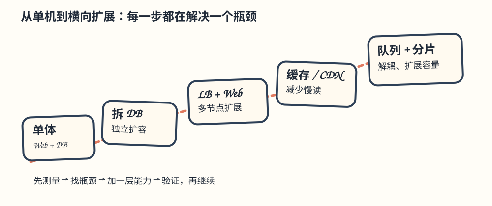
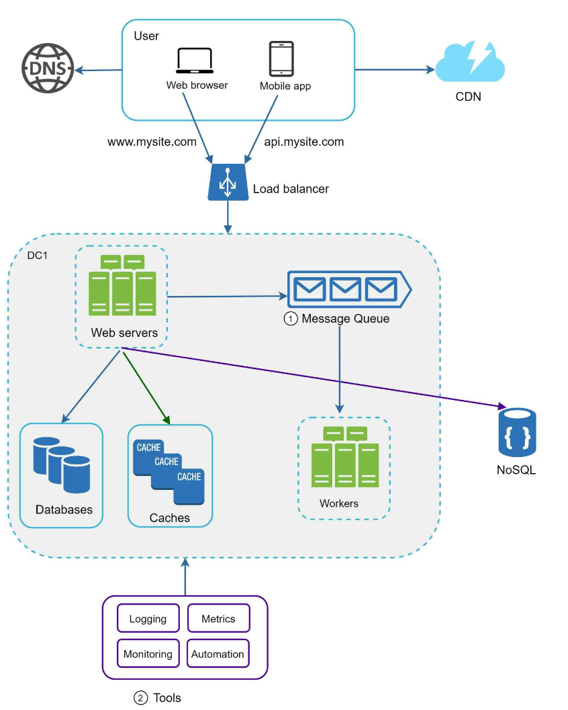

# 第 1 章：从零扩展到百万用户（中文版学习稿）

> **怎么读这章**：把系统想成一家不断变忙的餐馆。先让一名厨师把菜做出来（单机），再把收银、后厨、配送拆开（分层），最后才引入分店、中央厨房和订单队列（多机房、消息队列）。每加一层，都要先说明解决了哪个瓶颈，以及引入了什么新故障。
>
> **原版边界**：本目录是原版 `01. Scaling/Readme.md` 的中文翻译和学习批注；原版文件与图片未修改。英文术语保留在括号中，方便回看资料。

## 学习目标

读完后，基础薄弱、主要写 CRUD 的工程师应该能：

- 说清楚从单服务器到多数据中心的演进顺序，而不是一上来就喊“微服务”。
- 看到慢请求时，先判断是 Web、数据库、网络还是热点数据的问题。
- 区分**纵向扩展**（Vertical Scaling）和**横向扩展**（Horizontal Scaling），知道各自的上限。
- 为缓存、复制、分片、队列写出最小可行方案，并主动指出一致性、故障和成本。

---

## 引言（Introduction）

让系统支持数百万用户是一段持续迭代、不断优化的过程。本章从一台服务器开始，逐步扩展架构，使其能够承受百万级用户。

> **批注｜不要把“规模化”理解成一次重写**
>
> 先回答“当前哪个资源先耗尽”。如果 CPU 还很空闲，却把数据库分片了，复杂度只会提前到来。真实项目通常是：观测 → 找瓶颈 → 加一层能力 → 回归验证。

---

## 第 1 节：单服务器架构（Single Server Setup）

最初，Web 应用、数据库和缓存都运行在同一台服务器上。

### 请求流程（Request Flow）

1. 用户通过域名（例如 `api.mysite.com`）访问应用；DNS 把域名解析为 IP 地址。
2. 浏览器或移动应用拿到 Web 服务器的 IP 地址。
3. 客户端向 Web 服务器发送 HTTP 请求；服务器返回 HTML 或 JSON 响应。

### 流量来源（Traffic Sources）

1. **Web 应用**：服务端语言（如 Python、Java）执行业务逻辑，客户端语言（如 JavaScript、HTML）负责呈现。
2. **移动应用**：通过 HTTP 和 JSON 与 Web 服务器通信，以较轻量的方式交换数据。

> **批注｜CRUD 工程师的对应物**
>
> 你写的“Controller → Service → DAO → 数据库”都在这一台机器上。先用日志记录一次请求的总耗时和数据库耗时，否则后面扩展时没有基线。
>
> **类比**：一个人接电话、收银、做菜、洗碗。订单少时简单，订单一多，任何一个环节堵住都会拖慢全部顾客。
>
> **何时够用**：内部工具、低流量 MVP、需要快速验证业务时。
>
> **失败模式**：机器宕机即全站不可用；CPU、内存、磁盘和数据库相互争抢；发布应用可能连带重启数据库。

---

## 第 2 节：拆分数据库（Database Separation）

用户增长后，把数据库迁移到专用服务器，使 Web 层和数据库层可以独立扩容。

### 数据库选择（Database Choices）

1. **关系型数据库（SQL）**：数据以表格和关系组织，例如 MySQL、PostgreSQL。
2. **非关系型数据库（NoSQL）**：适合非结构化数据或低延迟场景，包括：
   - 键值存储（Key-Value Store）
   - 图数据库（Graph Database）
   - 列存储（Column Store）
   - 文档存储（Document Store）

在以下情况下，非关系型数据库可能更合适：

- 应用需要极低延迟。
- 数据无固定结构，或不存在需要维护的关系。
- 只需要序列化和反序列化 JSON、XML、YAML 等数据。
- 需要存储海量数据。

> **批注｜不要从“SQL 还是 NoSQL”开始争论**
>
> 先列查询：谁按什么键读？是否需要事务和多表 JOIN？一致性要求是什么？团队能否运维它？如果订单扣库存需要原子事务，成熟的 SQL 往往比“听起来更快”的 NoSQL 更稳。
>
> **最小迁移检查表**：连接池上限、慢查询、备份恢复、网络延迟、读写超时、迁移回滚方案。

---

## 第 3 节：纵向扩展与横向扩展（Vertical vs Horizontal Scaling）

### 纵向扩展（Vertical Scaling）

- 给现有服务器增加 CPU、内存等资源。
- 受硬件规格限制，且缺少冗余；服务器仍可能成为单点故障（SPOF）。

### 横向扩展（Horizontal Scaling）

- 增加服务器数量组成服务器池，更适合大型系统。
- 使用负载均衡器在服务器之间分发请求。

> **记忆句**：纵向扩展是“把一口锅换大”，横向扩展是“多口锅一起做”。前者简单但有上限，后者容量高但必须处理路由、会话和一致性。
>
> **面试模板**：当前瓶颈是单机资源；短期可纵向扩展快速止血，长期用横向扩展消除单点并支持故障转移。

---

## 第 4 节：负载均衡器（Load Balancer）

**负载均衡器**把流量分发到多台服务器。

1. **冗余**：一台服务器下线时，流量重新路由到健康服务器。例如服务器 1 下线，全部流量改送服务器 2。
2. **可扩展性**：流量突增时可增加服务器承接新增请求。

> **批注｜负载均衡器不等于“自动变快”**
>
> 它只能分发请求。还要确认健康检查、超时、重试、连接复用和优雅下线；如果所有请求都打到同一台数据库，Web 层加再多机器也没有用。
>
> **会话提醒**：优先把 session 放入共享存储，使 Web 节点无状态；临时方案才使用 sticky session，并说明它会降低故障转移灵活性。

---

## 第 5 节：数据库复制（Database Replication）

### 主从模型（Master-Slave Model）

- **主库（Master）**处理写操作：`insert`、`delete`、`update` 等会修改数据的命令必须发往主库。
- **从库（Slave）**处理读操作，以提升性能和可靠性。多数应用读多写少，因此从库数量通常多于主库。

### 收益（Benefits）

1. 多个从库并行处理读请求，提高性能。
2. 副本提高可用性和数据可靠性。

### 故障处理（Failure Handling）

- 只有一个从库且它下线时，读请求暂时转向主库。
- 有多个从库时，把读请求转给其他健康从库，并创建新服务器替换故障节点。
- 主库下线时，把一个从库提升（promote）为新主库。
- 生产环境中，被选中的从库可能不是最新的，因此需要通过数据恢复脚本追上缺失数据；原版列出多主复制和环形复制等可考虑的方法。

> **准确性批注**：多主或环形复制并不会自动消除数据丢失、冲突和脑裂风险。故障切换前需要确认复制位点、仲裁机制、旧主隔离（fencing）和恢复策略。

> **关键概念｜复制延迟（Replication Lag）**
>
> 写入主库后立刻读从库，可能暂时读不到刚写的数据。需要“读己之写”时，可在短窗口内读主库、携带版本号，或等待从库追平。
>
> **失败模式**：自动提升错误副本导致数据丢失；重试写请求造成重复写入；只监控“数据库在线”而不监控复制延迟。

---

## 第 6 节：缓存（Caching）

缓存把频繁访问的数据放在内存中，减少数据库压力。缓存层是比数据库快得多的临时数据存储层。

### 缓存注意事项（Caching Considerations）

1. **使用场景**：数据读取频繁、修改较少时适合缓存。
2. **过期策略**：缓存项到期会被删除；没有过期策略时，数据可能永久占用内存。
3. **一致性**：数据存储和缓存需要保持同步。因为修改数据库和缓存通常不是同一个事务，二者可能不一致。
4. **故障缓解**：单缓存服务器是潜在单点故障；建议在不同数据中心部署多个缓存服务器。
5. **淘汰策略**：缓存满后必须淘汰数据释放内存，LRU（最近最少使用）最常见。

> **新手最稳的读路径**：先读缓存，未命中再读数据库并回填缓存（cache-aside）。写入时先更新数据库，再删除缓存；删除失败要重试或由消息补偿。
>
> **何时不要缓存**：数据每次都变、命中率低、错误数据代价极高且没有失效方案时。缓存会把“慢”换成“可能读旧数据”。
>
> **面试追问**：命中率多少？TTL 多久？热点 key 会不会击穿？缓存全失效时数据库能否扛住（缓存雪崩）？

---

## 第 7 节：内容分发网络（Content Delivery Network, CDN）

CDN 把图片、CSS、JavaScript 等静态内容缓存到地理分散的服务器上，以缩短加载时间。

### 工作流（Workflow）

1. 用户向最近的 CDN 节点请求内容。
2. 如果节点没有缓存，CDN 从源站获取内容并缓存，然后返回给用户。

### CDN 注意事项（CDN Considerations）

1. **成本**：CDN 通常由第三方提供，按流入流出数据量收费。
2. **缓存过期**：过期时间不能过长，也不能过短。
3. **CDN 降级**：临时故障时，客户端应能发现问题并向源站请求资源。
4. **文件失效**：文件更新后需要让旧缓存失效，指向新文件。

> **实用做法**：静态文件名带内容哈希（`app.8f3c.js`），更新即换 URL，避免到处手动 purge。

---

## 第 8 节：无状态 Web 层（Stateless Web Tier）

把 session 等会话数据移到共享存储后，Web 服务器就变成无状态（stateless）。这带来：

1. 更容易横向扩展。
2. 可以根据流量自动扩容和缩容。

> **批注**：无状态不代表“没有状态”，而是请求处理不依赖某一台 Web 机器的本地内存。共享 session、令牌或用户数据库仍然是状态。

---

## 第 9 节：多数据中心（Multi-Data Center Setup）

跨多个数据中心部署可以提高可用性并降低延迟。

1. **GeoDNS 路由**：把用户导向最近的数据中心。
2. **数据复制**：在数据中心之间同步数据，避免不一致。

### 关键考虑点

- **流量重定向**：需要可靠工具把流量导向正确的数据中心。
- **数据同步**：常见策略是跨多个数据中心复制数据。
- **测试与发布**：自动化部署工具对保持各数据中心服务一致至关重要。

> **现实取舍**：跨地域复制通常带来延迟和冲突。先明确是“单地域主写、异地只读”，还是“多地域都可写”；不要只画两朵云就宣称高可用。

---

## 第 10 节：消息队列（Message Queue）

原版将消息队列描述为“一个持久化组件，存储在内存中”，它支持异步通信，作为缓冲区分发异步请求。

> **准确性批注**：只存内存不能保证进程重启或断电后的持久性。需要持久化语义时，队列通常通过磁盘日志、复制和确认机制实现；选型时应核对具体配置。

- 输入服务称为生产者（producer/publisher），创建消息并发布到队列。
- 其他服务称为消费者（consumer/subscriber），连接队列，按照消息执行动作。

> **类比**：前台把订单放进取餐架，后厨按自己的速度处理；前台不会被慢菜绑住，但必须考虑消息重复、顺序、确认（ack）和积压。
>
> **使用时机**：发送邮件、生成缩略图、写审计日志等允许稍后完成的任务。支付扣款、库存扣减等关键路径则要定义明确的重试和幂等策略。

---

## 第 11 节：日志、指标与自动化（Logging, Metrics, and Automation）

### 重要性

1. **日志（Logging）**：跟踪错误和系统健康状态。
2. **指标（Metrics）**：洞察性能和用户活动。
3. **自动化（Automation）**：简化测试、部署和扩缩容。

> **最小可观测性**：请求量、错误率、P50/P95/P99 延迟、数据库连接数、缓存命中率、队列积压。只有“服务是绿色”而没有这些数字，无法定位瓶颈。

---

## 第 12 节：数据库扩展（Database Scaling）

### 纵向扩展（Vertical Scaling）

增加硬件资源，但受到物理规格和成本限制，缺点包括：

- 单点故障风险更高。
- 纵向扩展的总体成本很高。

### 横向扩展：分片（Horizontal Scaling / Sharding）

使用分片键（例如 `user_id`）把数据分布到多个分片（shard）。

- 分片把大数据库拆成更小、更易管理的部分。
- 每个分片使用相同 schema，但保存的数据只属于该分片。
- 分片键非常关键，应尽量让数据均匀分布。

#### 挑战（Challenges）

1. **重新分片（Resharding）**：单个分片装不下更多数据，或数据分布不均导致某些分片先耗尽时，需要重新分片；一致性哈希（Consistent Hashing）可缓解迁移范围。
2. **名人问题（Celebrity Problem）**：大量请求集中访问一个用户或租户，使所在分片过载；可为热点名人分配专用分片、拆分读流量或预计算结果。
3. **跨分片 JOIN 与反规范化（Denormalization）**：数据分布在不同服务器后，跨分片 JOIN 很困难；常见做法是反规范化，把查询所需字段放到同一张表或索引中。

> **批注｜分片是最后一公里**
>
> 分片键一旦选错，迁移和跨分片查询都很贵。面试中先说明单库 + 读副本的上限，再说明何时、按什么键分片，并给出热点和迁移方案。

---

## 总结（Conclusion）

### 关键要点（Key Takeaways）

1. 保持 Web 层无状态。
2. 每一层都构建冗余。
3. 使用缓存和 CDN 优化性能。
4. 使用分片扩展数据层。
5. 解耦组件以获得灵活性。

本章为构建可承受百万级用户的可扩展系统提供基础。

### 一页式面试模板

> “我会先用单体验证需求，再按瓶颈拆分 Web 与数据库；用负载均衡和无状态 Web 横向扩展，用读副本和缓存降低读压力，用 CDN 处理静态内容。异步任务放入消息队列；数据量或热点超过单库能力时再分片。每一步我会补上监控、故障转移、一致性和成本。”

### 自测题

1. 为什么加 Web 服务器不能解决数据库锁等待？
2. 缓存命中率下降时，先看哪些指标？
3. 从库延迟时，如何保证用户刚写入的数据可见？
4. 你选择 `user_id` 作为分片键，名人用户把一个分片打爆了怎么办？
5. 哪些任务适合放入消息队列？如何防止消费者重复执行？

> **参考答案**：[Q01-01](../29.%20%E8%87%AA%E6%B5%8B%E9%A2%98%E8%AF%A6%E8%A7%A3/README.md#q01-01) · [Q01-02](../29.%20%E8%87%AA%E6%B5%8B%E9%A2%98%E8%AF%A6%E8%A7%A3/README.md#q01-02) · [Q01-03](../29.%20%E8%87%AA%E6%B5%8B%E9%A2%98%E8%AF%A6%E8%A7%A3/README.md#q01-03) · [Q01-04](../29.%20%E8%87%AA%E6%B5%8B%E9%A2%98%E8%AF%A6%E8%A7%A3/README.md#q01-04) · [Q01-05](../29.%20%E8%87%AA%E6%B5%8B%E9%A2%98%E8%AF%A6%E8%A7%A3/README.md#q01-05)。先独立作答，再逐题核对推导与图解。
