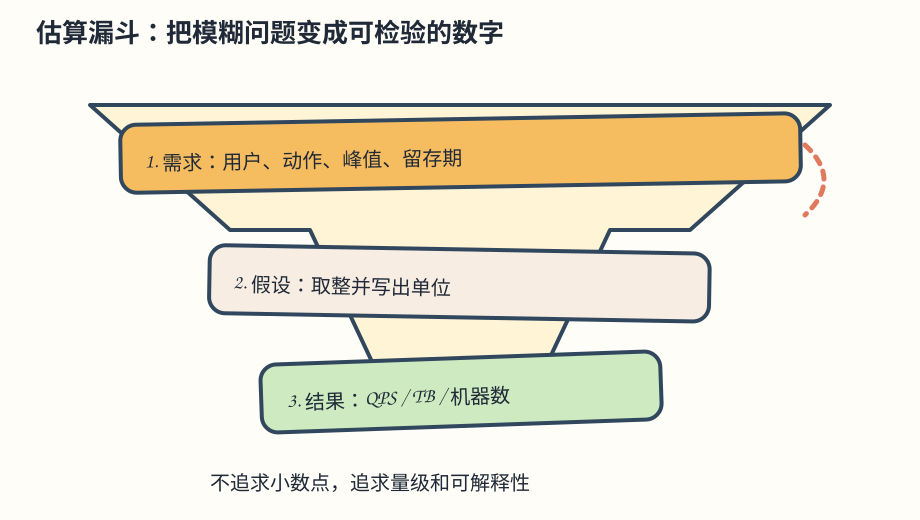
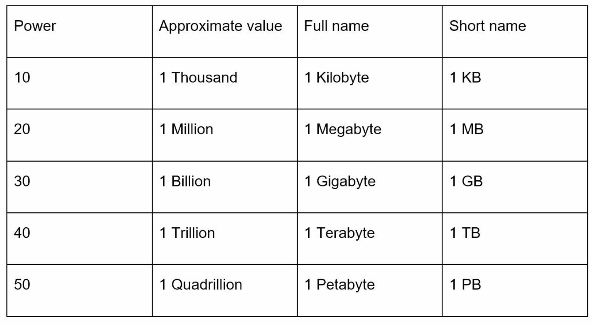

# 第 2 章：数量级估算（Back-of-the-Envelope Estimation）

> **定位**：这是系统设计面试里的“量级计算”练习。目标不是算到小数点，而是用几分钟判断方案是否可能、瓶颈在哪里、需要多少容量。
>
> **给 CRUD 工程师的记忆法**：先写“人 × 次数”，再除以“时间”；先算平均值，再乘峰值系数；每个数字都写单位。算不出来时，把假设说出来，允许面试官修正。

## 引言（Introduction）

数量级估算是一项关键系统设计技能，用于快速、粗略地评估系统容量或性能。Google Senior Fellow Jeff Dean 认为，这些估算可以通过思想实验和常见性能基准，帮助判断设计是否满足要求。

本章涵盖基本概念、方法和示例，帮助建立可扩展性与估算能力。

> **批注｜为什么 CRUD 工程师要学它**：代码能不能跑，只回答“功能正确”；QPS、存储和峰值决定“系统能不能活”。估算是把产品语言翻译成机器资源的桥梁。

---

## 第 1 节：基本概念（Key Concepts）

### 2 的幂（Power of Two）

用 2 的幂理解数据量是基础能力：

| 数值 | 近似容量 | 记忆方式 |
|---|---:|---|
| `2^10` | 1 千（Ki） | 千级 |
| `2^20` | 1 百万（Mi） | 百万级 |
| `2^30` | 1 十亿（Gi） | 十亿级 |
| `2^40` | 1 万亿（Ti） | TB 级 |
| `2^50` | 1 千万亿（Pi） | PB 级 |

这些量级有助于进行存储和带宽计算。工程实践中请注意：`KB/MB/GB` 常被十进制使用，而 `KiB/MiB/GiB` 是 1024 进制；面试里先声明口径即可。

> **心算技巧**：`1 天 = 86,400 秒 ≈ 10^5 秒`；`1 年 ≈ 3.15×10^7 秒`。把除法先换成 `10^5`，通常足够判断数量级。

---

### 程序员应该知道的延迟数字（Latency Numbers Every Programmer Should Know）

延迟表示一次计算或 I/O 所花的时间，可以帮助比较相对性能：

| 操作 | 延迟（2020 年参考） |
|---|---:|
| L1 Cache 访问 | 0.5 ns |
| L2 Cache 访问 | 7 ns |
| 主内存访问 | 100 ns |
| SSD 随机读 | 150 µs |
| HDD 随机寻道 | 10 ms |
| 数据中心内往返 | 500 µs |
| 跨地域数据中心往返 | 150 ms |

**关键洞察**：

- 内存快，磁盘慢。
- 尽量避免磁盘寻道。
- 通过互联网传输前压缩数据，可节省带宽。

> **批注｜不要背成“永恒真理”**：这是量级参考，不是你当前云厂商的 SLA。SSD、网络、数据库索引和并发都会改变实测值；设计时要用压测或监控验证。
>
> **从请求路径看延迟**：一次 API 可能包含 DNS、TLS、负载均衡、应用代码、缓存、数据库和序列化。即使每层都只慢一点，串行叠加也会变慢；因此缓存和批量请求常比微优化循环更有效。

---

### 可用性数字（Availability Numbers）

高可用（HA）意味着尽量减少停机时间。可用性用“几个 9”表示：

- **99%（两个 9）**：每年约 3.65 天不可用
- **99.9%（三个 9）**：每年约 8.8 小时不可用
- **99.99%（四个 9）**：每年约 52 分钟不可用
- **99.999%（五个 9）**：每年约 5.3 分钟不可用
- **99.9999%（六个 9）**：每年约 31.56 秒不可用

Amazon、Google、Microsoft 等云厂商的 SLA 通常目标为 99.9% 或更高。

> **公式**：年度停机分钟数 ≈ `365 × 24 × 60 × (1 - 可用性)`。先算预算，再决定是否值得为多一个 9 支付多地域、冗余和运维成本。
>
> **常见误区**：组件各自 99.9% 并不等于整个链路 99.9%。串行依赖会相乘；一个请求同时依赖 API、数据库和第三方支付时，端到端可用性更低。

<strong>交互实验：几个 9：串联相乘，冗余相并</strong>。用抽样的一年看三个 99.9% 串联为什么只剩约 99.7%，以及加副本、共用机房和可降级依赖怎样改变端到端可用性。<a href="https://kadaliao.github.io/system-design-interview-zh/#d2/lab-availability-nines">在线阅读版</a>中可直接操作。

---

## 第 2 节：估算示例——Twitter 的 QPS 与存储需求

### 假设（Assumptions）

- **3 亿月活用户（MAU）**。
- **50% 的用户日活（DAU）**。
- **每个用户每天平均发 2 条推文**。
- **10% 的推文包含媒体**。
- **数据保留 5 年**。

### 估算（Estimations）

#### 1. 每秒查询数（QPS）

- DAU = `300M × 50% = 150M`
- 平均发推 QPS = `150M × 2 / 24 小时 / 3600 秒 ≈ 3,500 条/秒`
- 峰值 QPS = `2 × 3,500 ≈ 7,000 条/秒`

> 原版公式中的 `~3500` 省略了单位和右括号；这里补全为“条/秒”，并保留同一假设。

#### 2. 媒体存储

- **推文大小组成**：
  - `tweet_id`：64 字节
  - `text`：140 字节
  - `media`：1 MB
- **每天媒体存储** = `150M × 2 × 10% × 1 MB = 30 TB/天`
- **5 年存储** = `30 TB × 365 × 5 ≈ 55 PB`

> **原版数值提醒**：原文列出 `tweet_id` 为 64 字节；常见 64 位整数 ID 实际是 8 字节。这里保留原文示例数值，容量估算时请按实际序列化格式测量。媒体占比远大于 ID，因此不影响本例约 55 PB 的媒体结论。
>
> **数量级检查**：这里只算媒体裸数据，未包含副本、缩略图、对象存储元数据、索引和备份。若做容量规划，可再乘 2～4 倍冗余系数，并把“平均媒体大小”和“峰值上传带宽”单列。
>
> **读写分离提醒**：上面的 7,000 是“发推写入”峰值，不代表首页读取 QPS。真实系统往往读远多于写，需要另外估算“每个 DAU 每天刷新几次、每次拉多少条”。

---

## 第 3 节：有效估算技巧（Tips for Effective Estimation）

### 1. 四舍五入与近似（Rounding and Approximation）

精确到小数点并不重要，过程更重要。用整数字简化复杂计算，例如：

`99987 / 9.1` 可以近似为 `100,000 / 10 = 10,000`。

### 2. 写下假设（Write Down Assumptions）

清楚记录假设，方便后续检查和调整。如果面试官说“峰值不是 2 倍而是 5 倍”，只替换一个参数，不必重新争论整套设计。

### 3. 标注单位（Label Units）

避免歧义：写 `5 MB`，不要只写 `5`。计算过程中保持单位相乘、相除，最后再换成 QPS、TB、机器数等可读结果。

### 4. 常见估算场景（Common Estimation Scenarios）

- **QPS（Queries Per Second）**：衡量流量强度。
- **峰值 QPS（Peak QPS）**：考虑流量突增。
- **存储需求（Storage Requirements）**：估算累计数据量。
- **缓存需求（Cache Requirements）**：评估内存容量。
- **服务器数量（Number of Servers）**：根据工作负载计算所需硬件。

> **缓存估算小例子**：如果 1,000 万用户中 10% 是日活，每人产生 20 KB 热数据，缓存目标是 50% 热用户，则约为 `1,000 万 × 10% × 50% × 20 KB = 10 GB`（还要加副本和协议开销）。
>
> **机器数小例子**：若峰值 7,000 QPS，而单实例压测稳定承载 350 QPS，则理论上需要 `7,000 / 350 = 20` 个实例；再按 30% 余量取 26～30 个，并说明这是估算值。

<strong>交互实验：估算计算器：从日活推到 QPS、存储和机器数</strong>。每一步都显示算式和单位，改一个假设就能看到哪些结果变了几倍，并在一天的流量曲线上对比按平均和按峰值买机器。<a href="https://kadaliao.github.io/system-design-interview-zh/#d2/lab-estimate-calculator">在线阅读版</a>中可直接操作。

---

## 面试可直接套用的 90 秒模板

1. **确认目标**：“我先估算写入 QPS、读取 QPS、峰值系数和五年存储，单位都用十进制。”
2. **列假设**：“MAU 3 亿、DAU 50%、每人每天 2 次操作、峰值按平均 2 倍。”
3. **算平均与峰值**：“平均约 3,500 QPS，峰值约 7,000 QPS。”
4. **算容量**：“媒体每天 30 TB，五年约 55 PB；生产上再加副本、备份和索引。”
5. **回到设计**：“这个量级意味着对象存储 + CDN，写入异步化，数据库保存元数据；实例数量用压测结果校准。”

## 自测题

1. `2^30` 为什么可以快速当作十亿级？
2. 一个链路依赖三个 99.9% 的组件，端到端可用性大约是多少？
3. 若 DAU 不变、每天操作从 2 次变成 10 次，QPS 和存储如何变化？
4. 为什么只算平均 QPS 会让容量不足？
5. 估算结果和监控实测差很多时，先检查假设、单位还是代码？

> **参考答案**：[Q02-01](../29.%20%E8%87%AA%E6%B5%8B%E9%A2%98%E8%AF%A6%E8%A7%A3/README.md#q02-01) · [Q02-02](../29.%20%E8%87%AA%E6%B5%8B%E9%A2%98%E8%AF%A6%E8%A7%A3/README.md#q02-02) · [Q02-03](../29.%20%E8%87%AA%E6%B5%8B%E9%A2%98%E8%AF%A6%E8%A7%A3/README.md#q02-03) · [Q02-04](../29.%20%E8%87%AA%E6%B5%8B%E9%A2%98%E8%AF%A6%E8%A7%A3/README.md#q02-04) · [Q02-05](../29.%20%E8%87%AA%E6%B5%8B%E9%A2%98%E8%AF%A6%E8%A7%A3/README.md#q02-05)。先独立作答，再逐题核对推导与图解。
