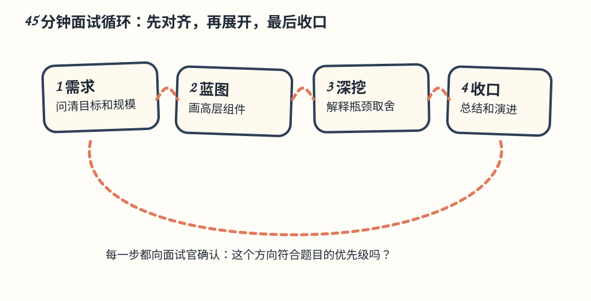

# 第 3 章：系统设计面试框架（System Design Framework）

> **给 CRUD 工程师的主线**：面试不是让你背一张“万能架构图”，而是观察你如何在不完整信息下做决定。先问清题目，再画最小可行蓝图，接着只深挖最关键的瓶颈，最后总结取舍和演进。
>
> **原版边界**：本目录是原版 `03. System Design Framework/Readme.md` 的中文翻译和批注；原版未修改。英文术语保留在括号中。



## 引言（Introduction）

系统设计面试是招聘流程的重要组成部分，模拟真实世界的问题解决场景。它考察的不只是技术能力，也包括协作、沟通和处理模糊需求的能力。

本章介绍一个**四步框架（4-step framework）**，帮助你有效应对系统设计面试。

> **批注｜面试官想听到什么**：你的假设、数据流、容量边界、故障处理和取舍。只说“用 Redis、Kafka、微服务”并不能证明设计正确。

---

## 第 1 步：理解问题并确定设计范围（Understand the Problem and Establish Design Scope）

### 目标（Key Objectives）

- 澄清需求和假设。
- 避免过早跳到解决方案。
- 通过提问展示批判性思考。

### 方法（Approach）

#### 先问澄清问题（Ask Clarifying Questions）

- 最重要的功能是什么？
- 系统需要承受多大规模？
- 面向 Web、移动端，还是两者都要？
- 是否有既有技术或约束？

#### 记录假设（Document Assumptions）

把假设写在白板或纸上，后续每次改动都能回看。没有数字时，主动提出合理初始值，并邀请面试官修正。

### 示例：设计新闻 Feed 系统

**问题**：设计一个新闻 Feed 系统。

**可问的问题**：

- 是移动应用、Web 应用，还是两者都有？
- 每个用户最多有多少好友？
- Feed 是否包含图片和视频？
- Feed 是否按倒序时间（reverse chronological order）排列？

> **新手提示｜问题要能改变设计**：
>
> “是否需要离线访问？”会影响缓存和同步；“是否允许重复发布？”会影响幂等；“峰值 QPS 是多少？”会影响分片和队列。不要为了显得专业而问不会改变方案的问题。
>
> **失败模式**：一开始就画 Kafka、Redis、十个微服务；到了中途才发现题目只要求按时间排序的好友动态。范围没锁定，细节越多越容易跑题。

<div class="sd-lab" id="lab-interview-scope" data-lab="interview-scope">
<p><strong>交互实验：新闻 Feed：需求答案怎样改变架构</strong>。切换排序方式、关注关系、内容类型和日活规模，看发布、读取和媒体路径上会多出哪些组件，以及名人发帖怎样压垮扇出队列。<a href="https://kadaliao.github.io/system-design-interview-zh/#d3/lab-interview-scope">在线阅读版</a>中可直接操作。</p>
</div>

---

## 第 2 步：提出高层设计并取得共识（Propose High-Level Design and Get Buy-In）

### 目标（Key Objectives）

- 构建高层架构。
- 与面试官协作，不断完善设计。

### 方法（Approach）

#### 起草蓝图（Draft a Blueprint）

用方框图表示关键组件，例如客户端、API、数据库、缓存、CDN。把面试官当作队友，一边画一边确认方向。

#### 进行纸巾盒背面估算（Perform Back-of-the-Envelope Calculations）

根据规模约束检查设计是否扛得住：请求量、峰值、存储、带宽、实例数量和可用性预算都要有量级。

#### 遍历用例（Walk Through Use Cases）

走一遍核心流程和边界情况，验证设计假设。

### 示例：新闻 Feed 系统

可以拆成两个主要流程：

1. **Feed 发布流程（Feed Publishing Flow）**：把帖子写入数据库，并填充好友的 Feed。
2. **Feed 获取流程（Feed Retrieval Flow）**：聚合好友帖子，并按倒序时间展示。

> **批注｜先画箭头再画技术名**：先标出“谁写入、谁读取、数据在哪里停留”。然后再决定数据库、缓存或队列。这样即使换技术栈，也能保持设计逻辑。
>
> **取得共识的句式**：
>
> “我先按 1,000 万用户、读远多于写、按时间排序来设计；如果您更关心实时性或推荐排序，我会调整发布和读取路径。这个范围可以吗？”

---

## 第 3 步：深入设计（Design Deep Dive）

### 目标（Key Objectives）

- 深入关键组件。
- 展示理解深度和适应能力。

### 方法（Approach）

- **优先关键组件**：聚焦与题目最相关的部分。
- **讨论瓶颈**：找出潜在性能问题并提出解决方案。
- **控制细节**：避免过度工程化或无关的深挖。

### 示例主题（Example Topics）

- **URL Shortener**：重点讨论哈希函数设计。
- **Chat System**：探索降低延迟、处理在线/离线状态的方法。
- **News Feed System**：研究 Feed 发布和获取流程。

> **深挖四问**：
>
> 1. 数据的主键和访问模式是什么？
> 2. 这个组件的容量上限和故障模式是什么？
> 3. 数据丢了、重复了或延迟了，会发生什么？
> 4. 何时需要升级方案，升级的迁移路径是什么？
>
> **失败模式**：把时间花在表字段和类名上，却没有解释热点、超时、重试和一致性；或者把所有可能技术都讲一遍，导致核心流程没讲完。

---

## 第 4 步：收尾（Wrap-Up）

### 目标（Key Objectives）

- 指出可以改进的地方。
- 回顾设计并讨论后续工作。

### 方法（Approach）

- **识别瓶颈**：讨论潜在限制和扩展策略。
- **总结设计**：回顾主要设计决策和取舍。
- **提出增强**：例如从 100 万用户扩展到 1,000 万用户，或处理服务器故障和网络问题。

> **最后三句话模板**：
>
> “主路径是客户端 → API → 缓存/数据库；写入和读取通过队列与存储解耦。当前瓶颈是 X，下一阶段通过 Y 扩展；代价是 Z 的一致性或成本。故障上我们会监控 A，并让 B 降级。”

---

## 最佳实践（Best Practices）

### 应做（Dos）

- **提问**：在进入方案前澄清歧义。
- **沟通**：持续分享思考过程。
- **与面试官迭代**：把对方当作协作者。
- **保持灵活**：提出替代方案并不断改进。
- **聚焦关键组件**：优先最重要的部分。

### 不应做（Don’ts）

- **避免过早给方案**：先理解需求再设计。
- **不要沉默**：过程中持续沟通。
- **避免过度工程化**：专注于实际、可扩展的方案。

> **批注｜把“不会”说清楚也是能力**：如果不知道某个中间件细节，可以说明假设、接口语义、故障处理和验证方式；不要用未经确认的术语掩盖空白。

---

## 时间管理（Time Management）

### 45 分钟面试建议分配

1. **理解问题与范围**：3–10 分钟
2. **高层设计与取得共识**：10–15 分钟
3. **深入设计**：10–25 分钟
4. **收尾**：3–5 分钟

> **实用计时点**：第 10 分钟前应有需求和核心 API；第 20 分钟前应有高层图和容量量级；第 40 分钟前停止新增组件，开始回顾故障和取舍。

<div class="sd-lab" id="lab-interview-drill" data-lab="interview-drill">
<p><strong>交互实验：面试节奏练习：45 分钟、最后 5 分钟、90 秒</strong>。带检查点的练习计时器：按本章建议分配练完整面试，或单独练最后 5 分钟收口和 90 秒陈述。<a href="https://kadaliao.github.io/system-design-interview-zh/#d3/lab-interview-drill">在线阅读版</a>中可直接操作。</p>
</div>

## 一页式答题卡

```text
需求：谁使用？核心动作？读写比例？峰值？一致性？可用性？
API：最小的读写接口、请求/响应、幂等键。
数据：主键、索引、生命周期、备份与恢复。
路径：写入流、读取流、缓存命中与未命中。
规模：平均/峰值 QPS、存储、带宽、实例数。
故障：超时、重试、重复、降级、数据丢失、恢复。
取舍：为什么选它？代价是什么？什么时候换方案？
收口：总结当前设计和下一阶段演进。
```

## 自测题

1. 设计新闻 Feed 时，你会先确认哪三个需求？它们如何改变架构？
2. 为什么高层设计阶段要取得共识，而不是直接深挖数据库？
3. 一个热点组件要讨论哪些容量和故障问题？
4. 当面试只剩 5 分钟，你如何收口而不是继续加组件？
5. 你能否用 90 秒讲完“需求—路径—瓶颈—取舍—演进”？

> **参考答案**：[Q03-01](../29.%20%E8%87%AA%E6%B5%8B%E9%A2%98%E8%AF%A6%E8%A7%A3/README.md#q03-01) · [Q03-02](../29.%20%E8%87%AA%E6%B5%8B%E9%A2%98%E8%AF%A6%E8%A7%A3/README.md#q03-02) · [Q03-03](../29.%20%E8%87%AA%E6%B5%8B%E9%A2%98%E8%AF%A6%E8%A7%A3/README.md#q03-03) · [Q03-04](../29.%20%E8%87%AA%E6%B5%8B%E9%A2%98%E8%AF%A6%E8%A7%A3/README.md#q03-04) · [Q03-05](../29.%20%E8%87%AA%E6%B5%8B%E9%A2%98%E8%AF%A6%E8%A7%A3/README.md#q03-05)。先独立作答，再逐题核对推导与图解。
