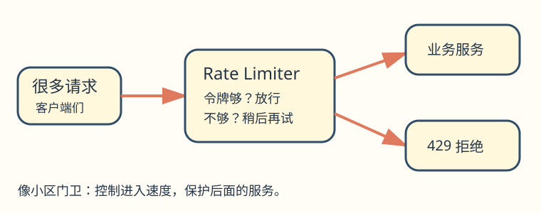
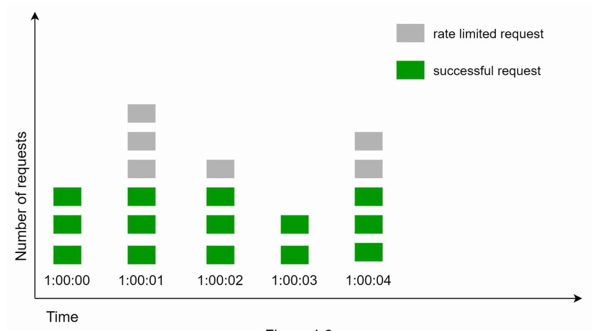
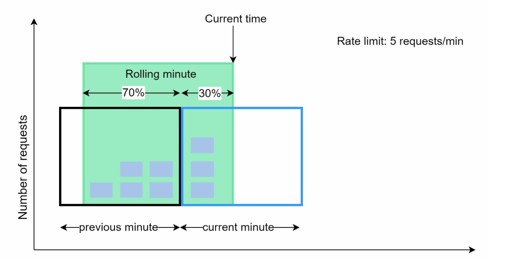

# 第 4 章：设计限流器（Design a Rate Limiter）

> 对照原版：[04. Rate Limiter/Readme.md](../../04.%20Rate%20Limiter/Readme.md)。本章按原版结构翻译；标有“批注”的内容为补充，原版文件未修改。

## 学习导读

如果你只会 CRUD，可以先把限流器想成“门卫”：请求太多时先挡住，避免数据库和业务服务被挤垮。学习目标是能说清限流放在哪里、如何选算法、分布式计数怎样避免出错。

先记住三个问题：**限谁**（用户/IP/API）、**限多少**（每秒/每分钟）、**超了怎么办**（拒绝、排队、降级）。常见误区是只在前端限制、只在单机内存计数，或把“读取计数再加一”当作原子操作。

## 简介（Introduction）

本章讨论限流器的设计与实现。限流器是控制客户端或服务请求速率的系统组件，对防止滥用、降低成本和保持服务器资源稳定十分重要。常见用途包括限制发帖次数、账户创建次数和奖励领取次数。

## 限流的好处（Benefits of Rate Limiting）

- **防止拒绝服务攻击（DoS）**：阻断过量调用，避免资源耗尽。
- **降低成本**：限制不必要的请求，减少服务器开支。
- **避免过载**：过滤过量请求，使服务器性能更稳定。

> **批注｜从 CRUD 接口出发**：假设发送短信要调用收费服务，给 `/send-sms` 限流既能控制费用，也能防刷；给数据库写接口限流可避免连接池被占满。应用层限流只是抗攻击的一层，不能单独抵御把网络带宽耗尽的攻击。

## 第 1 步：理解问题（Understanding the Problem）

### 关键能力（Key Features）

- 设计服务端 API 限流器。
- 支持多条节流规则（throttle rules）。
- 能在大规模分布式环境中运行。
- 可以是独立服务，也可以是应用中的代码。
- 请求被限流时应通知用户。

### 要求（Requirements）

- 请求限流准确。
- 额外延迟尽可能低。
- 内存占用少。
- 支持分布式部署。
- 异常处理清晰。
- 具备高容错能力。

> **批注｜补齐需求**：同一接口可以同时有“每个用户每分钟 10 次”和“全站每秒 1,000 次”规则。还应约定白名单、认证前后如何取限流标识、规则热更新，以及限流器故障时放行（fail-open）还是拒绝（fail-closed）。这取决于业务：普通查询可优先可用，付费或风控接口可能优先保护资源。

## 第 2 步：高层设计（High-Level Design）

### 部署位置（Placement Options）

1. **客户端实现**：可能被修改或绕过，因此不可靠。
2. **服务端实现**：控制性和可靠性较好，是优先选择。
3. **中间件/API 网关**：便于集成统一限流，部署灵活。

### 选择位置的原则（Guidelines for Placement）

- 评估当前技术栈，选高效且兼容的实现。
- 根据业务需求选择合适的限流算法。
- 微服务架构可以利用 API 网关。
- 团队资源有限时，可考虑商业化限流方案。

> **批注｜类比与失败模式**：小区门卫要设在实际入口。只在网页按钮上加倒计时，脚本仍能直接调用 API。网关限流可统一保护服务，但只有已校验的用户身份才适合做可信的 `userId` 计数键；IP 共享也可能误伤公司或校园网络内的用户。

## 第 3 步：限流算法（Rate Limiting Algorithms）

### 1. 令牌桶（Token Bucket）

- **原理**：按固定速率向桶内补充令牌，每个请求消耗一个令牌；令牌不足时拒绝请求。桶满后，多余令牌不再累积。
- **参数**：桶容量（bucket size）和补充速率（refill rate）。
- **优点**：容易实现，内存开销小，支持短时流量突发。
- **缺点**：参数需要仔细调节。

> **批注｜像限量通行券**：容量 20、每秒补 5 个令牌，意味着空闲后最多立即通过 20 次请求，长期速率约为每秒 5 次。容量控制“能突发多少”，速率控制“长期能走多快”。桶过大仍可能瞬间压垮下游。

### 2. 漏桶（Leaking Bucket）

- **原理**：使用先进先出队列（FIFO），按固定速率处理请求。
- **优点**：内存可控，输出速率稳定。
- **缺点**：突发流量可能让新请求长时间等待。
- 原版示例链接：[uber-go/ratelimit](https://github.com/uber-go/ratelimit)。

> **批注｜像匀速传送带**：适合保护要求平稳速率的下游。必须限制队列长度和最长等待时间；不能把漏桶理解成无限排队。不同库可能以调用阻塞等方式实现平滑速率，并不一定真的维护请求队列。

### 3. 固定窗口计数（Fixed Window Counter）

- **原理**：把时间分为固定区间，每个窗口维护一个计数器，根据配额判断是否放行。
- **优点**：简单、高效，适合规则较粗的场景。
- **缺点**：窗口边界附近的突发可能超过期望限制。

在相邻两个窗口的交界处集中发送请求，会导致短时间内通过的请求数超过单窗口配额。

> **批注｜能手算就记住了**：假设每分钟最多 100 次，在 12:00:59 发 100 次，再在 12:01:00 发 100 次，两次各自都合规，却在约 1 秒内通过了 200 次。它保证的是“每个固定分钟”，不是“任意连续 60 秒”。

### 4. 滑动窗口日志（Sliding Window Log）

- **原理**：记录请求时间戳，统计当前时刻向前一个窗口内的请求。
- **优点**：对滚动窗口进行精确限流。
- **缺点**：需要保存大量时间戳，内存开销较高。

> **批注｜逐张查票**：每次清除窗口外记录，检查剩余数量，再决定是否加入本次记录。删除、计数、插入必须作为一个原子操作，否则并发请求可能同时以为还有名额。对于“被拒请求是否计入后续窗口”也要预先定义。

### 5. 滑动窗口计数（Sliding Window Counter）

- **原理**：结合固定窗口计数与滑动窗口思想，平滑边界突发。
- **优点**：内存开销低，能应对突发流量。
- **缺点**：使用近似计数，未必能满足完全严格的配额。

> **批注｜近似公式**：常见实现为 `当前窗口计数 + 上一窗口计数 × 上一窗口仍覆盖的比例`。它隐含假设上一窗口流量分布较均匀，因此极端聚集流量会带来误差。

### 批注：选择算法的速记表

| 业务需要 | 常见选择 | 主要代价 |
|---|---|---|
| 长期限速、允许短突发 | 令牌桶 | 桶容量要匹配下游承受力 |
| 输出速率尽量平滑 | 漏桶 | 排队延迟与队列上限 |
| 规则简单、实现便宜 | 固定窗口 | 窗口边界突发 |
| 精确限制任意滚动窗口 | 滑动日志 | 保存时间戳耗内存 |
| 较平滑且省内存 | 滑动窗口计数 | 接受近似误差 |

## 高层架构（High-Level Architecture）

- **数据存储**：使用 Redis 等内存存储，快速更新计数器。
- **请求步骤**：
  1. 客户端将请求发给中间件。
  2. 中间件检查 Redis 中的计数和规则。
  3. 根据限流结果处理或拒绝请求。

> **批注｜失败要可解释**：超限常返回 HTTP `429 Too Many Requests`，可提供 `Retry-After`。客户端需要退避并加入随机抖动，避免所有人同时重试制造第二波拥堵。

## 进阶考虑（Advanced Considerations）

### 分布式环境（Distributed Environments）

- **挑战**：竞态条件、不同实例之间的同步。
- **解决方向**：锁、Redis Lua 脚本，以及 sorted set 等数据结构；利用共享存储协调各实例。

> **批注｜sorted set 本身不等于原子性**：它可保存时间戳，但“清理旧记录—计数—决定—写入”仍需放在 Lua 脚本等原子操作中。Lua 的原子性也只覆盖其所在 Redis 实例的数据操作，并非跨地区自动强一致。

### 性能优化（Performance Optimizations）

- 采用多数据中心部署，降低就近访问延迟。
- 通过最终一致方式同步部分计数或规则。

> **批注｜取舍**：跨地区异步同步可降低延迟，却可能暂时超发全局配额。严格全局额度可以集中协调或预分配地区额度，代价是延迟、可用性或利用率。

### 监控（Monitoring）

定期分析放行量、拒绝量和延迟，确认算法有效，并根据实际流量调整规则。

## 批注：面试回答模板与自测

“我先确认限流维度、窗口、配额和突发容忍度，默认在 API 网关采用令牌桶。各实例通过 Redis 原子脚本共享计数，超额返回 429；再按业务选择存储故障时的放行/拒绝策略，并监控拒绝率、延迟和误伤。”

合上文档，尝试解释：为什么前端限制不可靠？令牌桶两个参数分别管什么？为什么固定窗口边界会突发？多台网关怎样避免同时超发最后一个名额？

> **参考答案**：[Q04-01](../29.%20%E8%87%AA%E6%B5%8B%E9%A2%98%E8%AF%A6%E8%A7%A3/README.md#q04-01) · [Q04-02](../29.%20%E8%87%AA%E6%B5%8B%E9%A2%98%E8%AF%A6%E8%A7%A3/README.md#q04-02) · [Q04-03](../29.%20%E8%87%AA%E6%B5%8B%E9%A2%98%E8%AF%A6%E8%A7%A3/README.md#q04-03) · [Q04-04](../29.%20%E8%87%AA%E6%B5%8B%E9%A2%98%E8%AF%A6%E8%A7%A3/README.md#q04-04)。先独立作答，再逐题核对推导与图解。
