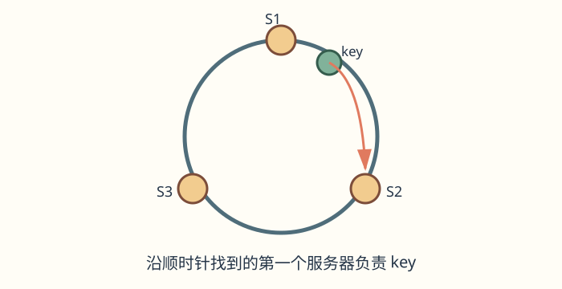
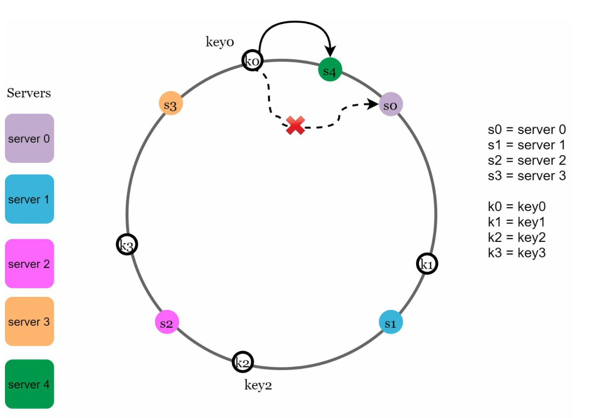

# 第 5 章：设计一致性哈希（Design Consistent Hashing）

> 对照原版：[05. Consistent Hashing/Readme.md](../../05.%20Consistent%20Hashing/Readme.md)。本章覆盖原版各节；“批注”为新增解释，原版文件保持不变。

## 学习导读

从 CRUD 出发，你已经知道 `SELECT ... WHERE id = ?`。数据库分成多台机器后，多了一个问题：**这个 key 应该去哪台机器查？** 一致性哈希解决的是节点增删时，如何尽量少改变 key 的去向。

先记住三个词：**环、顺时针、虚拟节点**。常见误区是以为“用哈希就一定均匀”，或以为“分布均匀就没有热门 key”；实际仍需虚拟节点、流量监控和热点处理。

## 简介（Introduction）

本章讨论一致性哈希。这项技术能有效地把请求和数据分散到多台服务器，支持水平扩展。节点增删时，它尽量减少数据重分配；结合合适的节点分布策略，可改善负载均衡，缓解服务器热点。

## 重哈希问题（The Rehashing Problem）

### 解释（Explanation）

传统哈希方法常写成 `serverIndex = hash(key) % N`，其中 N 是服务器数量。N 一旦变化，数据就要重新分配。例如：

- 移除服务器会让大量 key 改分到别的服务器，造成缓存未命中。
- 加入服务器也会造成大量不必要的 key 重分配。

当服务器池大小固定时，这种方式工作良好。但新增或移除服务器时就会出现问题。

### 关键问题（Key Issue）

服务器数量变化时，大多数 key 的路由都改变，造成低效的数据搬迁，甚至让后端过载。

> **批注｜像改抽屉编号规则**：`hash(key)=17` 时，4 台机器映射到 `17%4=1`，5 台机器映射到 `17%5=2`。即使原机器 1 还正常，key 也换了位置。缓存大量失效后，请求会落到数据库，扩容反而可能先造成一次压力峰值。

## 一致性哈希（Consistent Hashing）

### 定义（Definition）

一致性哈希让服务器增删时只有一部分 key 被重新映射，从而减少扰动、改善扩展性。

### 核心概念（Key Concepts）

#### 1. 哈希空间与环（Hash Space and Ring）

哈希空间可视作一条首尾相接的环。例如 SHA-1 的取值范围是 `0` 到 `2^160-1`，把范围的两端连接起来，就得到哈希环。

用同一个哈希函数 f，根据服务器 IP 或名称，把服务器映射到环上。

> **批注｜环是编号空间，不是网线**：机器并不需要真的按环连接。通常只需一份按哈希值排序的节点表，用查找算法找到后继位置；“沿环走”是解释路由规则的图像。

#### 2. 查找服务器（Server Lookup）

先求 key 的哈希位置，再顺时针沿环查找；遇到的第一个服务器负责该 key。

#### 3. 新增与移除服务器（Adding and Removing Servers）

新增服务器只改变附近区间中 key 的归属，只有这部分 key 被分配到新服务器。

移除服务器只影响它负责的范围；原属于它的 key 转交给顺时针方向的下一台服务器。

> **批注｜何时使用、如何落地**：适合缓存分片、分布式 KV 存储和需要稳定路由的负载均衡。真实迁移仍要复制数据、限速、校验并切换路由；哈希环只告诉你“哪些 key 应当搬”，不会自动搬数据。节点列表版本不一致会让客户端把同一 key 发到不同机器。

## 挑战与解决办法（Challenges and Solutions）

### 基础方案的两个问题（Two Issues in Basic Approach）

1. **分区大小不均**：服务器在环上的间距不同，负责的哈希区间可能差别很大。
2. **key 分布不均**：部分服务器可能收到明显更多的 key。

### 解决办法：虚拟节点（Virtual Nodes）

一台物理服务器在环上对应多个虚拟节点，而非只有一个位置。把虚拟节点分散到环上，能改善 key 分布和负载均衡。通常虚拟节点越多，分布的标准差越小，数据越均匀。

> **批注｜像在多个街区开分店**：一台机器只占一个连续区间，容易运气不好分到“大地盘”；占据许多小区间后，偏差更容易相互抵消。容量大的机器可分配更多虚拟节点。节点数过少仍不均，过多则增加路由表与维护成本。
>
> **批注｜数据均匀不等于访问均匀**：假设 1,000 万个 key 均匀分布，但某一个热门 key 占据一半请求，虚拟节点也不会自动把这个单 key 拆开。热门 key 仍需缓存复制、请求合并、拆分等业务方案。

## 受影响的 key（Affected Keys）

服务器新增或移除时，只有特定范围的 key 改变归属。

- **新增服务器**：受影响范围位于新服务器与其前驱之间。例子中把 s4 加入环，从 s4 逆时针找到前一个服务器 s3，因此 `(s3, s4]` 内的 key 转交给 s4。

  

- **移除服务器**：受影响范围位于被移除服务器与其前驱之间。例子中删除 s1，从 s1 逆时针找到 s0，因此 `(s0, s1]` 内的 key 转交给顺时针后继 s2。

  

> **批注｜记忆方法**：“找负责人顺时针，找归属区间看前驱”。端点写法要和实际查找实现保持一致；上面的 `(前驱, 当前节点]` 对应查找大于等于 key 哈希值的第一个节点。

## 一致性哈希的优点（Benefits of Consistent Hashing）

- **尽量少迁移**：只有部分 key 重新分配。
- **可扩展**：支持水平增加服务器。
- **缓解热点**：通过更均衡的数据分配，降低单服务器过载风险。

## 实际应用（Real-World Applications）

原版列举：

- Amazon DynamoDB
- Apache Cassandra
- Discord
- Akamai CDN
- Maglev Load Balancer

> **批注｜区分概念与实现**：这些是相关应用/系统示例，不表示都使用本章画出的同一种哈希环。Dynamo 与 Cassandra 是理解环形分区的典型资料；Maglev 是另一种基于查找表的稳定负载均衡方案，不能把它的实现直接画成此处的虚拟节点环。

## 批注：面试回答模板与自测

“`hash(key)%N` 在 N 变化时导致大量 key 重映射。我会让 key 与节点进入同一哈希空间，顺时针取后继节点，并用虚拟节点改善均衡；扩缩容时仅迁移受影响区间，同时控制迁移流量和节点视图版本。热门 key 仍需单独处理。”

合上文档，尝试画 3 个服务器和 4 个 key；加入一个节点后标出唯一受影响区间；解释为什么虚拟节点不能自动消除热门 key。

> **参考答案**：[Q05-01](../29.%20%E8%87%AA%E6%B5%8B%E9%A2%98%E8%AF%A6%E8%A7%A3/README.md#q05-01) · [Q05-02](../29.%20%E8%87%AA%E6%B5%8B%E9%A2%98%E8%AF%A6%E8%A7%A3/README.md#q05-02) · [Q05-03](../29.%20%E8%87%AA%E6%B5%8B%E9%A2%98%E8%AF%A6%E8%A7%A3/README.md#q05-03)。先独立作答，再逐题核对推导与图解。
