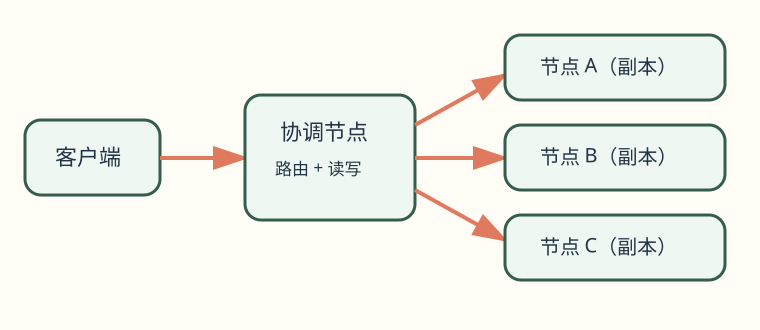
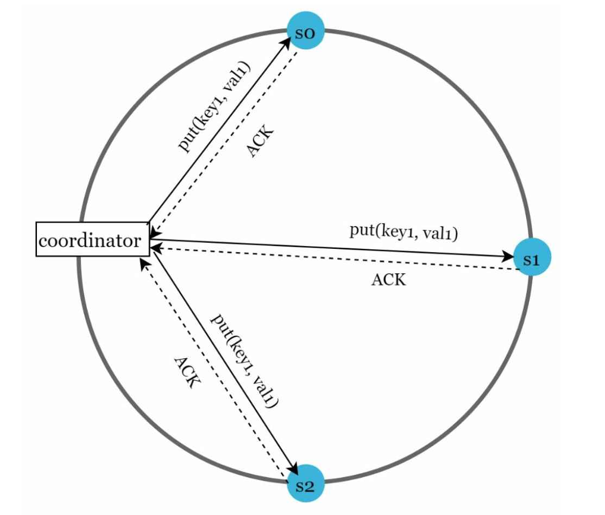
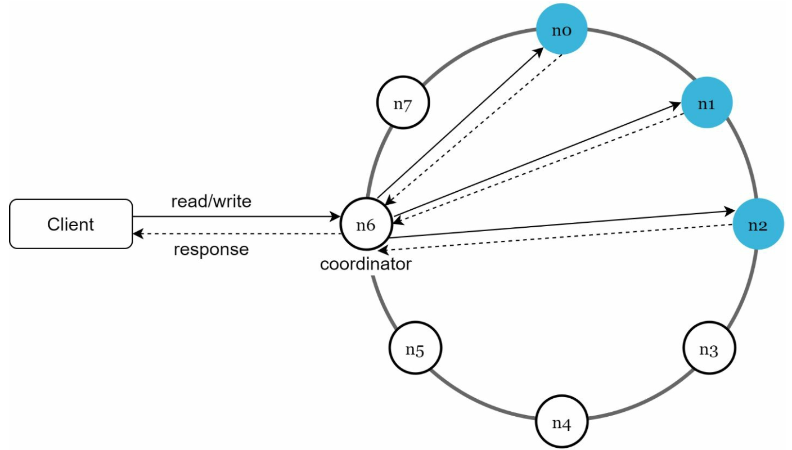

# 第 6 章：设计键值存储（Design a Key-Value Store）

> 对照原版：[06. Key-Value Store/Readme.md](https://github.com/liquidslr/system-design-notes/blob/main/06.%20Key-Value%20Store/Readme.md)。正文沿用原版结构；“批注”用于补充解释或标明原文简化的边界，原版文件未修改。

## 学习导读

你熟悉的 CRUD 在多台机器上仍然存在，但多了四个问题：**key 放哪台、保存几份、成功要等几份、机器坏了如何补齐**。本章就是依次回答这四个问题。

先记住：分区负责扩容量，复制负责抗故障，协调规则决定一致性与延迟。常见误区是认为“有三份副本就一定读到最新值”，或只设计正常读写、不设计故障恢复。

## 简介（Introduction）

<strong>键值存储（key-value store）</strong>是一类非关系数据库，以 key-value 对保存数据。每个 key 唯一，使用 key 读取对应 value。本章设计一个可扩展、高可用的分布式键值存储，提供以下操作：

- `put(key, value)`：写入数据。
- `get(key)`：读取数据。

### 设计特征（Characteristics of the Design）

- 键值对较小，大小小于 10 KB。
- 支持大量数据，兼顾高可用和可扩展性。
- 自动扩展，一致性可配置。
- 低延迟。

> **批注｜像超大的 Map**：可以把它理解成跨机器的字典，但它不自动提供 SQL 的连接查询、外键或多行事务。设计前先问清楚接口语义：相同 key 再 `put` 是覆盖还是保留版本？删除、过期和条件更新是否需要？

## 单机键值存储（Single Server Key-Value Store）

### 实现（Implementation）

用内存<strong>哈希表（hash table）</strong>保存键值对。可进一步优化：

- 压缩数据。
- 将低频访问的数据存到磁盘。

### 限制（Limitation）

一台服务器的内存有限。要支持更大的数据量，需要使用分布式方案。

## 分布式键值存储（Distributed Key-Value Store）

分布式键值存储把数据分区到多台服务器，因此必须考虑 **CAP 定理**描述的取舍。

### CAP 定理（CAP Theorem）

原版用以下三点介绍 CAP：

1. **一致性（Consistency）**：所有客户端看到一致的数据。
2. **可用性（Availability）**：即使一些节点故障，系统仍响应请求。
3. **分区容错（Partition Tolerance）**：网络分区时系统仍能工作。

原版将取舍概括为“这三项只能同时得到两项”。

> **准确性批注｜不要机械背“三选二”**：在网络分区发生期间，无法同时保证线性一致性 C 和 CAP 意义的可用性 A。C 通常指操作看起来按实时顺序、在一个瞬间完成；A 要求发往未故障节点的请求最终得到非错误响应，返回 503 不算满足。P 是网络可能断开的环境前提，不能简单把它当作功能开关。

#### 系统类型（System Types）

- **CP 系统**：分区时优先一致性，牺牲部分可用性。原版以银行系统为例。
- **AP 系统**：分区时优先可用性，可能返回旧数据，之后再收敛。
- **CA 系统**：不考虑分区时同时提供一致性和可用性；原版强调真实网络故障不可避免，所以不能依靠 CA 假设保证跨网络系统在分区时仍正常工作。

在分布式系统中，分区发生时要选择 C 或 A。例如 n3 与 n1/n2 失去联系，n1 或 n2 上的新写无法传到 n3；n3 上的写也无法及时传到 n1/n2，因此这些节点可能持有不同版本。

- 原版对 CP 的示例是阻止 n1/n2 上的写，以避免不一致。
- 对 AP，则继续读取，即使可能返回旧值；n1/n2 也继续写，网络恢复后再将变更同步到 n3。

> **准确性批注｜CP 不一定全停**：具体阻止哪一侧取决于协议。采用多数派协调时，只要 n1/n2 仍构成多数派，它们可能继续读写，少数派一侧拒绝服务。不能因为业务叫“银行”就断言整个系统都选 CP，应逐个操作说明约束。
>
> **入门批注｜像断线门店记账**：电话断了，要么先停止不确定的销售以免超卖，要么继续接单、恢复后处理冲突。面试时可以说：“我先定义分区期间允许的行为；余额扣减需要更严格的一致性，展示类数据可能允许短暂旧读。”

## 系统组件（System Components）

### 1. 数据分区（Data Partitioning）

- **技术**：使用一致性哈希将数据分散到多台服务器。
- **优点**：
  - 节点加入或离开时可自动扩缩容。
  - 通过虚拟节点支持不同容量的服务器，虚拟节点数量可与服务器容量成比例。

> **批注｜分区与复制别混淆**：分区把不同数据放到不同机器以扩容量；复制把同一份数据放到多台机器以抗故障。一个系统通常同时做两件事。

### 2. 数据复制（Data Replication）

将数据复制到 N 台服务器，提高可用性。原版沿哈希环顺时针选择前 N 个服务器保存副本；在有虚拟节点时，应选择不同物理服务器，并尽量将副本放到不同数据中心，以免一次物理故障带走多份副本。

### 3. 一致性（Consistency）

数据有多个副本，需要进行同步。

#### Quorum 读写法定人数

- `N`：副本总数。
- `W`：写入成功需要得到确认的副本数。
- `R`：读取成功需要等待响应的副本数。
- 原版规则：`W + R > N` 可使读写集合相交，并将其概括为强一致。
- 配置 W、R、N，通常要在延迟和一致性之间取舍。

- `R=1, W=N`：偏向快速读取。
- `W=1, R=N`：偏向快速写入。
- `W+R>N`：原版常见配置为 `N=3, W=R=2`。
- `W+R≤N`：无法保证读集合接触到最新已确认的写入。

> **准确性批注｜相交不是完整的一致性协议**：`W+R>N` 只保证固定 N 个副本中的读写集合相交。要实现线性一致性，还需正确的版本比较、并发写排序、失败写处理、读修复和成员变化处理；不能仅凭这条不等式就宣称“保证强一致”。只等一个副本也可能很快，但另两个后台写失败时要有明确恢复语义。

<strong>交互实验：Quorum 读写：集合相交，就一定读到新值吗</strong>。调 N、W、R，让副本变慢或失联，逐步看写确认、读回复和每个副本的版本；复现「读到 1 后又读到 0」的反例、读修复的效果，以及 sloppy quorum 下读写集合不再相交。<a href="https://kadaliao.github.io/system-design-interview-zh/#d6/lab-quorum-rw">在线阅读版</a>中可直接操作。

#### 一致性模型（Models）

- **强一致性（Strong Consistency）**：读操作返回符合最新已完成写入结果的值。
- **弱一致性（Weak Consistency）**：后续读取可能看不到最新写入。
- **最终一致性（Eventual Consistency）**：在没有新更新、传播与修复能够继续的前提下，给足时间，各副本最终收敛。

> **批注｜使用与代价**：订单状态若要求写后立刻读到，可选择更强读写语义；点赞数允许短暂变化，可接受最终一致。把 R/W 设置得更高通常会等待更多副本，并在故障时损失部分可用性。

### 4. 不一致解决（Inconsistency Resolution）

复制提高可用性，却可能让副本不一致。原版通过版本化和向量时钟解决这类问题（原文 `vector locks` 应理解为 `vector clocks`）。

#### 版本化（Versioning）

- 使用<strong>向量时钟（vector clock）</strong>跟踪版本、识别冲突。
- 把每次修改看作新的不可变数据版本。

例如服务器 1 修改姓名，服务器 2 同时也修改姓名，就产生冲突版本 v1 和 v2。

#### 向量时钟（Vector Clock）

1. **表示方式**：每个数据项携带若干 `[server, version]` 对，可判断版本先后或并发。表示为 `D([S1,v1], [S2,v2], …, [Sn,vn])`，其中 D 是数据项，Si 是服务器标识，vi 是该参与者的版本计数。
2. **更新方式**：在 Si 修改数据时，若向量中已有 Si，就增加它的计数；没有则添加新条目。
3. **冲突检测**：原版说明，若 X 的计数都不大于 Y，则 X 是 Y 的祖先；兄弟版本（siblings）表示存在并发冲突。
4. **冲突合并**：发现兄弟版本后，需要应用专用逻辑或客户端参与合并。

> **准确性批注｜精确比较规则**：缺失项视为 0。若 X 每一项都 `≤` Y，且至少一项 `<`，则 X 先于 Y；全部相等是同一向量。如果某一项 X 大于 Y，而另一项 Y 大于 X，二者才是并发。原文只写“有一项小于对方”不足以判断并发。
>
> **入门批注｜像各人盖章的修改记录**：`X={A:2,B:1}` 与 `Y={A:1,B:2}` 各有新信息，不能简单认为计数总和更大者胜。向量时钟能识别冲突，不能决定正确业务值；购物车可合并集合，姓名可能要用户选择或使用明确的覆盖规则。

<strong>交互实验：向量时钟：谁是祖先，谁在冲突</strong>。选基础版本和处理服务器来写入，看向量怎样递增、两个版本何时互不支配成为 siblings，以及客户端合并后的新向量。<a href="https://kadaliao.github.io/system-design-interview-zh/#d6/lab-vector-clock">在线阅读版</a>中可直接操作。

挑战包括：

- 客户端处理复杂度增加。
- 参与者增多时向量可能变长，需要裁剪策略限制大小；裁剪也可能丢失因果信息。

### 5. 故障处理（Handling Failures）

#### a. 故障检测（Failure Detection）

不能仅凭另一台机器说“它坏了”就下定论。原版建议使用至少两个独立信息来源，再把节点标记为故障。

##### Gossip 协议

- 每个节点保存成员 ID 和心跳计数器。
- 节点周期性递增自己的心跳计数。
- 节点周期性向一组随机节点发送心跳信息。
- 若某成员的心跳在预设时长内未增长，就认为它离线。

> **批注｜“怀疑故障”不是证明故障**：慢机器、网络拥堵、GC 暂停也会丢心跳。因此超时是故障怀疑，不是绝对证据；还需成员协议、重试/恢复机制和防止频繁上下线的措施。

#### b. 临时故障（Temporary Failures）

##### Sloppy Quorum（宽松法定人数）

- 发现故障后，需要机制保持服务可用。
- 不强制只在原来的固定副本集合里满足人数，而沿环挑选前 W 个健康节点写、前 R 个健康节点读。
- 忽略离线服务器，由其他健康服务器临时处理请求。

##### Hinted Handoff（提示移交）

替代节点保存“这份数据本来属于谁”的提示。原节点恢复时，把变更推送回去，使数据逐步一致。

> **准确性批注｜宽松后可能不再相交**：替代节点可能不属于原 N 个副本，`W+R>N` 便不能单独保证读写集合相交。hinted handoff 也依赖提示的可靠保存和及时交还，不能代替完整的副本修复。

#### c. 永久故障（Permanent Failures）

使用 <strong>Merkle Tree（默克尔树，也叫哈希树）</strong>高效检测副本差异，辅助数据同步和修复。

##### 工作原理（Working）

1. **树的结构**：
   - 叶节点保存各数据块的哈希。
   - 非叶节点保存子节点哈希组合后的哈希。
   - 根哈希代表整棵树所覆盖的数据状态。

2. **构建 Merkle Tree**：
   - **步骤 1**：把 key 空间划分成多个桶。

     

   - **步骤 2**：对桶中的 key 进行哈希（原版示意）。

     

   - **步骤 3**：将每个桶合并成一个哈希。

     

   - **步骤 4**：逐层合并桶哈希，直到得到根哈希。

     

3. **同步过程**：
   - 先比较两个副本的根哈希。
   - 根相同，表示当前树覆盖的数据在哈希意义上一致。
   - 根不同，递归比较子节点，定位不一致的桶。
   - 只同步有差异的数据。

##### 优点（Advantages）

- **高效**：仅传输不一致数据，减少传输量。
- **可扩展**：适合大数据集，避免总是全量同步。
- **可靠性**：帮助副本检查差异并恢复一致。

> **准确性批注｜值也必须进入指纹**：只对 key 哈希，检测不出“相同 key、不同 value”。真实系统需对规范编码后的 key、value、版本等相关内容计算摘要，且各副本使用相同分桶边界。相同哈希是一种基于哈希碰撞极低概率的判断，不是数学上绝无差异。
>
> **入门批注｜像逐级核对目录指纹**：先比整本书的指纹，不同再比章、节、页，只重传改动页。Merkle Tree 负责定位差异，具体哪一版本正确仍由版本与冲突规则决定；它也可用于日常反熵修复，不只用于永久故障。

### 6. 数据中心故障（Handling Data Center Outages）

把数据复制到多个数据中心，使单个机房中断时仍能提供服务。

> **批注｜不只是复制数据**：客户端流量切换、DNS/路由、认证依赖、容量预留和跨区复制延迟也需一起考虑。副本都在同一机房，不能抵御机房整体断电。

## 写路径与读路径（Write and Read Paths）

### 1. 写路径：参考 Cassandra 架构（Write Path）

1. 先把写入追加到 **commit log（提交日志）**。
2. 将数据写到**内存结构**中（原文称 memory cache）。
3. 内存达到阈值后，刷写为磁盘上的 **SSTable（Sorted String Table，有序字符串表）**。

> **批注｜日志与内存分工**：Cassandra 的写入内存结构通常称 memtable。日志用于崩溃恢复，内存用于快速写；确认写成功前是否已刷盘，取决于持久化设置，不能仅凭“用了日志”就断言断电绝不丢数据。SSTable 写出后通常不可变，后台 compaction 负责合并与清理旧版本。

### 2. 读路径（Read Path）

1. 先检查内存中是否有目标数据。
2. 若未命中，通过 <strong>Bloom Filter（布隆过滤器）</strong>排除不可能包含 key 的 SSTable。
3. 从相关 SSTable 读取并返回数据。

> **准确性批注｜Bloom Filter 不负责定位精确记录**：它只回答“一定不存在”或“可能存在”，后者还需查索引与数据文件；可能误报存在，但在正确维护下不会漏报已插入元素。LSM 系统中同一 key 也可能出现在多个 SSTable，读取可能需要合并版本、处理墓碑，而不是命中第一个文件就返回。

<strong>交互实验：Bloom Filter：「可能存在」为什么还要读盘</strong>。在 SSTable 读路径上插入和查询 key，看位数组怎样产生假阳性、位数组大小如何影响误报，以及为什么不能靠清零位来删除。<a href="https://kadaliao.github.io/system-design-interview-zh/#d6/lab-bloom-filter">在线阅读版</a>中可直接操作。

## 最终架构（Final Architecture）

- 客户端通过简单 API `get(key)` 和 `put(key,value)` 访问存储。
- <strong>协调节点（coordinator）</strong>作为客户端与存储节点之间的代理。
- 节点通过一致性哈希分布在环上。
- 系统采用去中心化的数据节点设计，可自动加入和迁移节点。
- 数据复制到多个节点。
- 原版强调各节点职责对等，从数据节点角色上避免单一固定节点成为单点。

> **准确性批注｜“去中心化”仍需系统审计**：对等节点不代表部署中绝无单点；客户端引导地址、配置服务、机房网络或凭证服务仍可能成为共同依赖。应按实际依赖图验证可用性。

## 批注：面试回答模板与自测

“先用一致性哈希分片，再跨故障域放 N 个副本；明确 R/W 与版本规则，说明需要的读写一致性。协调节点路由请求，日志、memtable、SSTable 构成单节点存储。临时故障用替代节点与 hinted handoff，持续反熵用 Merkle Tree；网络分区期间的拒绝、旧读和冲突必须事先约定。”

自测：分区和复制分别解决什么？N=3、R=W=2 为什么读写集合相交但仍不等于完整强一致协议？向量时钟能自动选出正确姓名吗？Bloom Filter 返回“存在”后为何还要读磁盘？

> **参考答案**：[Q06-01](../29.%20%E8%87%AA%E6%B5%8B%E9%A2%98%E8%AF%A6%E8%A7%A3/README.md#q06-01) · [Q06-02](../29.%20%E8%87%AA%E6%B5%8B%E9%A2%98%E8%AF%A6%E8%A7%A3/README.md#q06-02) · [Q06-03](../29.%20%E8%87%AA%E6%B5%8B%E9%A2%98%E8%AF%A6%E8%A7%A3/README.md#q06-03) · [Q06-04](../29.%20%E8%87%AA%E6%B5%8B%E9%A2%98%E8%AF%A6%E8%A7%A3/README.md#q06-04)。先独立作答，再逐题核对推导与图解。
