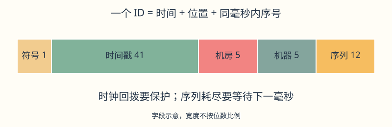
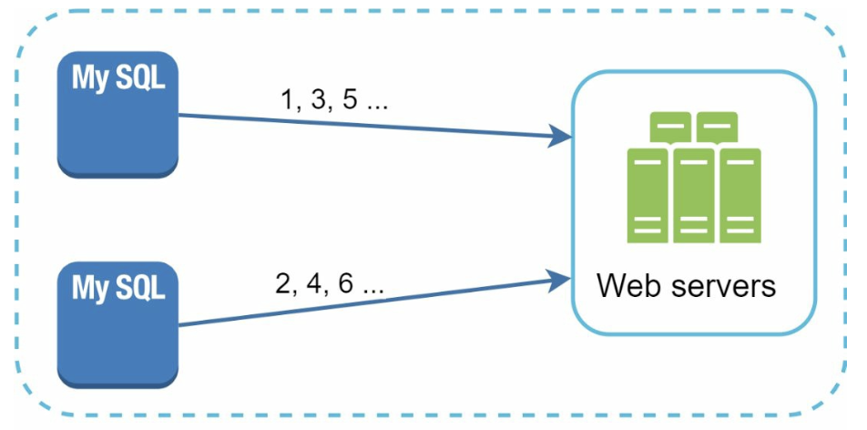

# 第 7 章：设计分布式唯一 ID 生成器（Unique ID Generator）

> 对照原版：[07. Unique-Id Generator/Readme.md](../../07.%20Unique-Id%20Generator/Readme.md)。本章按原文翻译并插入批注；原版文件保持不变。

## 学习导读

单机 CRUD 中，自增主键让数据库帮你发号。多台机器同时发号时，要解决“不同机器会不会发出同一个号”。本章目标是理解四种方案，并能解释 Snowflake 的字段、容量和故障边界。

先记住：**机器位置区分不同生成器，序列区分同毫秒内的多个 ID，时间字段支持大致排序**。常见误区是把“唯一”“连续”“时间有序”当成同一个要求，或只记位数、忽略时钟回拨。

## 简介（Introduction）

本章讨论分布式系统中的唯一 ID 生成问题。传统自增主键在分布式环境中会遇到扩展和同步困难。这里要生成唯一、可排序的 64 位数字 ID，满足：

- ID **唯一**，可按**日期排序**。
- ID 必须放在 **64 位**中。
- 系统每秒生成 **超过 10,000 个 ID**。

> **批注｜不要过早否定数据库自增**：单个数据库能满足规模时，自增仍很合适。本题的要求是让发号能力跨多节点扩展；选择方案前先确认吞吐、位宽、顺序和故障容忍度，避免为普通 CRUD 引入不必要服务。

## 第 1 步：理解问题（Understanding the Problem）

### 基本要求（Basic Requirements）

- ID 是唯一的数字，适合 64 位存储。
- ID 随时间增加，但不要求每次严格 `+1`。
- ID 能按日期排序。
- 支持高吞吐量，目标约为 10,000 IDs/s 或以上。

> **批注｜三个词分开记**：唯一意味着不重复；连续意味着无空洞；有序意味着比较大小能反映某种先后。本题不要求连续。跨机器的“按时间排序”还需进一步说明是大致有序，还是遵守实时先后的全局严格递增。

## 第 2 步：高层方案（High-Level Design Options）

### 1. 多主复制（Multi-Master Replication）

- **做法**：使用数据库 `auto_increment`，为 k 台服务器设置不同起点，并按 `+k` 的步长递增。

  

- **缺点**：
  - 难以跨数据中心扩展。
  - ID 不一定总是随实际时间增加。
  - 加入或移除服务器时，起点、步长和既有 ID 范围的管理会变复杂。

> **批注｜手算示例**：两台机器分别发 `1,3,5…` 和 `2,4,6…`，可以区分来源，但机器 A 已发到 101 时，机器 B 仍可能发 20，所以不能靠数字大小判断真实先后。扩成三台时不能简单把步长从 2 改 3，否则可能撞到历史 ID。

### 2. UUID（Universally Unique Identifier，通用唯一标识符）

- **做法**：
  - 每台服务器独立生成 128 位 UUID。
  - 服务器之间无需协调就能生成标识符。

  

- **优点**：
  - 无需服务器之间协调。
  - 可随着 Web 服务器数量增加而扩展。
- **缺点（原版概括）**：
  - 超出 64 位要求。
  - ID 不一定按时间排序，常见文本表示也不只是十进制数字。

> **准确性批注｜要说 UUID 版本**：随机 UUID（如 v4）不按时间排序；UUIDv7 等版本支持时间排序，但仍是 128 位，所以不满足本题位宽。UUID 也可按 16 字节二进制保存，不一定必须是字符串。随机 UUID 的唯一性依赖足够大的随机空间和合格实现，是碰撞概率极低，不能把任何实现都视为绝对不重复。

### 3. 票据服务器（Ticket Server）

- **做法**：用集中式数据库服务器递增并分配 ID。

  

- **优点**：
  - 对小规模系统容易实现。
  - 可以生成数字 ID。
- **缺点**：
  - 集中服务器可能成为单点故障。
  - 改成多服务器时需要解决同步和冲突。

> **批注｜像统一排号机**：好理解、好管控，但排号机坏了所有人都拿不到号。批量分配号段可降低每次调用成本；高可用切换仍需确保号段不重叠。号段优化是补充方向，不是原版已经实现的功能。

### 4. Twitter Snowflake 方案

- **做法**：把 ID 分成多个字段，组合保证唯一性并支持扩展。

  

  

- **符号位（Sign Bit），1 bit**：固定为 `0`，使有符号 64 位整数保持非负。
- **时间戳（Timestamp），41 bits**：相对自定义起始时间（epoch）的毫秒数。原版采用 Twitter 的 epoch `1288834974657`，对应 **2010-11-04 01:42:54.657 UTC**。高位存放时间，便于时间排序。
- **数据中心 ID（Datacenter ID），5 bits**：最多区分 `2^5 = 32` 个数据中心。
- **机器 ID（Machine ID），5 bits**：每个数据中心最多区分 `2^5 = 32` 台机器。
- **序列号（Sequence Number），12 bits**：区分同一机器同一毫秒内的 ID，可表示 `2^12 = 4096` 个值。进入新的毫秒后，序列重置为 `0`。

### 批注：为什么组合后不重复

- 不同机房：数据中心字段不同。
- 同机房不同机器：机器字段不同。
- 同机器不同毫秒：时间字段不同。
- 同机器同毫秒：序列不同。

只要机器身份不重复、时钟与序列按规则维护，这些字段的组合就不同。ID 可以看作“发号时间 + 窗口位置 + 本毫秒小票号”。

- **优点**：
  - **可扩展**：多服务器可共同达到每秒 10,000 个以上的 ID。
  - **时间顺序**：可按时间字段排序。
  - **去中心化**：正常生成路径无需集中数据库逐个发号，避免该类单点。

> **准确性批注｜大致有序与生成唯一性的前提**：跨机器存在时钟偏差，Snowflake 不保证全局严格递增。机器 ID 的分配、重启后的身份复用、时间回拨和序列并发更新必须正确，否则仍会碰撞；去中心化发号也不代表机器注册或配置依赖没有单点。
>
> **批注｜算一次容量**：单机器单毫秒最多 4096 个，理论上每秒 `4096×1000 = 4,096,000` 个，实际吞吐受实现与运行环境限制。41 位毫秒跨度约为 `2^41 / 1000 / 60 / 60 / 24 / 365 ≈ 69.7` 年，达到上限之前需迁移 epoch/位布局；不能认为这个布局能永远使用。

## 第 4 步：其他考虑（Additional Considerations）

> 编号说明：原版直接从第 2 步跳到第 4 步，没有独立的第 3 步；这里保留原编号以便对照。

### 1. 时钟同步（Clock Synchronization）

- **挑战**：ID 生成依赖服务器时钟，时钟差异会影响顺序与安全性。
- **原版方向**：使用 **NTP（Network Time Protocol，网络时间协议）**降低漂移。

> **批注｜NTP 不能替代回拨保护**：必须比较本次时间与上次发号时间。若当前时间更早，可等待追平、拒绝发号并报警，或采用经过设计的逻辑时间方案；不能悄悄把序列归零继续发。若同毫秒 4096 个序列用尽，也需等待下一毫秒或明确拒绝，不能回到 0 重用。

### 2. 字段长度调优（Section Length Tuning）

根据用途调整各字段大小，例如减少序列位数、增加时间戳位数。

> **批注｜位数是一份固定预算**：要更多机器，就给机器字段更多位；要更长生命周期，就给时间字段更多位；要更大的瞬时吞吐，就给序列更多位。总位数仍为 64，调整时还要考虑已有 ID 的解析和排序兼容性。

### 3. 高可用（High Availability）

- ID 生成器是关键基础设施，需要容错。
- 设计冗余和故障转移机制。

> **批注｜部署自检**：确保机器 ID 租约/分配互斥，重启不与旧实例并存复用同一身份；并发发号要同步时间与序列状态；监控时钟回拨、发号失败与容量，并演练故障恢复。JavaScript 的 Number 无法精确表示所有 64 位整数，JSON API 常以十进制字符串传递 ID，服务内可用相应的 64 位整数类型或 BigInt。

## 批注：面试回答模板与自测

“本题需要 64 位数字且大致按时间排序，所以随机 UUID 不满足位宽要求；集中票据服务容易出现瓶颈。我选 Snowflake：1 位符号、41 位毫秒时间、5 位机房、5 位机器、12 位序列。说明机器 ID 互斥分配、并发序列更新、时钟回拨和序列耗尽的处理，并明确它不提供全局严格递增。”

自测：唯一、连续、有序有什么区别？UUIDv7 为什么仍不满足本题？为什么机器号重复会产生碰撞？同一毫秒序列用完或时钟回拨时，该做什么？

> **参考答案**：[Q07-01](../29.%20%E8%87%AA%E6%B5%8B%E9%A2%98%E8%AF%A6%E8%A7%A3/README.md#q07-01) · [Q07-02](../29.%20%E8%87%AA%E6%B5%8B%E9%A2%98%E8%AF%A6%E8%A7%A3/README.md#q07-02) · [Q07-03](../29.%20%E8%87%AA%E6%B5%8B%E9%A2%98%E8%AF%A6%E8%A7%A3/README.md#q07-03) · [Q07-04](../29.%20%E8%87%AA%E6%B5%8B%E9%A2%98%E8%AF%A6%E8%A7%A3/README.md#q07-04)。先独立作答，再逐题核对推导与图解。
