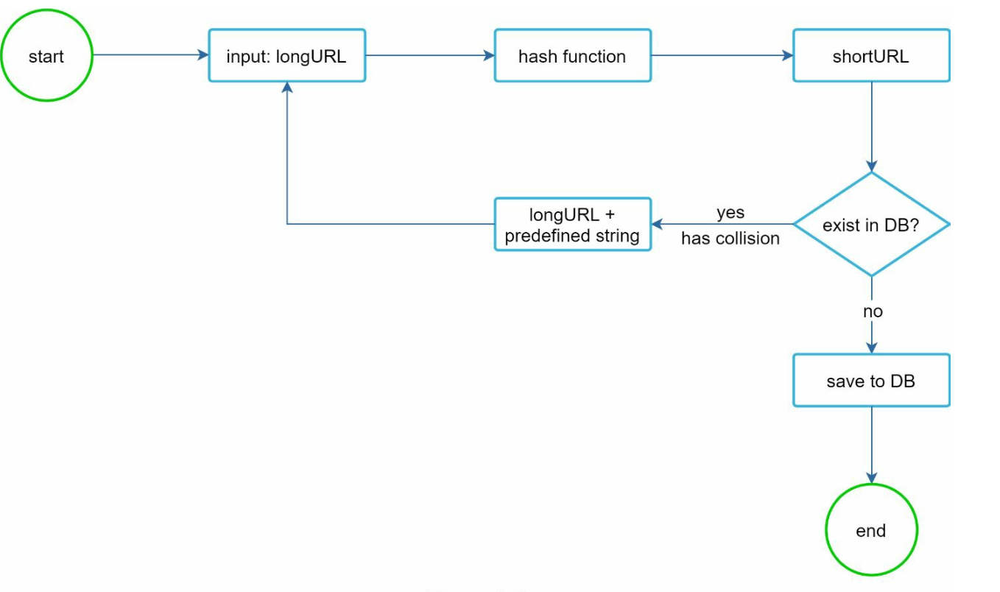
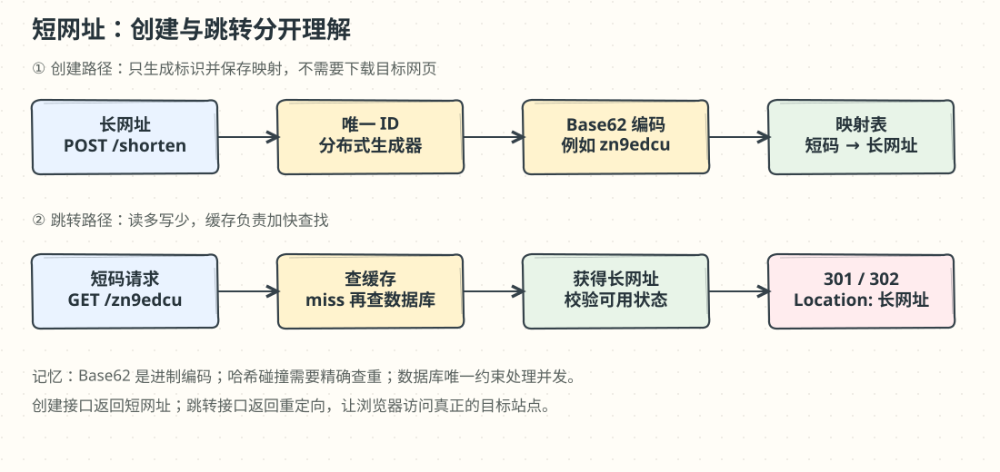

# 第 8 章：设计短网址服务（URL Shortener）

> 译文来源：[原版第 8 章](../../08.%20URL%20Shortener/Readme.md)。本目录新增中文翻译与教学批注；原版文件保持不变。标有“批注”的内容是新增解释或对原文简化表述的补充。

## 中文学习导读

**学习目标：**把一个“保存短码和网址”的 CRUD 功能，变成能承受大量跳转请求的服务。

**先记住：**创建时保证唯一，跳转时优先查缓存；Base62 是编码，哈希可能碰撞。

**常见误区：**把短码当成权限凭证；认为 301 和 302 只有数字不同；认为 Bloom Filter 能证明短码唯一。

## 简介（Introduction）

本章设计类似 TinyURL 的服务，主要目标是 **URL shortening（网址缩短）**、**redirecting（重定向）**，以及承受大量流量的 **high scalability（高可扩展性）**。

### 需求（Requirements）

- 短网址必须**唯一**，并且**尽可能短**。
- 每天生成 **1 亿**个短网址，支持未来 **10 年**的容量。
- 读写比例约 **10:1**，重点优化读取。
- 十年保存 **3650 亿**条记录，原文估计需要约 **365 TB**。

### 批注：把规模换成 CRUD 能理解的数字

按一年 365 天估算，`1 亿 × 365 × 10 = 3650 亿`。365 TB 隐含每条约 1 KB，尚未计入索引、复制、备份和数据库开销。平均写入约 `1 亿 / 86400 ≈ 1157 次/秒`，平均跳转约 1.16 万次/秒；峰值还需另作假设。

## 步骤 1：高层设计（High-Level Design）

### API 接口（API Endpoints）

1. **缩短网址：**`POST api/v1/data/shorten`，参数 `{longUrl: longURLString}`，返回 `shortURL`。
2. **跳转：**`GET api/v1/shortUrl`，根据短网址查出 `longURL` 并重定向。

### URL 重定向（URL Redirection）

- **301 Redirect：**表示资源已“永久”移到长网址。原文以浏览器缓存该响应为例，说明后续请求可能不再经过短链服务。
- **302 Redirect：**表示临时重定向，适合需要统计点击等分析的场景。

### 批注：先定统计目标，再定状态码

短链服务像指路牌：301 更像让浏览器“记住以后直接去那里”，302 更像“这次先去那里”。实际是否缓存还取决于缓存策略；302 也不等于绝对不可缓存。需要逐次观测请求时，除状态码外还要设计正确的缓存头。用户点击次数也不能简单等同于请求数，因为机器人、预取和重复请求会干扰统计。

### URL 缩短（URL Shortening）

原文提出使用 **hash function（哈希函数）**生成短值，并要求：

- 一个 `longURL` 得到一个 `hashValue`。
- 每个 `hashValue` 都能映射回其 `longURL`。

### 批注：映射回去靠数据库，不靠“逆哈希”

哈希通常不可逆。这里的“映射回去”是把 `<短码, 长网址>` 保存到数据库再查询。同一个长网址是否始终复用同一短码，是产品与幂等策略；不同用户可能需要独立统计，因此也可以拥有不同短码。

## 步骤 2：深入设计（Deep Dive into Design）

### 数据模型（Data Model）

将 `<shortURL, longURL>` 映射存入关系数据库，避免把全部数据放在内存。表包括 `id`（主键）、`shortURL`、`longURL`。

### 哈希函数与编码（Hash Function）

#### 1. Base62 进制转换（Base 62 Conversion）

- 使用 `[0-9, a-z, A-Z]` 共 **62 个字符**表示数字。
- 为短链分配唯一 ID，再把 ID 编码为 Base62。
- 7 位能表示 `62^7 = 3,521,614,606,208` 个值，约 **3.5 万亿**，足以覆盖 3650 亿条。
- 示例：按 `0-9a-zA-Z` 字符顺序，`2009215674938 → zn9edcu`。

#### 2. 哈希与冲突处理（Hash + Collision Resolution）

- 原文列举 CRC32、MD5、SHA-1 等哈希函数。
- 截取哈希值前 7 个字符可以得到短码，但不同长网址可能得到同一个短码。
- 发生碰撞时，可追加预设字符串后重新计算，反复重试直到找到空闲短码；这会增加开销。
- 原文提出使用 **Bloom Filter（布隆过滤器）**加速存在性查询。

### 批注：Bloom Filter 只帮忙筛选

布隆过滤器回答“一定不存在”或“可能存在”，不能独立解决碰撞；“可能存在”仍需精确查询。并发创建必须靠数据库唯一约束等原子机制兜底，避免两个请求同时判断“未占用”后写入。CRC32 不是密码学哈希，MD5/SHA-1 也不适合需要抗攻击的安全用途；这里仅作为原文的短码候选示例。

### 方案比较（Comparison）

|维度|哈希 + 冲突处理|Base62 转换|
|---|---|---|
|长度|可固定长度|通常随 ID 增大而增长，也可补零固定宽度|
|唯一 ID 生成器|不需要|需要|
|碰撞|可能发生，必须处理|在 ID 唯一且编码正确时不会发生|
|下一个短码|不依赖递增 ID，难从当前码预测|连续 ID 容易预测相邻短码，可能带来枚举风险|

### 缩短流程（URL Shortening Flow）

1. 在数据库中检查 `longURL` 是否已存在。
2. 若存在，返回已有的 `shortURL`。
3. 否则，用**分布式 ID 生成器**生成唯一 ID。
4. 将 ID 转为 Base62 短码。
5. 保存 `<id, shortURL, longURL>` 映射。

### 跳转流程（URL Redirecting Flow）

1. 用户点击 `shortURL`。
2. 查询 `<shortURL, longURL>` 映射，先检查缓存。
3. 缓存未命中时查询数据库。
4. 返回重定向响应，让浏览器访问 `longURL`。

### 批注：最短面试回答模板

“这是读多写少的映射系统。创建链路用唯一 ID 加 Base62，数据库唯一索引兜底；跳转链路先缓存后数据库。重定向状态码根据缓存与统计目标选择，再考虑热点、无效短码和限流。”

## 其他考虑（Additional Considerations）

### 限流（Rate Limiter）

按 IP 等维度限制请求，防止滥用。

### 可扩展性（Scalability）

1. **Web 层：**无状态，通过增减 Web 服务器扩缩容。
2. **数据库层：**使用复制和分片。

### 分析（Analytics）

采集点击率、来源、时间戳等数据，为业务分析提供依据。

### 高可用与可靠性（High Availability and Reliability）

使用数据库复制和容错设计，保持服务可靠。

### 批注：从小系统开始

初版可以只用关系数据库和唯一索引；数据库压力确实来自跳转读取时再加入缓存。故障模式包括缓存热点、恶意枚举、数据库不可用和长网址失效。短码只是地址，私有内容仍需要目标服务鉴权。
