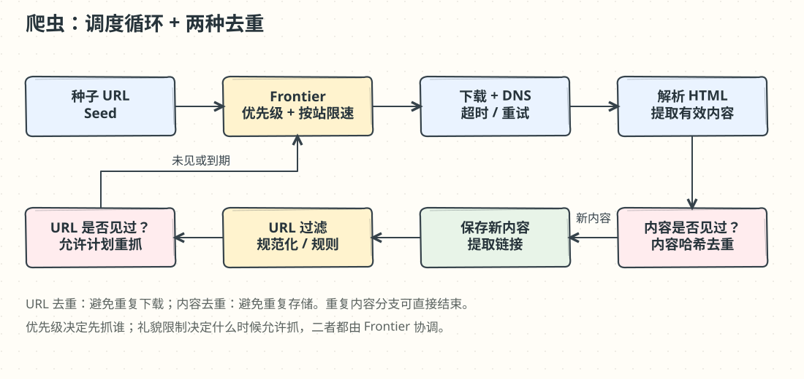

# 第 9 章：设计网络爬虫（Web Crawler）

> 译文来源：[原版第 9 章](https://github.com/liquidslr/system-design-notes/blob/main/09.%20Web%20Crawler/Readme.md)。原版不变；“批注”和手绘图为新增教学内容。

## 中文学习导读

**学习目标：**理解一个循环工作的采集流水线，学会把调度、网络下载、解析和去重拆开。

**先记住：**种子入队 → 下载 → 解析 → 去重 → 抽新链接 → 再入队。优先级决定“先抓谁”，礼貌决定“何时能抓”。

**常见误区：**只做一个 FIFO 队列；只按 URL 去重；认为增加线程一定会提高有效吞吐。

## 简介（Introduction）

**网络爬虫（web crawler）**也称 spider 或 robot，用来发现和收集网页、图片、视频。本章聚焦用于**搜索引擎索引**的可扩展爬虫。

### 应用（Applications）

1. **搜索引擎索引：**采集网页建立可搜索索引，例如 Googlebot。
2. **网络归档：**保存网页供未来查看，例如美国国会图书馆的归档工作。
3. **网络挖掘：**从网页提取知识，例如分析股东报告中的财务信息。
4. **网络监控：**检测版权或商标侵权。

### 设计挑战（Design Challenges）

- **可扩展性（Scalability）：**通过并行处理数十亿页面。
- **健壮性（Robustness）：**应对坏 HTML、进程崩溃和恶意链接。
- **礼貌（Politeness）：**避免过多请求压垮目标站点。
- **可扩展能力（Extensibility）：**以较少改动支持新内容类型。

## 步骤 1：理解问题（Understanding the Problem）

### 需求（Requirements）

1. 每月抓取 **10 亿**网页，平均约 **400 页/秒**，峰值 **800 QPS**。
2. 只采集 **HTML**。
3. 跟踪新增网页和已有网页的更新。
4. 忽略重复内容。
5. 保存 **5 年**，原文估计约 **30 PB**。

### 批注：估算必须说明平均页面大小

若每页约 500 KB，则 `10 亿 × 500 KB × 12 × 5 ≈ 30 PB`，未包含复制与索引。压缩、实际页面大小、重复率和重抓策略都会改变结果。

## 步骤 2：高层设计（High-Level Design）

### 组件（Components）

1. **Seed URLs（种子 URL）：**作为起点，应选择能遍历到更多链接的网站。可以按地域或主题组织，例如当地热门站点、体育、医疗。
2. **URL Frontier（待抓 URL 调度器）：**保存将要下载的 URL。初版可以理解为 FIFO 队列，后续加入优先级和礼貌调度。
3. **HTML Downloader（下载器）：**下载 Frontier 提供的网页。
4. **DNS Resolver（DNS 解析器）：**把 URL 中的主机名解析成 IP 地址。
5. **Content Parser（内容解析器）：**校验并解析网页，丢弃无法处理的畸形页面。
6. **Content Seen?（内容是否已见）：**比较网页哈希，检测重复内容。
7. **Content Storage（内容存储）：**将 HTML 保存到磁盘；热门内容可放内存降低访问延迟。
8. **URL Extractor（链接提取器）：**从解析后的页面提取新链接。
9. **URL Filter（URL 过滤器）：**排除黑名单和错误 URL。
10. **URL Seen?（URL 是否已见）：**记录已访问的 URL，避免重复抓取。
11. **URL Storage（URL 存储）：**持久化已访问 URL。

### 工作流程（Workflow）

1. 将种子加入 Frontier。
2. 下载器获取 URL，通过 DNS 解析器获得地址并下载页面。
3. 解析器校验内容，并交给 Content Seen 检查。
4. 内容未见过时，提取其中的链接。
5. 过滤链接，将未见过的 URL 加回 Frontier。

### 批注：为什么需要两道去重

两个不同 URL 可能返回相同页面，例如跟踪参数或镜像站；同一个 URL 又可能在明天更新内容。URL 去重减少重复下载，内容去重减少重复存储与处理。允许重抓时，“已见”还必须记录上次抓取时间等信息，不能把 URL 永久封死。

## 步骤 3：关键组件深入设计（Deep Dive into Key Components）

### DFS / BFS

网页可看作有向图：页面是节点，超链接是边。通常采用 **BFS（广度优先搜索）**，因为网页链路可能极深，DFS 容易一直钻进某个分支。但标准 BFS 不区分质量和重要性，仍需额外优先级。

### URL Frontier

#### 礼貌（Politeness）

同一主机通常同时只发一个请求，并在两次下载之间设置延迟。主机名映射到队列，worker 按队列顺序下载。

- **Queue router：**让每个后置队列 b1、b2…只含同一主机的 URL。
- **Mapping table：**保存主机到队列的映射。
- **Queue selector：**选择队列并分派给 worker。
- **Worker 1…N：**同一主机的页面顺序下载，并添加下载间隔。

#### 优先级（Priority）

用 PageRank、页面重要性、更新频率等信号决定先抓哪些页面。

- **Prioritizer：**接收 URL 并计算优先级。
- **Queue f1…fn：**每个前置队列有指定优先级，高优先级队列被选中的概率更大。
- **Queue selector：**带权随机选择队列，倾向高优先级。
- **Front queues（前置队列）：**管理优先级。
- **Back queues（后置队列）：**管理礼貌约束。

#### 新鲜度（Freshness）

根据页面历史更新频率和重要程度决定重新抓取时间。

### 批注：调度器像医院挂号处

优先级像“谁更紧急”，礼貌像“某个诊室什么时候空闲”。高优先级不能越过目标站点的限速约束。故障时若直接把失败请求立即重新入队，会形成重试风暴；应退避，并保留每个主机下一次允许抓取的时间。

### HTML Downloader

- **遵守 robots.txt：**尊重站点提供的爬取规则。
- **分布式抓取：**用多台服务器并行处理不同站点。
- **DNS 缓存：**避免重复域名解析。
- **地理分布：**部署更靠近目标站点的下载服务器，减少网络延迟。
- **较短超时：**防止慢站点或无响应站点长期占用资源。

### 健壮性（Robustness）

1. **一致性哈希：**将任务分配给服务器，减少增减节点时的迁移。
2. **错误处理：**隔离异常，避免整个系统崩溃。
3. **数据校验：**保证内容完整性。

### 扩展能力（Extensibility）

新内容类型使用独立模块，例如 PNG 下载器或网页监控器；也可以接入版权监控插件。

### 避免问题内容（Avoiding Problematic Content）

1. **重复内容：**比较哈希检测精确重复。
2. **Spider traps（爬虫陷阱）：**如无限日历、无限参数组合，可借助 URL 长度限制等规则减少无限循环。
3. **数据噪声：**过滤广告、垃圾和无关内容。

### 批注：规则不能只靠一条长度限制

短 URL 也可能形成无限路径。实际还需抓取预算、深度限制、参数归一化和站点级配额；归一化必须谨慎，因为某些参数确实改变页面内容。精确哈希也不能检测“只改了一行广告”的近似重复。

## 步骤 4：收尾（Wrap Up）

### 关键结论（Key Takeaways）

1. 爬虫必须兼顾规模、健壮性、礼貌和扩展能力。
2. 礼貌避免压垮站点，优先级保证重要页面先被采集。
3. 大规模抓取依赖高效存储与错误处理。

### 其他考虑（Additional Considerations）

- **动态页面：**原文将本项称作 Server-Side Rendering，实际意图是处理 JavaScript/AJAX 生成的内容；通常需要浏览器渲染或其他适合该站点的采集方式。
- **反垃圾：**排除低质量和无关页面。
- **数据库扩展：**使用复制与分片。
- **水平扩展：**通过无状态任务执行服务器增加抓取能力；Frontier 和去重状态仍需共享/持久化。
- **分析：**采集抓取结果和运行指标，用于优化。

### 批注：面试回答模板

“我把系统拆成 Frontier、下载、解析、两种去重和存储。先说明按 host 限速与重抓策略，再讨论优先级和分布式执行。判断爬虫好坏看有效新内容吞吐、错误率和站点压力，而不只看线程数。”
