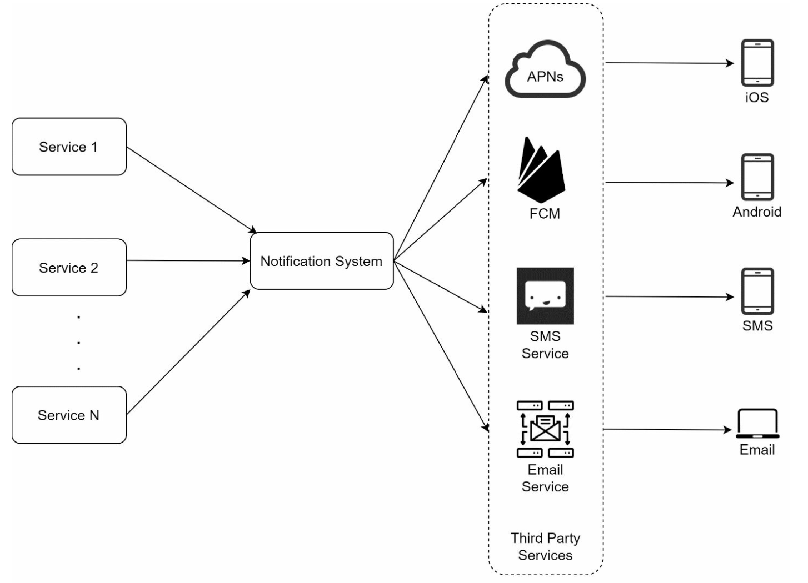
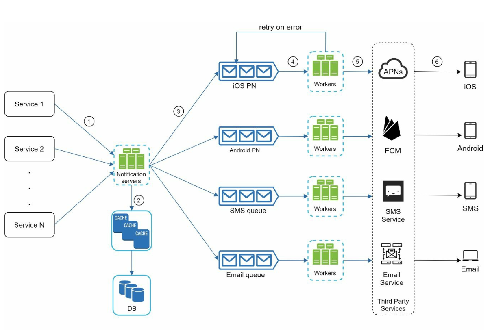
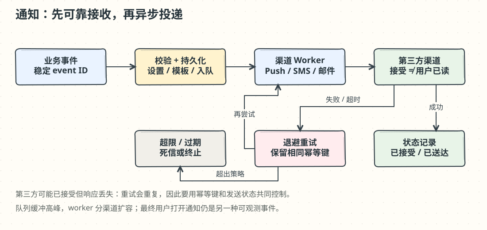

# 第 10 章：设计通知系统（Notification System）

> 译文来源：[原版第 10 章](https://github.com/liquidslr/system-design-notes/blob/main/10.%20Notification%20System/Readme.md)。原版保持不变；“批注”和手绘图是新增材料。

## 中文学习导读

**学习目标：**把“下单后发一封邮件”的同步代码，变成可重试、可扩展、能追踪状态的通知流水线。

**先记住：**业务事件 → 持久化队列 → 渠道 worker → 第三方。接受、投递、展示、打开是不同状态。

**常见误区：**第三方超时就认定没发送；认为 event ID 去重能自动保证绝不重复；忽略用户退订设置。

## 简介（Introduction）

现代应用用通知传递产品消息、事件、优惠和告警。渠道包括：

1. 移动端或桌面的 **Push notifications（推送）**。
2. **SMS（短信）**。
3. **Email（邮件）**。

本章设计每天可以处理数百万条通知的可扩展系统。

## 步骤 1：理解问题（Understanding the Problem）

### 需求（Requirements）

- **类型：**推送、短信、邮件。
- **时效：**尽量减少延迟的软实时系统。
- **平台：**iOS、Android、桌面端。
- **触发：**客户端操作或服务端定时任务。
- **日规模：**推送 **1000 万**条、短信 **100 万**条、邮件 **500 万**条。
- **退订：**用户可关闭指定类型的通知。

### 批注：软实时不等于永远立即到达

“软实时”允许偶发延迟，不像硬实时那样错过期限就算系统失败。验证码、故障告警和营销邮件的优先级与有效期不同，应分别定义时效；过期验证码无需在队列恢复后继续发送。

## 步骤 2：高层设计（High-Level Design）

### 组件（Components）

#### 1. 通知类型与渠道

- **iOS 推送：**Apple Push Notification Service（APNS）。
- **Android 推送：**Firebase Cloud Messaging（FCM）。
- **短信：**第三方短信服务，原文举例 Twilio、Nexmo。
- **邮件：**商业邮件服务，原文举例 SendGrid、Mailchimp。

这些是原文的实现示例，具体服务与认证方式需按实际平台选择。

#### 2. 收集联系信息（Contact Info Gathering）

在安装应用或注册时收集 device token、手机号和邮箱，并保存到数据库：

- **Device Tokens Table：**保存推送需要的设备令牌。
- **User Table：**保存用户邮箱和手机号。

#### 3. 通知发送流程（Notification Sending Flow）

- **Trigger Services（触发服务）：**产生账单提醒、物流更新等事件。来源可以是微服务、cron 任务或分布式系统。
- **Notification Server（通知服务器）：**提供发送 API；校验邮箱、手机号等基本信息；查询数据库或缓存，取得渲染通知所需的数据。
- **Third-Party Services（第三方服务）：**负责向用户送达通知。

### 初版设计的问题（Challenges in Initial Design）

- **单点故障（SPOF）：**唯一通知服务器故障会影响整个系统。
- **扩展困难：**数据库、缓存和处理模块耦合，难以独立扩容。
- **性能瓶颈：**发送通知占用大量资源。

### 改进设计（Improved Design）

- 把数据库和缓存移出通知服务器。
- 使用多台通知服务器进行**水平扩展**。
- 引入**消息队列**解耦各组件，并缓冲大量通知。
- 增加 worker，从各渠道队列拉取通知，调用对应第三方服务。

### 批注：队列像快递站的待发货区

业务服务把包裹交给可靠的待发货区后，不必一直等待快递员。队列削平短期高峰，但不会增加第三方的长期处理能力；若积压持续增长，要看渠道限额、worker 吞吐和通知过期策略，而不只是加机器。

## 步骤 3：深入设计（Design Deep Dive）

### 可靠性（Reliability）

#### 1. 防止数据丢失（Prevent Data Loss）

把通知数据持久化到数据库，并实现重试。**Notification log database（通知日志库）**记录通知状态，供恢复与排查。

#### 2. 去重（Deduplication）

原文方案是根据 **event ID** 判断事件是否已处理：到达时查重；见过则丢弃，没见过则发送。

### 批注：为什么简单“先查后发”不够

两个 worker 可能同时查到“没见过”；也可能第三方已接受，但响应丢失，worker 重试造成重复。需要原子占用/状态更新、稳定幂等键和第三方的幂等能力配合。若业务写库与事件入队必须一起成功，可用事务发件箱（transactional outbox）。能可靠描述“至少一次 + 去重”比轻率承诺 exactly-once 更准确。

### 其他组件（Additional Components）

1. **Notification Templates（模板）：**使用预定义模板保持格式统一，提高渲染效率。
2. **Notification Settings（设置）：**独立设置表记录用户各渠道的 opt-in/opt-out。
3. **Rate Limiting（限流）：**限制对用户的发送频率。
4. **Retry Mechanism（重试）：**第三方失败时重新投递。
5. **Monitoring Queues（监控队列）：**跟踪积压并动态调整 worker。
6. **Event Tracking（事件追踪）：**统计打开率、点击率和参与度。

### 安全（Security）

原文提出使用 **AppKey / AppSecret** 对推送 API 做认证。实际不同提供方可能使用证书、令牌、服务账号等方式；密钥应由服务端安全管理。

### 最终通知流程（Notification Flow）

1. 触发服务调用通知 API。
2. 通知服务器校验请求，从缓存/数据库获取元数据。
3. 将通知事件放进消息队列。
4. worker 处理事件并调用第三方。
5. 第三方向用户投递通知。

## 关键优化（Key Optimizations）

1. **水平扩展：**增加通知服务器分担流量。
2. **消息队列：**解耦并处理高吞吐。
3. **缓存：**缓存常用数据，减少延迟。
4. **地域优化：**原文将此项写作“Distributed Crawling（分布式爬取）”，但上下文讲通知投递，应理解为按地域优化消息投递，并非加入爬虫组件。

### 批注：面试回答模板

“我先区分渠道、时效、规模和退订要求。业务产生通知事件，持久化后入队，渠道 worker 独立扩容。可靠性重点是重试、幂等和状态追踪，并把已接受与用户已读分开统计。”
