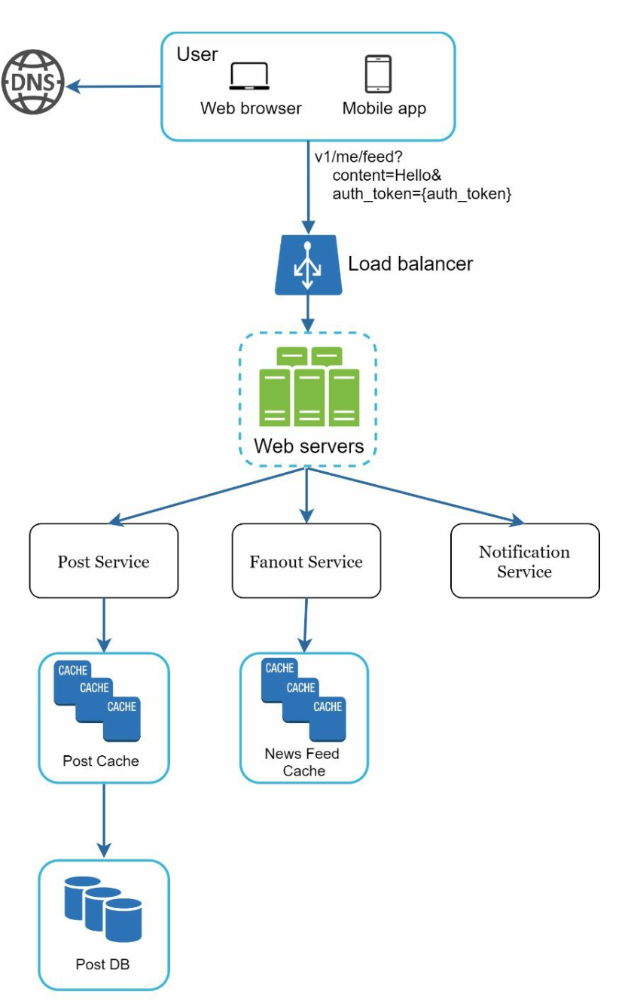
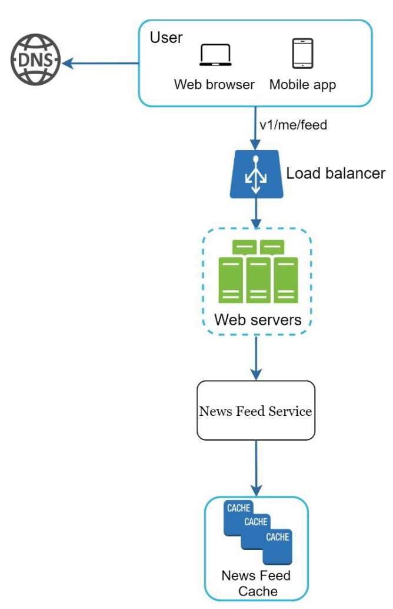
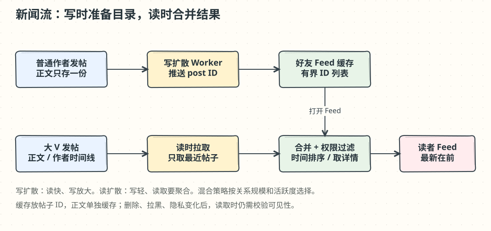

# 第 11 章：设计新闻流系统（News Feed System）

> 译文来源：[原版第 11 章](../../11.%20News%20Feed%20System/Readme.md)。原版保持不变；批注和手绘图为新增内容。

## 中文学习导读

**学习目标：**从“查询好友帖子”出发，理解为什么读多写少的新闻流要预计算。

**先记住：**写扩散提前把帖子 ID 放进读者列表；读扩散等读者打开时再聚合；混合方案处理大 V 的写放大。

**常见误区：**把 fanout 理解成复制整篇帖子；以为所有账号都适合写扩散；忽略删除与权限变更。

## 简介（Introduction）

**新闻流（news feed）**展示来自用户关系网络、不断更新的状态、照片、视频和链接，例如 Facebook News Feed、Instagram Feed、Twitter Timeline。本章设计一个可扩展的新闻流系统。

## 步骤 1：理解问题（Understanding the Problem）

### 需求（Requirements）

1. **平台：**同时支持 Web 和移动应用。
2. **功能：**用户发布帖子；查看好友发布的帖子。
3. **排序：**为简化问题，采用**时间倒序（reverse chronological order）**。
4. **规模：**每人最多 **5000 名好友**，**1000 万 DAU**；内容含文字、图片和视频。

## 步骤 2：高层设计（High-Level Design）

### 概览（Overview）

系统包含两条主流程：

1. **Feed Publishing（发布）：**帖子写入数据库，再传播到好友的新闻流。
2. **News Feed Building（构建）：**聚合好友帖子，按时间倒序返回给当前用户。

### News Feed APIs

|用途|端点|参数|
|---|---|---|
|发布|`POST /v1/me/feed`|`content`（正文）、`auth_token`（认证）|
|获取|`GET /v1/me/feed`|`auth_token`（认证）|

### 发布流程（Feed Publishing）

1. 用户调用发布 API。
2. **负载均衡器**将流量分配给 Web 服务器。
3. **Web 服务器**认证请求，转发给后端服务。
4. **Post Service（帖子服务）**把帖子保存到数据库和缓存。
5. **Fanout Service（扩散服务）**把帖子传播到好友的新闻流缓存。
6. **Notification Service（通知服务）**给好友发送通知。

### 构建流程（News Feed Building）

1. 用户调用获取 API。
2. 负载均衡器分发请求。
3. Web 服务器转发到 News Feed Service。
4. 新闻流服务从 feed cache 取帖子 ID，再从数据库或内容缓存获得完整帖子。

## 步骤 3：深入设计（Design Deep Dive）

### 发布细节（Feed Publishing Deep Dive）

#### Web 服务器

- 使用 `auth_token` 验证用户身份。
- 通过限流防止垃圾帖子和刷屏。

#### Fanout Service

|方案|工作时机|优点|代价|
|---|---|---|---|
|**Fanout on Write（写扩散）**|发帖时推入好友 feed|更新及时、读得快|好友多时写入成本高|
|**Fanout on Read（读扩散）**|读 feed 时拉取并聚合|不为不活跃用户提前计算|读取更慢|
|**Hybrid（混合）**|普通用户推；超多连接用户拉|平衡读延迟和写放大|合并逻辑更复杂|

Fanout 服务的工作步骤：

1. **取好友 ID：**从图数据库获得好友列表。
2. **按设置过滤：**查询用户设置缓存，排除静音、屏蔽或不在分享范围中的好友。
3. **发送队列：**把过滤后的好友列表与新 `post_id` 交给消息队列。
4. **Fanout workers：**消费队列并更新 feed cache，只保存 `<post_id, user_id>` 关系，不复制完整用户和帖子对象。
5. **限制列表长度：**只保留近期帖子 ID，长度可配置；多数用户主要看最新内容，因此可控制内存成本。

### 批注：像“提前准备目录”而非复印整本书

写扩散给每个读者准备“待读帖子 ID 目录”，正文仍共享。若某作者有 100 万读者，写一条就要更新 100 万份目录；这就是写放大。可以按粉丝规模、读者活跃度和发帖频率决定策略，不能仅凭“名人”标签。

## 新闻流读取细节（News Feed Retrieval Deep Dive）

### 缓存架构（Cache Architecture）

缓存分为五类：

1. **News Feed Cache：**保存帖子 ID，快速定位待读列表。
2. **Content Cache：**保存帖子详情，热门帖子放 hot cache。
3. **Social Graph Cache：**保存好友/关注关系。
4. **Action Cache：**保存点赞、回复、分享等动作。
5. **Counter Cache：**保存点赞数、回复数、关注者数等计数。

### 批注：缓存命中也不代表内容仍可见

用户删帖、拉黑或修改隐私之后，旧 feed ID 可能还在。读取时需要按当前权限过滤，并异步清理旧 ID。分页可用稳定游标而非只用 offset，减少新帖插入时重复或漏读。这里采用时间排序；推荐排序是另一层需求。

## 关键优化（Key Optimizations）

### 扩展（Scaling）

1. 数据库水平扩展、分片，高流量查询使用读副本。
2. Web 层保持无状态，便于水平扩容。

### 缓存（Caching）

1. 常访问的数据放内存。
2. 分层缓存降低延迟和数据库压力。

### 可靠性（Reliability）

1. 原文提出**一致性哈希**分配请求；它主要减少节点变化引发的映射迁移，本身不能消除热点。
2. **消息队列**解耦组件并缓冲流量；可靠性还取决于持久化、确认与重试配置。

### 监控（Monitoring）

1. 跟踪 QPS、延迟等核心指标。
2. 监控缓存命中率，按实际情况调参。

### 批注：面试回答模板

“我先确认时间排序、读写比例和好友分布。普通用户用写扩散，大 V 在读取时合并；feed 只存 ID，内容单独缓存。接着补充权限过滤、分页、扩散重试和缓存失效。”
