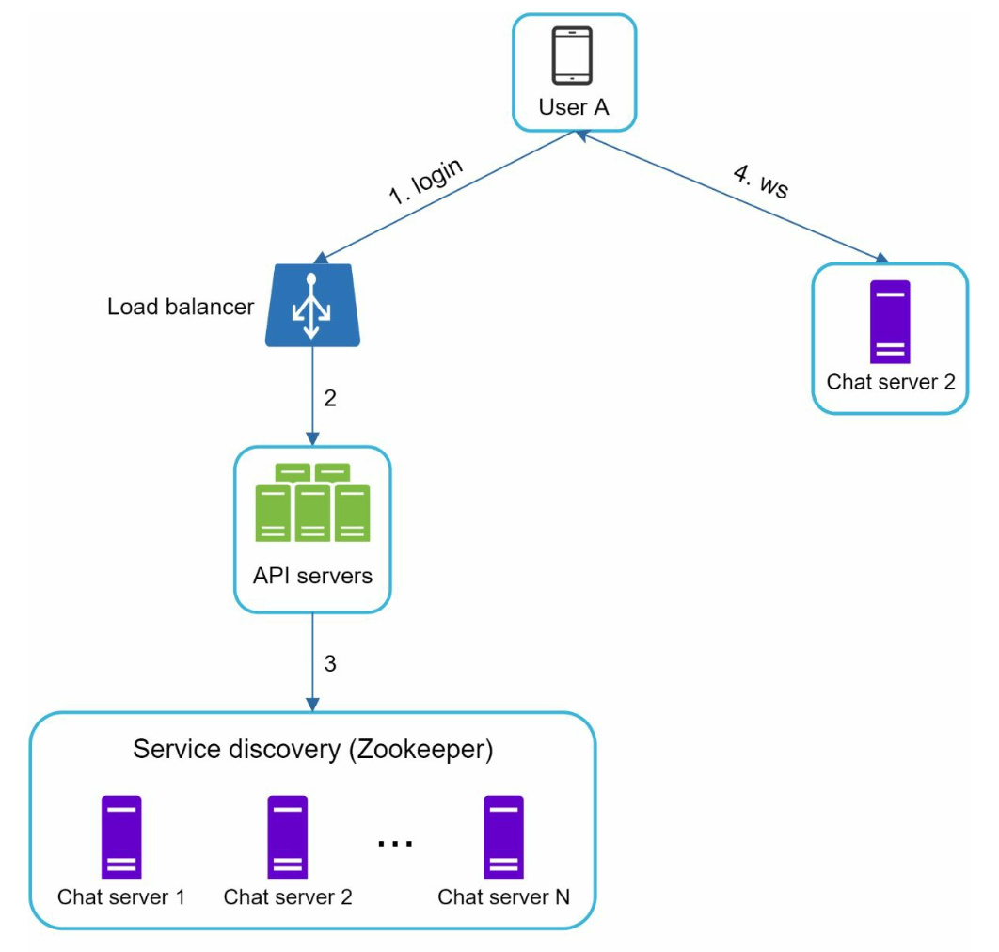
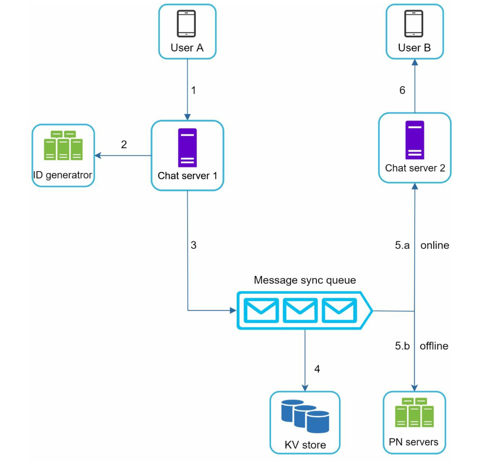
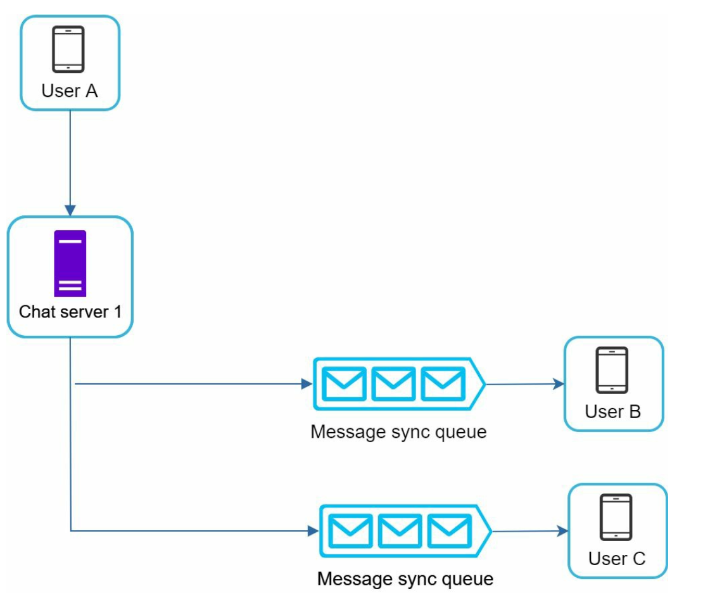
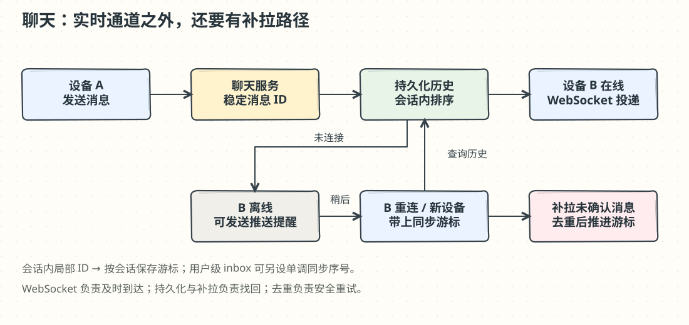
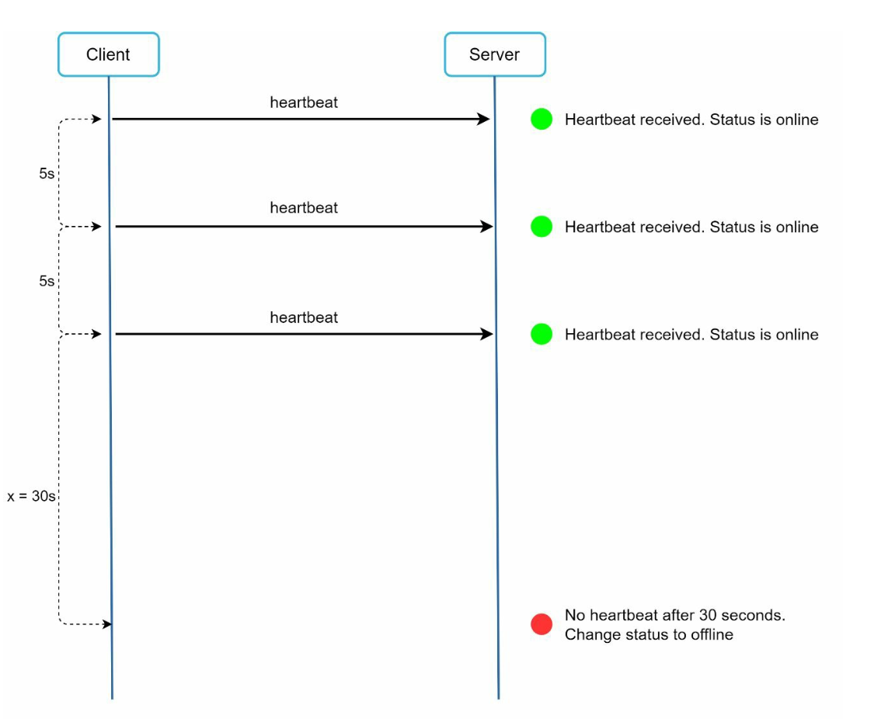
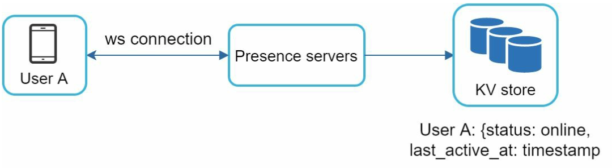

# 第 12 章：设计聊天系统（Chat System）

> 译文来源：[原版第 12 章](https://github.com/liquidslr/system-design-notes/blob/main/12.%20Chat%20System/Readme.md)。原版不变；“批注”与手绘图是新增教学内容。

## 中文学习导读

**学习目标：**理解聊天为何需要“实时连接 + 持久化消息 + 增量补拉”三部分。

**先记住：**WebSocket 是通道，消息库是历史，游标是补拉进度；一个会话内的顺序比所有会话的全局顺序更重要。

**常见误区：**连接断开等于消息丢失；消息 ID 唯一就等于严格有序；心跳在线状态绝对准确。

## 简介（Introduction）

聊天系统支持用户间的实时消息。本章包含：

- **一对一聊天（One-on-One Chat）**。
- **群聊（Group Chat）**，最多 100 人。
- **在线状态指示（Online Presence Indicators）**。
- **多设备支持（Multiple Device Support）**。
- **推送通知（Push Notifications）**。

目标是 **5000 万 DAU**，永久保存聊天记录。

## 步骤 1：理解问题（Understanding the Problem）

### 需求（Requirements）

1. 一对一和最多 100 人群聊；文本消息最多 **10 万字符**；在线/离线指示；多设备；推送。
2. 面向 **5000 万**日活用户。
3. 永久保存历史消息。

### 批注：DAU 不能直接当连接数

在线并发取决于用户活跃时段、设备数和连接保持策略。消息吞吐还需知道每天每用户消息数。永久保存也不等于全量常驻内存，冷热历史可以分层。

## 步骤 2：高层设计（High-Level Design）

### 通信协议（Communication Protocols）

#### 发送端（Sender Side）

原文先讨论使用 HTTP 发送消息，利用持久连接减少连接开销。

#### 接收端（Receiver Side）

**Polling（轮询）：**客户端定期询问是否有新消息，频繁空请求浪费资源。

**Long Polling（长轮询）：**请求保持打开直到有新消息或超时。原文指出对不活跃用户仍有成本；它减少空响应，但需要维护挂起请求并在结束后重连。

**WebSocket：**双向持久连接，客户端与服务器都可以发送数据。本设计最终对发送和接收都采用 WebSocket，原文称为 `ws` 协议。

### 批注：HTTP keep-alive 不等于服务器可随时推消息

HTTP 连接复用降低握手成本，但普通请求/响应模式仍由客户端发起。WebSocket 在建立后支持双向消息。生产环境通常使用加密的 `wss`；通道存在不代表消息可靠，断线后仍需补拉和去重。

### 组件（Components）

1. **Stateless Services（无状态服务）：**负责注册、登录、用户资料；配合服务发现推荐聊天服务器。
2. **Stateful Services（有状态服务）：**聊天服务器维护 WebSocket 连接，负责投递和同步。
3. **Third-Party Integration（第三方集成）：**推送服务通知用户新消息；实现可参考[通知系统](../10.%20Notification%20System/Readme.md)。

### 设计（Design）

客户端与聊天服务器保持持久 WebSocket 连接。

- **Chat Servers：**发送与接收消息。
- **Presence Servers：**管理在线/离线状态。
- **API Servers：**处理登录、注册、资料修改等。
- **Notification Servers：**发送推送通知。
- **Key-Value Store：**保存聊天历史。

原文选择 KV 的理由包括：容易水平扩展；低延迟；大索引下关系库随机访问可能昂贵；一些成熟聊天应用采用类似可扩展存储，并以 Facebook Messenger、Discord 为例。

### 批注：按访问模式选数据库

上述是原文设计理由，并非“关系数据库不能存聊天”。历史记录常按会话顺序读，因此关键是合适的分区键和排序键。原文提到的产品实现也会变化，不应把厂商案例当成当前架构证明。

一对一与群聊的数据模型如下：

- 消息 ID 作为主键或排序依据，帮助确定消息顺序。
- 群聊使用复合键 **`(channel_id, message_id)`**。
- 可用 Snowflake 一类全局 64 位序号生成器。
- 原文进一步建议会话内的**本地序列号**：只需要在同一群/会话内唯一并排序，不必为所有会话建立全局顺序。

### 批注：唯一性与顺序是两件事

Snowflake 通常近似按时间排序，但时钟漂移、跨节点并发和迟到消息意味着它不自动提供严格会话顺序。若要求严格顺序，需要会话内序号分配与持久化规则；全局 ID 仍可作为消息唯一标识。

## 步骤 3：深入设计（Design Deep Dive）

### 服务发现（Service Discovery）

服务发现根据地理位置、服务器容量等条件推荐聊天服务器。原文使用 **Apache ZooKeeper** 管理协调信息，以便分摊连接、降低延迟。

### 批注：ZooKeeper 保存信息，不替你决定业务策略

实际通常由应用侧路由/分配逻辑根据注册信息作选择。服务器故障后客户端需重连，服务发现推荐新节点；旧节点内存里的连接状态不会自动迁移。

### 消息流程（Messaging Flows）

#### 一对一聊天（One-on-One Chat）

1. 用户 A 把消息发给 Chat Server 1。
2. Server 1 分配唯一消息 ID，将消息写入 KV。
3. 若 B 在线，将消息转到维持 B 的 WebSocket 连接的 Chat Server 2。
4. 若 B 离线，发送推送通知。

#### 群聊（Group Chat）

- 给群内每个收件人的 inbox（消息同步队列）复制消息或消息索引。
- 这种方式简化同步，但群越大，写放大越严重。
- 一个收件人的 inbox 包含来自多个发送者的消息。

### 批注：小群可用写扩散，大群需重新估算

100 人群的一条消息最多触发约 100 份收件索引；万人群则不能直接照搬。可以让消息正文共享存储，再按成员或会话维护同步索引。重试时用稳定 message ID 去重。

#### 消息同步（Message Synchronization）

用户可能有多台设备。每个设备维护 **`cur_max_message_id`**，表示本地已保存的最新消息 ID。原文把同时满足以下条件的消息视为新消息：

- `recipient_id` 等于当前登录用户 ID。
- KV 中的 `message_id > cur_max_message_id`。

### 批注：原文两种 ID 方案不能直接混用

若 message ID 只在会话内唯一，不能用一个用户级最大 ID 比较所有会话；应按会话维护游标，或给用户 inbox 另设单调同步序号。只有确认较早消息已完整接收后才推进游标，否则迟到消息可能被跳过。

### 在线状态（Online Presence）

#### 1. 心跳机制（Heartbeat Mechanism）

客户端定期向 presence server 发心跳；超过阈值（原文示例 `x = 30`，可理解为约 30 秒）未收到则标记离线。

#### 2. 扩散模型（Fanout Model）

- 好友对各自维护发布订阅 channel。
- A 状态变化时，发布到 A-B、A-C、A-D 三个频道。
- B、C、D 分别订阅对应频道并获得更新。
- 该设计适合较小的关系集合。

### 批注：在线是近似状态

心跳超时也可能是弱网或设备休眠。它表达“最近还能联系上”，不是精确证明。多设备用户只要仍有一个有效连接就可能在线。好友很多时，可按当前打开的联系人列表订阅，避免全量状态扩散。

## 其他考虑（Additional Considerations）

### 可扩展性（Scalability）

水平增加服务器；负载均衡分配连接/流量；缓存减少数据库压力和延迟。

### 错误处理（Error Handling）

消息投递失败采用排队与重试；服务器故障时通过服务发现分配新服务器。

### 后续扩展（Future Extensions）

1. **媒体：**支持图片和视频，包括压缩与云存储。
2. **端到端加密：**保护消息隐私。
3. **客户端缓存：**减少数据传输。
4. **加快加载：**使用地理分布式缓存网络。

### 批注：面试回答模板

“长连接服务负责实时收发，持久化消息库保证断线后仍可找回。每条消息有稳定 ID，会话内定义顺序，多端用安全推进的游标补拉。最后解释离线推送、心跳、重连和重复消息处理。”
