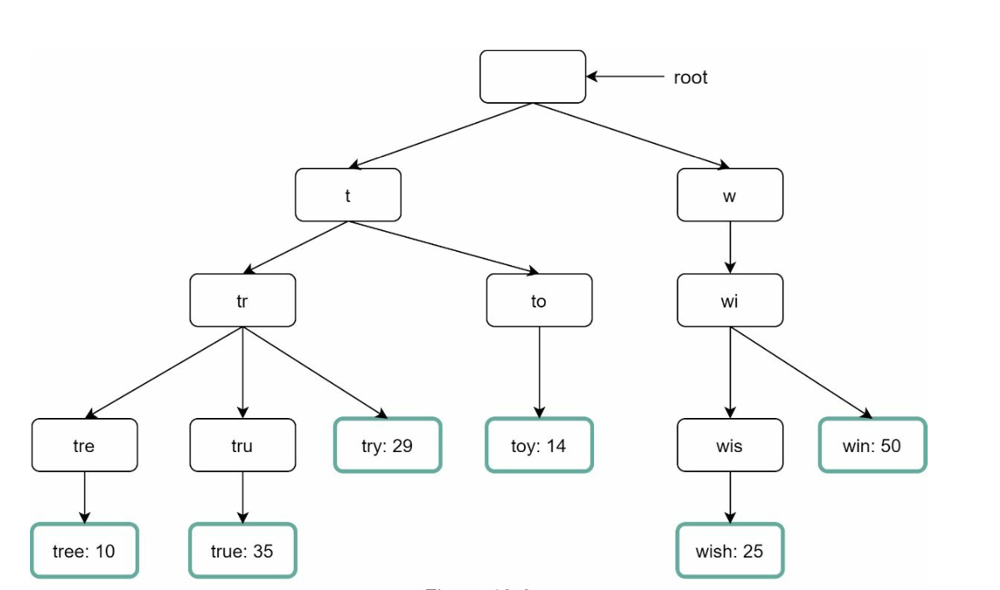
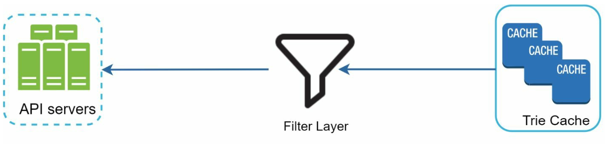
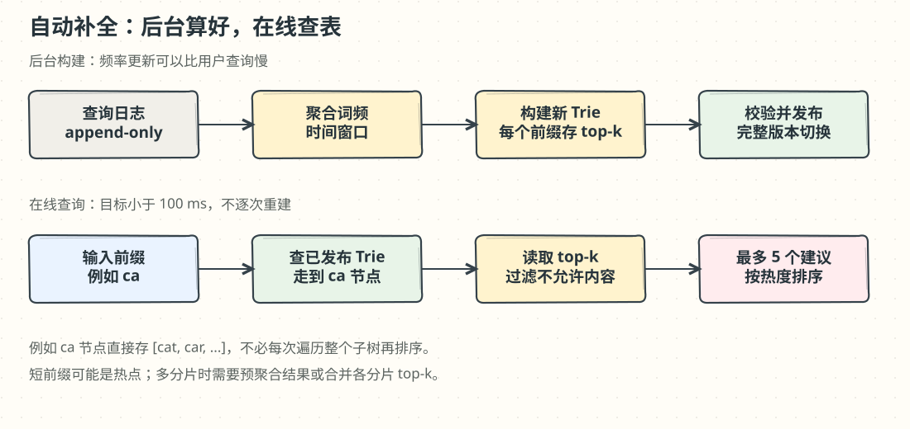

# 第 13 章：设计搜索自动补全（Search Autocomplete）

> 译文来源：[原版第 13 章](https://github.com/liquidslr/system-design-notes/blob/main/13.%20Search%20Autocomplete/Readme.md)。原版不变；批注与手绘图为新增教学内容。

## 中文学习导读

**学习目标**：理解如何把每次都要排序的查询，变成预先计算好的前缀查表。

**先记住**：日志收集 → 聚合频率 → 构建 Trie → 前缀节点缓存 top-k → 在线快速返回。

**常见误区**：每敲一个键就重建 Trie；只存完整词频却认为能直接得到前缀 top-k；用平均字母数量划分分片却忽略热点。

## 简介（Introduction）

自动补全又称 **typeahead** 或 **incremental search（增量搜索）**，在用户输入时实时给出建议。系统根据历史查询，返回相关且热门的 top-k 建议。

### 核心特性（Key Features）

- 最多 **5** 条建议。
- 根据查询流行程度，即频次排序。
- 只支持**小写英文字符**。
- 响应时间 **小于 100 ms**，可扩展。

## 步骤 1：理解问题（Understanding the Problem）

### 需求（Requirements）

1. 输入时实时显示匹配建议。
2. 最多返回 5 条，按热度排序。
3. **1000 万 DAU**，峰值 **48,000 QPS**。
4. 高可用，故障时尽量不中断服务。
5. 新查询数据每天增长约 **0.4 GB**。

### 批注：两类“实时”要分开

用户输入后马上得到结果，是**查询实时**；每次搜索马上改变排名，是**数据实时**。本章优先保证前者，并允许排名周期更新。原文的 QPS 和数据增量是设计假设，具体估算还需查询次数、字符数及新词比例。

## 步骤 2：高层设计（High-Level Design）

系统分成两个服务：

1. **Data Gathering Service（数据采集服务）**：收集查询并聚合频次。初版先设想实时聚合，但大规模逐次更新并不合适，后文会改为批处理。
2. **Query Service（查询服务）**：根据当前输入返回 top-k 建议。

### 数据采集服务（Data Gathering Service）

从 analytics logs（分析日志）聚合查询，更新 frequency table（频率表）；按周处理历史数据并构建 **Trie（前缀树）**。

### 查询服务（Query Service）

- 使用采集服务产生的频率数据。
- 通过 Trie 按用户输入寻找候选，返回 top-k。
- 用缓存和合适数据结构优化查找。
- 例如输入 `tw` 时，展示以 `tw` 开头、搜索次数最多的 5 个查询。

## 步骤 3：深入设计（Design Deep Dive）

### Trie 数据结构（Trie Data Structure）

Trie 是按前缀组织字符串的树形结构，用于高效存储和查找查询词。

#### 核心特性（Key Features）

1. **共享前缀**：按字符分层，避免重复保存公共前缀。
2. **频率信息**：保存查询频次，供热门程度排序。
3. **朴素 top-k 查询步骤**：找到前缀节点 → 遍历其子树得到所有完整查询 → 按频率排序取前 k 条。

4. **优化**：在每个前缀节点缓存 top-k，避免每次遍历整棵子树；限制查询前缀长度，例如 50 个字符，避免极长输入。

### 批注：先做工作，再把答案贴在节点上

前缀 `ca` 的子树可能有数千个词。若每次查询都找齐再排序，响应会变慢；后台提前算好 `ca → [cat, car, ...]`，在线只走到节点就能返回。缓存会增加存储，但换取查询速度。单词频率通常在完整词的结束节点保存；前缀节点缓存的是聚合后的候选列表，两者不要混淆。

#### Trie 操作（Trie Operations）

1. **Create（创建）**：使用分析日志/数据库聚合数据，原文方案每周构建。
2. **Update（更新）**：很少逐查询实时修改，而是用每周新版本替换旧版本。
3. **Delete（删除）**：在查询链路加过滤层，先排除不需要或有害的建议（例如仇恨言论）；根据不同规则灵活过滤，后台异步物理删除。

### 查询处理流程（Query Processing Flow）

1. **前缀搜索**：找到与输入对应的节点；朴素实现还需遍历子树收集有效候选。
2. **Top-k 排序**：优化实现直接使用该节点缓存的 top-k，减少遍历和排序开销。
3. **构建响应**：用缓存数据组装结果，快速返回。

### 优化（Optimizations）

1. 每个节点保存 top-k，减少重复遍历。
2. 限制前缀长度，例如 50 字符。
3. 使用轻量 **AJAX 异步请求**获取建议。
4. 在浏览器缓存常见前缀结果。

### 批注：前端也影响体验

输入过快时旧请求可能晚于新请求返回，导致建议跳回旧前缀。响应应携带请求标识或前缀，由客户端丢弃过时结果。浏览器缓存必须有合理 TTL，服务端过滤规则变化后也要考虑旧缓存。

### 数据采集流水线（Data Gathering Pipeline）

初版每次查询都实时更新，在大规模下不合适：

- 每天可能有数十亿次查询，逐条更新 Trie 成本高。
- Trie 构建完成后，热门建议通常不会每秒都大幅变化。

#### 改进设计（Updated Design）

1. **Analytics Logs**：原始查询追加写入日志，供每周聚合；日志不建立查询索引。
2. **Aggregators**：把日志聚合成频率表。Twitter 等强调即时热点的场景可缩短时间窗口；其他场景每周可能足够。
3. **Workers**：异步重建 Trie 并写入持久存储。
4. **Storage Options（存储选择）：**
   - **Trie Cache**：分布式缓存，将 Trie 保存在内存中快速读取。
   - **Trie DB / Document Store**：例如 MongoDB，周期生成快照，序列化整棵 Trie 后保存。
   - **Trie DB / Key-Value Store**：每个前缀映射到哈希表 key，节点数据映射到 value。

### 批注：版本切换要完整

先构建新版本、校验并预热，再切换查询服务到新版本，保留旧版本以便回滚。不要一边覆盖旧 Trie 一边服务查询，否则读者可能看到混合版本。对于热点词可增加小的实时增量层，与周期 Trie 合并。

### 可扩展性（Scalability）

1. **Sharding（分片）**：按前缀范围分布到不同服务器，例如 `a-m`、`n-z`；对不均匀范围继续细分，例如 `aa-ag`、`ah-an`。
2. **Load Balancing（负载分配）**：由 shard map manager 保存映射，把查询路由到正确分片。

### 批注：短前缀是热点

按字母平均分片不等于流量平均。`a` 或空前缀可能覆盖很多子分片，要么预先缓存其全局 top-k，要么并发查询各分片再合并。监控前缀访问分布后再决定分片边界。

<strong>交互实验：前缀树上的 Top-K，现算还是预先贴好</strong>。输入前缀看查询在 Trie 里走过的节点，对比遍历子树与节点缓存 Top-K；再把本周日志批量构建成新版本，比较原地覆盖和整版切换，并模拟短前缀热点。<a href="https://kadaliao.github.io/system-design-interview-zh/#d13/lab-trie-topk">在线阅读版</a>中可直接操作。

## 步骤 4：高级功能（Advanced Features）

### 多语言（Multi-Language Support）

1. 使用 Unicode 表达非英文字符。
2. 按国家或地区建立不同 Trie。

### 热门趋势（Trending Queries）

动态更新节点，或提高近期查询的权重，以响应实时事件。

### 批注：面试回答模板

“我把收集与查询分离。日志聚合出词频，后台生成带 top-k 的前缀树，线上按前缀查缓存。说明更新频率、过滤层和版本切换，再按真实热点做分片。多语言还需规范化与产品语言规则，不能只把字符编码改成 Unicode 就算完成。”
