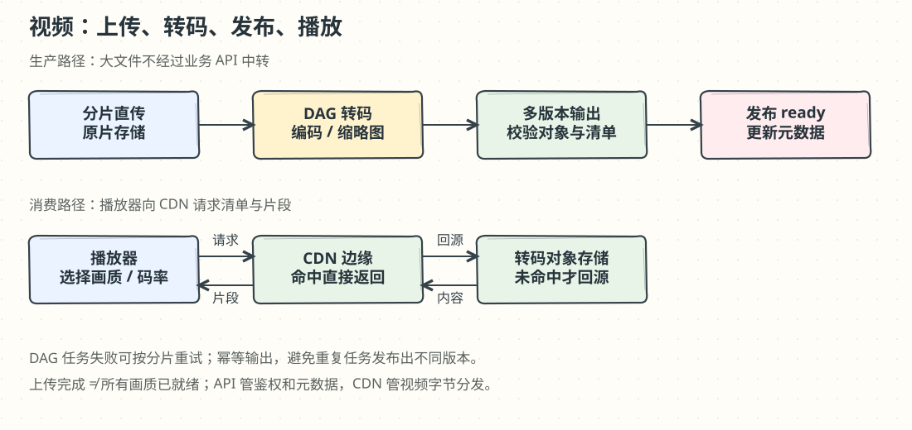
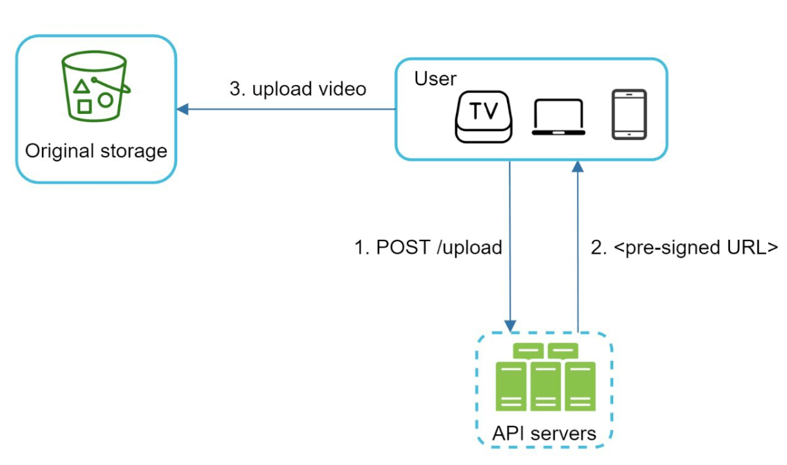

# 第 14 章：设计 YouTube 视频系统

> 译文来源：[原版第 14 章](https://github.com/liquidslr/system-design-notes/blob/main/14.%20Youtube/Readme.md)。原版保持不变；“批注”和手绘图是新增解释。原文平台统计与价格仅作历史设计背景。

## 中文学习导读

**学习目标**：把“大文件上传 + 视频播放”拆成控制请求、原片存储、异步转码和 CDN 分发。

**先记住**：原片上传一次，转成多个可播放版本；视频数据直接进对象存储、直接从 CDN 播放；API 管权限与元数据。

**常见误区**：让业务 API 中转所有视频字节；把 MP4 当成编码算法；认为上传完成就可以立即播放所有清晰度。

## 简介（Introduction）

YouTube 是支持视频上传、播放和交互的大型平台。本章关注可扩展视频系统的以下目标：

- 快速上传。
- 流畅播放。
- 可切换视频画质。
- 较低基础设施成本。
- 高可用和可靠性。

### 关键统计：2020 年背景（Key Statistics）

原版列举：**20 亿月活**、每天 **50 亿次视频观看**、移动互联网流量中 YouTube 占 **37%**、支持 **80 种语言**、**2019 年广告收入 151 亿美元**。

### 批注：历史背景与本题假设分开

这些是原文约 2020 年的背景数字，不代表当前平台规模，也不是本题计算公式中的输入。以下方案使用独立的练习假设。

## 步骤 1：理解问题与范围（Understand the Problem and Scope）

### 核心功能（Core Functionalities）

1. 上传视频。
2. 观看视频。

### 支持平台（Supported Platforms）

移动应用、Web 浏览器和智能电视。

### 假设（Assumptions）

- **DAU**：500 万。
- **平均视频大小**：300 MB。
- **上传限制**：单视频最大 1 GB。
- **每日新增存储**：150 TB。
- **CDN 费用**：原文使用 Amazon CloudFront 示例，`500 万 × 5 个视频 × 0.3 GB × $0.02/GB = $150,000/天`。

### 批注：150 TB 隐含多少上传者

`150 TB / 300 MB ≈ 50 万条视频/天`，相当于每 10 个 DAU 每天上传 1 条；原文省略了这个上传比例假设。费用计算也只是历史单价下的粗估，未计码率、实际观看时长、压缩、多版本、区域和回源等因素，不能当作当前报价。

## 步骤 2：高层设计（High-Level Design）

### 组件（Components）

1. **Client**：手机、电脑、电视等设备。
2. **CDN（内容分发网络）**：缓存和分发视频。
3. **API Servers**：处理播放数据传输之外的用户交互，例如上传控制和元数据更新。
4. **Metadata Database**：保存标题、描述、大小等视频元数据。
5. **Original Storage**：Blob/Object Storage，保存用户上传的原片。
6. **Transcoding Servers**：转成多种分辨率和格式。
7. **Transcoded Storage**：保存转码后的视频对象。

### 核心流程（Core Workflows）

#### 1. 视频上传流程（Video Uploading Flow）

两条流程可以并行进行：上传视频到原片存储，以及把视频元数据写入数据库。

**视频文件步骤：**

1. 视频上传到 Blob Storage。
2. 转码服务器将视频转换为多种格式。
3. 转码完成后，原文把下面两项画为并行：
   - **3a**：转码视频写入转码存储。
   - **3b**：转码完成事件加入完成队列。
4. **3a.1**：视频分发到 CDN。
5. **3b.1**：完成处理器更新元数据，并通知用户。

**元数据步骤：**

客户端并行发送元数据更新请求，包含文件名、大小、格式等信息。

### 批注：完成通知必须有真正的完成条件

原图的并行分支是概念图。若完成事件先到而视频对象还未落盘，用户可能看到“可播放”却得到 404。应在所需输出及清单持久化、校验后发布 ready 状态；较高清晰度可以稍后逐步可用。CDN 也常按需回源缓存，不一定提前复制所有视频到所有边缘节点。

#### 2. 视频播放流程（Video Streaming Flow）

- 客户端直接从 CDN 边缘节点获取流，以降低延迟。
- 原文列举 **MPEG-DASH、Apple HLS、Adobe HDS** 等播放协议。
- 不同协议支持的编码和播放器组合不同。

### 批注：把视频想成一串小片段

播放器先拿播放清单，再分段下载。自适应码率（ABR）根据网络吞吐和缓冲情况切换版本，目标是减少卡顿。HDS 是原文中的历史示例；新系统需核对目标设备的实际支持范围。

## 步骤 3：深入设计（Design Deep Dive）

### 视频转码（Video Transcoding）

#### 为什么需要（Importance）

1. 原始视频可能很大，压缩编码可减少体积。
2. 为不同设备和浏览器提供兼容格式。
3. 为不同网络条件提供不同画质版本。

#### 基本概念（Components）

- **Container（容器）**：封装视频、音频和元数据，如 MP4、AVI。
- **Codec（编解码器）**：压缩和解压算法，如 H.264、VP9。

### 批注：MP4 像盒子，H.264 像打包方法

相同 MP4 容器里可以放不同编码，播放器支持 MP4 并不意味着支持其中所有编码。转码成多个版本通常增加“全部衍生文件”的总存储；原文“减少空间”应理解为压缩后的单个版本可能小于高码率原片，并非总存储必然减少。

#### 有向无环图模型（Directed Acyclic Graph / DAG）

- 转码耗费计算资源且耗时较长。
- DAG 描述编码、缩略图和水印等任务及其依赖。
- 无依赖的任务可以并行，提高处理速度。
- 将原视频拆成视频、音频和元数据：
  - **Video encodings**：生成不同分辨率、codec 和 bitrate（码率）。
  - **Thumbnail**：用户上传或系统自动生成缩略图。
  - **Watermark**：在画面上叠加标识信息。

### 视频转码架构（Video Transcoding Architecture）

#### 1. Preprocessor（预处理器）

四项职责：

- 按 <strong>GOP（Group of Pictures，图像组）</strong>边界切分视频或进一步细分。
- 为未完成切片的旧客户端补做 GOP 对齐切分。
- 根据客户端开发者提供的配置文件生成 DAG。
- 把 GOP 和元数据保存到临时存储，编码失败时可据此重试。

#### 2. DAG Scheduler（DAG 调度器）

将 DAG 拆成阶段，把可执行任务加入资源管理器的任务队列。原文示例第一阶段处理视频、音频、元数据；视频分支后续再拆成编码与缩略图任务。

#### 3. Resource Manager（资源管理器）

负责有效分配资源，包含三个队列与一个调度器：

- **Task queue**：待执行任务的优先队列。
- **Worker queue**：保存 worker 利用率等信息的优先队列。
- **Running queue**：记录正在执行的任务及其 worker。
- **Task scheduler**：选择适合的任务与 worker，通知 worker 执行。

#### 4. Task Workers（任务执行器）

执行转码等操作，不同 worker 可负责不同任务类型。

#### 5. Temporary Storage（临时存储）

保存中间数据，支持重试。选择存储系统时考虑数据类型、大小、访问频率和生命周期。

#### 6. Output（输出）

产生可分发的视频版本，写入转码存储。

### 批注：GOP 对齐与任务重试

视频帧存在解码依赖，不能任意按文件字节截断后都指望独立解码；GOP/关键帧边界有助于分片处理。每个任务应有稳定标识（视频、版本、分片、参数），重复执行写到确定输出位置或用原子发布，避免产生不一致成品。

<strong>交互实验：转码 DAG 的并行、重试与完成条件</strong>。按 GOP 切片的转码任务在 worker 池上排队并行；调 worker 数、注入分片失败，看重试范围，以及过早通知为什么会让用户拿到 404。<a href="https://kadaliao.github.io/system-design-interview-zh/#d14/lab-transcode-dag">在线阅读版</a>中可直接操作。

## 系统优化（System Optimizations）

### 速度优化（Speed Optimizations）

1. **并行上传**：切成小片并行传输，支持断点续传。

2. **分布式上传中心**：使用靠近用户的上传入口；原文以 CDN 作为就近上传枢纽为例，实际需使用支持上传/加速能力的服务。
3. **并行处理**：用消息队列解耦模块，提高并行度。

### 安全优化（Safety Optimizations）

1. **Pre-Signed URLs（预签名 URL）**：让经授权的用户直接上传到对象存储。

2. **视频保护：**
   - DRM，例如 Apple FairPlay、Google Widevine。
   - AES 加密。
   - 水印。

### 批注：预签名 URL 是限时授权

API 先鉴权，再签发限定对象和操作的短期上传地址。任何拿到 URL 的人都可能在有效期内使用它，因此要控制权限与过期时间，并校验最终对象大小、类型和上传完成状态。加密、水印、DRM 各有目的，不等同于“无法复制”。

### 成本优化（Cost-Saving Optimizations）

1. 热门视频通过 CDN，冷门视频可由高容量服务器提供。
2. 冷门视频按需转码，避免提前生成无人观看的版本。
3. 根据地域热度分发视频。
4. 建设自有 CDN，并与 ISP 合作降低带宽成本。

### 批注：成本优化有规模门槛

冷视频绕过 CDN 可能增加延迟和源站压力；按需转码可能让首次播放等待。自建 CDN 只适合流量与团队规模足够大时评估。先按实际观看时长、缓存命中和热门分布计算，不能只看每 GB 单价。

## 错误处理（Error Handling）

### 可恢复错误（Recoverable Errors）

上传、转码或资源分配暂时失败时重试。

### 不可恢复错误（Non-Recoverable Errors）

视频格式损坏等无法处理的输入应停止任务，返回明确错误码。

### 批注：面试回答模板

“我把 API 控制面与视频数据传输分离。上传进对象存储，异步 DAG 转码，验证成品后发布 ready 状态；播放走 CDN 并使用自适应码率。可靠性靠分片续传、幂等任务和状态机，成本则取决于观看流量、缓存命中与转码版本。”
