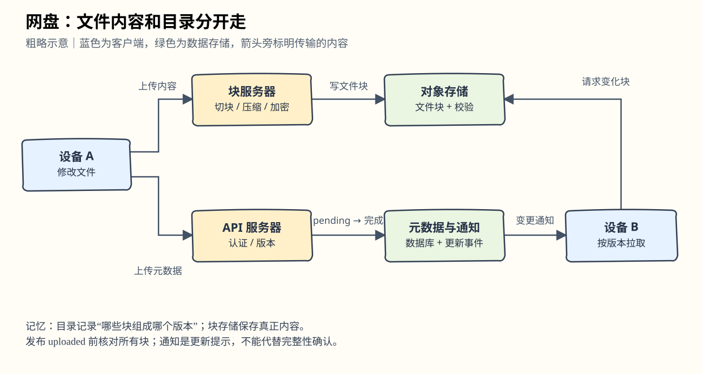
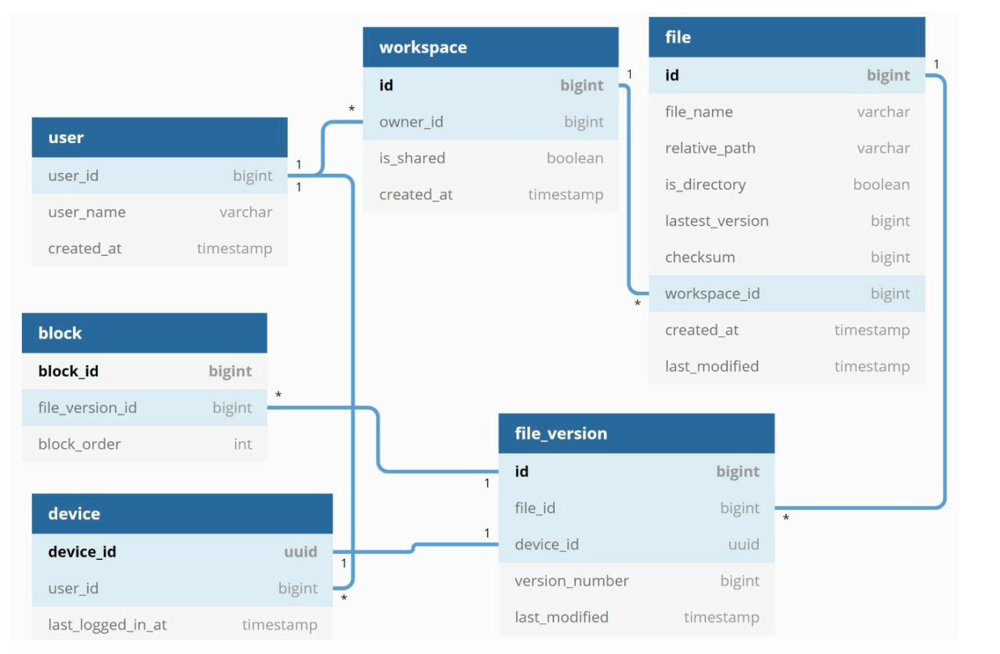
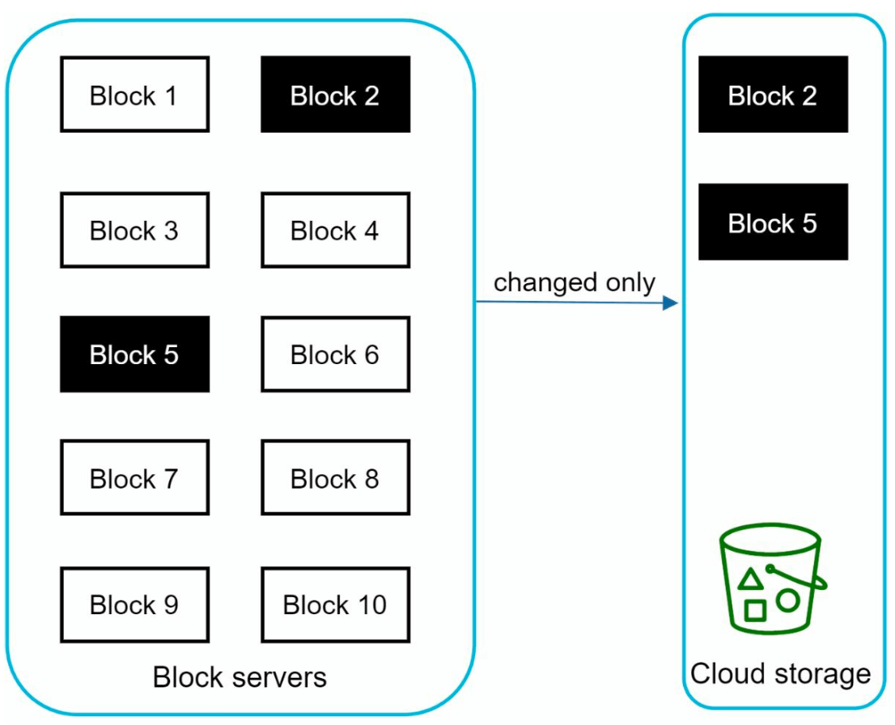

# 第15章：设计 Google Drive

> 本章对应[英文原版](https://github.com/liquidslr/system-design-notes/blob/main/15.%20Google%20Drive/Readme.md)。译文保留原文结构与设计假设；“批注”为面向初学者的解释或纠错，原版文件与原图未修改。

## 中文学习导读

你可以把网盘理解为“文件内容仓库 + 文件目录数据库 + 变更通知”。CRUD 经验可以迁移到元数据，但大文件、跨设备同步和故障恢复需要额外设计。先记住四句话：**内容拆块存，目录单独管；只传变化块，冲突留副本。** 本章目标是能说清一次上传如何最终变成另一台设备上的文件。

## 引言（Introduction）

Google Drive 是云端文件存储与同步服务，用户可以从不同设备保存、访问和分享文件。本章设计可扩展的系统，支持文件上传和下载、跨设备同步、文件分享、文件修订历史，以及编辑、删除和分享通知。

## 第一步：理解问题（Understanding the Problem）

### 关键需求（Key Requirements）

#### 功能需求

- 上传和下载文件。
- 在多台设备间同步文件。
- 保留文件修订版本。
- 按权限分享文件。
- 文件被编辑、删除或分享时发送通知。

#### 非功能需求

- **可靠性（Reliability）**：不能接受数据丢失。
- **快速同步（Fast Sync Speed）**：避免用户因同步缓慢失去耐心。
- **带宽效率（Bandwidth Efficiency）**：尽量减少不必要的数据传输。
- **可扩展性（Scalability）**：支持 1000 万日活用户（DAU）。
- **高可用（High Availability）**：服务器故障或网络异常时仍能提供服务。

### 约束与假设

- 每位用户获得 10 GB 免费空间。
- 单文件最大 10 GB。
- 平均上传文件大小 500 KB。
- 每位用户每天上传 2 个文件。
- 总存储需求为 500 PB。

> **批注｜不要把假设误当推导。** 原文列出 500 PB，却没有给出累计注册用户、实际占用率、版本和副本倍数。1000 万 DAU × 10 GB 仅为 100 PB，而且 DAU 不等于总用户数。因此 500 PB 应先视作独立容量假设。面试回答可说：“我先确认容量口径，再估算每日新增量和副本开销。”

## 第二步：高层设计（High-Level Design）

### 单服务器方案（Single-Server Setup）

最简单的方案包含：

1. **Web 服务器**：处理上传与下载。
2. **元数据数据库（Metadata Database）**：记录用户、登录和文件信息。
3. **存储目录（Storage Directory）**：按命名空间组织文件。

Web 服务器以 `drive/` 为上传文件的根目录。目录下有多个命名空间（namespace），每个命名空间保存一个用户的所有上传文件。将命名空间与相对路径拼接，就能唯一标识某个文件或文件夹。这是起点，但无法直接满足大规模需求。

#### API

1. **上传文件**：支持两种方式。
   - 简单上传（Simple upload）：用于小文件。
   - 可恢复上传（Resumable upload）：端点为 `https://api.example.com/files/upload?uploadType=resumable`。先发初始化请求获取可恢复上传 URL，再上传数据并检查状态；传输中断后从已确认的位置继续。
2. **下载文件**：`https://api.example.com/files/download`。
3. **获取修订版本**：`https://api.example.com/files/list_revisions`。

> **批注｜断点续传像分批搬家。** 已送到仓库的箱子不用再搬。实现时要记录上传会话、块序号、校验值和过期时间；重发同一块不能生成重复文件。

### 迁移到分布式系统（Moving to Distributed Systems）

#### 改进

1. **分片（Sharding）**：按 `user_id` 将存储分散到多台服务器。
2. **Amazon S3**：使用可扩展、有冗余的对象存储，并配置跨地域复制。

3. **负载均衡器（Load Balancer）**：把流量分给多台 Web 服务器。
4. **元数据数据库复制**：通过分片和复制提升容量与可用性。

#### 同步冲突（Sync Conflicts）

大型网盘难免遇到冲突：两个用户同时修改同一个文件或文件夹。

例子中，用户 1 和用户 2 同时更新文件，但用户 1 的请求先被处理，因此更新成功；用户 2 收到同步冲突。系统保留用户 2 的本地副本和服务器最新版本，让用户选择合并，或者用一个版本覆盖另一个。

> **批注｜这是冲突策略，不是协同编辑算法。** 这里不做 Google Docs 那样的字符级实时合并。可用 `base_version` 加条件更新检测冲突；“先处理成功”必须由服务器版本规则定义，不能只看客户端时钟。

### 改进后的设计（Improved Design）

1. **用户入口**：浏览器或移动应用。
2. **块服务器（Block Servers）**：文件被切为最大 4 MB 的块，并分配唯一哈希值；各块独立存入云端，按指定顺序拼接可以还原文件。
3. **云存储（Cloud Storage）**：保存文件块，提供扩展能力和冗余。
4. **冷存储（Cold Storage）**：保存长期不活跃的文件，降低成本。
5. **负载均衡器**：把请求均匀分配给 API 服务器。
6. **API 服务器**：处理认证、用户资料和文件元数据更新，负责所有非上传工作流。
7. **元数据数据库与缓存**：保存用户、文件、块、版本信息；缓存频繁访问的元数据。
8. **通知服务（Notification Service）**：用发布/订阅通知客户端文件新增、编辑、删除，使客户端能拉取最新变化。
9. **离线备份队列（Offline Backup Queue）**：暂存离线客户端需要的文件变更，客户端上线后同步。

> **批注｜两个平面。** 文件块像仓库里的箱子；元数据像“哪些箱子组成哪本文件”的目录。大内容与小目录分开，才能独立扩容。通知只告诉你目录变了，不需要携带整个文件。

## 第三步：深入设计（Design Deep Dive）

### 元数据数据库（Metadata Database）

这里采用简化模型，只列关键表与字段。

#### 表结构

- **User**：用户资料和偏好。
- **File**：文件大小、名称、路径等元数据。
- **Block**：用于重建文件的块信息。
- **File Version**：修订历史。

### 文件上传流程（File Upload Flow）

1. **文件内容上传**：块服务器切块、压缩并加密文件；文件块经块服务器进入 S3。
2. **元数据上传**：客户端把元数据发给 API 服务器；数据库记录状态为 `pending`。
3. **完成**：S3 触发回调，把文件状态改为 `uploaded`；通知服务告知相关用户。

> **批注｜“上传成功”是状态转换。** S3 对象事件本身并不证明整份文件的所有块都到齐。实际实现需要核对块清单、大小与校验值，再原子地发布文件版本；回调可能重复，处理逻辑必须幂等。`pending` 文件不应被其他设备当作完整文件下载。

### 文件同步（File Sync）

1. **增量同步（Delta Sync）**：只传变化块，而非整份文件。

2. **压缩（Compression）**：按文件类型选择适合的压缩算法。
3. **冲突解决（Conflict Resolution）**：先处理的版本成功；冲突版本单独保存，由用户选择。

> **批注｜什么时候有用。** 大文件只改一小部分时，增量同步最省带宽。已经压缩的视频、图片再次压缩通常收益小；在分块方式和加密顺序变化时，也要检查是否仍能识别相同块。

### 文件下载流程（File Download Flow）

当文件在其他设备被新增或编辑时，下载流程启动：

- 客户端 A 在线：通知服务告知 A 有变化。
- 客户端 A 离线：先保存变更信息；A 上线后拉取最新变化。原文此处称“缓存”，前面的架构称“离线备份队列”。

客户端知道文件变化后，先通过 API 服务器请求元数据，再下载文件块并重建文件：

1. 通知服务触发更新。
2. 客户端取得最新元数据。
3. 下载变化块，按块顺序构造文件。

> **批注｜不要只依赖通知。** 通知可能丢失、重复或乱序。用版本号和变更游标支持“重新拉取快照/增量”；离线记录需要明确保留期，超过保留期时允许全量核对。

### 通知服务（Notification Service）

1. 目的：让客户端及时知道文件变化。
2. 机制：采用长轮询（long polling）实现异步通知。
3. 例子：文件新增、编辑或删除后，把通知发给所有相关客户端。

### 存储优化（Storage Optimization）

1. **去重（De-duplication）**：按块哈希在账户范围识别重复内容。
2. **版本策略（Versioning Strategy）**：限制保留版本数量；频繁修改的文件优先保留近期版本。
3. **冷存储**：把不常访问的文件转移到更便宜的层，例如 Amazon S3 Glacier。

> **批注｜去重不等于直接删文件。** 多个版本可能共同引用同一个块。只有没有有效引用、且超过保留/回滚窗口的块才能回收；否则删旧版本时可能破坏当前文件。

### 故障处理（Failure Handling）

1. **负载均衡器故障**：备用负载均衡器接管。
2. **块服务器故障**：待处理任务重新分配给其他服务器。
3. **元数据数据库故障**：提升从节点为主节点，把流量导向可用副本。
4. **云存储故障**：通过跨地域副本取得不可用文件。
5. **通知服务故障**：客户端重连其他通知节点。

> **批注｜面试收尾模板。** “我把文件内容与元数据分开，分块支持续传和增量同步；版本号检测冲突；上传状态机只发布完整文件；副本、幂等重试和离线补拉负责恢复。最后确认允许丢失多少数据（RPO）以及多久恢复（RTO）。”
