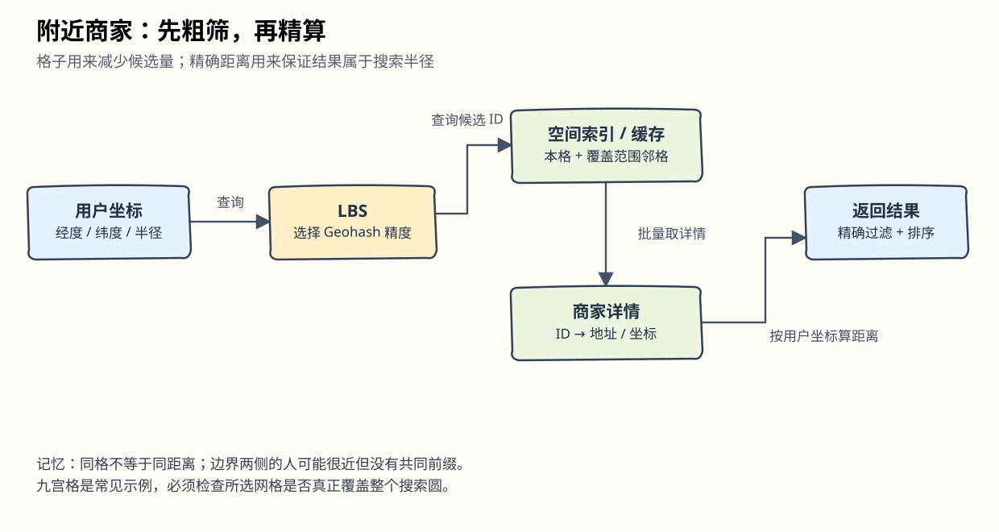

# 第16章：附近地点服务（Proximity Service）

> 对应[英文原版](https://github.com/liquidslr/system-design-notes/blob/main/16.%20Proximity%20Service/Readme.md)。原版文件与图片保持不变；本文按原文结构翻译，批注单独标明。

## 中文学习导读

把“找附近餐馆”分成两步：先用空间索引找一小批候选，再计算真实距离。CRUD 工程师最容易写出“扫描商家表”的版本；本章要学的是让数据按空间排列，使查询少读数据。记住：**先找格子，再取商家，最后按距离筛选。**



## 引言

附近地点服务查找餐馆、酒店、加油站等周边商家。Google Maps 和 Yelp 等应用用它帮助用户发现指定半径内的地点。

## 第一步：理解问题并确定范围

### 功能需求

1. 根据用户经纬度和搜索半径搜索商家。
2. 商家所有者可以新增、更新、删除商家，不要求实时生效。
3. 请求时提供商家详细信息。

### 非功能需求

- **低延迟**：用户迅速收到结果。
- **数据隐私**：遵守 GDPR、CCPA 等要求。
- **高可用**：能承受热门区域高峰流量。

### 粗略估算

- 1 亿 DAU。
- 2 亿商家。
- 每人每天搜索 5 次。
- 原版估算 `QPS = (100M × 5) / 86400 ≈ 5000`。

> **批注｜估算口径。** 精确计算约 5787 QPS，5000 是粗略取整；峰值需要另外估。此题商家位置不常变，所以读扩展是重点；下一章好友位置持续变化，写入与推送才是重点。

## 第二步：高层设计

### API 设计

#### 搜索附近商家

`GET /v1/search/nearby`

请求参数：

- `latitude`：用户纬度。
- `longitude`：用户经度。
- `radius`：搜索半径，默认 5000 米。

#### 商家 API

| API 端点 | 含义 |
|---|---|
| `GET /v1/businesses/{id}` | 获取商家详情 |
| `POST /v1/businesses` | 新增商家 |
| `PUT /v1/businesses/{id}` | 更新商家信息 |
| `DELETE /v1/businesses/{id}` | 删除商家 |

### 数据模型

“搜索附近商家”和“查看商家详情”都很常用，系统读多。原文选择 MySQL 等关系数据库。

> **批注｜选择理由要完整。** “读多”本身并不必然导向 MySQL。结构化商家数据、更新事务、成熟索引和主从复制一起构成合理理由；空间查询还需要下面的空间索引。

### 数据表结构

关键表为商家表（business table）和地理空间索引表（geospatial index table）。商家表保存详细信息。

### 高层架构

系统分为位置服务（Location-Based Service，LBS）与商家服务（Business Service）。


- **LBS**：处理位置查询；只读、不处理写请求；高峰区域 QPS 大，服务无状态。
- **商家服务**：处理商家所有者的增删改，以及消费者的详情查询。
- **负载均衡器**：把流量导向对应服务。
- **数据库集群**：主从复制支持读多场景。LBS 从副本读取的数据可能晚于主库写入；商家信息不要求实时，因此能接受这种延迟。

## 第三步：查找附近商家的算法

### 方案一：二维搜索（朴素方案）


最直观的方法是画一个指定半径的圆，找出圆内所有商家。原文用下面的 SQL 表达候选查询：

```sql
SELECT business_id, latitude, longitude
FROM business
WHERE (latitude BETWEEN :lat - radius AND :lat + radius)
AND (longitude BETWEEN :long - radius AND :long + radius);
```

问题：可能需要扫描大量数据；普通经纬度列的一维索引只能有限加速。分别给经度和纬度建索引可能略有改善，但仍较慢。

> **批注｜这段 SQL 是示意，不可直接照抄。** 米与经纬度“度”单位不同；经度一度对应的距离还随纬度改变。矩形边界只用于召回候选，之后仍要按球面距离过滤。数据库也有空间索引，不能据此理解为数据库永远只能做一维搜索。

### 更好的办法

原思路的瓶颈是普通索引很难同时高效限制两个维度。可以通过地理空间索引把二维空间组织为易搜索的结构：

- **哈希类**：均匀网格、Geohash。
- **树类**：Quadtree、Google S2、R-tree。


### 方案二：均匀网格（Evenly Divided Grid）


把世界划分成固定大小的格子。缺点是商家分布不均：城市密集、农村稀疏，固定格子不能同时适配两者。

### 方案三：Geohash

沿本初子午线和赤道把地球分为四象限，再不断细分；交替使用经度位和纬度位表示网格。


- 将经纬度编码成一个字母数字字符串，原文按 12 个长度精度层级讨论。
- 层级网格支持快速查找。
- 根据半径参考表选择合适的 Geohash 长度。


共享前缀越长，两个位置落入的共同网格范围越小。


挑战是边界：两个点非常近，也可能完全没有共同前缀，例如位于赤道两侧；两个编码有很长共同前缀，也仍可能落在不同细格中。解决办法是查询相邻网格。

> **批注｜记住单向关系。** 共享长前缀提供范围约束，但“距离近”不保证前缀相同。不要把 Geohash 当距离公式。查询要覆盖整个半径区域，再精确过滤。

### 方案四：四叉树（Quadtree）

四叉树递归把二维空间分成四个象限，每个内部节点恰好有四个子节点，分别代表四个区域。原版将它作为每台 LBS 启动时构建的内存数据结构。


根节点持续细分，直到每个叶区域中的商家都不超过阈值 `x`，本例取 100。


- 原版估计索引通常为 GB 量级，可以装入单机内存。
- 原文给出构建复杂度 `n log n`，构建可能耗时数分钟。
- 适合 k 近邻查询（k-nearest），例如最近的加油站。


#### 运维注意事项

- 对约 2 亿商家，启动构建可能需要数分钟。
- 构建完成前不能接收流量，新版本应分批滚动发布。
- 新增/更新商家最简单的办法是逐步重建树，但会造成缓存失效。
- 也能实时修改树，不过实现更复杂，需要锁等并发机制。

> **批注｜别把估算当保证。** 实際复杂度取决于树深度、分布、构建方式和退化情况；内存需要计入 ID、坐标、节点指针与语言对象开销。上线前应测量真实数据，而不是直接沿用“几 GB”。

### 方案五：Google S2

S2 基于 Hilbert 曲线，把球面单元映射到一维编号。原文的 `!D` 是 `1D` 的笔误。


- 将地球划成小单元（cell），使用 Hilbert 顺序编号。
- 可用不同层级的单元覆盖任意区域，适合地理围栏（geofencing）。
- 围栏定义关注区域周围的边界。
- 除固定精度，还能设置最小层级、最大层级和最大单元数。

> **批注｜空间曲线的局部性。** 相邻编号通常有空间局部性，但不能仅以编号差当作实际地理距离；相近空间点也可能编号相差很远。

## 方案权衡

### Geohash

- 易用、易实现，不必构建或重建树。
- 适合固定半径结果。
- 更新索引简单。
- 固定精度下不能按人口密度自动调整网格大小。

### Quadtree

- 实现略复杂。
- 适合获取最近 k 个商家。
- 可按密度动态调整区域大小。
- 更新较复杂，有时需要重建整棵树。

## 第四步：数据库扩展与缓存

### 扩展商家表

按 `business_id` 分片可以让数据分布较均匀。每个商家对应独立记录，索引关系可表示为：

| Geohash | Business ID |
|---|---|
| 9q9hvu | 343 |
| 9q9hvu | 347 |
| 9q9hvu | 112 |

### 扩展地理空间索引

若 Geohash 表已能放入单机，技术上没有必要立即分片。更合适的方式是增加只读副本承担读流量。

### 缓存策略

最直观的缓存键是 GPS 坐标，但 GPS 不够精确，用户移动也会改变坐标，使缓存命中变差。更好的键是 Geohash。

| 缓存键 | 缓存值 |
|---|---|
| `geohash` | 格子内的商家 ID 列表 |
| `business_id` | 名称、地址、评论等商家详情 |

> **批注｜缓存的是候选集合。** 两个用户落在同格可共享 ID 列表，但最终距离排序要以各自坐标计算。缓存“按距离排序后的完整结果”时不能忘记这个差异。

## 第五步：部署策略与最终架构

### 地域和可用区

把 LBS 与商家服务部署到多个地域。

### 处理更新

原版标题为“处理实时更新”，但正文的实际方案是**每天批量处理商家更新**，不承诺实时生效。

### 最终架构


## 检索附近商家的步骤

1. 用户搜索 500 米内餐馆，客户端将纬度 `37.776720`、经度 `-122.416730`、半径 `500m` 发给负载均衡器。
2. 负载均衡器转发给 LBS。
3. LBS 根据半径选择 Geohash 长度；原例为长度 6。
4. 计算相邻 Geohash，得到：

```
[my_geohash, neighbor1_geohash, neighbor2_geohash, ..., neighbor8_geohash]
```
5. 并行查询 Geohash Redis，获取这些格子的商家 ID。
6. 从商家详情 Redis 获取完整信息，按用户距离排序，返回结果。

> **批注｜九格不是所有场景的保证。** 网格实际尺寸随纬度与精度变化，应确认所选格子覆盖整个查询圆；覆盖不足就继续扩展邻格。最终再过滤掉半径外候选，避免“靠格子猜距离”。

## 关键优化

- 并行 Redis 调用，缩短等待。
- Geohash 索引，减少空间查询候选量。
- 缓存，加速商家 ID 与详情查找。

### 选择适合的索引

| 方法 | 优点 | 缺点 |
|---|---|---|
| Geohash | 简单，适合附近搜索 | 边界问题，固定层级下网格大小固定 |
| Quadtree | 随密度调整，适合 k 近邻 | 复杂，可能要重建/调整树 |
| Google S2 | 强大的球面区域覆盖和地理围栏 | 实现与使用门槛更高 |

> **批注｜面试回答模板。** “业务位置不要求实时，我用关系库管理商家、Geohash 缓存候选、主从副本扩读。按半径覆盖邻格并做精确距离过滤；若需求变成密度差异大或 k 近邻，再评估四叉树。”

## 参考资料

1. [Geohash 算法](https://www.movable-type.co.uk/scripts/geohash.html)
2. [Quadtree](https://en.wikipedia.org/wiki/Quadtree)
3. [Google S2 Geometry](https://s2geometry.io/)
