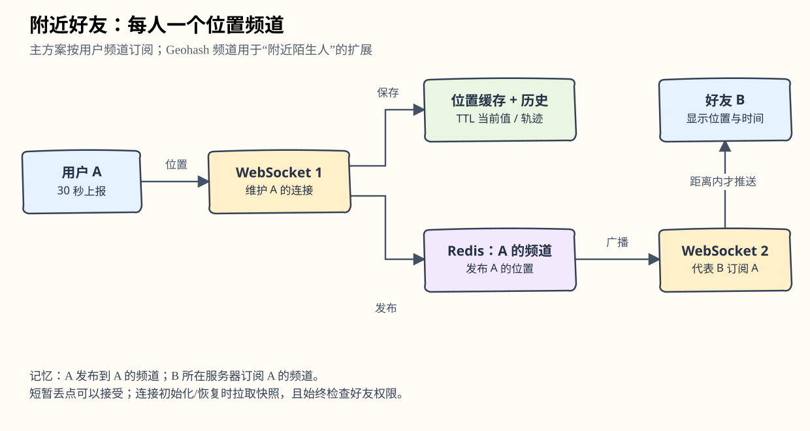
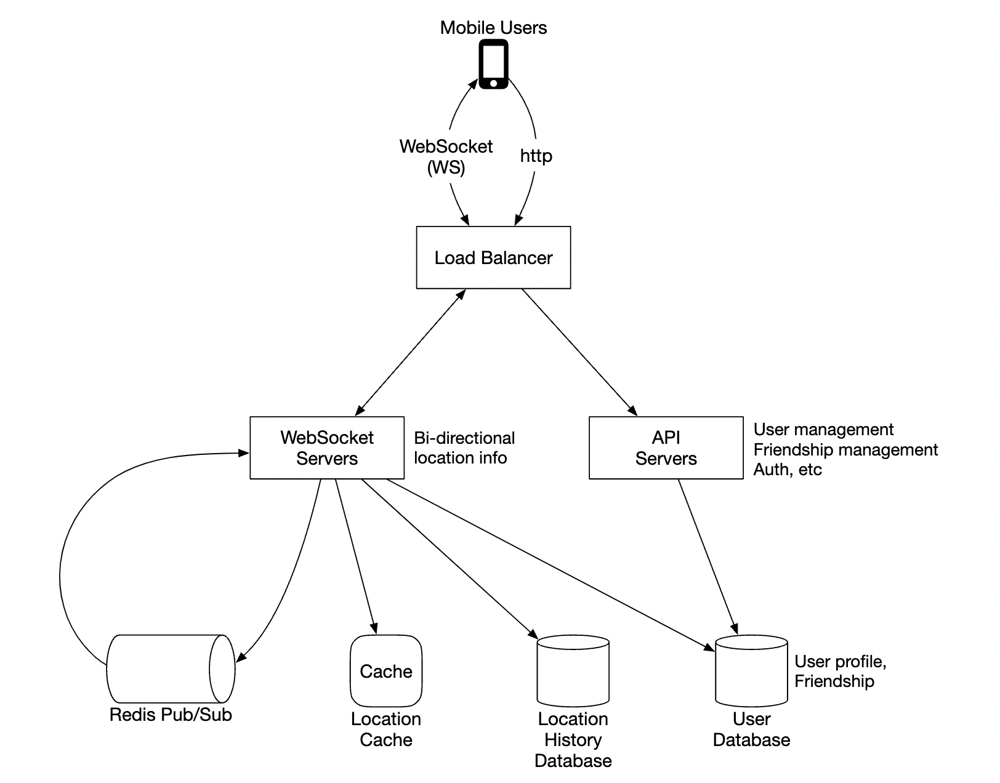
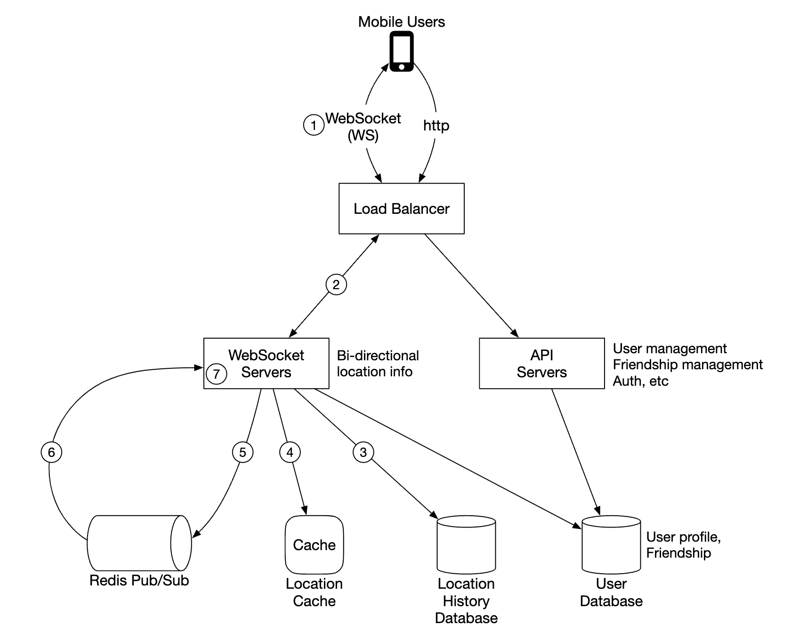

# 第17章：附近好友（Nearby Friends）

> 对应[英文原版](https://github.com/liquidslr/system-design-notes/blob/main/17.%20Nearby%20Friends/README.md)。正文按原小节翻译；批注为额外解释与边界提醒，原版文件不变。

## 中文学习导读

这一章与附近商家最大的区别是：**人一直在动**。不要每次刷新都扫描所有人；让在线设备上报位置，再通过好友频道推送。先记住：**WebSocket 连设备，Redis 存当前位置，每人一个频道，好友订阅后按距离过滤。** Geohash 是后面的“附近陌生人”扩展方案，不是本章主方案。

## 引言

本章设计可扩展的后端，使用户分享位置并发现附近好友。前一章商家地址基本不动，本章的位置则持续变化。

## 第一步：理解问题并确定范围

可以通过以下问答确定范围：

- 多近算“附近”？——5 英里，可配置。
- 用直线距离，还是考虑河流等实际通行障碍？——按直线距离的假设处理。
- 有多少用户？——10 亿，10% 使用附近好友功能。
- 是否保存历史位置？——保存，可用于机器学习等分析。
- 不活跃好友能否在 10 分钟后消失？——可以。
- 要讨论 GDPR 等要求吗？——原版为简化面试暂不讨论。

### 功能需求

- 移动端显示附近好友，每位好友附距离与最后更新时间。
- 列表每隔几秒更新。

### 非功能需求

- **低延迟**：位置更新不能延迟太久。
- **可靠性**：偶尔丢失位置点可接受，系统总体需可用。
- **最终一致性**：位置存储不必强一致，副本间延迟几秒可接受。

### 粗略估算

- 附近范围为 5 英里。
- 每 30 秒刷新位置；人步行较慢，不需要过于频繁。
- 日均 1 亿用户使用功能，10% 同时在线，即 1000 万。
- 每人平均 400 个好友，假设都使用此功能。
- 每页显示 20 位附近好友。
- 位置更新 QPS：`1000万 / 30 ≈ 33.4万/秒`。

> **批注｜时效比“精确实时”更重要。** 返回 `timestamp`，让用户知道位置多久前更新。实际产品还需位置授权、精度与保留期；原版暂不讨论不代表可以忽略隐私。

## 第二步：提出高层设计并确认方案

先讨论通信协议，因为这里不是普通请求/响应 CRUD。

### 高层设计

理论上可让设备点对点交换消息，但移动网络不稳定、耗电受限，P2P 不实用。更实用的方案是共享后端负责扇出（fan-out）：

后端负责接收活跃用户的位置更新，找出应收到更新的活跃好友并转发；距离超过阈值则不转发。难点是如何承受规模。

- **负载均衡器**：给 REST API 与双向 WebSocket 服务器分流。
- **REST API 服务器**：管理好友、资料等辅助功能。
- **WebSocket 服务器**：有状态，转发位置更新；初始化时给客户端发送当前附近好友位置。
- **Redis 位置缓存**：保存每个活跃用户的最近位置，并设置 TTL。过期表示用户不活跃，缓存条目删除。
- **用户数据库**：保存用户与好友关系，可使用关系型或 NoSQL 数据库。
- **位置历史数据库**：记录历史轨迹供分析，不直接作为附近列表的读路径。
- **Redis Pub/Sub**：轻量消息总线，每位用户对应一个位置更新频道。

WebSocket 服务器订阅与本机客户端好友有关的频道，收到消息后转发给合适的用户。

> **批注｜频道属于“被关注的人”。** A 发布到 A 的频道；B 是 A 的好友，B 所在服务器订阅 A 的频道。一个服务器可能代表多个客户端共享订阅，不能误解为所有用户只订阅自己的频道。

### 周期位置更新

1. 移动端向负载均衡器发送位置。
2. 经既有长连接转到负责该客户端的 WebSocket 服务器。
3. 服务器将位置写入历史数据库。
4. 更新位置缓存，同时在内存保存坐标以便后续距离计算。
5. 向该用户自己的 Redis 频道发布位置。
6. Redis 把更新广播给该频道的所有订阅者，即好友所在的服务器。
7. 订阅服务器计算距离，决定哪些客户端应该收到更新，然后发送。

平均每人 400 个好友、10% 在线，所以一次位置上报大约扇出 40 份更新。

### API 设计

需要的 WebSocket 操作包括：

- 周期位置上报：用户发送位置。
- 接收位置更新：服务器发送好友位置与时间戳。
- 客户端初始化：客户端发送自身位置，服务器返回附近好友位置。
- 订阅新好友：例如好友首次上线时，服务器发送需要关注的好友 ID。
- 取消订阅好友：例如好友离线，服务器发送不再关注的好友 ID。

辅助功能使用传统 HTTP 请求/响应 API。

### 数据模型

- 位置缓存：`user_id → (latitude, longitude, timestamp)`。只关心当前位置，且需要 TTL，因此 Redis 合适。
- 位置历史表：保存上述四个字段。Cassandra 擅长写多工作负载，可用于此处。

> **批注｜缓存与历史分工不同。** TTL 让在线位置自然过期，历史数据却需要独立保留策略。对乱序上报可加序列号或比较事件时间，避免旧位置覆盖新位置。

## 第三步：深入设计

### 各组件如何扩展？

- **API 服务器**：复制实例并用自动扩缩容组扩展。
- **WebSocket 服务器**：能水平扩容，但缩容时要优雅关闭连接。先在负载均衡器标记 `draining`，不再接入新连接，再移出服务池。
- **客户端初始化**：连接后取好友列表，订阅其 Redis 频道，从缓存拉好友位置，再发送给客户端。
- **用户数据库**：按 `user_id` 分片；也可由专门服务和团队提供用户/好友 API。
- **位置缓存**：增加 Redis 节点分片。TTL 限制同时保留的数据量，但仍要承受高写入率。
- **Redis Pub/Sub**：没有订阅者的频道不需要像持久化队列那样保留消息。可预先约定所有用户的频道名称，避免用户上线时额外协调频道创建。

### 深入扩展 Redis Pub/Sub

原版估算维护频道需要约 200 GB 内存，两台 100 GB Redis 可满足容量。但约每秒 1400 万次位置推送才是真正瓶颈：假设单机能处理 10 万次/秒，则至少约需 140 台。

因此要分布式 Redis 服务器集群分担 CPU 负载，并用 ZooKeeper 或 etcd 服务发现记录存活节点和频道分布：

WebSocket 服务器从 ZooKeeper 获取分布数据，确定频道在哪台机器上；可在内存缓存哈希环。扩缩容可根据历史流量每天规划，也可适当预留容量应对突发。

频道存在订阅状态，迁移时需与订阅者协调，所以不能把 Redis Pub/Sub 节点当作完全无状态实例随意移除。注意：

- 频道移动会产生大量重新订阅请求。
- 迁移期间可能漏掉部分位置点，本题允许，但仍应尽量降低影响并安排在低峰。
- 一致性哈希可减少增删节点时移动的频道数量。

> **批注｜容量与吞吐两张账。** 内存只够两台，不意味着两台能处理消息量。原版单机 10 万推送/秒和 200 GB 都是估算，网络、消息大小、订阅数量及 Redis 版本会影响实际结果，需压测。

### 添加/删除好友

好友关系变化时，受影响用户的 WebSocket 服务器需要订阅/取消对应好友频道。假设客户端能注册好友变更回调，再发消息让服务器执行操作。

> **批注｜服务端仍须鉴权。** 不能仅因客户端要求订阅某个 ID 就泄露位置；服务器必须检查真实好友关系和分享权限。

### 好友特别多的用户

可以限制好友数量，例如原文举 Facebook 的 5000 上限作为例子。“超级用户”所在 WebSocket 服务器负载更高，但足够多的服务器可以分散总体压力。

### 附近陌生人

若面试官增加“偶尔在地图上出现附近随机人”的功能，可按 Geohash 定义频道池：

同一 Geohash 区域中的人订阅该区域频道，以收到随机用户位置更新：

还要订阅相邻格子，防止附近的人处于格子边界另一侧：

### Redis Pub/Sub 的替代方案

可使用 Erlang，一种为分布式应用优化的通用语言。它可以创建数百万轻量进程互相通信，在同一分布式应用中同时处理 WebSocket 连接与 Pub/Sub 频道。困难是语言较小众，熟练开发者不易招聘。

## 第四步：回顾

核心组件是 WebSocket 服务器（客户端与服务器实时通信）和 Redis（高速读写当前位置、发布/订阅频道）。本章讨论了 REST API、WebSocket、数据库、缓存与 Pub/Sub 的扩展，也讨论了 Erlang 替代方案和附近陌生人扩展。

> **批注｜面试回答模板。** “长连接负责实时更新，Redis TTL 缓存当前位置，历史库异步留档。按用户频道把位置扇出到好友所在服务器，再做距离过滤。扩容看消息推送量；迁移需重新订阅，丢点后通过快照补齐。”
