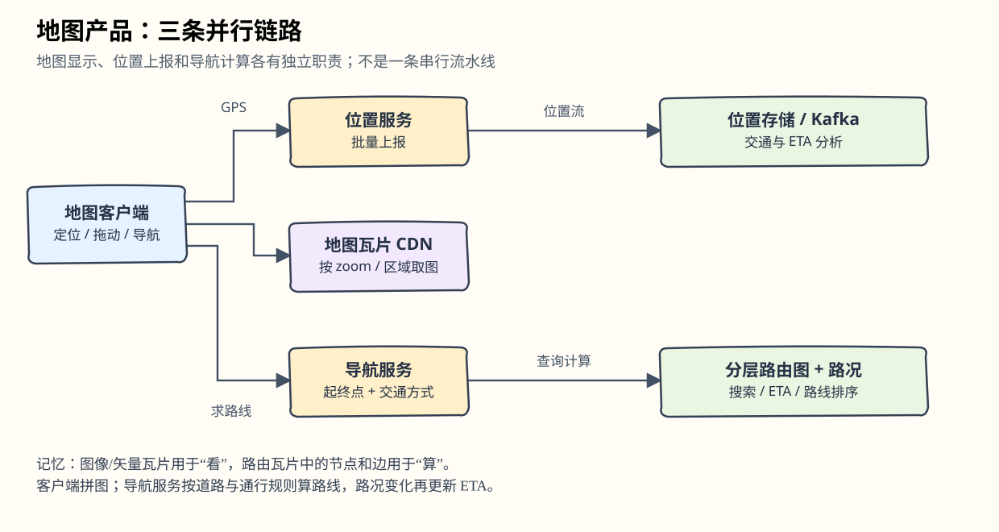
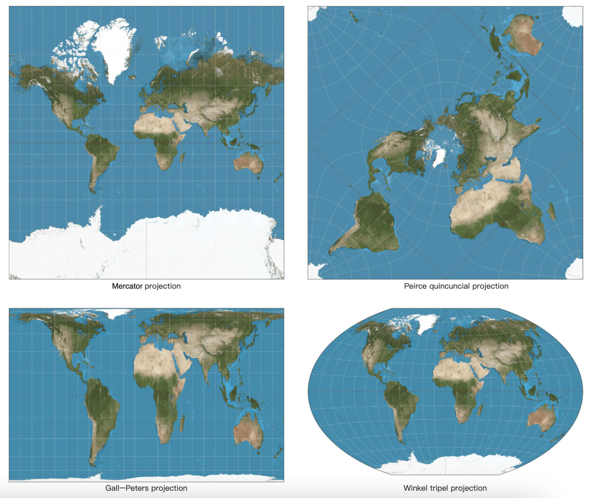
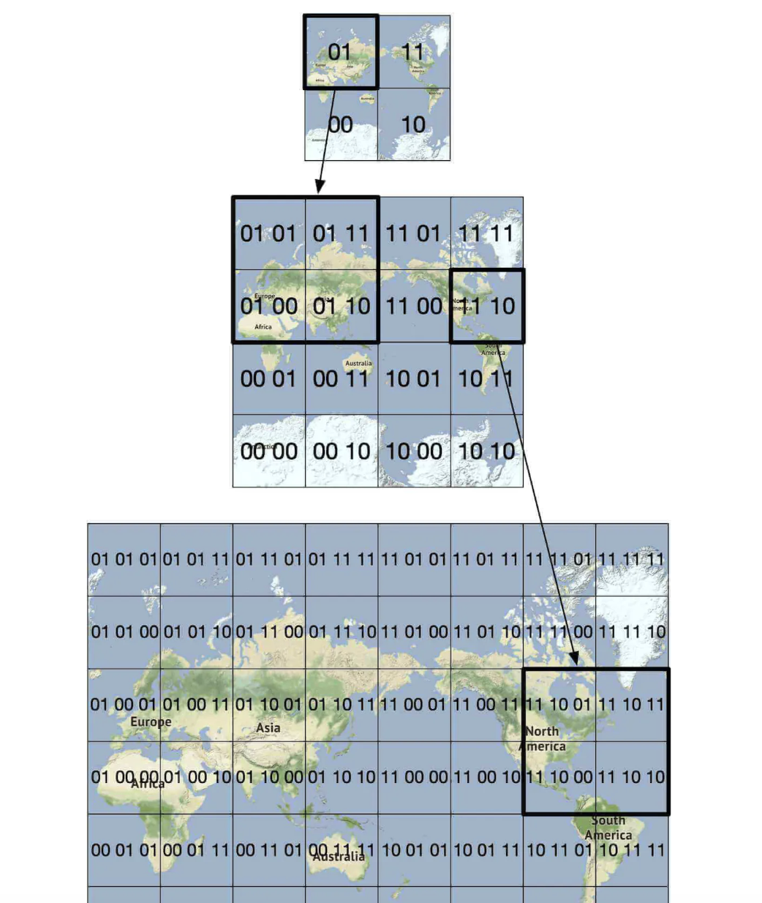
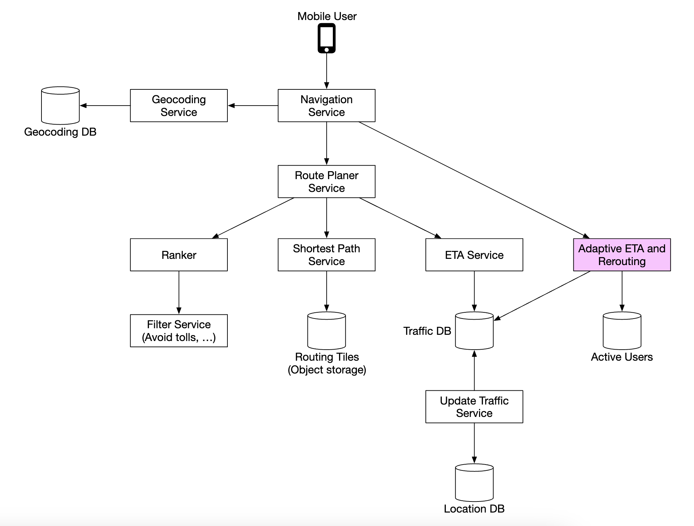

# 第18章：设计 Google Maps

> 对应[英文原版](https://github.com/liquidslr/system-design-notes/blob/main/18.%20Google%20Maps/README.md)。按原文结构翻译，原示例代码保留；“批注”解释概念或指出原笔记中的简化，原版未修改。

## 中文学习导读

把地图产品拆成三条独立链路：**位置上报、地图瓦片、导航路线**。CRUD 的表查询仍然有用，但地图不能一次下载整张，路由也不能每次扫描全球道路。先记住：图片切瓦片，道路切子图，位置按时间保存。



## 引言

本章设计简化版 Google Maps。原版介绍其 2005 年推出，提供卫星影像、街道地图、实时交通和路线规划；并引用截至 2021 年“10 亿 DAU、覆盖世界 99%、每天 2500 万次实时位置信息更新”等背景数字。这些是原文历史陈述，未在本次翻译中作为当前产品统计验证。

## 第一步：理解问题并确定范围

面试问答的范围如下：

- 10 亿 DAU。
- 关注位置更新、导航、预计到达时间（ETA）、地图渲染。
- 已从多个来源取得道路数据，原始数据为 TB 量级。
- 考虑实时交通，才能准确估时。
- 支持步行、骑行、驾车。
- 本次不重点设计多站点路线，也不包括商家地点和照片。

最终聚焦三项功能：用户位置更新、含 ETA 的导航服务、地图渲染。

### 非功能需求

- **准确性**：不能给用户错误方向。
- **流畅导航**：地图渲染平滑。
- **流量与电池**：移动端尽量省流量、省电。
- 一般的可用性与可扩展性要求。

### 地图基础（Map 101）

#### 定位坐标系统（Positioning System）

地球近似球体并绕轴自转。纬度（latitude）表示南北位置，经度（longitude）表示东西位置。


#### 从三维到二维

将三维坐标转成二维平面称为地图投影（map projection）。不同投影各有优缺点，几乎都会扭曲部分几何性质。



Google Maps 采用墨卡托投影的变体 Web Mercator。

> **批注｜地图上同样一厘米不总是同样距离。** 投影会影响面积与距离，精确距离计算应使用经纬度和适合的地理算法，不应直接拿屏幕像素相减。

#### 地理编码（Geocoding）

地理编码把地址转换为坐标，反向地理编码把坐标转换成地址。可利用 GIS 等来源中街道与坐标的映射，再插值估算地址的位置。

#### Geohash

Geohash 用字母数字字符串表示地理区域。将地图视作平面并递归分成四个象限：



#### 地图渲染（Map Rendering）

通过瓦片（tile）渲染地图：把世界拆成小块，客户端只下载当前需要的瓦片，像拼马赛克一样拼接。不同缩放级别对应不同瓦片；最小缩放时，一张 `256×256` 瓦片即可代表整个世界。

#### 将道路数据处理为导航图

交叉路口表示图的节点（node），道路表示边（edge）。


导航通常采用改进版 Dijkstra 或 A*。路径搜索对图的大小敏感，不能每次对全球完整道路图运行搜索。因此把道路图切成越来越小的路由瓦片（routing tile）。各瓦片保存相邻瓦片引用，搜索时按需拼接：


这样只需加载起终点路线相关的数据，降低内存带宽。长途路线若仍拼接大量细粒度瓦片会很贵，所以还使用不同细节层级的路由瓦片，根据距离选择合适层级。


> **批注｜图像瓦片与路由瓦片不是同一种东西。** 图像瓦片用于“看”，包含像素或矢量；路由瓦片用于“算”，包含路口、道路、通行规则。长途导航像先走高速公路，再在目的地附近展开小路。

### 粗略估算

需要保存：

- 世界地图瓦片：原文考虑类似沙漠瓦片压缩后估计约 70 PB。
- 元数据：相对很小，估算中忽略。
- 道路信息：以路由瓦片保存。

10 亿 DAU、每周使用 35 分钟，相当于每天累计 50 亿分钟。原文假设 GPS 更新批量提交，估计约 20 万 QPS，峰值约 100 万 QPS。

> **批注｜补全估算参数。** QPS 取决于批次间隔与每次包含多少点，原笔记未给完整推导；它在“导航请求”名下混用了 GPS 上报。实际估算应把导航请求、GPS 上报和瓦片下载分别计算。

## 第二步：高层设计


### 位置服务（Location Service）


负责记录位置：每 `t` 秒接收更新；长期的位置流可改善 ETA、监测交通、发现封路和分析行为。客户端先批量缓存位置，再一次上传多点，减少请求开销。


即使批量化，Google Maps 规模的写入仍很大，因此选择擅长高写入的 Cassandra，并用 Kafka 把位置流送往后续分析。

位置上报请求：

```
POST /v1/locations
Parameters
  locs: JSON encoded array of (latitude, longitude, timestamp) tuples.
```

### 导航服务（Navigation Service）

负责在合理时间内找到 A 到 B 的快速路线。允许少量延迟；路线不一定是数学意义的绝对最快，但方向与通行规则应准确。

请求示例：

```
GET /v1/nav?origin=1355+market+street,SF&destination=Disneyland
```

响应示例：

```json
{
  "distance": {"text":"0.2 mi", "value": 259},
  "duration": {"text": "1 min", "value": 83},
  "end_location": {"lat": 37.4038943, "Ing": -121.9410454},
  "html_instructions": "Head <b>northeast</b> on <b>Brandon St</b> toward <b>Lumin Way</b><div style=\"font-size:0.9em\">Restricted usage road</div>",
  "polyline": {"points": "_fhcFjbhgVuAwDsCal"},
  "start_location": {"lat": 37.4027165, "lng": -121.9435809},
  "geocoded_waypoints": [
    {
       "geocoder_status" : "OK",
       "partial_match" : true,
       "place_id" : "ChIJwZNMti1fawwRO2aVVVX2yKg",
       "types" : [ "locality", "political" ]
    },
    {
       "geocoder_status" : "OK",
       "partial_match" : true,
       "place_id" : "ChIJ3aPgQGtXawwRLYeiBMUi7bM",
       "types" : [ "locality", "political" ]
    }
  ],
  "travel_mode": "DRIVING"
}
```

> **批注｜原示例字段。** JSON 中 `end_location` 的 `Ing` 是原文拼写，应是 `lng`（小写 L）；示例原样保留方便对照，真正实现需统一 schema。`distance.value` 和 `duration.value` 应明确单位；指令中的 HTML 由客户端安全渲染。实时路况和重新规划在深入设计部分处理。

### 地图渲染

PB 级瓦片无法全部放在客户端，需要按位置和 zoom 按需获取。用户缩放、平移，或导航进入新瓦片时获取新数据。

- 动态生成每张图片会增加服务器负载，也不易缓存。
- 原版选择静态瓦片，客户端按位置计算标识，再从 CDN 获取。


CDN 让用户从附近的边缘节点（POP）取图，减少延迟。


确定瓦片有两种方式：

1. 客户端计算瓦片标识；长期必须维持兼容，因为强迫所有用户升级很难。
2. 服务端提供 API 计算瓦片 URL；多一次请求，但规则更容易调整。


> **批注｜原文把瓦片标识笼统称为 Geohash。** 常见 Web 地图瓦片使用 `z/x/y` 编号，不能把它与 Geohash 字符串直接等同。关键是客户端与服务端约定一致的坐标、缩放和编号体系。

## 第三步：深入设计

### 数据模型

#### 路由瓦片

道路原始数据来自多源，并根据位置更新持续改善。周期离线流水线把非结构化数据转换成图结构路由瓦片。不需要数据库事务/查询时，可以放在 S3 对象存储并积极缓存；利用库把邻接表高效压缩成二进制文件。

#### 用户位置数据

位置数据用于更新交通与其他分析，写入密集，适合 Cassandra。示例记录：


#### 地理编码数据库

保存地点与经纬度的映射。读频繁、写较少，原文选择 Redis 加速读取。

> **批注｜Redis 在这里是候选实现。** 真实地址查找还可能需要文本索引、别名、消歧和反向空间查询；简单键值映射只覆盖本章简化范围。

#### 世界地图的预计算图片

预先计算瓦片图片并通过 CDN 提供。


### 服务

#### 位置服务


高写入场景选择 NoSQL。位置不断更新、很快变旧，因此可用性优先于强一致，本章采用 Cassandra。


- `user_id` 为分区键，便于获取某用户的更新。
- `timestamp` 为聚簇键，按接收更新时间排序。

Kafka 把位置流输送给其他需要这些数据的服务：


> **批注｜长期分区不能无限长。** 实际 Cassandra 表通常给用户加时间桶，例如 `(user_id, day)`，避免一个用户多年数据堆成超大分区。事件时间与接收时间也应明确区分。

#### 地图渲染

最低 zoom 为一个 `256×256` 世界瓦片。每增加一级，瓦片总数变为原来的 4 倍。


可把完整图片改为路径和多边形等矢量表示，在客户端动态渲染，显著节省传输带宽。

#### 导航服务


先由地理编码服务将地址转换为经纬度。

请求示例：

```
https://maps.googleapis.com/maps/api/geocode/json?address=1600+Amphitheatre+Parkway,+Mountain+View,+CA
```

响应示例：

```json
{
   "results" : [
      {
         "formatted_address" : "1600 Amphitheatre Parkway, Mountain View, CA 94043, USA",
         "geometry" : {
            "location" : {
               "lat" : 37.4224764,
               "lng" : -122.0842499
            },
            "location_type" : "ROOFTOP",
            "viewport" : {
               "northeast" : {
                  "lat" : 37.4238253802915,
                  "lng" : -122.0829009197085
               },
               "southwest" : {
                  "lat" : 37.4211274197085,
                  "lng" : -122.0855988802915
               }
            }
         },
         "place_id" : "ChIJ2eUgeAK6j4ARbn5u_wAGqWA",
         "plus_code": {
            "compound_code": "CWC8+W5 Mountain View, California, United States",
            "global_code": "849VCWC8+W5"
         },
         "types" : [ "street_address" ]
      }
   ],
   "status" : "OK"
}
```

路线规划服务（Route Planner）结合交通条件，优化旅行时间。最短路径服务对对象存储中的路由瓦片运行 A* 变体：

1. 接收起终点，转换为坐标，计算空间标识并确定瓦片。
2. 从起点瓦片开始遍历，直到找到通往终点瓦片的足够好路线。


- **ETA 服务**：路线规划器调用它，以交通数据和机器学习估算时间。
- **排序服务（Ranker）**：按用户条件给候选路线排序，例如避开收费道路或高速公路。
- **更新服务（Updater）**：异步刷新重要数据库。

> **批注｜算法正确性有前提。** 经典 A* 要保持最优性，启发函数不能高估剩余代价；道路限制、路况时间权重和分层近似需要另行设计。可以明确本题追求“准确可走、合理快”，不必无条件承诺全局最短。

#### 改进：动态 ETA 与重新规划

根据新路况调整正在导航的路线。可记录每位导航用户会经过的瓦片：

```
user_1: r_1, r_2, r_3, …, r_k
user_2: r_4, r_6, r_9, …, r_n
user_3: r_2, r_8, r_9, …, r_m
...
user_n: r_2, r_10, r21, ..., r_l
```

某瓦片发生事故时，查出经过它的用户并重新规划。为了减少保存数量，也可以记录起点瓦片以及包含它的不同分辨率父瓦片，直到覆盖终点：

```
user_1, r_1, super(r_1), super(super(r_1)), ...
```


原文建议判断用户的最终覆盖瓦片是否包含事故瓦片，筛出可能受影响者；也可保存多条候选路线，有更快方案就通知。

> **批注｜粗瓦片命中只代表候选。** 大范围父瓦片包含事故，并不说明用户路线一定经过事故。需要再检查具体路径，否则会给无关用户频繁改道；还可建立 `tile → active route/user` 倒排索引减少扫描。

#### 数据下发协议

- 移动推送通知载荷受限，不适合持续导航数据；原文称其不支持 Web，现代浏览器可能支持 Web Push，但它仍不适合高频导航通道。
- WebSocket 通常比反复长轮询开销更低。
- SSE 可以单向推送，但这里倾向 WebSocket，因为双向通信也适用于末端配送等扩展功能。

## 第四步：回顾



后续还可增加多站点导航，为 Uber、Lyft 等企业场景求访问一组地点的合适路线。

> **批注｜面试回答模板。** “位置批量上报进入 Cassandra/Kafka；静态或矢量瓦片通过 CDN；导航使用分层道路图、ETA 与路线排序。交通事件先筛受影响路线，再验证并推送改道；客户端省电与协议兼容性一起考虑。”
