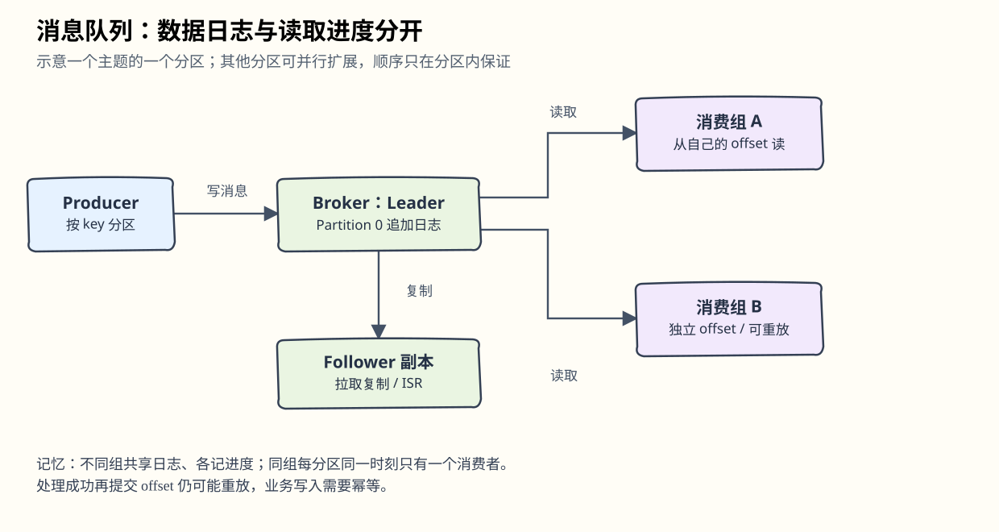
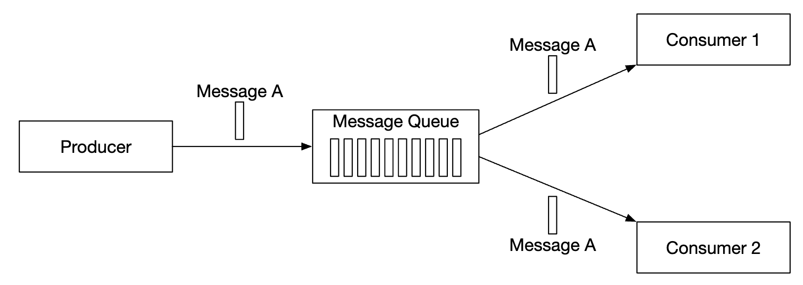
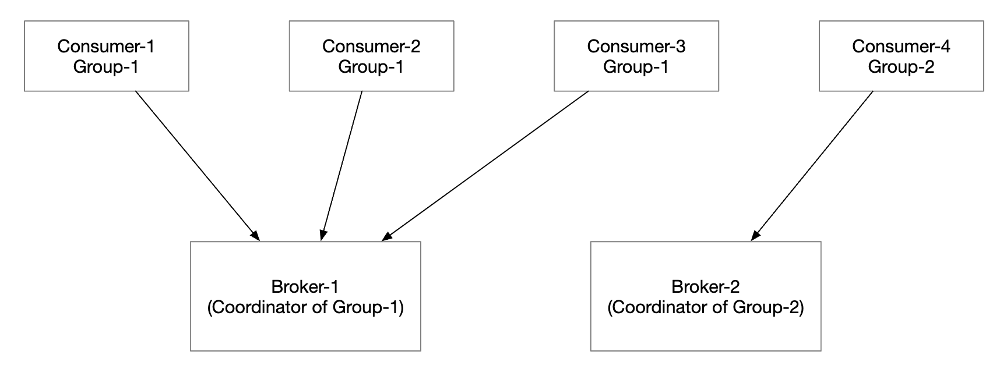
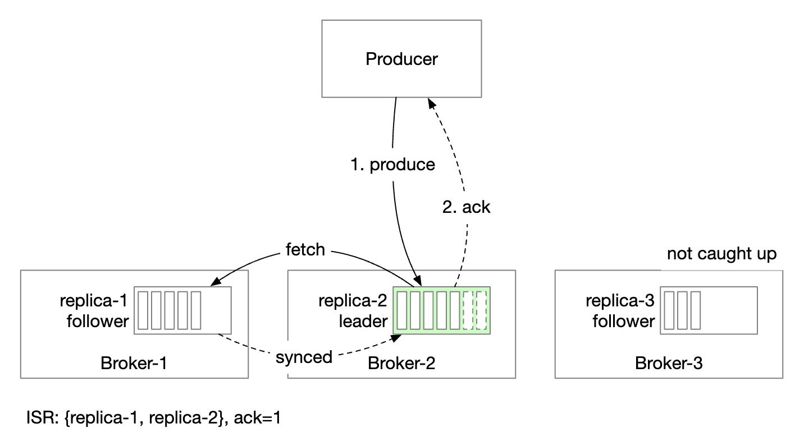
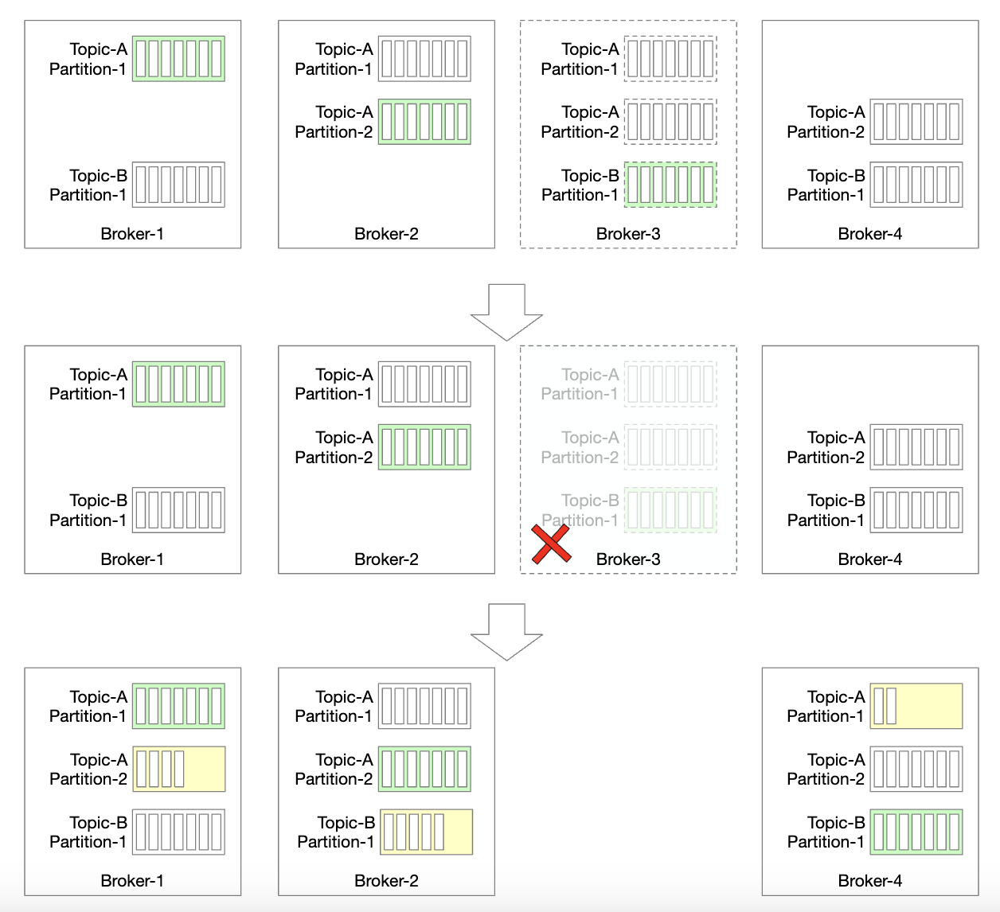
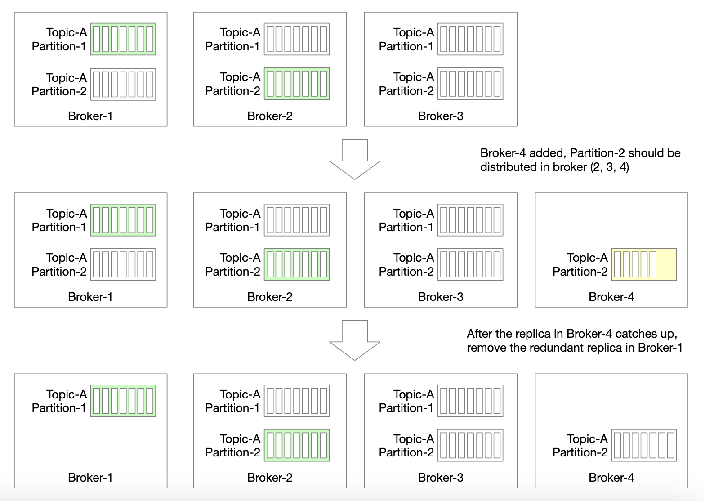
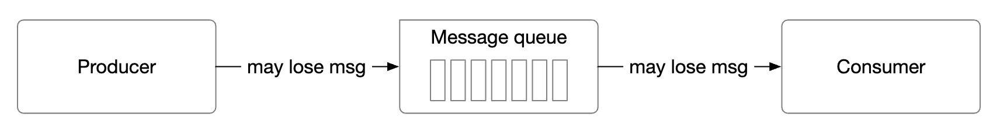
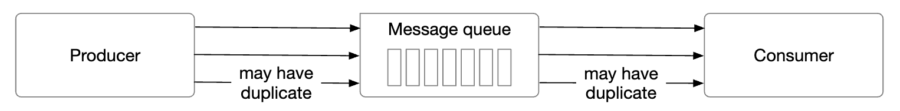

# 第19章：分布式消息队列（Distributed Message Queue）

> 对应[英文原版](<../../19. Distributed Message Queue/README.md>)。按原结构翻译并保留示例与原图，批注标明解释和实现边界；原版未修改。

## 中文学习导读

把队列想成有序、可翻页的工作记录本：生产者写页，消费者记住读到哪里。记住四个概念：**Topic 分业务，Partition 分并行度，Broker 存数据，Consumer Group 记进度。** 本章重点是“顺序在哪一层保证”“宕机后从哪里重做”，而不是只会调用 `send()`。

## 引言

消息队列的好处：

- **解耦（Decoupling）**：组件可以独立更新。
- **扩展性**：生产者和消费者按各自流量独立扩容。
- **可用性**：部分系统不可用，其他组件仍可与队列交互。
- **性能**：生产者不用等待消费者业务处理完成。

常见产品有 Kafka、RabbitMQ、RocketMQ、Apache Pulsar、ActiveMQ、ZeroMQ。严格分类下 Kafka 和 Pulsar 更接近事件流平台，但功能逐渐融合，边界不绝对。本章设计支持长时间保留与反复消费的队列。

## 第一步：理解问题并确定范围

基础是生产者发送、消费者接收；还要明确性能、投递和保留语义。

面试范围问答：

- 消息格式与大小？——纯文本，通常几 KB。
- 能否反复消费？——可以，不同消费者可以反复读。
- 是否保序？——需要。
- 保留多久？——两周。
- 生产者和消费者数量？——越多越好，需要扩展。
- 投递语义？——必须至少一次，最好最多一次、至少一次、恰好一次都能配置。
- 吞吐与延迟？——支持日志聚合等高吞吐场景，也支持传统消息队列的低延迟场景。

### 功能需求

- 生产者发送，消费者读取。
- 可只消费一次，也可反复消费。
- 历史数据可截断。
- KB 级消息。
- 保留消息顺序。
- 可配置 at-most-once / at-least-once / exactly-once。

### 非功能需求

- 按场景选择高吞吐或低延迟。
- 分布式、能承受突增消息量。
- 持久化到磁盘并跨节点复制。

原版把长保留、重放和保序视为相对传统队列增加的需求，因而本设计更复杂。

> **批注｜产品分类别背成绝对结论。** 传统队列也可能支持特定顺序和保留方式。这里应理解为“本题选择的对比模型”。更关键的是先说明：保序只保证在单分区内，跨分区没有天然全局顺序。

## 第二步：高层设计

生产者发送消息；消费者订阅并读取。中间的队列服务让两者独立扩展。生产者和消费者都是客户端，队列是服务端。

### 消息模型（Messaging Models）

**点对点（Point-to-Point）**：

一条消息进入队列，由一个消费者处理。可以有多个竞争消费者，但确认消费后消息从队列删除。原版此模型不保留已确认数据，而本题需要保留。

**发布/订阅（Publish-Subscribe）**：

消息属于某个 Topic（主题）。订阅者各自收到该主题的消息。

### Topic、Partition 与 Broker

主题数据太多时，切成多个分区（partition），也就是分片：

- 消息分布到不同分区；实际是否均匀取决于 key 分布。
- 承载分区的服务器叫 Broker。
- 每个分区按 FIFO 追加和读取，顺序在分区内保留。
- 消息在分区中的位置叫偏移量（offset）。
- 每条消息发到指定分区。分区键（partition key）决定去哪里，例如 `user_id` 可把同一用户事件放在一起。
- 消费者订阅一个或多个分区；共同处理一个主题的消费者可以组成消费组。

### 消费组（Consumer Groups）

- 每个组逻辑上各自读取完整消息流，而非每个组内成员都重复读全部消息。
- 每组独立保存 offset。
- 并行读取提高吞吐，但须保护分区内顺序。
- 同一组内，同一分区同一时刻仅分给一个消费者。
- 因而活跃消费者数量最多等于分区数；更多成员只能空闲。

> **批注｜“每组一份”不是物理复制一份。** 数据日志通常共享，独立的是组的读取位置。订单组与统计组互不影响；订单组内部多个工人分摊分区。若同一消费者又并发处理单分区消息，业务完成顺序仍可能乱，应用也要配合保序。

### 高层架构

- **客户端**：Producer 向主题发送，Consumer Group 订阅主题。
- **Broker**：持有多个分区。
- **数据存储**：保存分区消息。
- **状态存储**：保存消费者状态。
- **元数据存储**：保存配置和主题属性。
- **协调服务**：服务发现、存活 Broker 列表和选主，协助分区分配。

## 第三步：深入设计

高吞吐、长保留带来三个选择：使用适合顺序磁盘访问与操作系统缓存的结构；消息不可变以减少复制；用批量写减少小 I/O。

### 数据存储

消息访问特点：读多、写多；消息不原地更新，也不逐条删除；主要顺序读写。传统消费即删的队列则另有删除语义。

候选：

- **数据库**：普通通用数据库的索引、事务与随机访问能力未必值得本场景的额外开销。
- **追加日志 / WAL**：只追加，适合磁盘顺序访问。分区再切成多个 segment，避免单个文件太大；旧段只读，仅最新段可写。

HDD 并非任何访问都慢，顺序吞吐远好于随机寻道；操作系统页缓存还能减少实际磁盘读取。原文给出“每秒数 MB”作为足够使用的例子，但硬盘实际能力随型号与负载变化。

> **批注｜这里的 WAL 是日志思路。** 队列日志不必是纯文本文件，生产系统常用二进制编码、批次与索引。删历史数据可直接回收过期段，避免逐条 delete。

### 消息数据结构

生产者、队列与消费者应使用兼容编码，减少反序列化和重新复制。

`key` 决定分区，例如 `hash(key) % numPartitions`；生产者可覆盖默认分区策略。`value` 是负载，可以是文本或压缩二进制块。与 KV 数据库不同，消息 key 可重复，也可为空。

其他字段：

- **Topic**：所属主题。
- **Partition**：分区 ID。
- **Offset**：分区内位置；三元组 `(topic, partition, offset)` 定位消息。
- **Timestamp**：消息存储时间。
- **Size**：消息大小。
- **CRC**：完整性校验。

还可加入标签等字段支持过滤。

### 批处理（Batching）

生产者、消费者、队列都采用批量：一次网络往返传更多数据，把消息成组顺序写入日志，利用页缓存。

- 大批次：吞吐高，等待凑批的延迟更高。
- 小批次：延迟低，吞吐相对低。

传统低延迟用例可调小 batch；高吞吐场景可增加分区并行分散磁盘限制。

> **批注｜要同时设大小与等待时间。** 只设“凑满 1000 条”会让低流量消息一直等待。通常达到大小阈值或最大等待时间，任一条件满足就发送。

### 生产者流程

生产者应连哪台 Broker？一种方案是在中间加路由层，查元数据中的副本计划并本地缓存，把消息转到分区 Leader。

1. 路由层读取并缓存副本分配。
2. 生产者发送给路由层。
3. 转发给例子中的 Broker 1（Leader）。
4. Follower 从 Leader 拉取；收到足够复制确认后提交并回复。

副本用来容错。额外路由层带来网络跳转，也不利于让生产者直接控制分区批次；原文据此选择把路由逻辑放进生产者。

这样网络跳数更少，生产者可控制目标分区，并在内存缓存后一次发送大批次。

大批次等待提交更久；小批次更早发出，延迟低但吞吐较低。

> **批注｜独立路由层并非理论上不能批量。** 它也能批量，但会增加状态与协调复杂度。本章选择客户端路由是一种工程取舍。

### 消费者流程

消费者给出分区 offset，取得从该位置开始的一批消息。

**推模型（Push）**：Broker 收到就推，延迟小；但若处理速度低于生产速度，会压垮消费者，且难统一适配不同算力。

**拉模型（Pull）**：消费者自己控制速度，慢时不会被无限推送，可扩容追赶；更适合自主拉取大批次。缺点是空轮询和延迟，可用长轮询减少无消息时的请求。

本章选择拉模型。

1. 新消费者订阅 Topic A 并加入 Group 1。
2. 对组名哈希定位 Broker，组内成员连接同一个组协调器（group coordinator）。
3. 组协调器不是 ZooKeeper 那个全局协调服务。
4. 协调器确认加入，示例分配 Partition 2；策略可以是轮询、范围等。
5. 消费者从上次 offset 拉取，状态存储保存进度。
6. 处理后提交 offset；“处理与提交谁先做”决定投递语义。

### 消费者重平衡（Rebalancing）

重平衡决定每个分区由谁处理。当成员加入/退出，或分区增删时触发；作为协调器的 Broker 组织流程。

- 同组成员连接同一协调器。
- 成员变化时，协调器选择组 Leader。
- 组 Leader 计算分区分配方案，交给协调器广播。

心跳长期收不到也会触发：

**加入时**：

1. 初始只有 A，消费全部分区。
2. B 请求加入。
3. 协调器在心跳响应中通知成员重平衡。
4. 成员重新加入后，协调器选 Leader 并公布结果。
5. Leader 计算分配计划，其他成员等待。
6. 所有成员按新分区开始消费。

**退出时**：

A、B 原来同组；B 请求退出；协调器在 A 的心跳回复中通知重平衡，后续步骤相同。

**心跳超时**也采用类似流程：

> **批注｜重平衡是交接班。** 旧消费者必须停止失去所有权的分区，否则新旧实例可能同时写业务结果。上述是原版协议示例；现代队列可能使用不同分配协议和渐进式交接。

### 状态存储（State Storage）

保存分区与消费者映射，以及各组已消费 offset。

图中 Group 1 的 offset 为 6，意味着之前的消息已消费，故障后可从该位置继续。

访问特点：频繁读写但数据量小；经常更新、很少删除；随机访问；一致性重要。原版选用 ZooKeeper 一类协调型 KV 存储。

> **批注｜明确 offset 的定义。** 通常提交值表示“下一条要读取的位置”，本例据此解释。高频 offset 更新未必适合 ZooKeeper；真实 Kafka 通常使用内部主题管理 offset。本章是一种教学设计，不是当前 Kafka 实现说明书。

### 元数据存储（Metadata Storage）

保存分区数、保留期、副本分布等主题配置。变更少、量小、强一致要求高，原版选择 ZooKeeper。

### ZooKeeper

ZooKeeper 是层级 KV 存储，常用于分布式配置、同步与命名注册/服务发现。

原设计让 Broker 主要保管消息，元数据和消费状态交给 ZooKeeper，并用它帮助选主。

> **批注｜不是必须依赖 ZooKeeper。** 可用其他共识/协调实现；例如采用内置共识元数据的系统可以不部署它。要记住职责“谁存元数据、谁选主”，而不是死记产品名。

### 复制（Replication）

硬件故障不可避免，用复制提高可用性。

- 每分区跨 Broker 放多个副本，但只有一个 Leader。
- 生产者写 Leader，Follower 主动拉取。
- 足够副本同步后 Leader 确认。
- 每分区副本在哪里，称为副本分布计划。
- 原文写“分区 Leader 生成计划并存 ZooKeeper”；实际系统也可由集群控制器统一生成，这是实现边界。

### 同步副本（In-Sync Replicas，ISR）

ISR 是跟得上 Leader 的副本集合。原版用 `replica.lag.max.messages` 表示允许落后的最大消息数。

- 已提交 offset 为 13。
- Leader 又写了两条，尚未提交。
- 消息同步到 ISR 中所有副本后才算提交。
- 副本 2、3 跟上，所以在 ISR。
- 副本 4 落后，暂时被移出。

ISR 在性能与持久性之间取舍：若所有副本都必须等齐，慢副本会拖住分区；因此确认策略可配置。

- `ACK=all`：等待 ISR 中所有副本同步，延迟较高、持久性更强。

- `ACK=1`：Leader 收到就确认，更快，但复制前故障可能丢失。

- `ACK=0`：不等待确认，发送最快，也无法从确认得知失败。

消费者可统一从 Leader 读取，设计和运维最简单。每组每分区只连一个消费者，所以非热点场景连接数通常不大；热点可增加分区和消费者。在跨数据中心等场景，可考虑从 ISR 副本读取。Leader 追踪各副本落后情况并维护 ISR。

> **批注｜`all` 仍有前提。** ISR 如果只剩 Leader，`all` 也可能只确认一份；需配合最小同步副本数与禁止不安全选主。原文的 lag 参数属于历史/教学表述，落地应查具体版本；不能照抄为当前通用配置。

### 可扩展性

#### 生产者

原文认为生产者逻辑比消费者轻，通过增加/减少实例扩展。

#### 消费者

各消费组独立，可自由增删；组内成员变化通过重平衡实现扩展和故障接管。

#### Broker

Broker 失败时，剩余副本继续提供数据；选出新 Leader，协调器重新分配缺失副本。新副本作为 Follower 追赶，跟上后加入 ISR。

其他注意事项：

- 最小 ISR 数在延迟与安全性之间取舍。
- 副本应跨 Broker；放在同一节点失去容错意义。
- 如果所有副本都不可恢复地损坏，数据可能永久丢失。跨数据中心复制更安全但延迟高，也可使用[数据镜像](https://cwiki.apache.org/confluence/pages/viewpage.action?pageId=27846330)。

新增 Broker 时如何迁移？

迁移期间允许临时多一份副本；新 Broker 追上后，再删掉不需要的旧副本。

#### 分区（Partition）

新增分区后通知生产者，并触发消费组重平衡。新分区只接新消息，不搬全部旧消息。

减少分区更复杂：

- 停用分区不再接受新消息，新写只进剩余分区。
- 旧分区仍保留，消费者可以继续读取。
- 超过保留期才回收数据与空间。
- 过渡时生产者只写活跃分区，消费者读所有分区。
- 保留期结束后再重平衡。

> **批注｜这是本章提出的方案，不是所有产品的现成功能。** 例如某些系统不支持直接减少分区。增加分区还会改变 `hash(key) % N` 映射，同 key 新旧消息可能分处两区，要额外处理顺序过渡。

### 数据投递语义（Data Delivery Semantics）

#### 最多一次（At-most-once）

最多交付一次，也可能完全没交付。

- 生产者异步发送，失败不重试。
- 消费者取到消息就提交 offset；若随后处理前崩溃，这条消息不会再处理。

#### 至少一次（At-least-once）

允许重复交付，目标是不漏处理。

- 生产者用 `ack=1` 或 `ack=all`，出错持续重试。
- 消费者成功处理后才提交 offset。
- 处理成功但提交前崩溃，会再次读取。
- 适合允许重复或能去重的业务。

> **批注｜不丢失仍依赖持久化配置。** `ack=1` 在 Leader 故障时仍有丢失窗口。订单扣款等业务要用事件 ID、唯一约束或事务记录做幂等，不能把“至少一次”当“只执行一次”。

#### 恰好一次（Exactly-once）

对用户最友好，但实现代价高。

> **批注｜说清边界。** 队列内部事务可能保证读—处理—写消息结果只提交一次；若最终写到外部数据库或支付接口，还需事务性协作或幂等。仅把 offset 提交顺序调整一下不能得到端到端 exactly-once。

### 高级功能

#### 消息过滤（Message Filtering）

消费者可能只想要分区中某类消息。为每个子集另建主题会复制数据、浪费资源，并使生产者随消费者需求变化而变化。

可以选择：

- 消费者自己过滤，简单，但传输了不需要的数据。
- 消息附标签，消费者声明订阅标签，由服务端筛选。
- 按 payload 过滤，但加密或序列化负载不易安全解析。
- 复杂数学条件可用语法解析器或脚本执行器，但会增加队列负担。

#### 延迟消息与定时消息

例如发送 30 分钟后的支付核验任务，届时消费者检查付款状态。可把消息先放 Broker 临时存储，到时再移入目标分区。

临时存储可用专用主题；定时机制可用延迟队列或[分层时间轮](http://www.cs.columbia.edu/~nahum/w6998/papers/sosp87-timing-wheels.pdf)。

> **批注｜到期转移也要能重试。** 定时器执行成功但确认失败可能重复投递。延迟队列解决“何时交付”，不会自动解决“业务只做一次”。

## 第四步：回顾

还可继续讨论：

- **通信协议**：覆盖用例和吞吐，并校验完整性；例子有 AMQP、Kafka 协议。
- **重试消费**：暂时处理不了的消息转入重试主题，稍后再试。
- **历史归档**：旧消息备份到 HDFS 或 S3 等大容量存储。

> **批注｜面试回答模板。** “主题分区提供吞吐，单分区日志提供顺序；副本和 ISR 保护持久性；消费组 offset 支持重放与接管。批次大小换延迟与吞吐，幂等业务处理应对至少一次；扩容还要检查 key 映射和重平衡期间的所有权。”
