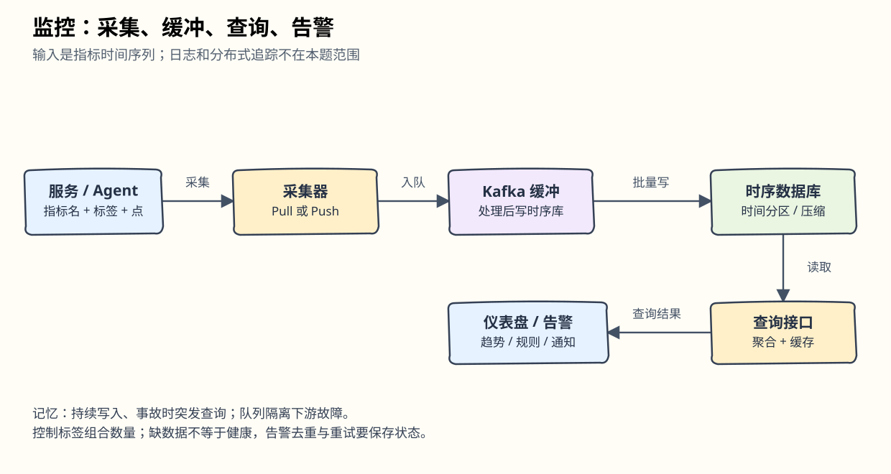
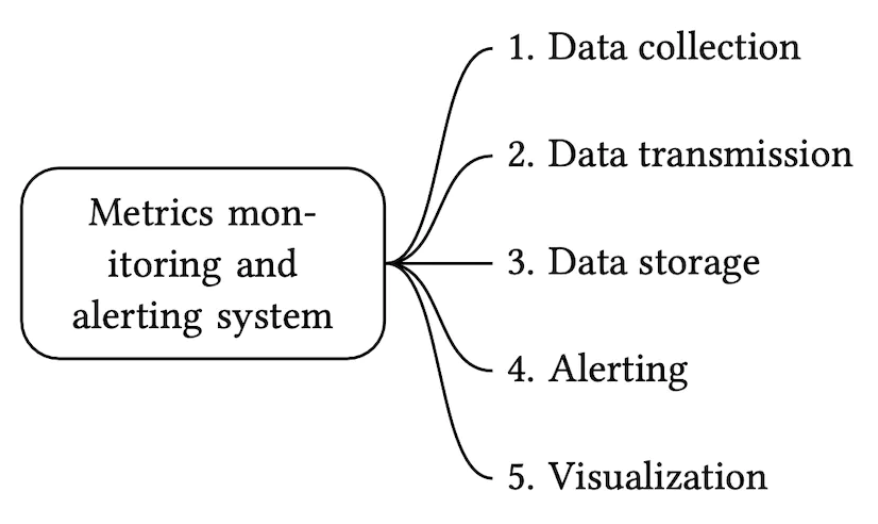
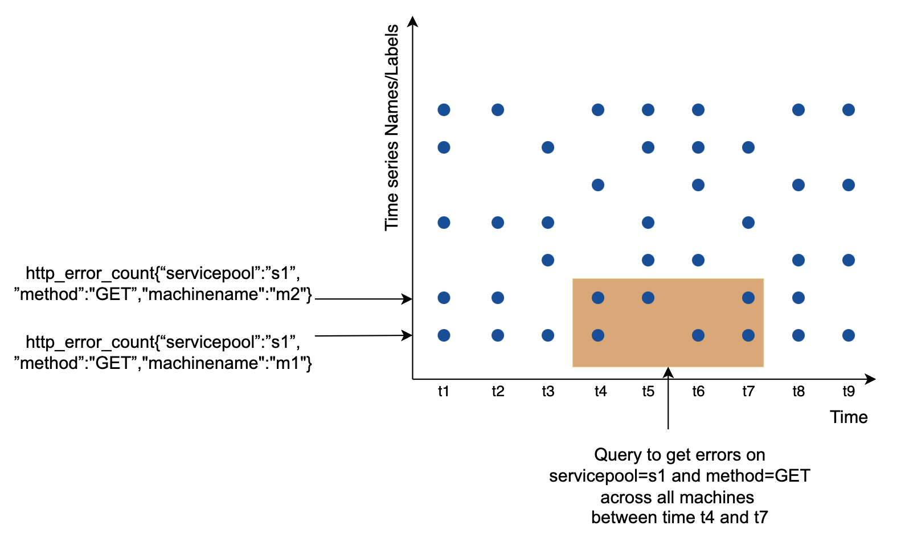
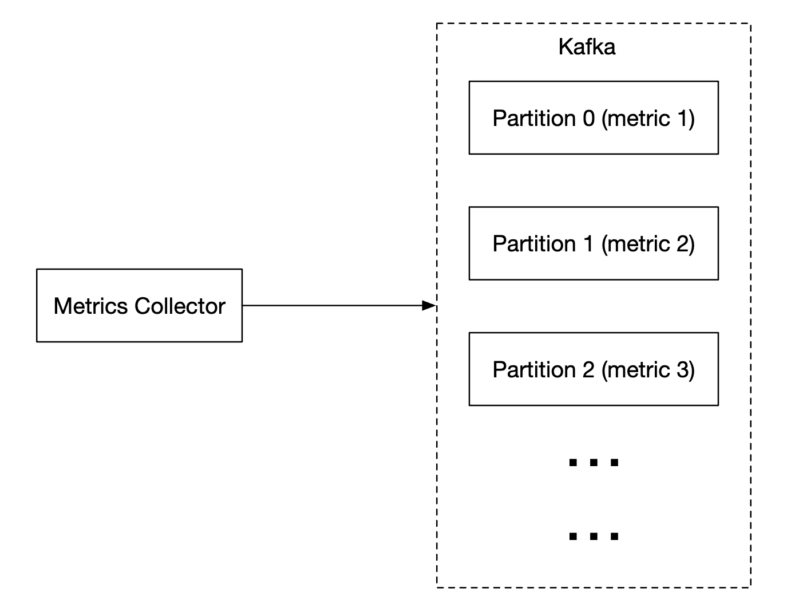

# 第20章：指标监控与告警系统

> 对应[英文原版](https://github.com/liquidslr/system-design-notes/blob/main/20.%20Metrics%20Monitoring%20and%20Alerting%20System/README.md)。按原结构翻译并保留原图、数据表与代码；批注用于解释与纠错，原版文件不变。

## 中文学习导读

监控像服务的体检记录：定期测量、沿时间保存、画趋势、异常时叫人处理。记住五步：**采集 → 传输 → 存储 → 告警 → 展示**。重点不是做一个漂亮图表，而是控制标签基数、知道数据缺失的含义，并确保关键告警送达。本题只谈指标，不包括日志和链路追踪。



## 引言

本章设计高可扩展的指标监控和告警系统，它帮助保障业务的高可用与可靠性。

## 第一步：理解问题并确定范围

“监控”可能指不同东西；如果面试官要基础设施指标，就不能设计成日志搜索系统。

范围问答：

- 为大公司内部使用，不是面向外部客户的 Datadog 类 SaaS。
- 收集 CPU 负载、内存、磁盘空间、每秒请求数等运维指标；不包括业务指标。
- 规模：1 亿 DAU，1000 个服务器池，每池 100 台。
- 保留一年；新数据原分辨率留 7 天，接着以 1 分钟分辨率保留 30 天，30 天以后降为 1 小时分辨率。
- 告警渠道：邮件、电话、PagerDuty、Webhook。
- 不采集错误/访问日志，不做分布式追踪。

### 总体要求与假设

- `1000 个池 × 100 台 × 每台约 100 指标 = 1000 万条指标序列`。
- 1 亿 DAU，一年保留。
- 保留层级：7 天原始数据、30 天 1 分钟数据、1 年 1 小时数据。
- 例子：CPU 负载、请求数、内存使用、消息队列消息数。

> **批注｜“1000 万指标”不是每秒 1000 万点。** 还需采样周期：若 10 秒一个点，约每秒 100 万点。原文 7 天/30 天的时间区间表述略有重叠，实施时应明确为年龄区间，例如 0–7 天原始、7–30 天分钟级、30 天–1 年小时级。

### 非功能需求

- **扩展性**：能增加指标和告警数量。
- **低延迟**：仪表盘与告警查询快。
- **可靠性**：避免漏掉关键告警。
- **灵活性**：方便接入新技术。

范围之外：日志监控（ELK 是常见方案）；分布式追踪（追踪一次请求跨服务的生命周期）。

## 第二步：高层设计

### 基础组成



1. **数据采集**：从不同来源取得指标。
2. **数据传输**：送入监控系统。
3. **数据存储**：组织和保存数据。
4. **告警**：分析数据、发现异常、生成告警。
5. **可视化**：以图表展示。

### 数据模型

指标一般是时间序列（time series）：一组带时间戳的值，使用名称及可选标签（tags/labels）标识序列。

例一：生产环境实例 `i631` 在 20:00 的 CPU 负载是多少？


序列由指标名与标签集合标识；具体一个数据点则再加时间戳和值。

例二：过去 10 分钟 `us-west` 地域所有 Web 服务器的平均 CPU 负载？原版示例数据：

```
CPU.load host=webserver01,region=us-west 1613707265 50

CPU.load host=webserver01,region=us-west 1613707265 62

CPU.load host=webserver02,region=us-west 1613707265 43

CPU.load host=webserver02,region=us-west 1613707265 53

...

CPU.load host=webserver01,region=us-west 1613707265 76

CPU.load host=webserver01,region=us-west 1613707265 83
```

原文建议平均最后一列。以上是它用于说明行式指标格式的数据，类似格式在监控系统中常见。

> **批注｜示例数据与平均方式。** 原例重复使用同一时间戳，因此不能真的表示 10 分钟变化；同一序列相同时间戳的重复点还可能覆盖/去重。只有等间隔且样本权重相同时才能直接平均；机器核数不同可能需要加权。Prometheus、InfluxDB、OpenTSDB 的格式也不相同，不能把此示意当作通用可提交协议。




图示横轴是时间，另一维列出指标名/标签确定的序列；真正的折线图纵轴通常是数值及单位。

访问模式是持续大量写、偶尔突发读——平时查得少，事故期间集中查询。存储是设计核心：

- 通用数据库经专家调优也可达到规模，但不一定是最省事的选择。
- NoSQL 理论可行，不过要自己解决时间序列的存储、索引与查询模型。
- 专用时序数据库提供针对标签和时间的聚合/查询接口。
- OpenTSDB 依赖 Hadoop/HBase，没有既有基础设施时引入成本高。
- 原文举 Twitter MetricsDB、Amazon Timestream，以及 InfluxDB、Prometheus 为例。它们的产品状态与能力随版本变化；这里保留原版选型背景。
- InfluxDB 与 Prometheus 都利用内存和磁盘管理大量时间序列。


原文引用 8 核、32 GB 内存的 InfluxDB 每秒超过 25 万次写入的例子，这是特定基准，不能直接当成当前部署容量保证。一般面试不要求讲时序数据库内部算法，除非简历明确写了相关经验；知道指标是时序数据、常见存储与取舍通常足够。

时序库可按标签高效聚合；原文以 InfluxDB 的标签索引为例。必须限制标签基数（cardinality）。

> **批注｜标签基数为什么会爆炸。** `method={GET,POST}` 很小；`request_id=每个请求唯一` 会让每个请求产生新序列。序列数大致由实际出现的标签组合决定，不是只数标签名称。把用户 ID、URL 原始参数放入标签前应先评估。

### 高层架构


- **指标来源**：应用服务器、SQL 数据库、消息队列等。
- **采集器**：收集指标并写时序库。
- **时序数据库**：保存与分析时序数据。
- **查询服务**：提供方便的读取接口；若数据库接口足够好，可省略。
- **告警系统**：向不同渠道发送通知。
- **可视化系统**：展示图表。

## 第三步：深入设计

### 指标采集（Metrics Collection）

本题允许偶尔丢失一个指标点，因此客户端可采用尽力发送（fire and forget）。


两类方式是拉（pull）和推（push）。

**拉模型**：


采集器必须知道最新服务与指标端点，可用 ZooKeeper/etcd 做服务发现，记录何时、从哪里采集。


- 采集器读取间隔、IP、超时、重试等配置。
- 通过约定 HTTP 端点，例如 `/metrics`，拉取由客户端库暴露的指标。
- 可以监听服务发现变化事件，也可周期轮询配置。

单采集器不够，需要多个实例，并协调所有权，避免相同指标被重复采集。可将采集器与目标服务器映射到一致性哈希环，每个目标只由一个采集器负责。


**推模型**：服务主动推送到采集器。


通常在服务旁部署 Agent，先采集本机指标，再推送给中央采集器。


Agent 可在发送前聚合，减少中央处理量。但采集器过载会拒绝请求，因此应放在负载均衡后，并自动扩容。

原文以 Prometheus 的拉模式、CloudWatch 和 Graphite 的推模式举例。两者比较：

| 维度 | 拉（Pull） | 推（Push） |
|---|---|---|
| 调试 | 可随时直接访问 `/metrics`，容易定位 | 未收到数据可能是网络或发送端问题 |
| 健康检查 | 拉取失败有直接信号，但还需区分网络与服务故障 | 没有上报无法直接区分服务停机与网络故障 |
| 短任务 | 任务可能在下次抓取前结束，可用 Push Gateway 衔接 | 结束前主动推送，较合适 |
| 防火墙/跨机房 | 采集器要能访问所有目标，网络配置可能复杂 | 服务向可达的负载均衡入口发送较方便 |
| 性能 | 原文举 TCP 拉取 | 原文举 UDP 推送可降低开销，但 TCP 建连开销相对负载可能不大 |
| 来源真实性 | 目标事先在配置中指定 | 任何客户端都可能推送，需要白名单或认证 |

> **批注｜协议不由推/拉决定。** 推也可用 HTTP/TCP，拉也需认证。预配置目标不等于数据一定真实；防止冒充仍要身份验证和传输保护。大组织通常同时支持两种方式，有些环境也无法安装 Agent。

### 扩展指标传输流水线


无论推拉，采集器都可自动扩容。但时序库宕机时会有丢数据风险，故加入队列。


采集器写 Kafka；消费者或 Storm、Flink、Spark 等流处理服务处理后再写时序库。

好处：Kafka 可靠且可扩展；采集与处理解耦；暂存数据以跨过下游故障。原文建议按指标名分区，便于聚合；更大规模时继续按标签分片，并按重要性分类优先处理。



代价是维护运维开销。原文提出也可考虑类似 [Gorilla](https://www.vldb.org/pvldb/vol8/p1816-teller.pdf) 的大规模指标摄入/存储架构。

> **批注｜这不是一比一替换。** Gorilla 论文讨论的是时序数据库设计，不等于 Kafka 的通用持久消息队列；采用它的思路时仍需说明故障缓冲与重放如何实现。按“每指标一分区”也只是示意，指标非常多时应映射到有限数量分区，避免元数据膨胀。

### 在哪里聚合？

- **采集 Agent**：适合简单聚合，例如累计 1 分钟计数再发送。
- **摄入流水线**：Flink 等在入库前聚合，减少写量；若不另存原始值，会损失细节。
- **查询端**：读取原始数据后聚合，保留灵活性，但查询处理量大、可能较慢。

> **批注｜平均数不能随意再平均。** 预聚合最好保留 `sum` 与 `count`；不同样本数的平均值不能直接平均。P95 等分位数也通常不能对各机器的 P95 再取平均获得整体 P95。

### 查询服务（Query Service）

独立查询层把仪表盘和告警与数据库解耦，未来更换数据库容易；可加缓存减压。


但很多可视化和告警工具已有成熟插件。如果数据库接口、缓存足够，不必另写服务。

原版用以下 SQL 表达其所称的“指数移动平均”例子：

```
select id,
       temp,
       avg(temp) over (partition by group_nr order by time_read) as rolling_avg
from (
  select id,
         temp,
         time_read,
         interval_group,
         id - row_number() over (partition by interval_group order by time_read) as group_nr
  from (
    select id,
    time_read,
    "epoch"::timestamp + "900 seconds"::interval * (extract(epoch from time_read)::int4 / 900) as interval_group,
    temp
    from readings
  ) t1
) t2
order by time_read;
```

并给出 Flux 例子：

```
from(db:"telegraf")
  |> range(start:-1h)
  |> filter(fn: (r) => r._measurement == "foo")
  |> exponentialMovingAverage(size:-10s)
```

> **批注｜原例不是可验证的等价查询。** SQL 使用普通 `avg(...) over (...)`，不含指数衰减权重，因此不能称为与 EMA 等价。Flux 示例参数也应按实际版本确认。本章借此说明专用时序语言可更简洁；不能据此说 SQL 天生无法高效查询时序数据，许多时序库支持 SQL。

### 存储层（Storage Layer）

认真选择数据库。原文引用 Facebook 研究：约 85% 运维查询针对过去 26 小时。针对近期热数据优化会显著影响性能；InfluxDB 是文中举例之一。

编码压缩可减少容量，优秀时序库通常内建这些能力。


不用每次保存完整时间戳，可保存差值；若间隔稳定，差值的差值往往更小。旧数据还可降采样（down-sampling），由规则决定精度：7 天原样、30 天分钟级、一年小时级。

原版 10 秒采样数据：

| 指标 | 时间戳 | 主机 | 值 |
|---|---|---|---|
| cpu | 2021-10-24T19:00:00Z | host-a | 10 |
| cpu | 2021-10-24T19:00:10Z | host-a | 16 |
| cpu | 2021-10-24T19:00:20Z | host-a | 20 |
| cpu | 2021-10-24T19:00:30Z | host-a | 30 |
| cpu | 2021-10-24T19:00:40Z | host-a | 20 |
| cpu | 2021-10-24T19:00:50Z | host-a | 30 |

原版给出的 30 秒降采样结果：

| 指标 | 时间戳 | 主机 | 平均值（原文） |
|---|---|---|---|
| cpu | 2021-10-24T19:00:00Z | host-a | 19 |
| cpu | 2021-10-24T19:00:30Z | host-a | 25 |

> **批注｜这里有算术错误。** 按通常半开窗口 `[00,30)` 与 `[30,60)`，应为 `(10+16+20)/3 ≈ 15.33` 和 `(30+20+30)/3 ≈ 26.67`，不是 19 与 25。原表保留供对照，学习时使用纠正后的数值。原始点一旦丢弃，短暂峰值无法从平均值恢复；必要时同时保存最大值。

很久不访问的数据可转冷存储，成本较低。

### 告警系统（Alerting System）


配置加载到缓存，规则通常用 YAML，例如：

```
- name: instance_down
  rules:

  # Alert for any instance that is unreachable for >5 minutes.
  - alert: instance_down
    expr: up == 0
    for: 5m
    labels:
      severity: page
```

规则表示实例不可达持续 5 分钟时告警。告警管理器从缓存取配置，并按预定周期调用查询服务；满足规则后生成告警事件。其他职责：

- 过滤、合并、去重，例如同一实例反复触发只产生一个事件。
- 权限控制，限制谁能修改告警。
- 重试，确保至少一次传递。

告警存储可使用 Cassandra 等 KV 型数据库，保存状态。触发后写 Kafka；通知消费者读取后发送邮件、短信、PagerDuty、Webhook。实际产品已有许多成熟方案，自建前应确认必要性。

> **批注｜存状态不会自动保证送达。** 还需要可恢复任务、重试、持久化确认和下游响应处理。至少一次通知可能重复，通知端要去重。指标缺失也应有明确规则，不能把“没有数据”默认为“健康”。

### 可视化系统（Visualization System）

按时间显示指标和告警，下面是 Grafana 仪表盘：


高质量可视化系统难以自建，通常优先用 Grafana 等现成工具。

## 第四步：回顾


> **批注｜面试回答模板。** “以指标名、标签和时间点建模；采集器通过推/拉获得数据，用队列跨越下游故障。时序库做压缩与分层保留，查询/告警共享接口；标签基数、数据缺失、通知重试和降采样语义是正确性的重点。”
