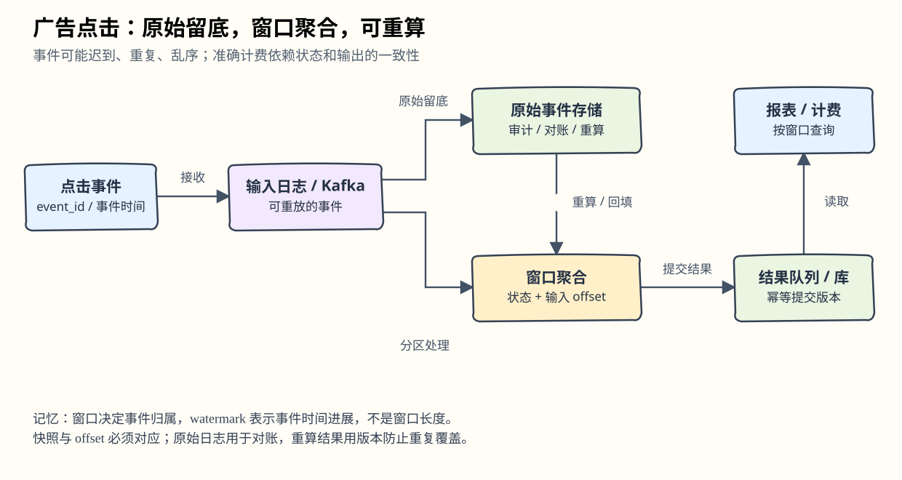
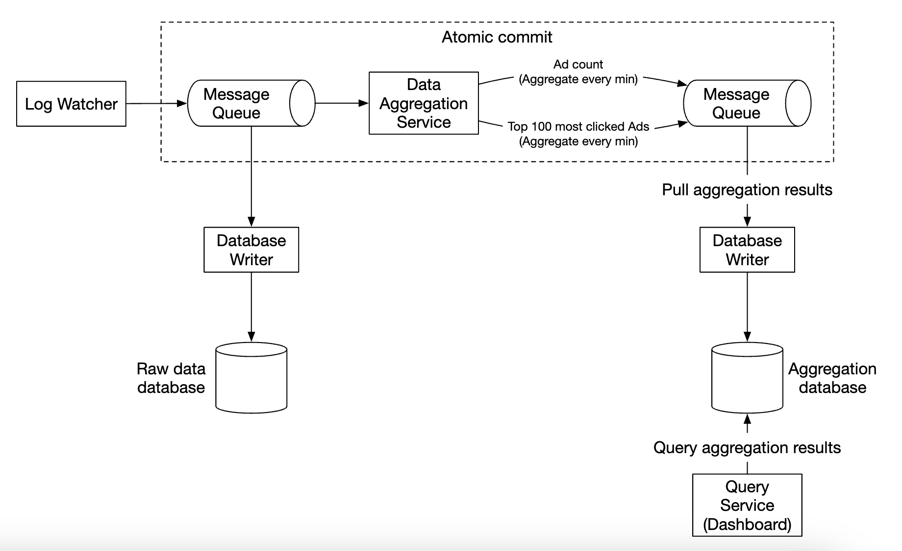
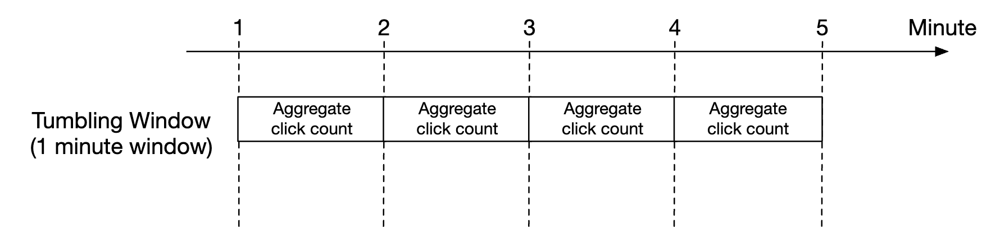
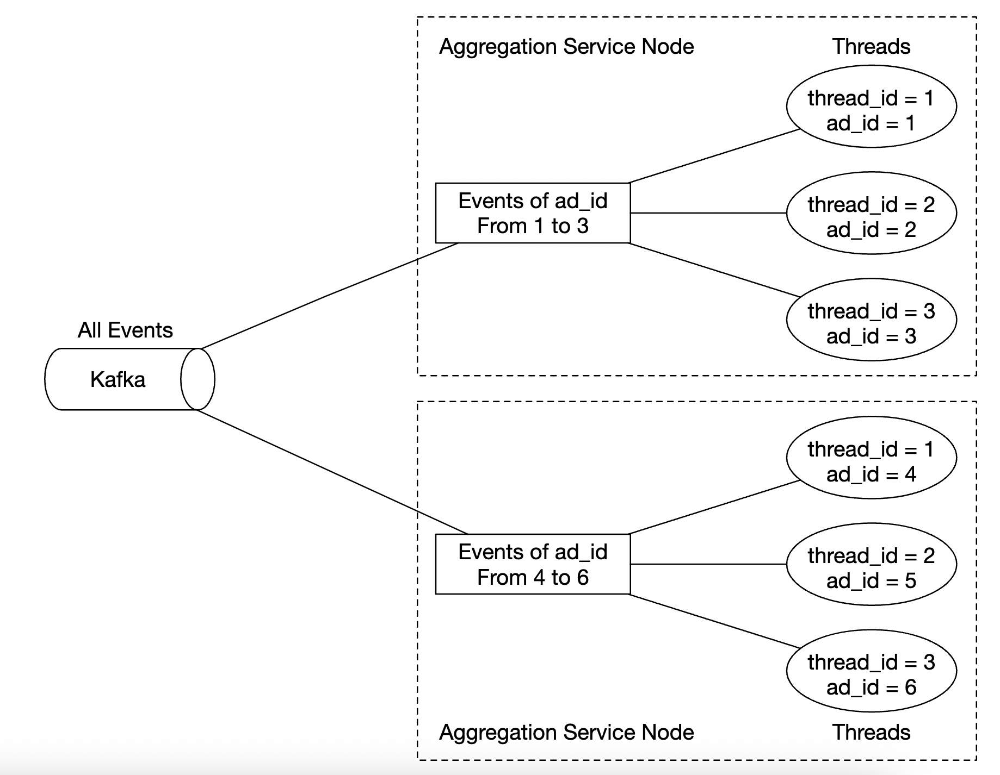

# 第21章：广告点击事件聚合

> 对应[英文原版](<../../21. Ad Click Event Aggregation/README.md>)。按原结构翻译，保留原图、API、数据模型和估算；批注解释概念或纠正简化，原版文件未修改。

## 中文学习导读

把系统想成“收集点击小票，再按广告和分钟结账”。难点不在 `COUNT(*)`，而在小票会迟到、重复、乱序，机器也会中途宕机。先记住：**原始事件留底，窗口决定归属，状态与进度一起恢复，结果可对账重算。** 这四句话比记住某个大数据产品名更重要。



## 引言

随着 Facebook、YouTube、TikTok 等平台发展，数字广告成为大产业。本章设计 Facebook/Google 量级的点击聚合系统。

广告库存的买卖涉及实时竞价（Real-Time Bidding，RTB）：


RTB 往往需在一秒内完成，速度很重要；点击统计影响广告主付费，准确性也重要。广告主可据此调整目标人群与关键词。

## 第一步：理解问题并确定范围

面试问答的假设：

- 每天 10 亿点击，总共 200 万广告，事件量每年增长 30%。
- 查询广告 X 最近 Y 分钟的点击数。
- 返回过去 1 分钟点击最多的 100 个广告；窗口与数量可配置，每分钟聚合一次。
- 支持按 `ip`、`user_id`、`country` 过滤。
- 考虑迟到事件、重复事件与局部故障恢复。
- 点击聚合允许几分钟端到端延迟；RTB 本身低于一秒。计费和报表可接受前者，不应混成同一路径的延迟要求。

### 功能需求

- 聚合 `ad_id` 最近 Y 分钟点击数。
- 每分钟返回 Top 100 `ad_id`。
- 支持不同属性过滤。
- 承受 Facebook/Google 量级数据。

### 非功能需求

- 聚合正确性重要，影响广告/计费。
- 正确处理迟到与重复。
- 抵抗部分系统故障。
- 端到端延迟最多几分钟。

### 粗略估算

- 10 亿 DAU，每人每天点击一次广告，即 10 亿点击/天。
- 原文平均 QPS 约 10,000，峰值为其 5 倍，即 50,000。
- 每事件 0.1 KB，每日约 100 GB，每月约 3 TB。

> **批注｜估算的精度。** `10亿 / 86400 ≈ 11574/秒`，原文取整为 1 万。存储数字不含副本、索引与额外字段，容量规划要另加。允许几分钟延迟，让系统有时间等迟到数据，但不能因此重复计费。

## 第二步：高层设计

### 查询 API 设计

API 是仪表盘用户（分析师、数据科学家、广告主）与服务端的契约。两个端点覆盖点击数、Top N 和过滤需求。

**查询广告最近 M 分钟点击数：**

```
GET /v1/ads/{:ad_id}/aggregated_count
```

参数：

- `from`：起始分钟，默认当前时间减 1 分钟。
- `to`：结束分钟，默认当前时间。
- `filter`：过滤策略标识，例如 `001` 代表“非美国点击”。

响应：`ad_id` 与该时间范围内聚合的 `count`。

**查询最近 M 分钟点击最多的 N 个广告：**

```
GET /v1/ads/popular_ads
```

参数：`count`（N）、`window`（分钟窗口 M）、`filter`（过滤策略）。响应是 `ad_id` 列表。

> **批注｜边界也属于 API。** 需约定时间范围是否为 `[from,to)`、使用哪个时区、结果是否仍会被迟到事件修正。原文路径 `{:ad_id}` 是占位符写法，不应作为实际 URL 字面量发送。

### 数据模型

系统包含原始数据与聚合数据。原始事件示例：

```
[AdClickEvent] ad001, 2021-01-01 00:00:01, user 1, 207.148.22.22, USA
```

结构化表示：

| ad_id | click_timestamp | user | ip | country |
|---|---|---|---|---|
| ad001 | 2021-01-01 00:00:01 | user1 | 207.148.22.22 | USA |
| ad001 | 2021-01-01 00:00:02 | user1 | 207.148.22.22 | USA |
| ad002 | 2021-01-01 00:00:02 | user2 | 209.153.56.11 | USA |

聚合表：

| ad_id | click_minute | filter_id | count |
|---|---|---|---|
| ad001 | 202101010000 | 0012 | 2 |
| ad001 | 202101010000 | 0023 | 3 |
| ad001 | 202101010001 | 0012 | 1 |
| ad001 | 202101010001 | 0023 | 6 |

`filter_id` 对应过滤条件：

| filter_id | region | IP | user_id |
|---|---|---|---|
| 0012 | US | * | * |
| 0013 | * | 123.1.2.3 | * |

> **批注｜这是模型示例，不是完整关联数据。** 原文聚合表有 `0023`，过滤表只展示 `0012/0013`，没有给出 `0023` 的定义；不能用这几行核对所有计数。`*` 表示该维度不过滤。

为了快速返回 Top N，再维护：

| most_clicked_ads 字段 | 类型 | 含义 |
|---|---|---|
| window_size | integer | 聚合窗口 M，单位分钟 |
| update_time_minute | timestamp | 最后更新，分钟粒度 |
| most_clicked_ads | array | JSON 格式的广告 ID 列表 |

两类数据的权衡：

- 原始数据完整，支持重新过滤和重算，但存储大、查询慢。
- 聚合数据小、查询快，但已丢掉部分细节。

本设计两者都留：原始数据用于调试和修复聚合错误，聚合数据服务快速查询；原始数据可转冷存储节省成本。

选数据库时要考虑数据形态（关系/文档/blob）、读写比例、事务需求，以及 SUM/COUNT 等 OLAP 查询。

- 原始数据平均 1 万、峰值 5 万 QPS，写多读少，通常仅故障时回看。关系库也能实现，但扩写有挑战；原文选择 Cassandra，也提到 InfluxDB。
- 另一方案是 S3 搭配 ORC、Parquet 或 Avro 文件；原文因面试熟悉度选择 Cassandra。
- 聚合数据每分钟持续写，并被仪表盘/告警频繁读，所以读写都多，原文同样用 Cassandra。

> **批注｜文件格式纠正。** ORC、Parquet 是列式格式，Avro 通常是行式序列化/容器格式；不能把三者统称为列式。Cassandra 也不会自动适配任意 OLAP，表与分区键仍要围绕查询设计。

### 高层设计


输入输出都是无界事件流。同步写下游会使消费者故障阻塞整条链路，因此使用 Kafka 异步解耦。


第一队列存点击事件：

| ad_id | click_timestamp | user_id | ip | country |
|---|---|---|---|---|

第二队列保存每分钟点击聚合：

| ad_id | click_minute | count |
|---|---|---|

以及每分钟 Top N：

| update_time_minute | most_clicked_ads |
|---|---|

第二级队列用于支持端到端原子提交设计：



> **批注｜多放一个队列不会自动得到 exactly-once。** 必须让输入进度和输出结果处在同一个事务/可恢复检查点中，最终写库还需幂等或事务，后文会展开。

聚合服务可采用 MapReduce 思路：


每个节点做单一任务并把结果发给下游：

- **Map**：读取、过滤、转换；例如按 `ad_id` 分发到聚合节点。


也可预先将同广告分到同 Kafka 分区，让聚合节点组成消费组直接读。但单独 Map 节点便于清洗转换，也适用于无法控制上游分区、同一广告散落多分区的情况。

- **Aggregate**：在内存中每分钟按 `ad_id` 计数。
- **Reduce**：收集合并聚合节点结果，输出最终值。


这个有向无环图（DAG）采用 MapReduce 范式，借助分布式并行把大量事件压缩成较小结果。中间数据保存在内存，节点用 TCP 或共享内存通信。

**用例一：聚合点击数。**


示例按 `ad_id % 3` 分配广告。

**用例二：返回 Top N。**


图中为 Top 3，可扩展到 N。节点用堆（heap）快速维护 Top N。

> **批注｜合并局部 Top N 的前提。** 同一广告的计数必须先完整合并到一个负责节点，再选局部 Top N，最后合并候选。若同一广告散在多个节点而未汇总，直接合并各节点榜单可能漏掉全局赢家。跨分钟滑动窗口也不能只保存每分钟 Top N 就假设能精确恢复任意窗口榜单。

**用例三：数据过滤。** 预定义条件并预聚合：

| ad_id | click_minute | country | count |
|---|---|---|---|
| ad001 | 202101010001 | USA | 100 |
| ad001 | 202101010001 | GPB | 200 |
| ad001 | 202101010001 | others | 3000 |
| ad002 | 202101010001 | USA | 10 |
| ad002 | 202101010001 | GPB | 25 |
| ad002 | 202101010001 | others | 12 |

过滤字段称为维度（dimensions）。原文把此方法称作星型模型（star schema）：易理解、可复用聚合服务增加维度、预计算使过滤快；缺点是条件越多，桶和记录数越多。

> **批注｜术语与示例。** 上表 `GPB` 保留原文，像是国家代码笔误，实际实现应统一代码表。严格的星型模型通常由事实表和维度表组成；上表直接展示的是按维度预聚合结果。维度组合会放大存储，不能为任意条件都预计算。

## 第三步：深入设计

### 流式与批处理（Streaming vs. Batching）

高层架构属于流处理。三类系统比较：

| 维度 | 在线服务 | 批处理（离线） | 流处理（近实时） |
|---|---|---|---|
| 响应性 | 快速回复客户端 | 不需即时回复客户端 | 不需逐事件回复客户端 |
| 输入 | 用户请求 | 有限、有边界的大数据集 | 无界、持续到来的流 |
| 输出 | 客户端响应 | 物化视图、聚合指标等 | 物化视图、聚合指标等 |
| 性能指标 | 可用性、延迟 | 吞吐 | 吞吐、延迟 |
| 示例 | 在线购物 | MapReduce | Flink |

本设计实时接收并聚合，历史备份/读取使用批任务。若同时维护批与流两条独立处理路径，称为 **Lambda 架构**，代价是两套代码。


**Kappa 架构**用一套流处理引擎，历史数据通过重放走同一逻辑。


本章高层设计按 Kappa 思路处理重算，因为历史事件也经过相同聚合逻辑：

1. 重算服务批量读取原始存储，例如修复严重聚合 Bug 后回填。
2. 发往独立聚合实例，避免影响实时处理。
3. 结果进入第二队列，再更新聚合数据库。


> **批注｜同一代码不等于抢同一资源。** 逻辑复用，重放和实时运行仍可资源隔离。重算写结果应带批次/版本，防止“旧版本重算”覆盖更完整的新结果。

### 时间（Time）

时间戳可能来自：

- **事件时间（Event Time）**：点击发生时。
- **处理时间（Processing Time）**：服务器处理时。

队列与网络延迟会使两者差异很大。按处理时间容易把迟到事件算错窗口；按事件时间则要处理迟到。

| 时间类型 | 优点 | 缺点 |
|---|---|---|
| Event Time | 聚合更符合真实发生时间 | 客户端时钟可能错，也可能被恶意伪造 |
| Processing Time | 服务器时钟通常更可控 | 迟到时不代表事件真实发生时间 |

本题重视准确性，选事件时间。为处理迟到，引入水位线（watermark）。下面事件 2 未赶上原先的窗口输出：


原文通过延长等待时间降低漏算概率，并把延长部分称作 watermark：


等待短，延迟低但迟到漏算概率高；等待长，迟到少但输出更慢。无论等多久都可能有极晚事件，可通过每日对账修正。

> **批注｜watermark 的准确定义。** 它是流中事件时间进展的估计，不是“窗口被延长的那段长度”。窗口仍固定，例如 `[12:00,12:01)`；水位线越过窗口终点才触发相应计算。可配置乱序容忍和允许迟到（allowed lateness），超期事件进侧输出或重算。有限等待无法保证所有事件到齐，所以计费还需要更正机制。

### 聚合窗口（Aggregation Window）

四类窗口：滚动/固定窗口（Tumbling）、跳跃窗口（Hopping）、滑动窗口（Sliding）、会话窗口（Session）。

本章按分钟点击计数用不重叠滚动窗口：



最近 M 分钟 Top N 用滑动窗口：


> **批注｜一眼区分。** 滚动窗口像每分钟一个独立账本；滑动/跳跃窗口是每隔一段时间看“最近 M 分钟”，窗口可以重叠；会话窗口按一段无活动间隔断开。不同框架对 hopping/sliding 命名有差异，面试时直接说明窗口长度与滑动步长更清楚。

### 投递保证（Delivery Guarantees）

计费用途要求不重复计数、也不漏事件。通常少量重复可接受时，至少一次足够；本题哪怕很小百分比差异也可能对应大量金额，因此目标是 exactly-once 的结果语义。

> **批注｜结果恰好一次与网络只发送一次不同。** 网络重试难以避免，设计应允许重复运输，再通过事务、状态恢复和幂等结果写入保证每个业务事件只贡献一次计数。

### 数据去重（Data Deduplication）

重复来源：

- 客户端重发；恶意点击应由风险引擎处理，不能只靠传输去重。
- 聚合节点中途宕机，上游没收到确认而重发。

最后一步确认失败时，offset 100 的结果可能反复发送：


如果先把已见 offset 保存到 HDFS/S3，再发送下游，可能在发送前宕机，导致结果永久漏发：


因此可让“保存 offset”与“向下游提交结果”原子完成，需要事务性机制：


原作者另注：若下游幂等处理聚合结果，可以不使用分布式事务。

> **批注｜CRUD 工程师最熟悉的实现。** 以 `(ad_id, window, filter, result_version)` 作为唯一键写绝对结果，重复同一提交不会再 `+count`；但还要防止旧版本覆盖新版本。输入源重复点击也需要稳定 `event_id` 的精确去重。Bloom Filter 有假阳性，不能单独用于计费去重，否则会误删真实点击。

### 扩展系统（Scale the System）

队列、聚合服务、数据库彼此解耦，可以独立扩容。

**消息队列：**

- 生产者可增加实例。
- 消费者按组扩容，但必须预留足够分区。
- 数千消费者重平衡可能慢，宜低峰进行。
- 可按地域分主题，例如 `topic_na`、`topic_eu`。


**聚合服务：**


- Map/Reduce 节点可增多。
- 可通过多线程增加吞吐。
- 也可由 Apache YARN 等资源管理器调度多进程。
- 多线程简单，多进程更便于跨机器扩展，原文认为实践中后者常见。



**数据库：** Cassandra 原生通过一致性哈希支持水平扩容。新节点加入后数据按虚拟节点分布重新平衡，无需手动设计每次重新分片。


> **批注｜自动分配仍有运维工作。** 增加节点会搬数据并占网络/磁盘，要检查容量、复制、修复和重平衡流量；“支持水平扩展”不等于无限即时扩容。

**热点问题：** 某条广告异常热门，会让负责它的单节点过载。


原例中节点向资源管理器申请资源，把 300 条事件拆为三组，每组 100 条给不同节点处理，再把部分结果合回原节点。更高级方法包括全局/局部聚合（Global-Local Aggregation）和拆分去重聚合（Split Distinct Aggregation）。

> **批注｜拆热点要能再合并。** `count` 与 `sum` 易合并；去重人数等非简单可加指标更复杂。拆分后保留来源分片与窗口标识，避免合并重试时重复加总。

### 容错（Fault Tolerance）

聚合状态在内存里，宕机会丢失。Kafka offset 可定位恢复进度，但 Top N 最近 M 分钟还需要窗口中间状态。

可按分钟为正在进行的聚合建立快照：


故障接管节点读取最新已提交 offset 和对应快照，再继续处理：


> **批注｜快照与 offset 必须匹配。** 如果快照覆盖到 100，offset 却从 120 开始，会漏 101–119；从 80 开始又可能重复。检查点需一起描述状态、输入位置和已提交输出，不能各存一个“最新值”就拼起来。

### 数据监控与正确性

因为涉及计费，要持续监控：

- **延迟**：各阶段时间戳，用于端到端延迟分析。
- **队列积压**：Kafka 是持久提交日志，应看 `records-lag` 等消费落后量，而非单看日志总大小。积压突增后诊断并按需增加聚合资源。
- **聚合节点资源**：CPU、磁盘、JVM 等。

每日跑批量对账：从原始数据重新计算，与聚合数据库结果比较。


> **批注｜对账也要共享业务规则。** 两边必须使用同一时区、过滤口径、迟到范围、去重和版本。对账发现差异后需要有审核/修正记录，不能只发告警而不纠正计费结果。

### 替代设计

通用系统设计面试不要求掌握专业大数据工具内部。讲清思路和权衡比报产品名更重要，因此原版先讲通用方案。

也可用现成工具：点击数据存 Hive，上层结合 Elasticsearch 提升部分检索速度；OLAP 聚合可使用 ClickHouse、Druid 等。


> **批注｜这些是候选组件，不是必装清单。** 按查询、写入、事务结果语义和团队经验选择一条明确链路，避免同时引入多个承担相同职责的存储。

## 第四步：回顾

本章覆盖数据模型和 API、MapReduce 聚合、队列/计算/数据库扩展、热点拆分、持续监控、对账与容错。这是典型大数据处理系统；熟悉 Kafka、Spark、Flink 会更容易理解，但核心仍是数据与状态语义。

> **批注｜面试回答模板。** “点击先入可重放日志，按事件时间与窗口聚合；处理状态、offset 和输出一致提交，下游按版本幂等写。热门广告拆局部计数再合并；保留原始数据，每日对账并可重算修正。”
