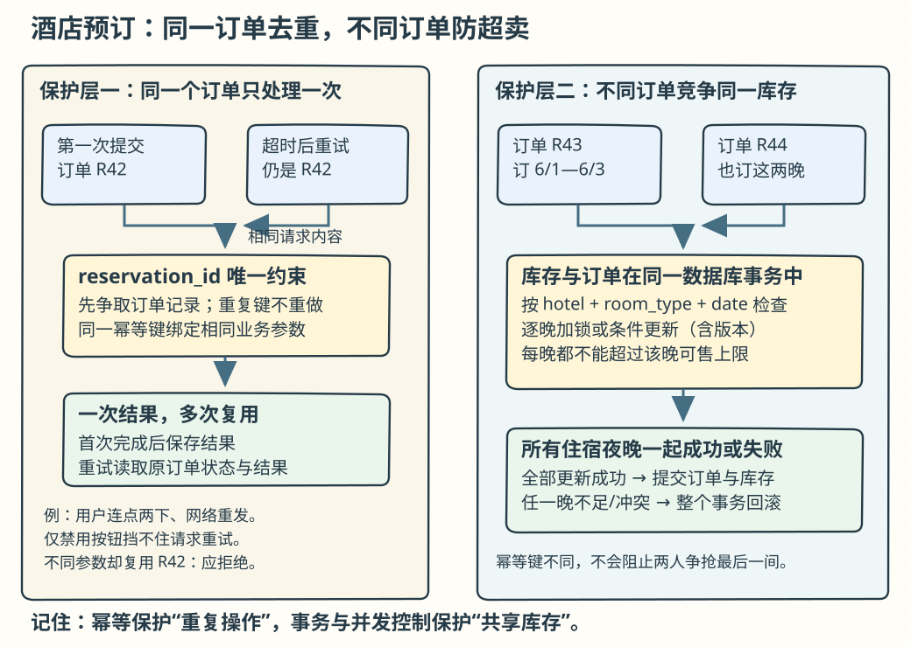
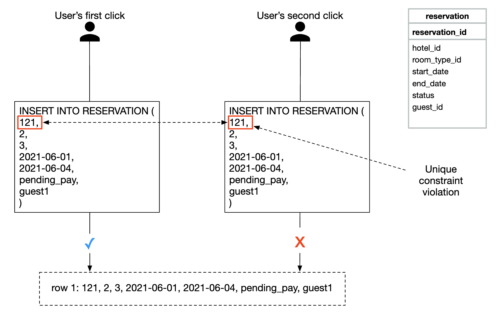
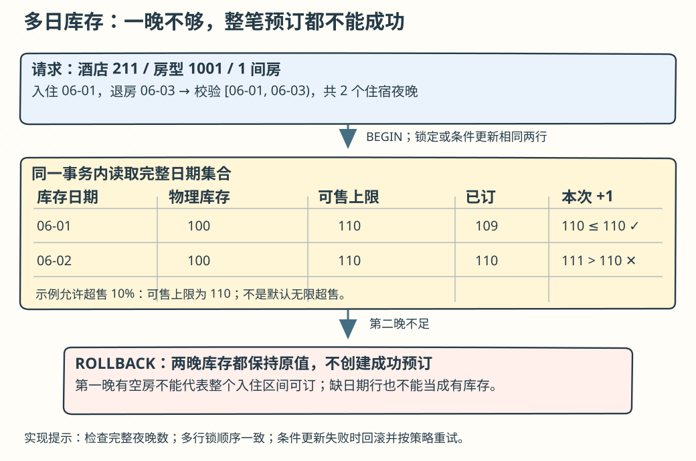
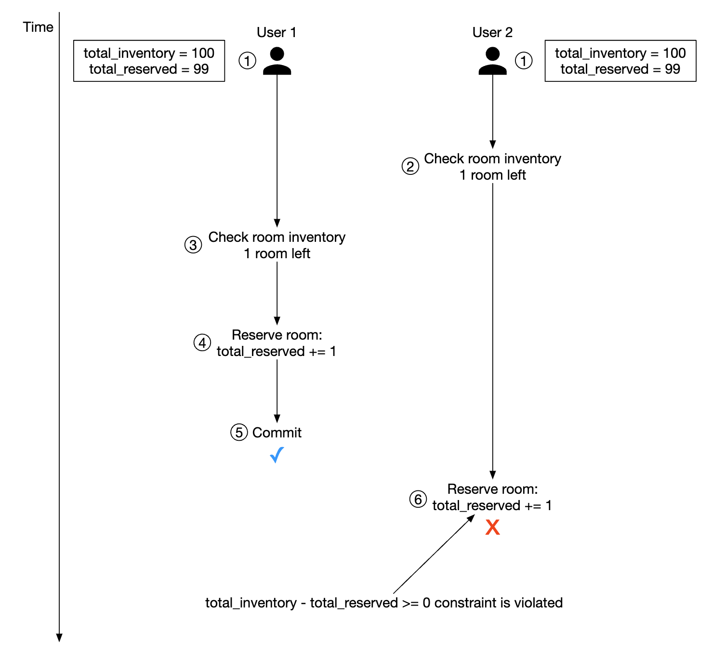

# 第 22 章：酒店预订系统（Hotel Reservation System）

> 原版：[第 22 章英文笔记](../../22.%20Hotel%20Reservation%20System/README.md)。以下按原文顺序翻译；「批注」是新增解释或校正，原文件未改动。

## 学习导读

你可能写过 `SELECT 库存 → INSERT 订单 → UPDATE 库存`。这一章追问：**两个人同时读到最后一间房怎么办？连续住三晚，要扣几行库存？请求超时后再点一次，会生成两张订单吗？**

先记住两个不同问题：同一个订单重试，用幂等键；不同订单争抢库存，用事务与并发控制。再记住库存单位是「酒店 × 房型 × 入住日期」，不是一间实体客房。



也可打开[可缩放的事务边界图](../学习图解/酒店预订事务.html)。

## 简介（Introduction）

本章设计类似万豪国际的酒店预订系统。思路也适用于 Airbnb、机票预订和电影票购票，但各自库存粒度、付款和取消规则不同。

## 第 1 步：理解问题并确定范围

以下 C 表示候选人，I 表示面试官。

- C：系统规模多大？I：连锁酒店网站，5,000 家酒店、100 万间客房。
- C：预订时付款还是到店付款？I：预订时全额付款。
- C：只支持网站，还是还要电话预订？I：只考虑网站或 App。
- C：可以取消预订吗？I：可以。
- C：还有什么要考虑？I：允许 10% 超售，即卖出比实际客房更多的预订，因为预计部分客人会取消。
- C：时间有限，聚焦酒店展示页、房间详情页、订房、管理后台和超售？I：可以。
- I：酒店价格经常变化，假设房价每天都可能不同。C：明白。

### 非功能需求（Non-functional requirements）

- 支持高并发：旺季可能有很多人同时预订同一家酒店。
- 延迟适中：低延迟最好，但预订处理花几秒可以接受。

### 粗略估算（Back-of-the-envelope estimation）

- 总共 5,000 家酒店、100 万间客房。
- 假设入住率 70%，平均每次住 3 天。
- 每日预订数：`1,000,000 × 0.7 / 3 ≈ 240,000`。
- 原文以一天约 `10^5` 秒估算：`240,000 / 10^5 ≈ 3 TPS`，平均预订写流量很低。

再估算页面 QPS。假设走到完成预订要经过三步，每一步转化率为 10%，每秒 3 次预订对应每秒 30 次预订页浏览、300 次客房详情页浏览。


> **批注：平均低，不代表没有抢房。** 精确的一天是 86,400 秒，上面是数量级估算。全站平均 TPS 很低，某热门酒店某日期仍可能成为热点。10% 超售是题目给定的经营策略，不是数据库并发错误；上线必须有可配置上限和超售后的履约方案。

## 第 2 步：提出高层设计并取得共识

依次讨论 API、数据模型和整体架构。

### API 设计（API Design）

这里采用 REST 风格，只列核心端点。完整系统还需要支持多条件客房搜索；原文认为这些不是本题重点，所以暂不展开。

|范围|端点|用途|
|---|---|---|
|酒店|`GET /v1/hotels/{id}`|酒店详情|
|酒店|`POST /v1/hotels`|新增酒店，仅运营|
|酒店|`PUT /v1/hotels/{id}`|更新酒店，仅运营|
|酒店|`DELETE /v1/hotels/{id}`|删除酒店，仅运营|
|客房|`GET /v1/hotels/{id}/rooms/{id}`|客房详情|
|客房|`POST /v1/hotels/{id}/rooms`|新增客房，仅运营|
|客房|`PUT /v1/hotels/{id}/rooms/{id}`|更新客房，仅运营|
|客房|`DELETE /v1/hotels/{id}/rooms/{id}`|删除客房，仅运营|
|预订|`GET /v1/reservations`|当前用户预订历史|
|预订|`GET /v1/reservations/{id}`|某次预订详情|
|预订|`POST /v1/reservations`|发起预订|
|预订|`DELETE /v1/reservations/{id}`|取消预订|

预订请求示例：

```json
{
  "startDate":"2021-04-28",
  "endDate":"2021-04-30",
  "hotelID":"245",
  "roomID":"U12354673389",
  "reservationID":"13422445"
}
```

`reservationID` 是防止重复下单的幂等键，后文解释并发问题。

> **批注：接口名是示意。** 同一路径中两个 `{id}` 实际应区分 `hotelId` 与 `roomId`；取消通常是状态变更，不应物理删除审计记录。示例保持原样以便对照。

### 数据模型（Data model）

选数据库前先看访问模式：查看酒店详情；按日期范围找可订房型；记录预订；查询预订和历史。估算表明整体规模不大，但要准备承接流量突增。

原文选择关系数据库，理由是读多写少、预订只是访问用户中的小部分、ACID 事务帮助避免余额为负和重复扣款，且数据结构清晰、适合关系建模。原文还把 NoSQL 概括为通常偏向写优化。

> **批注：按能力选库。** 「关系型适合读、NoSQL 适合写」只是原文的粗略概括，不能当通则。这里更直接的依据是库存与预订需要原子提交、唯一约束和可检查的不变量。ACID 也不会自动解决跨支付机构的一致性或错误业务逻辑。


大多数字段含义直观。`status` 用状态机表达预订的生命周期；原文称为客房状态，需要结合预订记录理解。


初版按具体客房预订，较适合 Airbnb。酒店客人通常订的是房型，具体房号在后续分配。因此还要改进模型。原笔记提到在预订时选择房号，实际分配时机取决于酒店业务，不影响下面按房型管理库存的设计。

### 高层设计（High-level Design）

本题采用微服务架构。


- **用户**：在手机或电脑上订房。
- **管理员**：执行退款、取消付款等管理功能。
- **CDN**：缓存 JS 包、图片、视频等静态资源。
- **公共 API 网关**：托管式入口，承担鉴权、限流等功能。
- **内部 API**：仅授权人员可见，通常由 VPN 保护。
- **酒店服务**：提供酒店与客房信息。这些数据相对静态，可以积极缓存。
- **价格服务（Rate service）**：提供未来各日期房价；价格可能随当日入住率变化。
- **预订服务**：接收预订请求，并在预订/取消时跟踪库存。
- **支付服务**：处理付款，成功后更新预订状态。
- **酒店管理服务**：授权人员管理和查询酒店、预订等信息。

服务之间可以使用 gRPC 等 RPC 框架通信。

> **批注：不必为了面试把每个名词拆成服务。** 先把库存和订单放进同一事务边界；确有独立扩容、权限或团队边界时再拆。价格确认、库存占用、付款、取消之间必须有明确状态和补偿规则。

## 第 3 步：深入设计

本节讨论改进数据模型、并发、扩展以及微服务间的数据一致性。

### 改进数据模型（Improved data model）

把预订 API 中的 `roomID` 改为 `roomTypeID`，支持一次订多间：

```text
POST /v1/reservations
{
  "startDate":"2021-04-28",
  "endDate":"2021-04-30",
  "hotelID":"245",
  "roomTypeID":"12354673389",
  "roomCount":"3",
  "reservationID":"13422445"
}
```


- `room`：客房信息。
- `room_type_rate`：某房型的价格信息。
- `reservation`：客人预订记录。
- `room_type_inventory`：房型库存。

库存表字段：`hotel_id` 酒店；`room_type_id` 房型；`date` 单个日期；`total_inventory` 总客房数扣除临时不可售客房；`total_reserved` 该酒店、房型、日期已订数量。

每个 `(hotel_id, room_type_id, date)` 存一行，使查询和管理简单。原文的「one room」在这里应理解为一条库存记录。每天用定时任务预先生成未来日期的行。

|hotel_id|room_type_id|date|total_inventory|total_reserved|
|---|---|---|---|---|
|211|1001|2021-06-01|100|80|
|211|1001|2021-06-02|100|82|
|211|1001|2021-06-03|100|86|
|211|1001|…|…|…|
|211|1001|2023-05-31|100|0|
|211|1002|2021-06-01|200|16|
|2210|101|2021-06-01|30|23|
|2210|101|2021-06-02|30|25|

查询库存的原文示例：

```sql
SELECT date, total_inventory, total_reserved
FROM room_type_inventory
WHERE room_type_id = ${roomTypeId} AND hotel_id = ${hotelId}
AND date between ${startDate} and ${endDate}
```

允许 10% 超售时，每天都必须满足：

```text
(total_reserved + ${numberOfRoomsToReserve}) <= 110% * total_inventory
```

规模估算：5,000 家酒店，每家 20 种房型，预生成两年，`5000 × 20 × 2 × 365 = 7300 万行`。原文认为单台数据库可容纳，并建议配置读副本，必要时跨可用区，提高可用性。

若单库容纳不了预订数据，可把历史移至冷存储，只保留当前与未来数据；也可按 `hash(hotel_id) % servers_cnt` 分片，因为查询都会指定酒店。

> **批注：入住日期用半开区间。** 4 月 28 日入住、4 月 30 日退房，实际消耗 28、29 两晚。原 SQL 的 `BETWEEN` 包含结束日期，应在真实实现中使用 `date >= startDate AND date < endDate`。还必须验证返回行数等于入住晚数，不能漏一天却照样成功。7300 万行能否放单库，要结合行宽、索引和查询实测。

### 并发问题（Concurrency issues）

重复预订有两种来源：同一用户点两次；多个用户同时抢同一份库存。


第一种可以前端禁用按钮改善体验，但不能依赖前端保证正确：脚本被关闭、请求重试或直接调 API 都可能绕过。可靠办法是幂等 API。


1. 填写详情、准备预订时生成全局唯一的预订订单号。
2. 提交时使用这个 `reservation_id`。
3. 再次点击提交仍发送相同 ID，后端识别重复请求。
4. 给 `reservation_id` 加唯一约束，防止数据库出现两条同号订单。



> **批注：唯一约束还要和库存更新一起提交。** 「先扣库存，再插入唯一订单，插入失败却未回滚」仍会错扣。重复请求应返回已有结果；同一个幂等键携带不同日期/房型时应拒绝。

第二种问题如下：


假设隔离级别不是可串行化。两个事务都看到 100 间中已订 99 间；事务 2 先更新并提交，事务 1 仍依据旧检查继续预订，两者都成功，若禁止超售就越过 100 间上限。原图暂不考虑本题允许的 10% 超售；套入本题应以“上限 110、已订 109，两人各订一间得到 111”说明越界。需要悲观锁、乐观锁或数据库约束。

原文预订逻辑如下（这是伪代码，保留以便对照）：

```sql
# step 1: check room inventory
SELECT date, total_inventory, total_reserved
FROM room_type_inventory
WHERE room_type_id = ${roomTypeId} AND hotel_id = ${hotelId}
AND date between ${startDate} and ${endDate}

# For every entry returned from step 1
if((total_reserved + ${numberOfRoomsToReserve}) > 110% * total_inventory) {
  Rollback
}

# step 2: reserve rooms
UPDATE room_type_inventory
SET total_reserved = total_reserved + ${numberOfRoomsToReserve}
WHERE room_type_id = ${roomTypeId}
AND date between ${startDate} and ${endDate}

Commit
```

> **批注：原示例不可直接上线。** 更新缺少 `hotel_id` 条件，日期又包含退房日。多日检查、更新和插入预订必须在同一事务内。仅「先查后改」没有并发保护；参数也必须绑定，不能把 `${…}` 当字符串拼接进 SQL。以下三种方案讨论如何补上保护。



#### 方案 1：悲观锁（Pessimistic locking）

更新期间锁住记录，防止其他事务同时改。MySQL 可用 `SELECT … FOR UPDATE`，锁保留到提交或回滚。


优点：阻止并发修改；实现相对直接，把冲突更新串行化，适合争用较高的情况。缺点：锁多个资源可能死锁；长事务阻塞后来者，查询范围越大、持锁越久，影响越严重。原文因此不推荐作为本题首选。

> **批注：悲观锁并非一律不可扩展。** 同一库存热点本就需要某种串行化。短事务、合适索引、固定加锁顺序和死锁重试很重要；不要拿着库存行锁等待几秒钟的第三方付款。

#### 方案 2：乐观锁（Optimistic locking）

允许多个请求先读取，再在提交更新时发现冲突。常用版本号或时间戳；原文推荐版本号，避免机器时钟不准。


表中增加 `version`；读记录时一并读取；成功更新时版本加一。原文用「新版本必须超过旧版本」概括验证。

> **批注：必须比较“我读到的版本”。** 正确语义是 `UPDATE … SET version=version+1 … WHERE version=:oldVersion` 并检查受影响行数。仅检查新版本更大不能阻止两次基于旧库存的更新。多日订单要在同一事务里完成，任意一天冲突就整体回滚。

优点：防止覆盖旧数据，应用不需要先持有悲观读锁，冲突少时适合。缺点：高争用会大量回滚和重试。原文因本题预订 QPS 不高而选择此方案。

> **批注：乐观锁也会用数据库内部写锁。** “不加锁”指不提前用长时间悲观读锁保留记录，不代表数据库更新完全没有锁。

#### 方案 3：数据库约束（Database constraints）

把不变量交给数据库检查，原文例子：

```sql
CONSTRAINT `check_room_count` CHECK((`total_inventory - total_reserved` >= 0))
```



优点：简单，低争用下效果好。缺点：高争用仍可能大量失败；各数据库的约束支持不同。原文还提到约束不如应用代码易做版本控制，并认为它适合本题。

> **批注：这里有两处需要区分。** 上述约束禁止任何超售，与题目允许 10% 超售不同；应保存整数 `sellable_limit` 或准确计算上限，并约束 `total_reserved <= sellable_limit`。约束完全可以放进数据库迁移脚本进行版本控制。它还应搭配非负库存/数量校验，而不是代替事务。

### 可扩展性（Scalability）

通常酒店预订流量不高。若扩展成 booking.com 一类大型旅行网站，QPS 可能增加 1,000 倍。先识别瓶颈：无状态服务可以加实例，数据库有状态，需要分片等方案。

由于查询都带 `hotel_id`，可以据此分片。原文举例，30,000 QPS 分成 16 片，每片约 1,875 QPS，认为在单个 MySQL 集群能力范围内。


也可用 Redis 缓存库存和预订，给过期日期设置 TTL：


```text
key: hotelID_roomTypeID_{date}
value: 对应酒店、房型、日期的剩余可售数量
```

数据库变化通过 CDC 异步同步到缓存，例如使用 Debezium 读取变更，再由下游应用到 Redis。短时间内缓存和数据库可能不一致，但最终下单时数据库会阻止无效预订。用户可能看到有房，提交却发现售罄；即使没有缓存，犹豫期间库存被别人订走也会出现类似情况。

缓存优点是减少数据库压力、内存读取快；缺点是维护一致性困难，要考虑陈旧信息对用户体验的影响。

> **批注：展示库存不能作为成交依据。** 最终预订必须检查权威库存。分片按酒店分布平均只是估算，热门酒店仍可能集中一片；每片能承受多少 QPS 需由真实 SQL、索引、硬件和延迟目标验证。CDC 管道也要处理重复、顺序和积压。

### 服务间数据一致性（Data consistency among services）

单体系统可用共享关系数据库保证事务一致性。本章采用务实的混合方式：部分服务独立，但预订与库存归同一服务，利用同库 ACID 保证原子性。

面试官可能要求每个微服务拥有专属数据库：


单体里能把多个操作放进一个数据库事务：


拆库后，同样的操作跨多个服务，原子性更难保证：


常见方案：

- **两阶段提交（2PC）**：跨多个节点协调原子提交；协调、等待和锁持有会增加成本，节点迟缓或协调故障可能阻塞。
- **Saga**：串联本地事务，某步失败时执行补偿事务；通常是最终一致的流程。

原文提醒，跨微服务一致性增加复杂度，应评估拆分收益是否值得。把强关联操作保留在同一关系数据库中可能更合适。

> **批注：补偿不是时间倒流。** 已发送邮件无法收回，付款可能要另发退款交易。Saga 需要可重试的正向/补偿动作、持久状态和人工处理出口；不能只写一个 `catch` 就算完成。

## 第 4 步：回顾（Wrap Up）

本章从需求与估算开始，给出 API、模型和架构；将按实体客房预订改为按房型库存；讨论重复请求与并发争抢、悲观锁/乐观锁/约束；通过分片和缓存扩容；最后处理微服务事务边界。

### 批注：合上文档后，用一分钟复述

「我按酒店、房型、入住日建库存行，把多晚库存更新与预订记录放在同一事务。相同请求靠唯一预订 ID 幂等，不同请求争抢靠版本校验/行锁和库存约束。缓存只用于展示，数据库决定能否卖。支付超时要查证状态和补偿，不能拿着数据库锁等支付。」

自测：① 住三晚时中间一天无房怎么办？② 同一订单重试与两张订单抢房有什么不同？③ 为什么缓存显示有房仍可下单失败？④ 若允许 10% 超售，数据库约束应该限制什么？

> **参考答案**：[Q22-01](../29.%20%E8%87%AA%E6%B5%8B%E9%A2%98%E8%AF%A6%E8%A7%A3/README.md#q22-01) · [Q22-02](../29.%20%E8%87%AA%E6%B5%8B%E9%A2%98%E8%AF%A6%E8%A7%A3/README.md#q22-02) · [Q22-03](../29.%20%E8%87%AA%E6%B5%8B%E9%A2%98%E8%AF%A6%E8%A7%A3/README.md#q22-03) · [Q22-04](../29.%20%E8%87%AA%E6%B5%8B%E9%A2%98%E8%AF%A6%E8%A7%A3/README.md#q22-04)。先独立作答，再逐题核对推导与图解。
