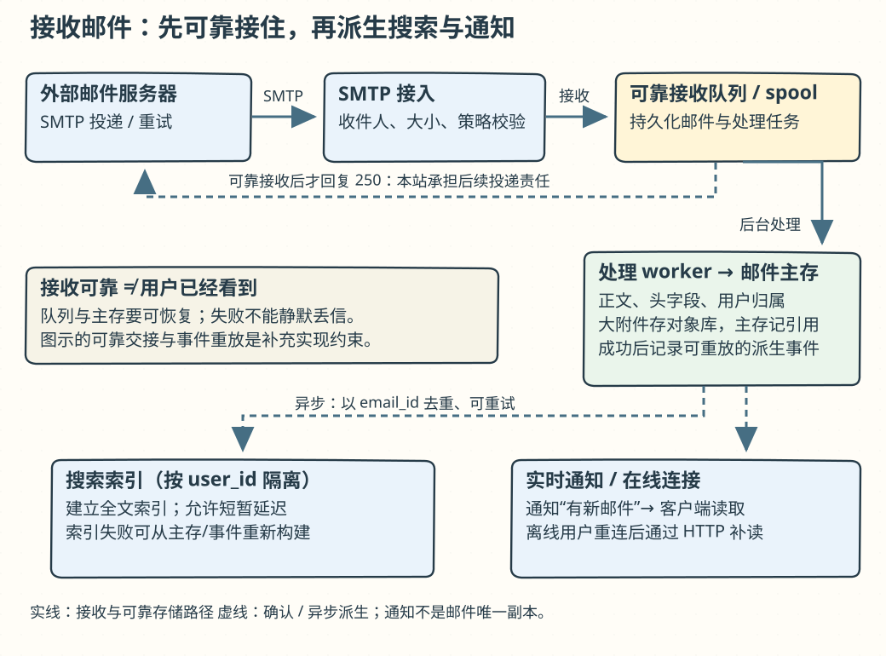
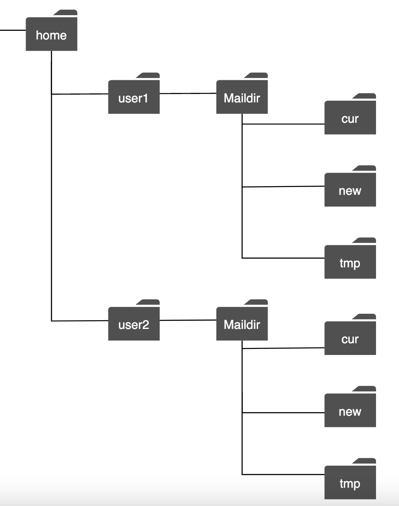
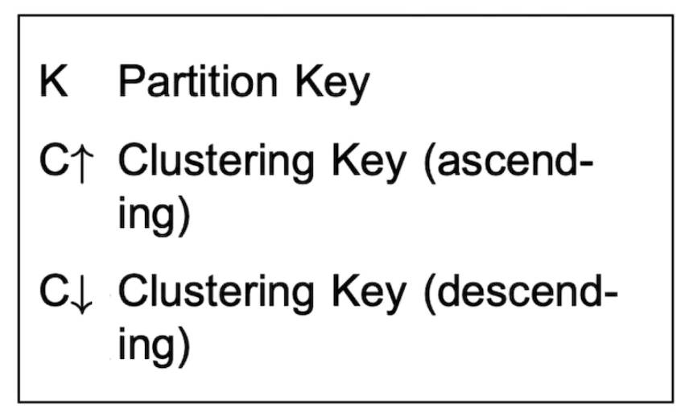
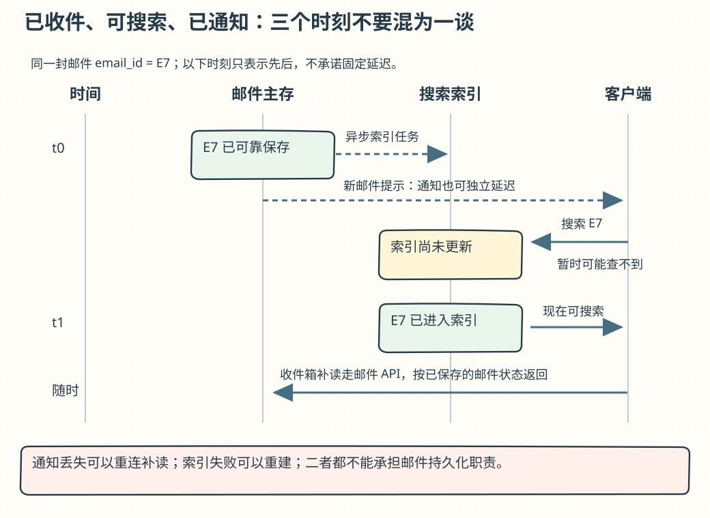

# 第 23 章：分布式邮件服务（Distributed Email Service）

> 原版：[第 23 章英文笔记](https://github.com/liquidslr/system-design-notes/blob/main/23.%20Distributed%20Email%20Service/README.md)。按原文顺序翻译；新增解释和校正标为「批注」。原文件未改动。

## 学习导读

把邮箱看成每个人自己的资料库：原始邮件要可靠保存，收件箱是查询视图，搜索索引是另一份可重建的数据。**“已接受发送”不等于“已送达”，SMTP 负责服务器间传信，HTTP/IMAP 负责用户看信。**



## 简介（Introduction）

本章设计类似 Gmail 的分布式邮件服务。原文引用的历史规模为：2020 年 Gmail 有 18 亿活跃用户，Outlook 全球有 4 亿用户。这是原笔记的历史背景，不是当前统计。

## 第 1 步：理解问题并确定范围

- C：多少用户？I：10 亿。
- C：核心功能包括认证、收发邮件、获取邮件、过滤、搜索和反垃圾？I：可以，本题暂不深入认证。
- C：客户端怎么连邮件服务器？I：通常用 SMTP、POP、IMAP，本题客户端使用 HTTP。
- C：支持附件吗？I：支持。

### 非功能需求

- **可靠性**：不能丢邮件。
- **可用性**：通过复制消除单点故障，容忍部分系统失效。
- **可扩展性**：能随用户增长扩容。
- **灵活性与可扩展功能**：容易增加能力，这也是面向 Web 客户端选择 HTTP 的原因之一。

### 粗略估算

- 10 亿用户。
- 每人每天发 10 封，约每秒 10 万封。
- 每人每天收 40 封，每封平均 50 KB 元数据，每年约 730 PB。
- 20% 的邮件有附件，附件平均 500 KB，每年约 1,460 PB。

> **批注：这两项相加约 2,190 PB/年。** 这里用十进制 KB/PB，未计副本、索引、编码和协议开销。“元数据”在本章还包含正文，区别于只存几百字节邮件头。10 亿人每天 100 亿封除以 86,400 约 11.6 万封/秒，原文取数量级为 10 万。

## 第 2 步：高层设计

### 邮件基础（Email knowledge 101）

- **SMTP**：邮件发送协议，尤其用于服务器间邮件交换。
- **POP**：从远端邮箱下载到本地。原文描述下载后删除服务器邮件。
- **IMAP**：在服务器保留邮件，客户端同步与管理邮箱。
- **HTTPS**：不是专门的邮件协议，可供 Web 邮箱客户端调用服务 API。

> **批注：POP 不等于必删服务器邮件。** 是否删除取决于客户端操作和设置；IMAP 更适合多设备同步。题目把浏览器接口改为 HTTP，并不意味着与外部邮箱交换邮件也改用 HTTP。

邮件服务器还需配置 DNS 的 MX 记录，告诉发送方某域名的收信服务器在哪里。


附件通常用 Base64 编码。原文举例多数服务有 25 MB 左右上限，实际按服务与个人/企业账户配置而异。

> **批注：Base64 会膨胀。** 原始附件大小约增加到 4/3，再加 MIME 头和换行。不要把上传文件大小直接当成线上邮件大小；具体上限需查目标邮件服务文档。

### 传统邮件服务器（Traditional mail servers）

单机传统方案适合用户较少的环境：


1. Alice 登录 Outlook 并发送邮件，经 SMTP 交给 Outlook 邮件服务器。
2. Outlook 服务器查询 `gmail.com` 的 MX，再经 SMTP 把邮件交给 Gmail。
3. Bob 使用 IMAP/POP 从 Gmail 获取邮件。

传统实现可能把每封邮件作为独立文件放在本地文件系统：



规模增大后磁盘 I/O 成为瓶颈；磁盘损坏或服务器宕机会影响可靠性和可用性。

### 分布式邮件服务器（Distributed mail servers）

分布式设计解决规模与现代功能需求。仍可向原生客户端提供 IMAP/POP，服务器间仍用 SMTP；富功能 Web 客户端通常用 HTTP REST API。

- `POST /v1/messages`：给 To、Cc、Bcc 中的收件人发信。
- `GET /v1/folders`：列出账户文件夹。

文件夹响应示意（字段说明已翻译）：

```text
[{
  id: string       // 文件夹唯一标识
  name: string     // 文件夹名；RFC 6154 列举特殊用途标记：
                   // All、Archive、Drafts、Flagged、Junk、Sent、Trash
  user_id: string  // 账户所有者
}]
```

- `GET /v1/folders/{:folder_id}/messages`：分页列出文件夹邮件。
- `GET /v1/messages/{:message_id}`：获取一封邮件详情。

```text
{
  user_id: string,                    // 账户所有者
  from: {name: string, email: string},// 发件人姓名与地址
  to: [{name: string, email: string}],// 收件人列表
  subject: string,                   // 主题
  body: string,                      // 正文
  is_read: boolean                   // 是否已读
}
```

> **批注：上面是类型示意，不是 JSON。** Bcc 收件人不能泄漏给其他收件人；鉴权必须在服务端限制 `user_id`，不能相信客户端传来的账户 ID。RFC 6154 是特殊用途属性，不能推断所有邮箱都具有完全相同的文件夹名。

整体架构如下：


- **Webmail**：浏览器中收发邮件。
- **Web servers**：对外处理请求/响应，包括登录、注册、用户资料等。
- **Real-time servers**：实时推送新邮件，使用 WebSocket，不支持时回退长轮询。
- **Metadata DB**：存主题、正文、发件人、收件人等。
- **Attachment store**：对象存储，例如 S3，适合大文件。
- **Distributed cache**：例如 Redis，缓存近期邮件改善体验。
- **Search store**：分布式文档索引，提供全文搜索。

发送流程：


1. 用户编写邮件并点击发送，进入负载均衡入口。
2. 入口限制过量发信，并分发到 Web 服务器。
3. Web 服务器进行大小等基本校验；同域收件人可走内部短路径，但仍先检查垃圾邮件。
4. 校验通过则进入发信队列，附件以对象存储引用传递。
5. 校验失败进入错误处理队列。
6. SMTP 出站 worker 拉取消息，检查垃圾邮件/病毒，投递目标服务器。
7. 保存到“已发送”文件夹。

持续监测发信队列长度。积压可能是收件服务器不可用，需要指数退避重试；也可能是消费者不足，需要扩容。

> **批注：积压原因决定动作。** 对方已经限流时增加 worker 只会更糟。发送成功也有不同层级：本系统接受、对方 SMTP 接受、进收件箱、用户阅读，不能混称。瞬时故障可重试，永久拒收应生成可追踪的失败结果，避免无限重发。

收信流程：


1. 邮件到达 SMTP 负载均衡器，再分给 SMTP 服务器，执行接收策略；原文举例丢弃无效邮件。
2. 较大附件分离到对象存储。
3. 邮件处理 worker 做初步检查，将内容送往持久存储、缓存、对象存储和实时通知服务。
4. 离线用户上线后通过 HTTP API 读取新邮件。

> **批注：拒收与接受后丢弃不同。** 合法邮件在承诺接收前应已有符合可靠性目标的持久副本，不能只放内存再回成功。无效邮件应按 SMTP 语义拒绝或隔离；不要把“无法处理”一律静默丢弃。实时通知可以暂时失败，用户仍应能从持久邮箱查询到信。

## 第 3 步：深入设计

### 元数据数据库（Metadata database）

邮件数据特征：邮件头小且常读；正文大小变化很大但通常只读少数次；获取、标记已读、搜索多以单个用户为范围；近期邮件更热；丢数据不可接受。原文指出 Gmail/Outlook 级别系统可能定制存储以降低 IOPS。

数据库选项：

- **关系数据库**：能索引头部和正文；原文认为常见实现更适于较小数据块。
- **分布式对象存储**：适合备份和大对象，单独使用难以高效实现搜索、已读标记等查询。
- **NoSQL**：原文以 Gmail 使用 Bigtable 为例，并指出其实现不开放源码。

没有一种现成方案天然满足全部目标。面试中不必现场设计一个新数据库，但要给出所需属性：单列可达个位数 MB；强一致；减少磁盘 I/O；高可用、容错；易做增量备份。

用 `user_id` 分区，使单用户数据位于同一分片。原文把跨用户共享一条邮箱记录排除出范围，这不妨碍一封邮件投递给多个用户；各人的已读、文件夹等状态各自独立。

主键由分区键（分布）与聚簇键（分片内排序）组成。所需查询：用户全部文件夹；文件夹全部邮件；创建/获取/删除邮件；读取已读/未读邮件；可选的会话线程。




`email_id` 使用 timeuuid，以邮件创建时间排序。

附件用独立表记录，图中以文件名作为标识的一部分：


> **批注：文件名不能当全局唯一键。** 两封邮件都可能有 `report.pdf`，实际键必须包含用户/邮件/附件 ID，显示文件名另存。时间排序标识还要确定同时间戳如何排序。

关系数据库过滤已读/未读较方便。Cassandra 模型不能把任意非键过滤当成高效查询；原文称非分区/聚簇键过滤被禁止。把整文件夹取出再在内存筛选不适合大规模。可反规范化为已读和未读查询表：


> **批注：为查询建表，就承担同步成本。** 状态从未读改成已读时，要更新相关查询视图，设计重复处理和失败修复。某些过滤、索引能力随 Cassandra 版本和查询模式变化；这里的核心是避免无界扫描，不是背“任何非键过滤都不允许”。

会话线程可利用邮件头重建：

```json
{
  "headers": {
    "Message-Id": "<7BA04B2A-430C-4D12-8B57-862103C34501@gmail.com>",
    "In-Reply-To": "<CAEWTXuPfN=LzECjDJtgY9Vu03kgFvJnJUSHTt6TW@gmail.com>",
    "References": ["<7BA04B2A-430C-4D12-8B57-862103C34501@gmail.com>"]
  }
}
```

原例 `"headers"` 后缺少冒号，上面只修正语法。`Message-Id` 标识当前邮件，`In-Reply-To` 指向被回复邮件，`References` 提供关联链。

本题优先一致性。故障切换或网络分区时，受影响用户的同步/更新可能暂不可用。

> **批注：一致性与耐久性不同。** 强一致不自动等于“不会丢”，仍需要持久化、复制和备份；分区期间受影响的写入等待/拒绝，也不代表整个系统所有查询都停止。

### 邮件送达能力（Email deliverability）

搭建发信服务器相对容易，让信进入对方收件箱更难：反垃圾系统可能把新服务器邮件归为垃圾。原文建议：

- 专用发信 IP，管理信誉。
- 邮件分类，营销流量和重要事务邮件分离。
- 逐步给 IP 预热，原文给出 2–6 周的经验范围。
- 快速封禁滥发账号，保护发送信誉。
- 和 ISP 建立投诉反馈处理，监测投诉率。
- 使用 SPF、DKIM 等认证抵御冒用与钓鱼。

不必把细节全部背下；要知道邮件系统需要专门领域知识。

> **批注：专用 IP 不保证进收件箱。** 共享 IP 也能有良好信誉；预热没有固定保证时间。还应考虑域名信誉、退订、退信、DMARC 对齐及收件平台规则。SPF/DKIM 是认证手段，不能保证内容安全。

### 搜索（Search）

既要支持正文全文搜索，也要按发件人、收件人、主题、未读等过滤。搜索范围局限于用户邮箱；索引更新多而搜索查询少，因此常是写多读少。

|维度|互联网搜索|邮箱搜索|
|---|---|---|
|范围|整个互联网|某用户自己的邮箱|
|排序|通常按相关性|常按时间、日期等属性|
|准确性/新鲜度|爬取索引有延迟|期望快速更新、结果准确|

可使用 Elasticsearch 集群，按 `user_id` 路由，使同用户数据集中到同一分片：


修改通过 Kafka 异步进入索引，解耦业务与重建流程；搜索请求同步查询。Elasticsearch 是现成全文搜索方案。也可开发定制搜索引擎，但具体设计超出本题，主要难点是写密集优化。

一种思路是使用 LSM tree 组织磁盘索引，偏向顺序写；Cassandra、Bigtable、RocksDB 使用此类结构。数据先在内存积累，达到阈值后刷新到磁盘，并逐层合并：


> **批注：不能“内存满了才首次持久化”。** 通常先写 WAL 以恢复尚未刷盘的数据，再更新内存表；压缩合并会带来写放大，读取可能需要合并多个层。全文搜索还需要倒排索引，LSM 本身不是全文搜索算法。

两种方式的取舍：Elasticsearch 能扩到一定规模，定制引擎可针对邮箱优化；ES 是需要额外维护的服务，定制方案可与元数据存储整合；ES 可以直接采用，自研需要大量工程投入。

> **批注：按用户路由不等于用户绑定永远不变的物理节点。** 分片会复制和迁移。异步索引有新鲜度延迟，必须监控索引水位，明确删信/权限变化多久反映到搜索。



### 可扩展性与可用性（Scalability and availability）

用户操作大多彼此独立，多数组件能独立扩容。跨数据中心部署，通过 leader/follower 与故障切换提升可用性。


> **批注：复制不是备份。** 误删除也可能被同步；备份要能恢复，恢复结果要验证。跨机房同步复制和异步复制分别影响延迟、可用性与潜在数据损失窗口。

## 第 4 步：回顾（Wrap Up）

还可以继续讨论：各节点故障时的容错；按适用法规（如欧洲 GDPR）妥善处理个人数据；邮件加密、防钓鱼、安全浏览；重复附件去重以降低存储成本。

### 批注：一分钟复述与自测

「客户端用 HTTP 管邮箱，服务器间用 SMTP 传信。先可靠接收，再异步投递和建索引；邮件正文、附件、搜索视图按职责分开。以用户为分片键服务查询，缓存只存热数据。出站队列重试要区分临时故障和永久拒收，索引与通知失败不能丢掉原信。」

自测：① SMTP 接受邮件代表用户已读吗？② 为什么附件常放对象存储？③ 搜索不到刚收到的信，先查哪个队列水位？④ 已读查询表反规范化之后多了什么写入责任？

> **参考答案**：[Q23-01](../29.%20%E8%87%AA%E6%B5%8B%E9%A2%98%E8%AF%A6%E8%A7%A3/README.md#q23-01) · [Q23-02](../29.%20%E8%87%AA%E6%B5%8B%E9%A2%98%E8%AF%A6%E8%A7%A3/README.md#q23-02) · [Q23-03](../29.%20%E8%87%AA%E6%B5%8B%E9%A2%98%E8%AF%A6%E8%A7%A3/README.md#q23-03) · [Q23-04](../29.%20%E8%87%AA%E6%B5%8B%E9%A2%98%E8%AF%A6%E8%A7%A3/README.md#q23-04)。先独立作答，再逐题核对推导与图解。
