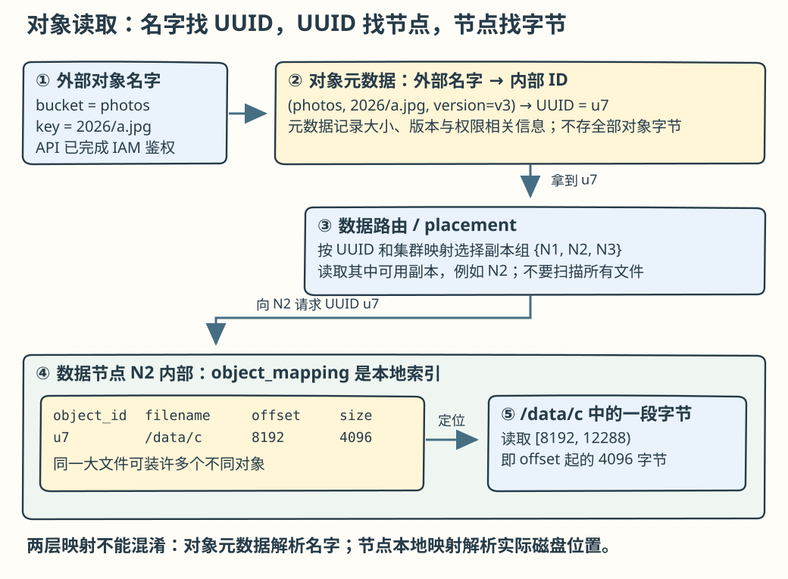
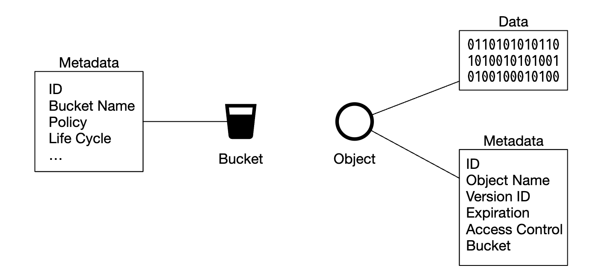
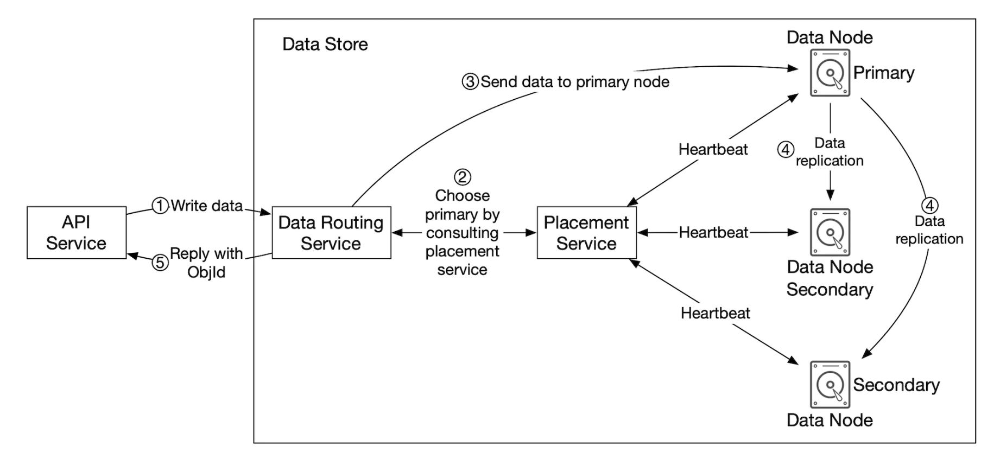
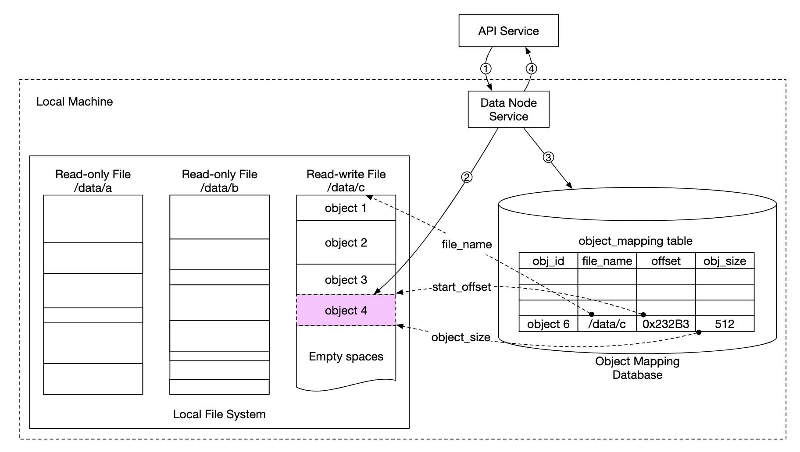
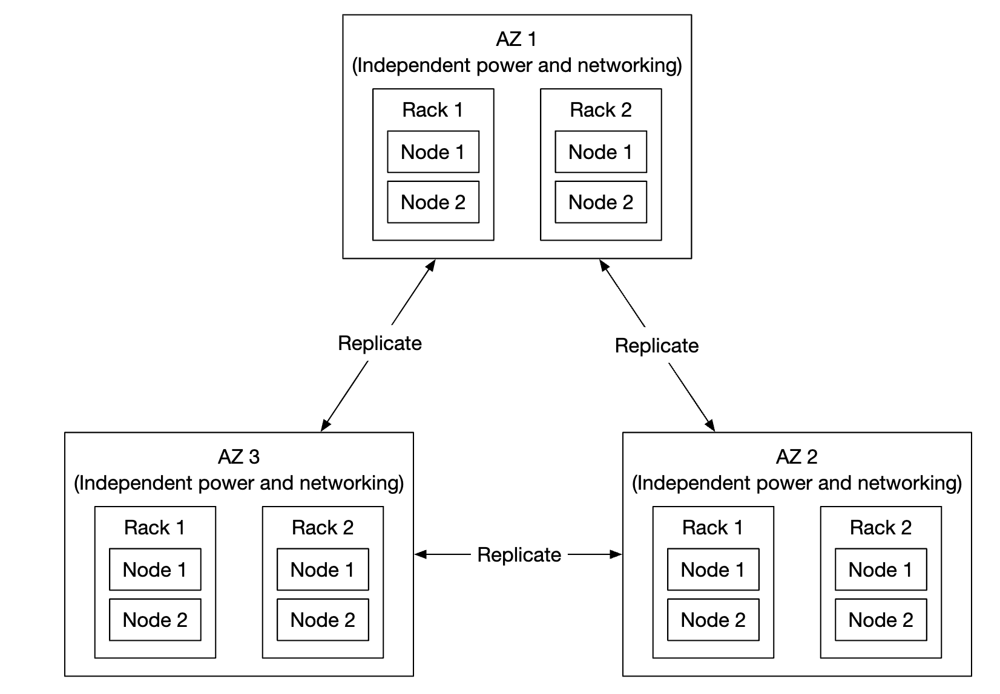
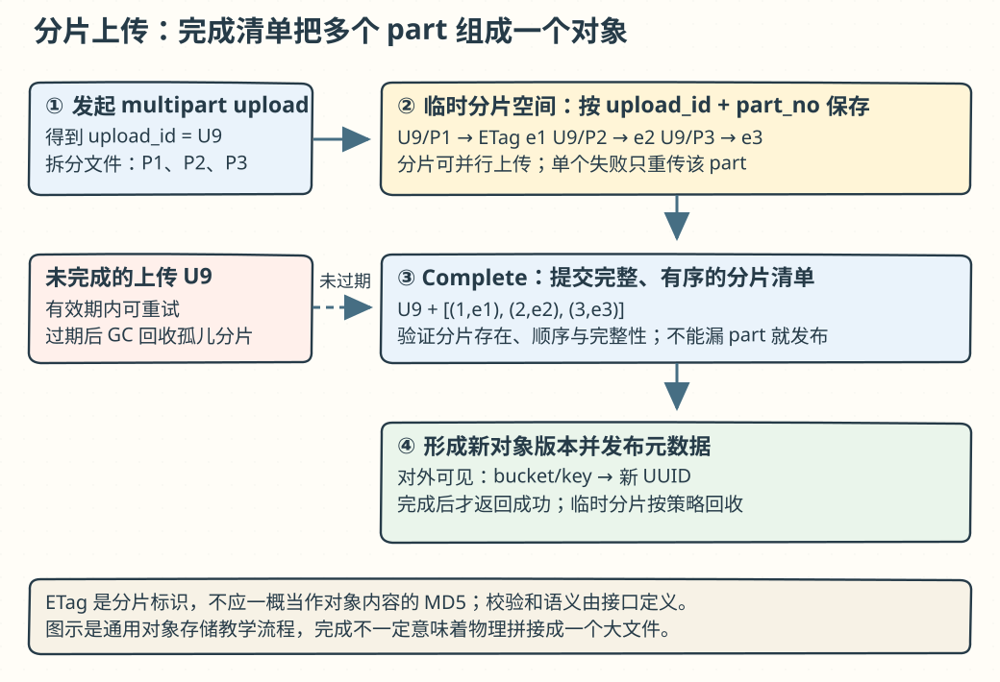

# 第 24 章：S3 类对象存储（S3-like Object Storage）

> 原版：[第 24 章英文笔记](https://github.com/liquidslr/system-design-notes/blob/main/24.%20S3-like%20Object%20Storage/README.md)。按原文结构翻译；「批注」区分新增解释和校正。这里是教学设计，不是对 Amazon S3 内部实现的披露。

## 学习导读

把对象存储想成仓库：`bucket + key` 是货单地址，元数据记录货物在哪里，数据节点保存真正的字节。**找得到地址、读得出字节、坏一块盘还能恢复，是三件不同的事。**



## 简介（Introduction）

本章设计类似 Amazon S3 的对象存储。存储大体分为三类：

- **块存储（Block storage）**：HDD、SSD 等设备提供原始块；可直连服务器，也可经高速网络连接。服务器可在块上建文件系统，或由应用直接管理原始块。
- **文件存储（File storage）**：在块之上提供文件、目录等更高层抽象，方便管理。
- **对象存储（Object storage）**：围绕高持久性、大规模和低成本设计，采用对象键空间。原文描述其以性能换取这些目标，主要面向冷数据、归档和备份；供应商包括 S3、Google GCS 等。

> **批注：对象存储不只存冷数据。** 现代对象存储广泛用于数据湖、网站资源和应用数据。性能、价格、一致性取决于产品和存储等级，不能只按“对象”二字推断。对象键中的 `/` 常只是前缀约定，而非 POSIX 目录。


下表保留原文的概括性对比：

|维度|块存储|文件存储|对象存储|
|---|---|---|---|
|原地修改内容|可以|可以|本题不支持，可整体替换/版本化|
|成本|高|中到高|低|
|性能|中高到很高|中高|低到中|
|一致性|强一致|强一致|原文列为强一致|
|访问方式|SAS/iSCSI/FC|文件接口、CIFS/SMB、NFS|RESTful API|
|扩展规模|中|高|很高|
|适用场景|虚拟机、数据库|通用文件系统|二进制和非结构化数据|

> **批注：这是教学表，非产品能力矩阵。** 不同文件系统、复制设置和对象产品会改变上述结论；S3 当前对成功的对象 PUT/DELETE 及后续读取提供强一致语义，不能把旧资料中的最终一致概括到所有对象存储。

术语：**Bucket** 是对象逻辑容器，原文假设名字全局唯一；**Object** 包含数据和元数据；**Versioning** 在同桶保存对象多个版本；**URI** 唯一标识资源；**SLA** 是服务商与客户之间的服务承诺。

原文举 S3 Standard-IA 为例：跨多个可用区设计为 99.999999999% 持久性，可应对整个可用区损毁，设计可用性为 99.9%。

> **批注：持久性、可用性与 SLA 分开读。** 持久性关心数据长期是否丢失，可用性关心此刻能否访问，服务设计目标也不等同于合同赔付条款。以上保留原文背景数字，不是本教学系统已达到的指标。

## 第 1 步：理解问题并确定范围

- C：要支持哪些功能？I：创建桶、上传/下载、版本管理、列出桶内对象。
- C：对象多大？I：大对象和小对象都要高效保存。
- C：一年存多少？I：100 PB。
- C：可否按六个九持久性（99.9999%）、四个九可用性（99.99%）设计？I：可以。

### 非功能需求

100 PB 数据；六个九持久性；四个九服务可用性；在可靠性和性能目标下尽量降低存储成本。

### 粗略估算

对象存储可能受磁盘容量或 IOPS 限制。假设对象按数量分布：20% 小于 1 MB、60% 为 1–64 MB、20% 大于 64 MB；7200 rpm SATA 硬盘约每秒 100–150 次随机寻道。

分别取代表大小 0.5、32、200 MB。100 PB 为 `10^11 MB`，按 40% 已用容量估算约 6.8 亿个对象；每个对象元数据 1 KB，约需 0.68 TB。

> **批注：把省略的公式展开。** 平均对象大小 `0.2×0.5 + 0.6×32 + 0.2×200 = 59.3 MB`，`10^11×40% / 59.3 ≈ 6.745×10^8`。若题目的 100 PB 全是实际数据，就不该再乘 40%。副本/纠删码、索引和余量另算；随机寻道数字也不能代表顺序吞吐量。

## 第 2 步：高层设计

先看对象存储的特征：对象通常整体写入、删除或替换，不支持本题范围内的局部更新；URI 作为键，通过 HTTP 取值；写一次读多次，原文引述某 LinkedIn 研究中约 95% 操作是读；同时支持大小对象。

原文用 UNIX 类比：先通过文件系统元数据找到块位置，再取字节。对象存储同样将元数据与内容分开：


> **批注：文件名并不直接存进 inode。** 目录项把名称映射到 inode，inode 保存属性和数据块定位信息。这里可类比为 `bucket/key → 对象元数据 → 数据位置`，不要把类比当成完全相同的实现。

分离后，两类存储能独立扩展：



### 高层设计（High-level design）


- **负载均衡器**：把 API 请求分配到服务副本。
- **API 服务**：无状态，编排元数据、数据存储和 IAM 调用。
- **IAM**：身份认证、授权与访问控制。
- **Data store**：根据对象 ID（UUID）存取真实字节。
- **Metadata store**：保存对象元数据。

### 上传对象（Uploading an object）


1. HTTP PUT 创建 `bucket-to-share`。
2. API 调 IAM 验证用户身份和写权限。
3. 在元数据存储建桶记录，完成后返回成功。
4. 创建桶后，PUT 上传 `script.txt`。
5. 再次验证身份与写权限。
6. 把正文交给数据存储，持久化后返回 UUID。
7. 元数据存储记录对象 ID、桶 ID、桶名等信息。

原文上传请求：

```http
PUT /bucket-to-share/script.txt HTTP/1.1
Host: foo.s3example.org
Date: Sun, 12 Sept 2021 17:51:00 GMT
Authorization: authorization string
Content-Type: text/plain
Content-Length: 4567
x-amz-meta-author: Alex

[4567 bytes of object data]
```

> **批注：字节写成但元数据没提交怎么办？** 对象会暂时成为孤儿，需要可靠重试或延迟回收。反过来先公布地址却未持久化字节，会让用户读到坏引用。权限、数据耐久性和元数据可见性必须有明确成功边界。

### 下载对象（Downloading an object）

桶内没有本题意义上的真实目录层级，可以用对象名称前缀模拟路径。

```http
GET /bucket-to-share/script.txt HTTP/1.1
Host: foo.s3example.org
Date: Sun, 12 Sept 2021 18:30:01 GMT
Authorization: authorization string
```


客户端 GET 到负载均衡；API 用 IAM 检查读取权限；从元数据查对象 UUID；凭 UUID 从数据存储取字节并返回。

## 第 3 步：深入设计

### 数据存储（Data store）

API 与数据存储交互如下：


**数据路由服务**提供 REST/gRPC API，无状态、可加实例。职责是向 placement 服务查询目标节点，从节点读数据返回 API，以及把写请求交给节点。

**放置服务（Placement service）**决定对象放在哪些节点，维护虚拟集群映射，体现物理拓扑：


通过心跳监控数据节点，决定是否从可用集合移除。该服务关键，原文建议 5 或 7 个副本，使用 Paxos/Raft 共识同步；7 节点集群在多数派仍互通时能容忍 3 个节点故障。

**数据节点**保存实际字节，通过多个节点副本保障可靠性。节点守护进程向放置服务发送心跳，包括管理的 HDD/SSD 数量、各盘已用容量。

> **批注：心跳说明“怀疑故障”，不是确定数据已永久丢失。** 需要超时、节点身份/任期和重新加入流程，避免一边补副本一边让旧主继续写。同一副本组成员选择要确定且版本可追踪。

#### 数据持久化流程（Data persistence flow）



API 把数据交给数据存储；路由服务发给主数据节点；主节点本地保存并复制给两个从节点，复制成功后应答；对象 UUID 返回 API。原文根据 UUID 用一致性哈希确定副本组，并指出等待复制会增加延迟。


> **批注：同步复制不独自保证强一致。** 还要定义读从哪里读、写顺序、主节点选举和故障时旧主隔离。等待多个耐久副本主要保护成功写入不易丢失；它与读写线性化不是一回事。

#### 数据如何组织（How data is organized）

每对象一个文件简单，但海量小文件会浪费块空间（原文举典型 4 KB 块），也产生大量 inode 与管理开销。可把小对象追加到较大文件，达到几 GB 后滚动创建新文件，原文称为类似 WAL 的追加结构：


单文件并发追加要序列化，多核心竞争会等待；可让不同核心拥有不同文件，减少锁争用。

#### 对象查找（Object lookup）

需要本地映射表：`object_id`、所在 `filename`、起始 `file_offset`、`object_size`。可用 RocksDB 或关系数据库，原文以读多写少为由偏向关系型。

若全节点共享远程映射数据库，集群承受所有查询，还多一次网络访问。各节点仅需自己的对象索引，可在节点内嵌轻量 SQLite。

> **批注：本地索引不是全局元数据。** 全局元数据把桶/键映射到对象 ID，本地索引再把对象 ID 映射到文件偏移。选择 SQLite/RocksDB 应测并发、恢复与持久化开销，不能仅凭读多写少下结论。

#### 更新后的持久化流程（Updated data persistence flow）



API 请求保存；数据节点把对象追加到 `/data/c`；映射表新增记录。

> **批注：文件与索引之间要能恢复。** 文件追加完成但索引没写成、索引已提交但文件未落盘，都需处理。可用日志、刷盘顺序、对象边界和校验在重启后恢复；图中三步并不自动构成跨文件与数据库事务。

#### 持久性（Durability）

达到六个九不能只考虑正常运行。硬件会坏，因此复制之外还要跨故障域：不同机架、数据中心、网络等，避免一个故障同时毁掉多副本。



原文假设 HDD 年故障率 0.81%，认为三份拷贝可近似达到六个九。还可采用纠删码减少空间开销：


用数据块和校验块恢复丢失部分；示意中六块丢两块，剩四块仍能重建。在本设计选择 8+4：8 数据分片、4 校验分片，跨不同故障域分布：


路由服务读取多个位置的数据，带来计算与访问成本，但降低空间：


- 三副本总容量为原数据 3 倍，即额外 200%；8+4 总容量 1.5 倍，即额外 50%，比三副本总占用少 50%。
- 原文引用 [Backblaze 持久性模型](https://github.com/Backblaze/erasure-coding-durability)，用纠删码十一个九对比复制六个九。
- 纠删码需编码/解码和校验计算，实现更复杂。

原文结论：延迟敏感场景倾向复制，成本敏感的大规模存储倾向纠删码。

> **批注：副本数不能直接推出几个九。** 把 `0.0081³` 当丢失概率假定故障相互独立、同时不可恢复等，忽略修复窗口、相关故障、静默损坏、操作失误。8+4 可恢复任意四个缺失分片，需采用具有相应性质的编码且至少八个有效分片可读；跨机房放置若一次丢五片仍无法恢复。十一个九是特定模型/系统目标，不是纠删码算法的固定保证。

#### 正确性校验（Correctness verification）

整盘失效易发现，部分比特静默损坏较难。给文件和对象存校验和（checksum），读取时重算比较：


8+4 场景中，要检查所读的各个分片校验和，原文以读取八个数据分片为例。

> **批注：校验只能发现损坏。** 修复还需健康副本或足够有效分片；定期巡检（scrubbing）帮助在第二次故障前发现问题。校验失败的数据先隔离并修复，不能把唯一可恢复的残余直接删除。

### 元数据模型（Metadata data model）


要支持按名称找对象 ID、按名称插入/删除、列出桶内同前缀对象。桶数量通常受限，桶表较小，可容纳于单数据库但仍需扩展读吞吐。对象表可能很大，需要分片。

- 按 `bucket_id`：一个桶有数十亿对象时会热点。
- 原笔记第二项也写 `bucket_id`，却说更均匀但查询慢，与上一条不一致。
- 本章最终按 `hash(bucket_name, object_name)` 分片，多数点查询由桶名、对象名定位，但列举会变慢。

> **批注：保留原文矛盾，不猜成确定事实。** 若第二项本想说“按对象 ID 分片”，则按名称查找需要额外映射；这是可能的解释。实际取舍是点查询均衡与范围列举局部性之间的冲突。

### 列出桶内对象（Listing objects in a bucket）

单库按前缀列举，原文示例：

```sql
SELECT * FROM object WHERE bucket_id = "123" AND object_name LIKE `abc/%`
```

> **批注：原 SQL 引号是示意错误。** 真正的前缀模式应作为绑定字符串参数，例如 `LIKE :prefix`，值为 `abc/%`；反引号在 MySQL 中通常表示标识符。

哈希分片下需向各片查询再内存聚合。分页复杂：不同片返回数量不同，需要维护各片位置，原文以独立 limit/offset 描述。可接受列举较慢，也可为列举额外建按桶分区的反规范化表，使单桶查询局部化。

> **批注：大桶热点会回来。** 专门的列表索引解决访问模式，但还需按前缀/范围进一步切分、维护一致性。排序后的游标和各片水位通常比大 offset 更合适；并发写入期间还要定义分页的稳定性语义。

### 对象版本（Object versioning）

增加 `object_version`，类型为 TIMEUUID，支持按时间排序。新版本产生新的 `object_id`：


删除不立即移除所有字节，而是插入特殊删除标记版本；默认查询最新版本时返回 404：


> **批注：删除标记不等于永久删除旧版本。** 指定旧版本仍可能读取；应区分隐藏当前对象、删某个版本与生命周期清理。同一 key 的并发版本顺序需要服务端规则，客户端时钟不够。

### 大文件上传优化（Optimizing uploads of large files）

分段上传使大文件的各块独立传输与重试：


1. 客户端初始化上传。
2. 返回唯一 `upload_id`。
3. 客户端切块，带该 ID 上传各块。
4. 每块成功返回 ETag，原文把它描述为 MD5 校验和。
5. 全部完成后，提交 upload ID、part number 和各 ETag。
6. 服务端组装对象，原文说可能耗时几分钟，完成后返回成功。

无用临时块由垃圾回收器清理。

> **批注：ETag 不普遍等于 MD5。** 对加密对象、分段上传等情况不能依赖该等式，完整性应使用明确的 checksum 语义；合并也可能通过元数据完成，不一定拷贝全文件或固定花几分钟。只有完成提交后才让完整对象可见，失败块单独重试。



### 垃圾回收（Garbage collection）

需要回收：延迟删除对象占据的空间；失败上传遗留的孤儿；已确认可替换的损坏副本。复制场景清理主副本和从副本；8+4 清理关联十二个分片。

通过 compaction 压缩整理：把 `/data/b` 中仍有效对象复制到 `/data/d`；复制完成后用事务更新 `object_mapping`；选择达到阈值的文件进行整理，避免产生过多小文件。


> **批注：回收要落后于可见性。** 新文件持久化并成功切换映射后，旧文件仍可能被在途读取使用，需要安全释放。版本保留期、活跃 multipart、复制落后和 GC 水位都要考虑；不能把暂时没有元数据引用的新上传立即当垃圾。

## 第 4 步：回顾

本章比较块/文件/对象存储，设计桶与对象上传、下载、列举、版本管理，深入元数据/数据分离、复制与纠删码、分段上传和分片。

### 批注：记忆与自测

「名字查元数据，ID 查数据节点，节点再查文件偏移。写成功前满足持久化要求；副本/纠删码对抗故障，校验和发现静默损坏。哈希分片利于点查，前缀列举要额外付代价；删除先改可见状态，GC 再安全回收字节。」

自测：① 8+4 的总存储放大为什么是 1.5？② 元数据提交失败会留下什么？③ 同步三副本为什么不能直接证明线性一致？④ ETag 为什么不能始终当 MD5？

校注参考：[S3 官方文档](https://docs.aws.amazon.com/AmazonS3/latest/userguide/Welcome.html)、[Object / ETag API 说明](https://docs.aws.amazon.com/AmazonS3/latest/API/API_Object.html)。

> **参考答案**：[Q24-01](../29.%20%E8%87%AA%E6%B5%8B%E9%A2%98%E8%AF%A6%E8%A7%A3/README.md#q24-01) · [Q24-02](../29.%20%E8%87%AA%E6%B5%8B%E9%A2%98%E8%AF%A6%E8%A7%A3/README.md#q24-02) · [Q24-03](../29.%20%E8%87%AA%E6%B5%8B%E9%A2%98%E8%AF%A6%E8%A7%A3/README.md#q24-03) · [Q24-04](../29.%20%E8%87%AA%E6%B5%8B%E9%A2%98%E8%AF%A6%E8%A7%A3/README.md#q24-04)。先独立作答，再逐题核对推导与图解。
