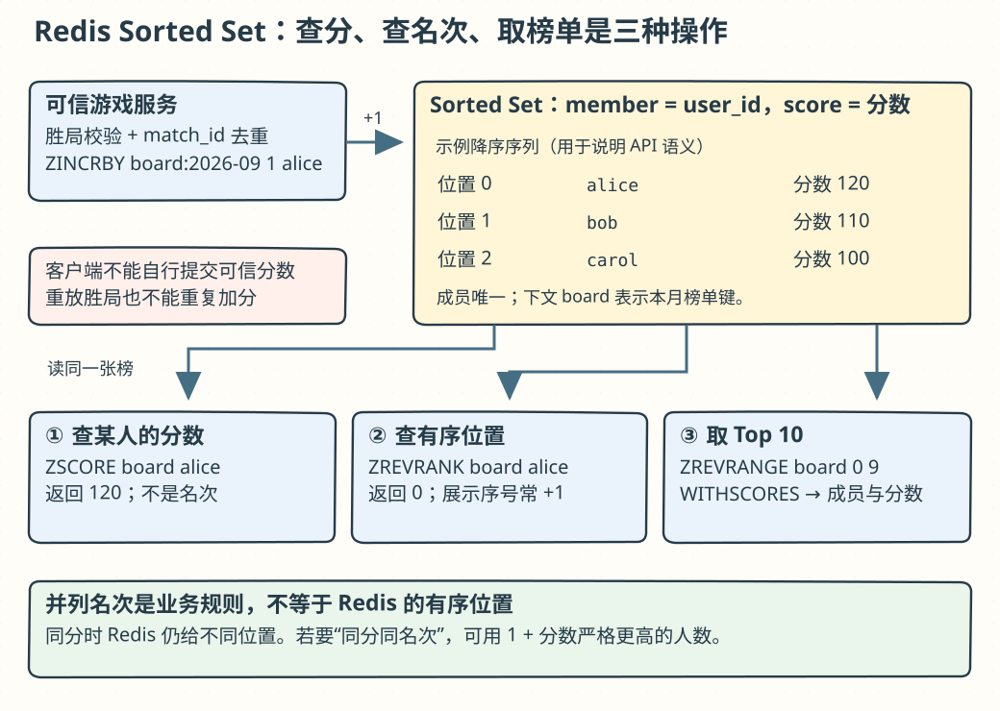
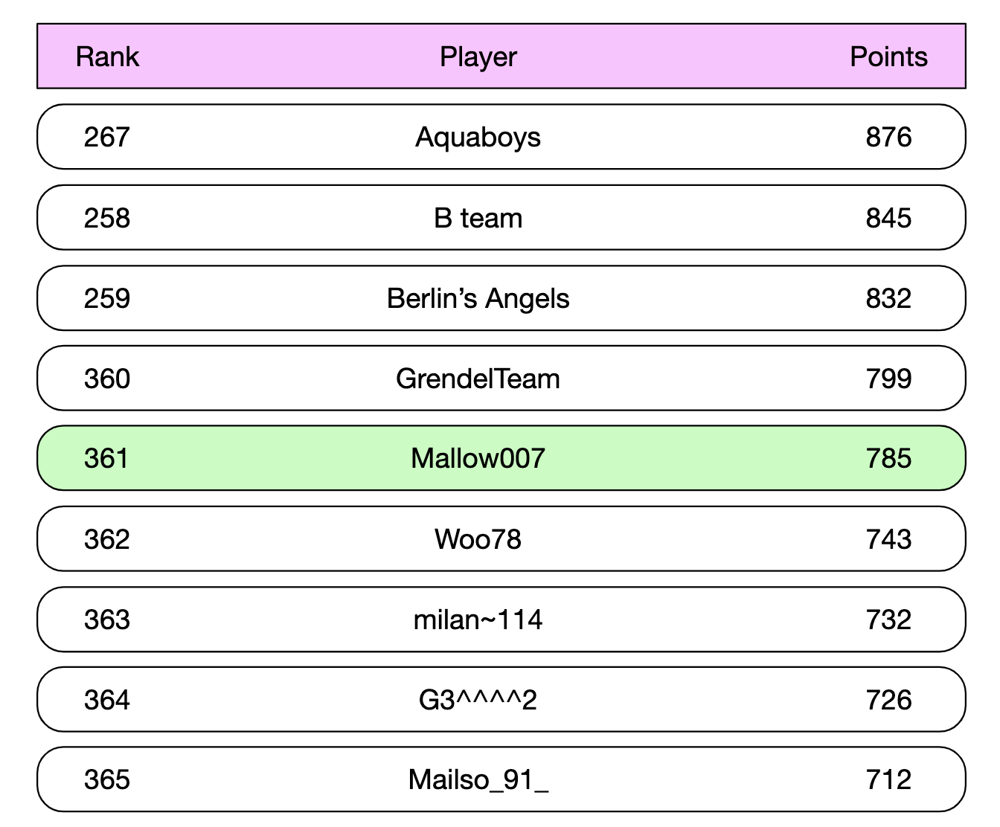
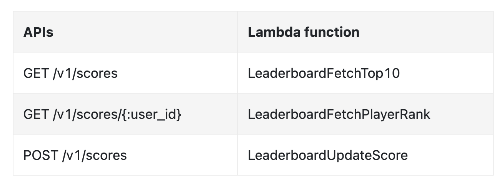
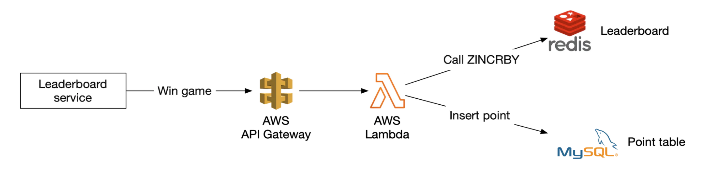
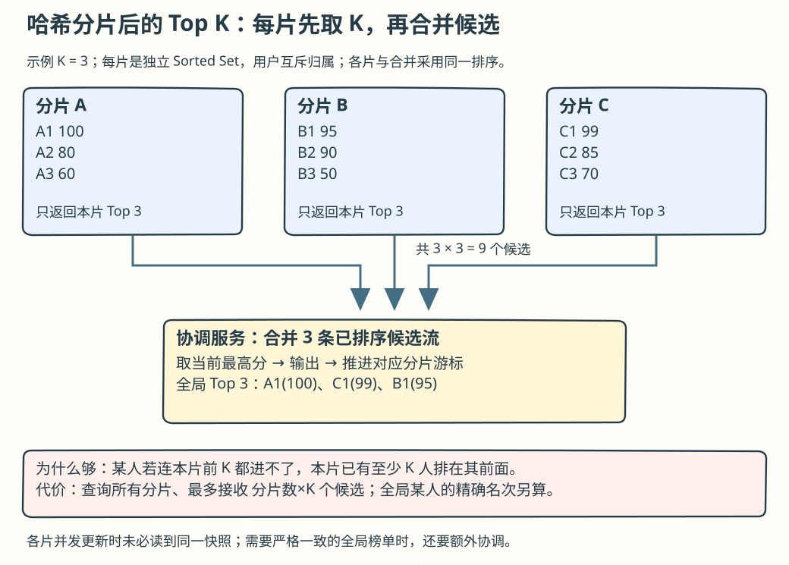
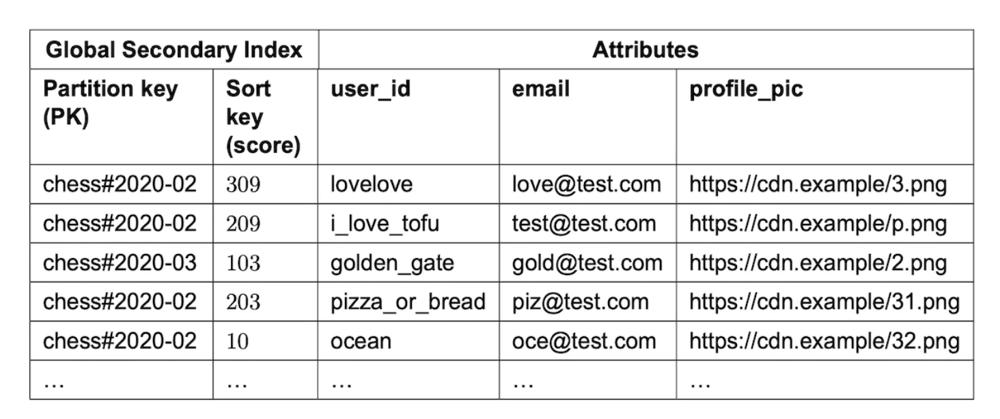

# 第 25 章：实时游戏排行榜（Real-time Gaming Leaderboard）

> 原版：[第 25 章英文笔记](https://github.com/liquidslr/system-design-notes/blob/main/25.%20Real-time%20Gaming%20Leaderboard/README.md)。按原文顺序翻译，新增解释及原文疑点标为「批注」。原文件保持不变。

## 学习导读

你会写 `ORDER BY score DESC LIMIT 10`，这解决了榜首查询。但“我在第几名”和“我前后四个人是谁”是另外两类查询。**有序索引解决排序，名次统计解决排位；分片以后，局部名次不等于全局名次。**



## 简介（Introduction）

本章设计在线手机游戏排行榜。


## 第 1 步：理解问题并确定范围

- C：如何计分？I：每赢一场加一分。
- C：所有玩家都上榜？I：是。
- C：按什么时间段？I：每月新比赛、新排行榜。
- C：只看前十？I：还要查指定用户的位置，时间允许再讨论附近名次。
- C：用户规模？I：500 万 DAU，2,500 万 MAU。
- C：每天打多少场？I：每人平均 10 场。
- C：同分怎么办？I：并列，之后可以讨论额外排序规则。
- C：需要实时吗？I：要实时或尽量接近实时，不接受只展示批量计算的历史结果。

### 功能需求

显示前十；显示指定用户名次；可选：显示该用户前后各四个位置的玩家。

### 非功能需求

实时更新分数，并尽快反映到榜单；可扩展、高可用、可靠。

### 粗略估算

原笔记此处写“50 million DAU”，却算出平均每秒 50 用户，与前面的 500 万 DAU 不一致。按本题前面约定的 500 万 DAU、一天约 `10^5` 秒：

- 平均到达量约 `5,000,000 / 100,000 = 50/s`，原文取峰值 250/s。
- 每用户 10 场，按每次活动可能触发一次更新的简化上界：平均 `50×10=500 QPS`，峰值 2,500 QPS。
- 假设每人每天看一次前十，平均约 50 QPS。

> **批注：这不是在线人数。** DAU 除以秒得到到达/活动频率，在线并发还取决于会话时长。严格按“一场胜利加一次分”，要考虑胜率和一场比赛参与人数；原文按 10 次更新估算是简化假设，保留其量级用于设计。

## 第 2 步：高层设计

### API 设计

更新分数：

```http
POST /v1/scores
```

参数为 `user_id`、胜利获得的 `points`，**只能由可信游戏服务器访问，不能让终端客户端直接报分**。

获取前十：

```http
GET /v1/scores
```

响应示例（原文省略号改为文字说明，以下展示两条）：

```json
{
  "data": [
    {"user_id":"user_id1","user_name":"alice","rank":1,"score":12543},
    {"user_id":"user_id2","user_name":"bob","rank":2,"score":11500}
  ],
  "total":10
}
```

查询某用户：

```http
GET /v1/scores/{:user_id}
```

```json
{
  "user_info": {"user_id":"user5","score":1000,"rank":6}
}
```

原文末尾的多余逗号在此去除。实际 API 还应明确比赛月份/赛季，保证同一用户不同赛季的数据隔离。

### 高层架构（High-level architecture）


1. 玩家胜利后，客户端通知游戏服务。
2. 游戏服务验证胜利有效，再调用排行榜服务。
3. 排行榜服务更新存储中的分数。
4. 玩家查询前十或自己的名次。

如果游戏逻辑由服务器权威执行，服务器自己知道胜负，无需客户端另报胜利。

原文讨论过让客户端直接更新排行榜的替代设计：


这不安全，玩家可通过代理改请求中的分数。原文称为中间人攻击风险。

> **批注：根本问题是不可信输入。** 即使用 HTTPS，玩家仍控制自己的客户端；TLS 不会把玩家提交的“我赢了”变成权威事实。应由游戏服务器验证比赛结果，并给结果事件唯一 ID，避免重试重复加分。

是否在游戏服务与排行榜之间加队列？若其他服务也消费比赛结果，队列有帮助；题目未明确要求，初版可省略。


### 数据模型（Data models）

先讨论关系数据库、Redis，NoSQL 放到深入部分。

#### 关系数据库方案（Relational database solution）

规模小时，关系数据库够用。原文用每月一张榜单表，并附个人笔记认为加 `month` 列更易维护：


与查询无关的附加字段省略。玩家获胜后：


首次插入：

```sql
INSERT INTO leaderboard (user_id, score) VALUES ('mary1934', 1);
```

后续加分：

```sql
UPDATE leaderboard set score=score + 1 where user_id='mary1934';
```

查询榜单位置：


原文给出 MySQL 用户变量式序号：

```sql
SELECT (@rownum := @rownum + 1) AS rank, user_id, score
FROM leaderboard
ORDER BY score DESC;
```

无合适索引时要扫描排序全部记录。给 `score` 建索引，再加 `LIMIT 10` 可加快前十查询：

```sql
SELECT (@rownum := @rownum + 1) AS rank, user_id, score
FROM leaderboard
ORDER BY score DESC
LIMIT 10;
```

但找榜单中间某人的名次依然昂贵。

> **批注：原 SQL 不可直接当正确名次实现。** 用户变量需要初始化，表达式求值顺序不能随意依赖；流水序号也不支持题目要求的并列名次。支持窗口函数的数据库可使用 `RANK()` 或 `DENSE_RANK()`，但仍应考虑排序成本与索引。唯一键应包括赛季与用户，首次插入和重复请求也需并发保护。

#### Redis 方案（Redis solution）

Redis 将数据放内存，sorted set（有序集合）适合数百万玩家的分数与位置查询。常见大集合编码组合哈希表和跳表：哈希表由成员查分数；跳表按分数组织顺序。


跳表（skip list）是有序链表上加多层稀疏索引：


原文用 64 节点示例：普通链表找目标需走 62 个节点，跳表约 11 个。


有序集合持续维护顺序，插入和名次定位通常为 `O(log N)`。原文对比关系数据库的嵌套计数：

```sql
SELECT *,(SELECT COUNT(*) FROM leaderboard lb2
WHERE lb2.score >= lb1.score) RANK
FROM leaderboard lb1
WHERE lb1.user_id = {:user_id};
```

> **批注：`>=` 不是通常的并列竞赛名次。** 例如分数 100、100、90，前两人的名次通常都为 1；上述计数会得到 2。竞赛名次应为“严格高于我的人数 + 1”。Redis 的 `ZRANK/ZREVRANK` 返回成员位置，同分按成员字典序排序，也不会自动给出并列名次。

常用操作：

|命令|用途|复杂度|
|---|---|---|
|`ZADD`|插入成员或设置分数|每项 `O(log N)`|
|`ZINCRBY`|加分，不存在时从零开始|`O(log N)`|
|`ZRANGE/ZREVRANGE`|按名次区间读取，可正序/逆序|`O(log N + M)`|
|`ZRANK/ZREVRANK`|某成员的正序/逆序位置|`O(log N)`|

胜利加一分：

```text
ZINCRBY leaderboard_feb_2021 1 'mary1934'
```

每月创建新 key，旧榜归档到历史存储。取前十及分数：

```text
ZREVRANGE leaderboard_feb_2021 0 9 WITHSCORES
```

示意结果：

```text
[(user2,score2),(user1,score1),(user5,score5)...]
```

查附近玩家：



先用 `ZREVRANK leaderboard_feb_2021 mary1934` 查零基位置，假设为 361，则取前后各四个：

```text
ZREVRANGE leaderboard_feb_2021 357 365
```

> **批注：区间两端都包含。** 榜首要把起点截到 0；成员不存在时先处理空结果。展示普通位置时加 1；若按题目给并列名次，可先取分数，再统计严格更高分成员数量 `ZCOUNT key (score +inf` 并加 1。跨命令读取要考虑中间分数变化，可用同一服务端原子执行单元取得一致结果。`ZINCRBY` 重试会再次加分，须用比赛事件 ID 去重。

存储估算：2,500 万 MAU 都参加，ID 24 字节、分数按原文 16 位（2 字节），则 `26×2500万 ≈ 650 MB`。原文再按跳表开销翻倍，认为仍能放入现代 Redis 集群。峰值 2,500 更新/秒也被认为在单实例能力范围内。

> **批注：650 MB 只是原文有效载荷估算。** Redis 分数是双精度浮点，不是 16 位整数；成员对象、字典、跳表节点、分配器、碎片、副本及持久化还占内存。小集合可使用不同紧凑编码。不要拿“乘二”当容量保证，要用真实长度和分布装载测试；一个大 sorted set 也不会由 Redis Cluster 自动拆开。

其他考虑：配置副本；启用 Redis 持久化；MySQL 辅助表保存用户资料和比赛获胜记录，用后者重建榜单；缓存经常访问的前十名资料。

> **批注：副本不等于绝不丢分。** 复制和持久化策略决定故障时窗口；可靠比赛事件是可重建基础。数据库与 Redis 双写要有重放位置和去重逻辑。

## 第 3 步：深入设计

### 是否使用云服务（To use a cloud provider or not）

自管方案使用 Redis 保存榜单、MySQL 保存资料，必要时另加资料缓存：


托管方案可用 API Gateway 路由到 AWS Lambda：



Lambda 按调用执行代码，由平台管理服务器与扩缩容。加分和查榜流程如下：




原文建议从零开发时考虑 serverless，减少服务器维护工作。

> **批注：托管减少运维，不消除容量规划。** 仍要考虑冷启动、并发限额、到 Redis 的连接数、网络延迟和成本。实时目标要测端到端，不只看函数执行时间。

### 扩展 Redis（Scaling Redis）

原文认为 500 万 DAU 时单实例可满足存储和 QPS。然后写“增长 10 倍到 5 亿 DAU”，并给出 65 GB、25 万 QPS。

> **批注：这里实际上是 100 倍。** 500 万到 5 亿是 100 倍，650 MB×100=65 GB、2500×100=25 万才相符；内存估算仍只是上述不含真实编码开销的原文模型。

大规模需要分片。一种是按分数范围：


应用维护用户到分片映射，可放 MySQL 或缓存。前十通常先查最高分范围，如 `[900,1000]`。指定用户全局位置等于分片内位置加上更高分片中的玩家数。

> **批注：有三个隐藏成本。** 加分跨区间需迁移成员与更新路由，避免重复/丢失；最高分片不足十人要继续取下一片；汇总更高区间计数需一致快照或接受短时近似。原文把 `INFO keyspace` 当成员计数不正确，它统计数据库键，不是某个 sorted set 的成员数；单集合用 `ZCARD`，查询多个分片仍有网络和汇总成本。

另一种是哈希分片：


原文把 Redis Cluster 说成代理、类似一致性哈希。准确地说，它按 key 映射到固定哈希槽，客户端按路由访问节点；应用需先把一个逻辑榜单拆为多个 key，才能把它分散到节点。

要计算全局前十，从每片取前十再合并：


限制：K 大时要取很多数据；分片越多，查询扇出越大；没有只查一片就能得到全局用户名次的简单方法。原文因此偏向固定范围分区。

> **批注：本地 Top K 足够求全局 Top K。** 全局前 K 的某人若在本片排到 K 之后，已有 K 人比他靠前，因此不可能进全局 K。此论证需要统一排序规则；若要求“前十个名次含所有并列者”，结果可能超过十人，需要扩大边界取数。精确个人并列名次可统计各片严格更高分人数再求和，但代价为扇出查询。

原文另建议写密集 Redis 预留约双倍内存以应对快照，并使用 `redis-benchmark` 做数据驱动决策。

> **批注：双倍只是经验留量。** fork 后写时复制、写入速率、快照时长和内存碎片影响实际峰值；基准要模拟真实 key 大小、命令组合与并发。



### 替代方案：NoSQL

可考虑写吞吐高、能在分区内按分数有效排序的数据库。原文列 DynamoDB、Cassandra、MongoDB；实际需针对各自索引与分区能力建模。本章选择托管 DynamoDB，可借助 GSI 查询非主键字段。


先建国际象棋榜单：


为按分数查询，把分数放入排序键：



按月份分区会让当月成为热点。写分片可在月份键后附加 `user_id % num_partitions` 得到的编号（字符串 ID 可先哈希）：


分片越多，写入能分散得越开；读取聚合时却要查询更多片：


要通过基准选择片数。这个方案仍难以低成本计算某人的精确全局名次；规模足够大时，可与产品讨论改为展示分数百分位，定时任务分析分布。

原文百分位阈值例子：

```text
10th percentile = score < 100
20th percentile = score < 500
...
90th percentile = score < 6500
```

> **批注：百分位改变了产品语义。** 不能悄悄用定时近似分位替代题目“实时精确名次”。排序键还应处理同分唯一性，例如分数与用户 ID 的复合键；更新分数会移动索引条目，GSI 的传播延迟也需计入实时目标。

## 第 4 步：回顾（Wrap Up）

时间允许可继续讨论：用 Redis hash 缓存 `user_id → 用户资料`；同分用最近比赛时间作为次序规则；Redis 大规模故障后，通过 MySQL 的比赛日志重建，原文称回放 MySQL WAL。

> **批注：恢复数据源要具体。** InnoDB redo log、MySQL binlog、业务比赛事件表不是同一东西。最容易解释的恢复方案是持久业务事件加已处理水位，按唯一事件 ID 幂等重放，再核对总分；不能只说“读 WAL”就假定能还原每场比赛语义。

### 批注：一分钟复述与自测

「可信游戏服务器发结果，按事件 ID 去重后计分。单机用 sorted set 查前十和位置，并单独处理并列名次。Redis 内存按真实编码实测，靠持久比赛记录恢复。分片后前十需要合并，个人精确名次需要跨片统计；范围分片还要处理跨分段迁移。」

自测：① 为什么 HTTPS 不能防玩家自行报高分？② 两人同分时 Redis 返回的位置就是题目要求的并列名次吗？③ Redis Cluster 为什么不能自动拆一个大 ZSET？④ 本地 Top 10 为什么足够求全局 Top 10？

校注参考：[Redis sorted sets](https://redis.io/docs/latest/develop/data-types/sorted-sets/)、[ZREVRANK](https://redis.io/docs/latest/commands/zrevrank/)、[Redis Cluster 分片](https://redis.io/docs/latest/operate/oss_and_stack/management/scaling/)。

> **参考答案**：[Q25-01](../29.%20%E8%87%AA%E6%B5%8B%E9%A2%98%E8%AF%A6%E8%A7%A3/README.md#q25-01) · [Q25-02](../29.%20%E8%87%AA%E6%B5%8B%E9%A2%98%E8%AF%A6%E8%A7%A3/README.md#q25-02) · [Q25-03](../29.%20%E8%87%AA%E6%B5%8B%E9%A2%98%E8%AF%A6%E8%A7%A3/README.md#q25-03) · [Q25-04](../29.%20%E8%87%AA%E6%B5%8B%E9%A2%98%E8%AF%A6%E8%A7%A3/README.md#q25-04)。先独立作答，再逐题核对推导与图解。
