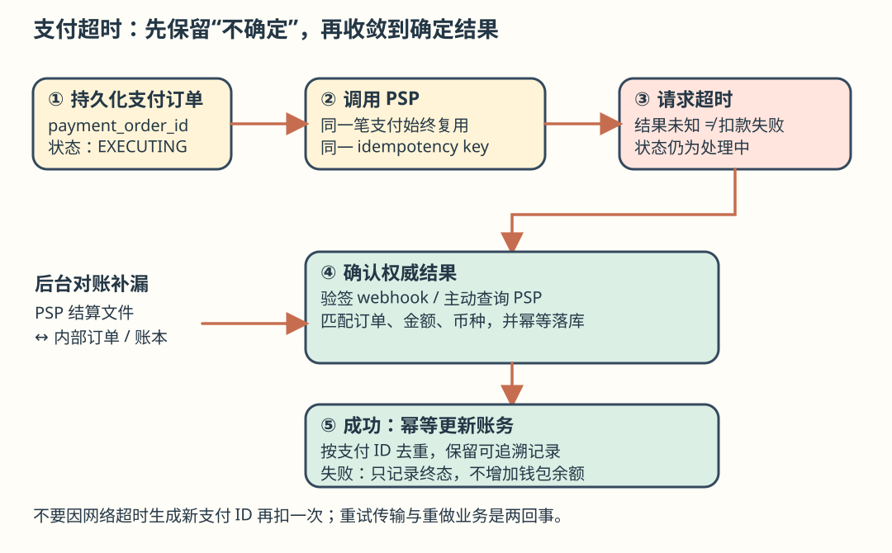

# 第 26 章：支付系统（Payment System）

> **学习导读**：写 CRUD 时，“返回失败”通常意味着可以重试；支付里，超时只表示你不知道结果，钱可能已经扣走。本章的主线是：记录支付意图 → 调用外部机构 → 幂等更新内部账务 → 用对账收敛不确定结果。
>
> 本文逐节翻译原版，保留原来的示例、表格和图片；新增解释以“批注”标明。原版只读。

## 引言（Introduction）

本章设计一个支撑现代电子商务的**支付系统**。支付系统用来结算金融交易，完成货币价值的转移。

---

## 第 1 步：理解问题并确定范围

下面的 C 表示候选人，I 表示面试官。

- **C**：要构建哪种支付系统？
- **I**：类似 Amazon.com 的电商支付后端，处理所有资金流动相关工作。
- **C**：支持信用卡、PayPal、银行卡等哪些支付方式？
- **I**：实际系统应支持这些方式；面试只考虑信用卡支付。
- **C**：我们自行处理信用卡交易吗？
- **I**：不，使用 Stripe、Braintree、Square 等第三方服务商。
- **C**：在系统里保存信用卡数据吗？
- **I**：出于合规原因，不直接保存，交给第三方支付处理商。
- **C**：是否全球服务，需要不同币种和跨境支付吗？
- **I**：应用面向全球，但面试假定只用一种货币。
- **C**：每天支持多少笔支付？
- **I**：100 万笔。
- **C**：是否需要付款流程，例如每月向收款方结算？
- **I**：需要。
- **C**：还需要注意什么？
- **I**：要支持对账，修复内部与外部系统通信造成的不一致。

> **批注｜原文措辞**：原问句写作“payout to payers”；结合本章 pay-out 定义，应理解为向卖家或收款方结算，而非向付款买家付款。

### 功能需求（Functional requirements）

- **收款（Pay-in）**：支付系统代表商家从顾客处收钱。
- **付款（Pay-out）**：支付系统向世界各地的卖家付钱。

### 非功能需求（Non-functional requirements）

- 可靠性与容错：必须谨慎处理失败支付。
- 建立内部系统与外部系统之间的对账机制。

### 粗略估算（Back-of-the-envelope estimation）

每天 100 万笔交易，粗略相当于每秒 10 笔。这对数据库而言吞吐量不高，因此不是本次面试重点。

> **批注｜量级和重点**：精算为 `1,000,000 / 86,400 ≈ 11.6 TPS`，原文取整为约 10 TPS。这里难的是“钱正确地移动一次”，而非把 SQL 跑得更快；实际还需另估峰值。

---

## 第 2 步：提出高层设计并取得共识

资金流动从高层看涉及三个参与者：


### 收款流程（Pay-in flow）

收款流程的高层结构如下：


- **支付服务（Payment service）**：接收支付事件并协调支付流程；通常会调用第三方服务执行风险检查，检查反洗钱（AML）违规或犯罪活动。
- **支付执行器（Payment executor）**：通过支付服务商执行一个支付订单；一个支付事件可以包含多个支付订单。
- **支付服务商（Payment Service Provider, PSP）**：把资金从一个账户转到另一个账户，例如从买家的信用卡账户转入电商银行账户。
- **卡组织（Card schemes）**：处理信用卡业务的组织，例如 Visa、MasterCard。
- **账本（Ledger）**：保存所有支付交易的财务记录。
- **钱包（Wallet）**：维护所有商家的账户余额。

一个收款流程示例：

1. 用户点击“下单”，支付事件发往支付服务。
2. 支付服务把事件存入数据库。
3. 支付服务为该事件中的每个支付订单调用支付执行器。
4. 支付执行器把支付订单存入自己的数据库。
5. 支付执行器调用外部 PSP 处理信用卡付款。
6. 付款处理完成后，支付服务更新钱包，记录卖家拥有的资金。
7. 钱包服务把更新后的余额写入数据库。
8. 支付服务调用账本，记录所有资金流动。

> **批注｜三种记录别混在一起**：支付订单回答“外部扣款进行到哪”；钱包回答“可用余额多少”；账本回答“这笔余额从何而来”。只保存余额无法解释历史，更无法可靠对账。

### 支付服务 API（APIs for payment service）

```json
POST /v1/payments
{
  "buyer_info": {...},
  "checkout_id": "some_id",
  "credit_card_info": {...},
  "payment_orders": [{...}, {...}, {...}]
}
```

`payment_order` 示例：

```json
{
  "seller_account": "SELLER_IBAN",
  "amount": "3.15",
  "currency": "USD",
  "payment_order_id": "globally_unique_payment_id"
}
```

注意：

- `payment_order_id` 会传给 PSP 用于支付去重，即幂等键（idempotency key）。
- `amount` 使用字符串，因为 `double` 不适合准确表示货币值。

```http
GET /v1/payments/{:id}
```

该接口根据 `payment_order_id` 返回单笔支付的执行状态。

> **批注｜API 与合规边界**：上面是原版概念结构，`{...}` 不是可解析 JSON。使用托管支付页时，`credit_card_info` 应替换为 PSP 令牌或引用，不能把原始卡号、CVV 当普通业务字段落库。金额可在边界用字符串传输，在内部用定点十进制或最小货币单位整数运算，并明确币种小数位。

### 支付服务数据模型（Payment service data model）

需要维护 `payment_events` 和 `payment_orders` 两张表。支付场景里，性能通常不是首要因素，强一致性才是。

选择数据库还要考虑：

- 市场上是否容易招聘到合适的 DBA。
- 是否有大型金融机构使用的成熟记录。
- 配套工具是否丰富。
- 原版倾向传统 SQL，而非 NoSQL/NewSQL，理由是 ACID 保证。

> **批注｜别把分类当保证**：ACID 能力与隔离级别取决于具体数据库和配置，不能简单认为所有 SQL 都满足需求或所有 NewSQL 都缺少 ACID。重点验证事务、唯一约束、故障恢复与运维能力。

`payment_events` 表：

| 字段 | 类型与含义 |
|---|---|
| `checkout_id` | string，主键 |
| `buyer_info` | string；原作者批注：可能更适合作为其他表的外键 |
| `seller_info` | string；原作者批注：同样可能更适合作为外键 |
| `credit_card_info` | 取决于卡服务商 |
| `is_payment_done` | boolean |

`payment_orders` 表：

| 字段 | 类型与含义 |
|---|---|
| `payment_order_id` | string，主键 |
| `buyer_account` | string |
| `amount` | string |
| `currency` | string |
| `checkout_id` | string，外键 |
| `payment_order_status` | enum：`NOT_STARTED`、`EXECUTING`、`SUCCESS`、`FAILED` |
| `ledger_updated` | boolean |
| `wallet_updated` | boolean |

注意：

- 一个支付事件关联多个支付订单。
- 收款流程不需要 `seller_info`，它只在付款流程中需要。
- 调用账本与钱包服务记录支付结果时，分别更新 `ledger_updated` 与 `wallet_updated`。
- 后台任务管理支付状态转移，检查处理中支付的最新状态；如果超过合理时限还未完成，就触发告警。

> **批注｜状态机是核心**：数据库成功写入 `EXECUTING`，不代表 PSP 扣款成功；`wallet_updated=true` 也不能替代账本凭证。每次跨服务副作用都需要独立的幂等标识、结果和可重试状态。

### 复式记账（Double-entry ledger system）

复式记账是支付系统的关键机制：每次资金操作同时记入两个账户。原版用“一方增加（credit）、另一方减少（debit）”解释，并给出下表：

| 账户 | 借方（Debit） | 贷方（Credit） |
|---|---:|---:|
| 买家（buyer） | $1 | |
| 卖家（seller） | | $1 |

所有分录采用带符号表达时，总和始终为零；它让系统中的资金流动可端到端追踪。

> **准确性批注**：会计中的借、贷不天然等于减少、增加，具体方向取决于资产、负债、收入等账户类型。应记忆“每笔凭证借方合计 = 贷方合计”，不要机械把 debit 当减法、credit 当加法。平衡只是必要条件；金额、币种和业务账户错了，仍可能平衡。

### 托管支付页（Hosted payment page）

为了避免保存信用卡资料，并减轻沉重的相关合规要求，多数公司倾向使用 PSP 提供的控件，由 PSP 存储卡资料并处理信用卡支付。


### 付款流程（Pay-out flow）

付款流程与收款流程的组件很相似，主要区别是：

- 钱从电商银行账户转入商家的银行账户。
- 可以使用 Tipalti 等第三方应付账款服务商。
- 付款同样涉及大量记账和监管要求。

---

## 第 3 步：深入设计

本节关注让系统更快、更健壮、更安全。

### PSP 集成（PSP Integration）

如果系统能直接连接银行或卡组织，可以不用 PSP；这种连接比较少见，通常只有能证明投资合理的大公司才会做。

走常规路径时，PSP 有两种集成方式：

- 系统可以收集支付信息时，通过 API 集成。
- 通过托管支付页，避免自行处理支付信息带来的监管工作。

托管支付页流程：


1. 用户在浏览器点击“结账”。
2. 客户端携带支付订单信息调用支付服务。
3. 支付服务收到信息后，向 PSP 发送支付注册请求。
4. PSP 收到币种、金额、过期时间等信息，以及用作幂等标识的 UUID；通常就是支付订单 UUID。
5. PSP 返回唯一标识这次支付注册的 token；支付服务把 token 存入数据库。
6. token 保存后，向用户展示 PSP 托管支付页，使用 token 与成功/失败跳转 URL 初始化页面。
7. 用户在 PSP 页面填写支付信息；PSP 处理支付并返回状态。
8. 用户跳回 `redirectURL`，例如 `https://your-company.com/?tokenID=JIOUIQ123NSF&payResult=X324FSa`。
9. PSP 同时异步通过 webhook 通知支付服务后端支付结果。
10. 支付服务根据收到的 webhook 记录支付结果。

> **批注｜不要信浏览器回跳就发货**：URL 参数和客户端页面不能充当权威付款凭证。后端应验证 webhook 签名、对象归属、金额与币种，并按幂等键落账；必要时向 PSP 查询。用户关掉页面也不应丢失付款结果。可参照 [Stripe 官方 webhook 验签示例](https://github.com/stripe/stripe-node/blob/master/examples/webhook-signing/express/main.ts)：验签使用原始请求体与签名头，不能先改写请求体再验证。



### 对账（Reconciliation）

前一节是支付成功路径；异常路径要靠后台对账发现并修复。每晚 PSP 发送结算文件，系统据此比较外部状态和内部状态。


同一过程也可发现内部账本与钱包等服务之间的不一致。财务团队处理差异，分为：

- 可分类的已知差异：可以使用标准流程调整。
- 可分类但不能自动处理：财务团队手工调整。
- 无法分类：财务团队手工调查，再调整。

> **批注｜对账是兜底，不是撤销历史**：保留原支付事件、PSP 参考号、金额、币种、结算日和凭证。修复账务通常新增补正记录，避免直接覆盖历史让问题不可追溯。

### 处理支付延迟（Handling payment processing delays）

支付通常几秒完成，但有时会花几小时，例如：

- 支付被标为高风险，需要人工审核。
- 信用卡要求额外保护，例如 3D Secure Authentication，需要持卡人补充验证。

处理办法：

- 等待 PSP 在完成后发送 webhook；如果 PSP 不提供 webhook，就轮询其 API。
- 向用户显示 `pending`，提供查询付款进度的页面；也可以在完成后发邮件。

### 内部服务通信（Communication among internal services）

服务之间有同步与异步两类通信。

同步通信（例如 HTTP）适合小规模系统，但规模增大后有这些问题：

- **性能低**：调用链涉及的服务越多，请求响应周期越长。
- **故障隔离差**：PSP 或其他服务失败，用户可能收不到响应。
- **耦合紧**：发送方必须知道接收方。
- **难扩展**：没有缓冲区，不容易应对突增流量。

异步通信可分两类：

**单接收方（Single receiver）**：多个消费者订阅同一主题，每条消息交给其中一个处理。


**多接收方（Multiple receivers）**：多个消费者订阅同一主题，每条消息分发给所有订阅方。


后一种适合支付，因为支付会触发由不同服务处理的多个副作用。同步方式更简单，但服务自主性不足；异步方式以简单性和即时一致性换取扩展性与韧性。

> **准确性批注**：原文把单接收方写作“消息只处理一次”。消费者分组只能决定由谁接收，不能独自保证业务只执行一次；故障重投仍需幂等处理。异步也不天然等于最终一致，需要补偿与对账使状态收敛。

### 处理失败支付（Handling failed payments）

每个支付系统都必须处理失败，使用的机制包括：

- **跟踪支付状态**：失败时依据状态决定重试还是退款。
- **重试队列**：将可重试支付送入重试队列。
- **死信队列（Dead-letter queue）**：最终失败的支付送入死信队列，供调查和调试。


### 恰好一次投递（Exactly-once delivery）

必须确保一笔支付只处理一次，避免重复扣款。原版将“恰好一次执行”拆为同时满足至少一次与至多一次。

通过重试实现“至少一次”：


常见重试间隔策略：

- **立即重试**：失败后立刻再次发送。
- **固定间隔**：等待固定时长后重试。
- **递增间隔**：每次逐渐增加等待时长。
- **指数退避（Exponential back-off）**：后一次间隔为前一次两倍。
- **取消**：错误是终止性错误，或已经达到重试上限时，客户端取消请求。

经验上默认使用指数退避；服务端通过 `Retry-After` 指定等待时长也是好做法。

重试可能造成重复支付：

- 用户点两次付款按钮，导致两次扣款。
- PSP 已成功处理，但账本或钱包没有完成，重试又让 PSP 再扣一次。

因此需要**幂等性（Idempotency）**：同一操作多次提交，仅产生一次业务效果。从 API 看，多次调用返回一致结果；通常用 UUID 作为请求头中的 `idempotency-key`。


数据库唯一约束可用于幂等：

1. 服务端尝试插入一条新记录。
2. 已存在的唯一键使插入失败。
3. 服务端识别该错误，向客户端返回已经存在的对象。

PSP 端也使用前述 nonce 去重，不重复处理同一 nonce。

> **批注｜幂等真正的边界**：唯一键要和业务状态的原子更新配合；同一键携带不同金额应拒绝。外部 PSP 与本地数据库没有共同事务，超时后应查原请求状态、复用原键，而不是生成新键。有限重试本身也不保证最终执行，超过阈值仍需人工处理或对账。实际还常加入抖动（jitter），避免重试同时涌入。可对照 [Stripe 官方客户端重试实现](https://github.com/stripe/stripe-node/blob/master/src/RequestSender.ts)理解同一逻辑请求如何携带幂等键；应用自己的重复提交仍需稳定业务键。

### 一致性（Consistency）

一次支付生命周期涉及 PSP、账本、钱包、支付服务等有状态组件。任意两个服务之间都可能通信失败。原版通过恰好一次处理与对账来实现最终一致性。

数据库复制存在延迟，用户可能从主库和副本读到不同数据。缓解方式包括：

- 全部读写走主库，副本仅用于冗余和故障切换。
- 使用 Paxos 或 Raft 等共识算法保持副本一致。
- 使用 YugabyteDB、CockroachDB 等基于共识的分布式数据库。

> **准确性批注**：共识保证已提交日志的一致性，不意味着任意时刻每个副本都已追平；强一致读仍需具体的读协议与路由保证。对 PSP 的外部副作用，数据库共识也无法替代幂等和对账。

### 支付安全（Payment security）

| 风险 | 原版列出的应对方式 |
|---|---|
| 请求/响应窃听 | 所有通信使用 HTTPS |
| 数据篡改 | 加密与完整性监测 |
| 中间人攻击 | SSL 与证书固定（certificate pinning） |
| 数据丢失 | 跨地域复制、数据快照 |
| DDoS | 限流与防火墙 |
| 卡资料盗取 | 系统使用 token，不保存真实卡资料 |
| PCI 合规 | 处理品牌信用卡的组织所需遵循的安全标准 |
| 欺诈 | 地址验证、CVV、用户行为分析等 |

> **准确性批注**：现代通信应使用 TLS；证书固定需要明确客户端适用性、轮换和恢复设计。托管 PSP 能缩小卡数据暴露范围，但并不自动免除全部 PCI 责任。加密也不能独自证明数据未被篡改，需认证与完整性校验。

---

## 第 4 步：收尾（Wrap Up）

还可以讨论：

- 监控与告警。
- 调试工具：帮助快速理解一笔支付为什么失败。
- 货币兑换：国际支付设计的重要部分。
- 地理差异：不同地区使用不同支付方式。
- 现金支付：原版指出其在印度、巴西等地很常见。
- Google Pay / Apple Pay 集成。

> **记忆卡**：先记录，再外调；不确定就查，重试复用键；余额靠账本解释，异常靠对账收敛。
>
> **面试模板**：“这题平均约 12 TPS，我优先保证正确性。支付订单持久化后用同一幂等键调用 PSP，通过验签 webhook 与主动查询确认结果，内部账本和钱包以幂等消息更新。超时维持处理中，使用退避重试与死信调查，最后用结算文件对账。”
