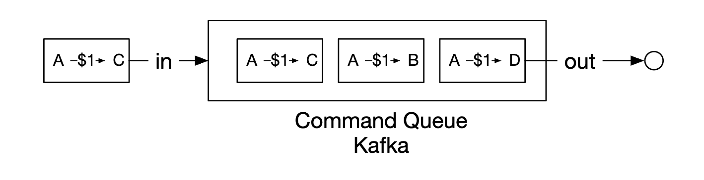
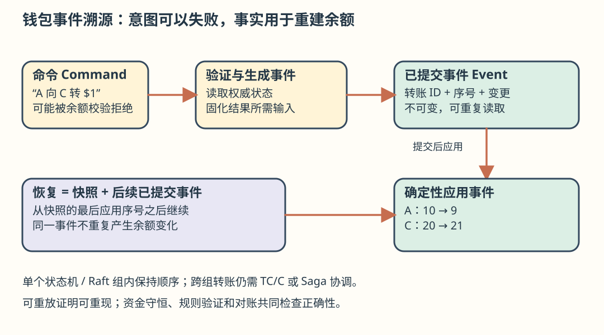
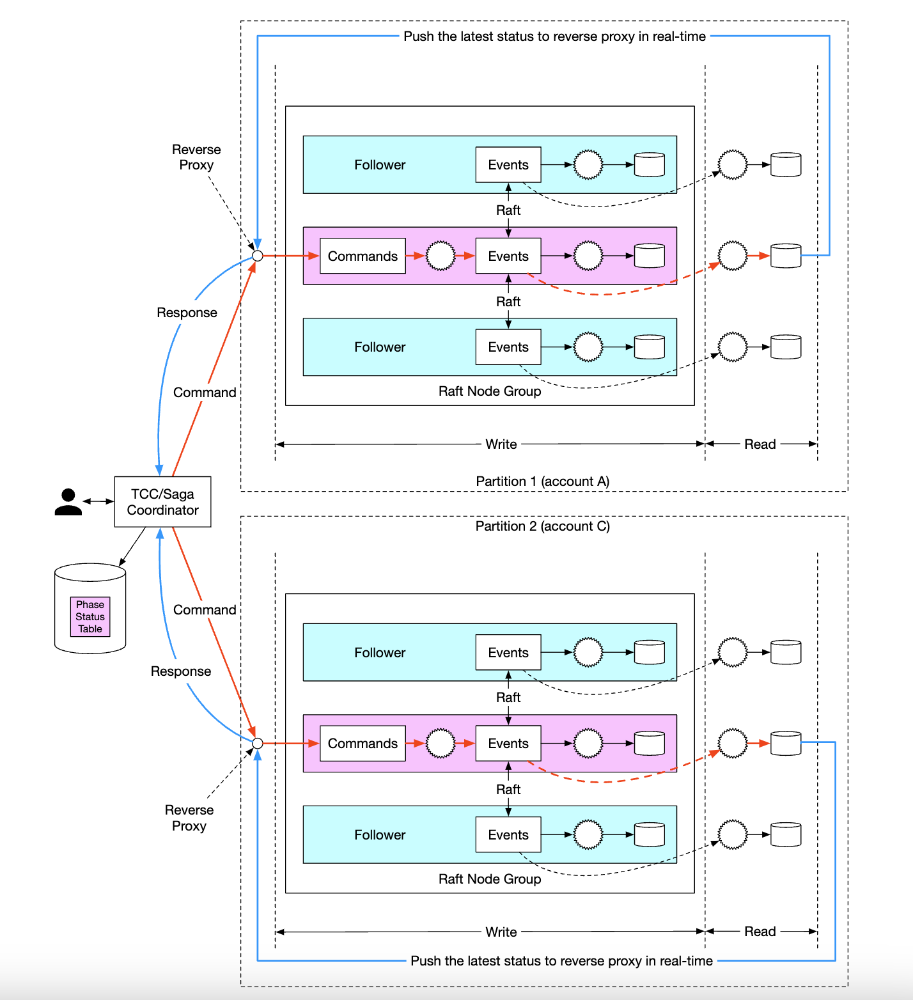

# 第 27 章：数字钱包（Digital Wallet）

> **学习导读**：普通 CRUD 常把当前值覆盖掉；钱包必须回答“余额为什么是这个数”。先理解一笔转账的两条腿，再理解跨库事务，最后用不可变事件解释历史并恢复系统。性能优化始终受“不能凭空多钱、不能少钱”的约束。
>
> 本文按原版逐节翻译，保留全部图、代码、表格和数字；新增解释与纠错均标为批注。原版不改。

## 引言（Introduction）

支付平台通常有钱包服务，用户可以把资金保存在应用中，之后再提现。用户也可以使用余额支付商品与服务，或转给同一数字钱包服务中的其他用户。这通常比经由传统支付网络转账更快、更便宜。


---

## 第 1 步：理解问题并确定范围

C 表示候选人，I 表示面试官。

- **C**：只关注钱包之间的转账吗？还需支持其他操作吗？
- **I**：目前只关注钱包间转账。
- **C**：系统要支持多少每秒交易数？
- **I**：假设为 100 万 TPS。
- **C**：钱包对正确性要求严格，可以认为事务保证足够吗？
- **I**：可以。
- **C**：需要证明正确性吗？
- **I**：可以用对账，但对账只能发现差异，不能展示根因。我们希望能从头重放数据，重建完整历史。
- **C**：可用性要求可以假设为 99.99% 吗？
- **I**：可以。
- **C**：需要考虑外汇吗？
- **I**：不需要，超出范围。

总结要求：

- 支持两个账户之间的余额转移。
- 支持 100 万 TPS。
- 原版称可靠性要求为 99.99%。
- 支持事务。
- 支持可重现性（reproducibility）。

> **批注｜指标口径**：这里的 99.99% 延续访谈中的“可用性”，并不是“允许万分之一的转账出错”。资金正确性不能用可用性百分比替代。

### 粗略估算（Back-of-the-envelope estimation）

原版假设云上一个传统关系数据库约支持 1,000 TPS。要达到 100 万 TPS，就要 1,000 个节点。但一笔转账有扣款、入账两条腿，因此实际需要处理约 200 万次账户操作/秒。

设计目标之一是提高单节点 TPS，从而减少数据库节点数。

| 单节点 TPS | 节点数量 |
|---:|---:|
| 100 | 20,000 |
| 1,000 | 2,000 |
| 10,000 | 200 |

> **批注｜这是容量模型，不是数据库定律**：1,000 TPS 是原版估算假设，取决于事务大小、持久化、索引、硬件和竞争程度。两条腿使“账户更新次数”翻倍，并不意味着所有实现都需要独立的两笔数据库事务；同分片可在一个本地事务中完成。

---

## 第 2 步：提出高层设计并取得共识

### API 设计（API Design）

本次面试只需要一个端点：

```http
POST /v1/wallet/balance_transfer
```

该接口从一个钱包向另一个钱包转移余额。请求参数：`from_account`、`to_account`、`amount`（字符串，避免精度丢失）、`currency`、`transaction_id`（幂等键）。

原版响应示例：

```text
{
    "status": "success"
    "transaction_id": "01589980-2664-11ec-9621-0242ac130002"
}
```

> **准确性批注**：原例缺少 `"success"` 后的逗号，所以不是有效 JSON；实际接口应补逗号。处理中的跨分片转账不能提前返回成功，要返回可查询的状态和稳定 `transaction_id`。

### 内存分片方案（In-memory sharding solution）

钱包应用维护每个账户的余额。可以使用 `map<user_id, balance>` 表示，并放进 Redis 内存存储。

一个 Redis 节点无法承担题设的 100 万 TPS，因此把 Redis 集群拆成多个分区。示例分区算法：

```text
String accountID = "A";
Int partitionNumber = 7;
Int myPartition = accountID.hashCode() % partitionNumber;
```

ZooKeeper 是高可用配置存储，可以保存分区数量和 Redis 节点地址。钱包服务本身无状态，负责执行转账，容易横向扩展。


这个方案解决了扩展问题，却不能原子地完成跨节点转账。

> **批注｜CRUD 直觉的陷阱**：先 `A -= 1`、再 `C += 1` 是两次写入；中间故障会让钱暂时消失。反过来先加再减，则可能让用户花掉尚未扣出的资金。示例 `%` 还要处理负哈希值，扩容时也会大规模重映射，不能直接当生产分片协议。

### 分布式事务（Distributed transactions）

一种方案是在分片关系数据库之上使用两阶段提交（Two-phase commit, 2PC）。


2PC 的流程：


1. 协调者（钱包服务）像通常一样在多个数据库执行读写。
2. 应用准备提交时，协调者要求全部数据库进入 prepare 状态。
3. 如果所有数据库回答“可以”，协调者通知它们提交。
4. 否则通知全部数据库中止事务。

2PC 的缺点：

- 锁竞争导致性能不理想。
- 协调者是单点故障。

> **批注｜关键不是“两次网络调用”**：prepare 后参与者必须保留可提交状态，可能持锁等待最终决定。协调者故障会造成阻塞；持久化决策与协调者恢复可以缓解，但不会消除跨节点往返和锁成本。

### Try-Confirm/Cancel 分布式事务（TC/C）

原版将 TC/C 视为使用补偿事务的 2PC 变体：

- 协调者要求所有数据库为事务预留资源。
- 收集数据库响应：全部成功则确认（Confirm），否则取消（Cancel）。

一个重要区别是：2PC 是一次逻辑事务，而 TC/C 的两个阶段各自执行独立的本地事务。

| 阶段 | 操作 | A | C |
|---|---|---|---|
| 1 | Try | 余额 -$1 | 不操作 |
| 2 | Confirm | 不操作 | 余额 +$1 |
| 2 | Cancel | 余额 +$1 | 不操作 |

**阶段 1：Try**


- 协调者在 A 的数据库启动本地事务，把余额减 $1。
- C 的数据库收到 NOP 指令，不执行任何操作。

**阶段 2a：Confirm**


- 如果两个数据库都回答成功，进入确认阶段。
- A 的数据库收到 NOP；C 的数据库通过本地事务把 C 的余额加 $1。

**阶段 2b：Cancel**


- 如果阶段 1 的任一操作失败，就进入取消阶段。
- A 的数据库把余额加回 $1；C 收到 NOP。

2PC 与 TC/C 对比：

| 方案 | 第一阶段 | 第二阶段：成功 | 第二阶段：失败 |
|---|---|---|---|
| 2PC | 事务尚未结束 | 原版写作提交/取消全部事务 | 取消全部事务 |
| TC/C | 各本地事务已结束：提交或取消 | 按需执行新的本地事务 | 反向补偿已经提交的事务 |

> **准确性批注**：2PC 的成功路径应为“提交全部已 prepare 的事务”，取消属于失败路径。这里保留原表含义并明确修正。

TC/C 也称为通过补偿实现的分布式事务，高层操作由业务逻辑管理。其他特点：

- 与数据库种类无关，只要数据库支持本地事务。
- 分布式事务的细节和复杂性由业务代码承担。

> **批注｜更容易理解的模型**：Try 像“把钱装进带转账号的封套”，Confirm 把封套交给对方，Cancel 把它退回来。生产系统通常区分可用余额与冻结金额；本章直接扣余额是简化示例。三个操作都要幂等，补偿不能把本来未扣的钱加回来。

### TC/C 的故障模式（TC/C Failure modes）

协调者中途崩溃后必须恢复中间状态。可以维护阶段状态表，并在数据库分片中以原子方式更新。


状态表包含：

- 分布式事务的 ID 与内容。
- Try 状态：未发送、已发送、已收到响应。
- 第二阶段名称：Confirm 或 Cancel。
- 第二阶段状态。
- 乱序标志（下文解释）。

TC/C 执行中，两个账户会短暂不一致：


只要能从该状态恢复，且用户不能利用中间状态消费，就可以接受。因此原版要求先扣款、后入账。

| Try 阶段选择 | 账户 A | 账户 C |
|---|---|---|
| 选择 1 | -$1 | NOP |
| 选择 2（无效） | NOP | +$1 |
| 选择 3（无效） | -$1 | +$1 |

选择 3 在本方案中无效，因为不使用 2PC，就不能保证不同数据库的两次操作同时原子完成。

> **批注｜先扣后加只是条件之一**：还需校验余额、冻结资源、防止并发超支、持久化事务阶段、幂等确认/补偿，保证未完成转账会被持续恢复。不能只靠执行顺序宣称资金安全。

还要处理乱序：


数据库可能先收到 Cancel，后收到 Try。可在状态表记录乱序标志；Try 到达时先检查标志，如果已标记取消，则返回失败。

> **记忆点**：Cancel 先到是“空回滚”，迟到的 Try 是“悬挂”。用事务号和持久化状态挡住迟到请求；单纯超时不能证明对端从未执行。

### Saga 分布式事务（Distributed transaction using Saga）

Saga 是微服务中实现分布式事务的常见方式：

1. 把全部操作按顺序排列，各自在自己的数据库里执行独立事务。
2. 从第一步依次执行到最后一步。
3. 某一步失败时，从已完成步骤开始反向执行补偿，直到流程起点。


有两种协调方式：

- **协同式（Choreography）**：参与服务订阅有关事件，自行执行属于自己的步骤。
- **编排式（Orchestration）**：一个协调者按正确顺序指挥各服务。

协同式把业务逻辑拆散在多个异步服务中，理解和管理更难。编排式更容易集中处理复杂性，因此数字钱包通常倾向使用它。

| 比较项 | TC/C | Saga |
|---|---|---|
| 补偿发生阶段 | Cancel | 回滚阶段 |
| 中央协调 | 有 | 编排模式下有 |
| 操作执行顺序 | 可任意安排 | 线性 |
| 可否并行执行 | 可以 | 本章线性模型不可以 |
| 是否可见部分不一致状态 | 可以 | 可以 |
| 逻辑所在层 | 应用 | 应用 |

原版认为主要区别是 TC/C 可并行，因此低延迟要求下可优先考虑 TC/C。无论使用哪一种，仍需审计与历史重放来恢复失败状态。

> **准确性批注**：并行能力取决于步骤依赖，Saga 也可以建模有独立分支的工作流；不能只按“Saga 必须慢”选型。补偿是新的业务动作，不是数据库级时间倒流，也可能失败，需要重试、告警与人工处置。

### 事件溯源（Event sourcing）

实际钱包被审计时，需要回答：

- 是否知道任意时刻的账户余额？
- 如何证明历史余额和当前余额正确？
- 代码修改后，如何验证系统逻辑仍然正确？

事件溯源有助于回答这些问题，包含四个概念：

- **命令（Command）**：现实世界期望执行的动作，如“从 A 向 B 转 $1”。原版要求命令有全局顺序，因此进入 FIFO 队列。
  - 命令可能失败，也可能因 I/O 或无效状态带来不确定性。
  - 命令产生零个或多个事件。
  - 生成事件的过程可能包含外部 I/O 等不确定输入，后面会再次讨论。
- **事件（Event）**：已经发生的事实，如“已从 A 向 B 转 $1”。
  - 与命令不同，事件陈述系统内发生过的事实。
  - 事件同样需要保持顺序，因此进入 FIFO 队列。
- **状态（State）**：事件导致的当前结果，例如账户到账户余额的键值映射。
- **状态机（State machine）**：驱动事件溯源，主要负责验证命令、应用事件并更新状态。
  - 状态机应当确定（deterministic），不读取外部 I/O、不依赖随机性。


动态过程如下：


钱包里的命令是余额转账请求，可以先放入 Kafka 等 FIFO 队列。



完整流程：


1. 状态机从命令队列读取命令。
2. 从数据库读取余额状态。
3. 验证命令；有效时，为两个账户分别生成事件。
4. 读取下一个事件，更新数据库里的余额状态。

> **批注｜把“意图”和“事实”分开**：命令可以是“转 $1”，事件应记录验证后的确定结果。外部汇率、时间、随机 ID 等输入若影响结果，应在事实中固化，重放时不能重新查询。Kafka 只保证分区内顺序；本章初始单状态机可用单有序流，后面的多分片系统不等于所有命令具有单一全局顺序。



事件溯源最大的优势是可重现性：所有状态更新保存为不可变的余额变更历史。只要重放起点以来的事件，就能重建历史余额；事件列表不可变且状态机确定，使中间状态可重建。


前面的审计问题可这样回答：

- **任意时刻余额**：从开始重放到目标时点。
- **历史和当前余额是否正确**：从头重新计算全部事件并检查。
- **改代码后如何验证**：用不同版本处理同一批事件，比较结果是否一致。

> **准确性批注**：能够重放证明过程可重现，不能单独证明业务规则正确。如果最初事件金额错了，重放也会得到同样错误。还要检查资金守恒、账户约束、来源凭证与外部对账；合法规则变化也可能有意改变派生结果，需有版本和迁移规则。

客户端余额查询可通过 CQRS（命令查询职责分离）处理：多个只读状态机根据同一不可变事件列表构建可查询的历史状态。


---

## 第 3 步：深入设计

仍需达到 100 万 TPS，因此本节讨论性能优化。

### 高性能事件溯源（High-performance event sourcing）

第一项优化是把命令和事件写到本地磁盘，替代 Kafka 等外部存储。这样避免网络延迟；又因为仅追加写入，对 HDD 通常也比较友好。

第二项优化是把最近命令和事件缓存在内存，省去重新从磁盘加载的时间。底层可使用 `mmap`，把本地文件映射进内存并利用内存缓存。


接着把状态也保存在本地文件系统中：SQLite 是基于文件的本地关系数据库，RocksDB 也是选择。原版选 RocksDB，因为其日志结构合并树（LSM）针对写操作优化，读取则使用缓存优化。


为了加快重放，定期将快照写入磁盘，避免每次从最初事件开始恢复。快照可以保存为大二进制文件，放到 HDFS 等分布式文件存储。


> **批注｜mmap 不是持久化开关**：映射成功、内存可见和断电后可恢复是不同事情，需要刷盘、提交边界及崩溃恢复协议。快照还应绑定已应用事件的序号；恢复时从该序号之后继续，避免漏放或重放两次。

### 可靠的高性能事件溯源（Reliable high-performance event sourcing）

这些优化让服务变得有状态，因此需要复制来保证可靠性。先判断哪些数据必须可靠：

- 状态和快照可以由事件重建，因此关键是事件列表可靠。
- 不能总从命令列表再生成同样事件，因为命令处理可能包含不确定性。
- 所以，重建余额所依赖的权威持久化对象是事件列表。

要让事件可靠，必须复制到多个节点，并保证：

- 不丢数据。
- 各副本日志中记录的相对顺序一致。

可使用 Raft 等共识算法。Raft 有活跃 leader 和被动 follower；leader 故障时由 follower 接替。多数节点可用时，系统可以继续运行。


此方案中所有节点都根据事件更新状态，Raft 保证已提交事件日志一致。

> **批注｜可靠性的前提**：这里的“不丢数据”依赖多数副本持久化、提交后才确认、正确选主等假设；不是所有副本任意故障仍能无损。请求幂等键、协调状态和审计要求可能也需要可靠保存，不能把“余额可从事件重建”误读为其他信息都可随意丢弃。

### 分布式事件溯源（Distributed event sourcing）

到这里，单节点性能和可靠性已经提高，但还存在限制：

- 单个 Raft 组容量有限，最终仍要分片，并实现分布式事务。
- CQRS 请求响应路径慢：客户端要轮询才能知道钱包是否更新。

轮询不是实时的，余额变化可能过一段时间才可见；频率过高又会压垮查询服务。


可以引入反向代理，代用户发送命令和轮询结果。


代理可用一次请求查询多个用户，降低负载，但仍不能提供即时回执。因此进一步让只读状态机在结果可用后主动推送给反向代理，使用户更快看到更新。


最后把系统拆成多个 Raft 组，由编排器通过 TC/C 或 Saga 在组之间协调分布式事务。



最终系统中一次余额转账的生命周期示例：

1. 用户 A 向 Saga 协调者发送包含 `A-1`、`C+1` 两个操作的事务。
2. 协调者在阶段状态表创建记录，跟踪事务状态。
3. 协调者确定各命令应发送到哪些分区。
4. 分区 1 的 Raft leader 收到 `A-1`，验证命令、转换为事件，并复制到组内其他节点。
5. 事件结果同步到只读状态机，状态机把响应推送给协调者。
6. 协调者记录第一步成功，再执行 `C+1`。
7. 第二步同样经过确定分区、发送命令、执行、只读状态机推送响应。
8. 协调者记录第二步成功，最后通知客户端结果。

> **批注｜推送快不等于账务已完成**：回执必须关联事务号与明确阶段。代理断开重连后仍应可查询权威结果；协调者收到重复回执也不能再次入账。跨组仍可能短暂处于中间状态，Raft 只解决组内复制，不自动解决组间事务。

---

## 第 4 步：收尾（Wrap Up）

本章设计的演进路线：

1. 先用内存 Redis；原版指出问题是它不是持久存储。
2. 改用关系数据库，并以 2PC、TC/C 或 Saga 执行分布式事务。
3. 引入事件溯源，使操作可审计。
4. 初始使用外部数据库与队列保存数据，但性能不足。
5. 改为本地文件存储，利用追加写入，并缓存读路径。
6. 本地方案性能高，却仍有单点故障风险；引入 Raft 共识与复制。
7. 采用 CQRS 与反向代理，代用户管理事务生命周期。
8. 最后将数据拆成多个 Raft 组，用 TC/C 或 Saga 统筹跨组事务。

> **准确性批注**：Redis 支持持久化配置，本地文件也可以是持久存储；这两处原文真正要强调的是所述方案还未具备完整的故障恢复与副本保证。选型应区分持久化、复制、可用性、跨分片原子性四件事。
>
> **记忆卡**：余额是结果，事件是历史；命令可失败，事实不可重写；单组靠共识，多组靠事务；快照省时间，对账查正确性。
>
> **面试模板**：“我把转账号作为幂等键，先保证扣款和入账两条腿可恢复，再用事件保存确定结果。单组用顺序日志和 Raft 提供一致的已提交历史，CQRS 服务查询，快照加速恢复；超过单组吞吐后，按账户分片，由协调者通过 TC/C 或 Saga 完成跨组转账。”

> **参考答案**：[P27-01](../29.%20%E8%87%AA%E6%B5%8B%E9%A2%98%E8%AF%A6%E8%A7%A3/README.md#p27-01) · [P27-02](../29.%20%E8%87%AA%E6%B5%8B%E9%A2%98%E8%AF%A6%E8%A7%A3/README.md#p27-02) · [P27-03](../29.%20%E8%87%AA%E6%B5%8B%E9%A2%98%E8%AF%A6%E8%A7%A3/README.md#p27-03)。先独立作答，再逐题核对推导与图解。
