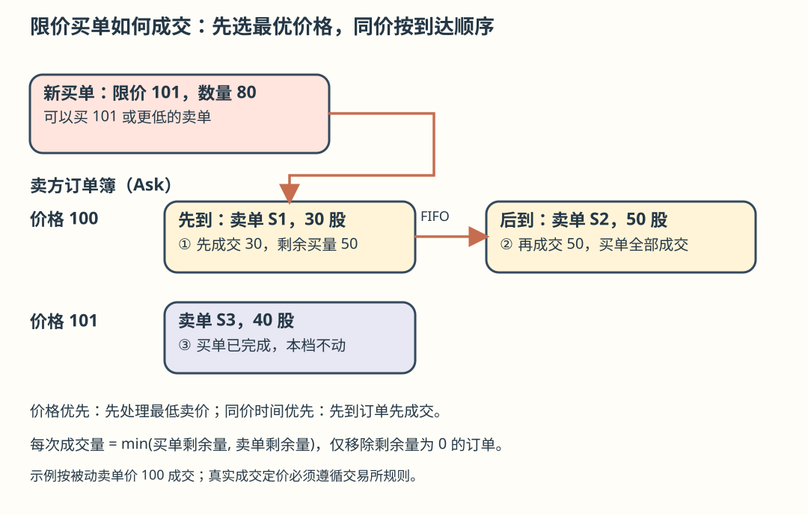
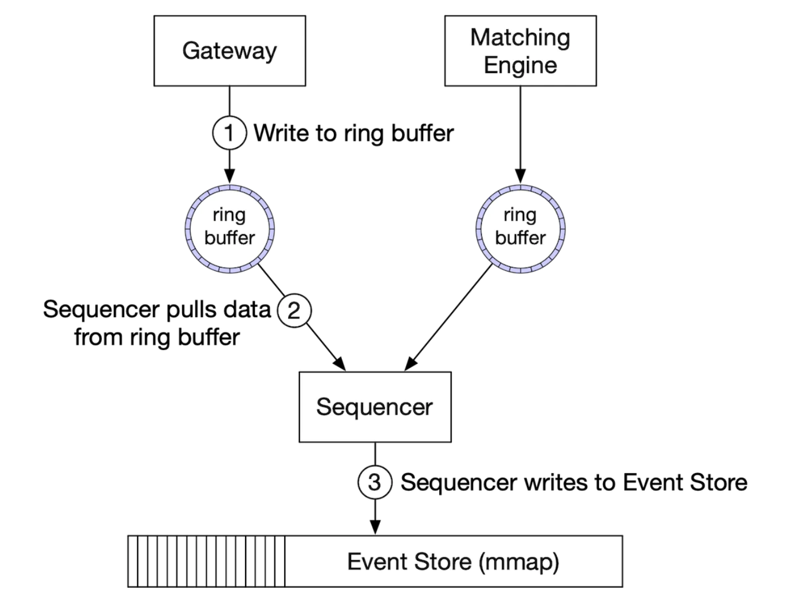

# 第 28 章：证券交易所（Stock Exchange）

> **学习导读**：CRUD 系统常靠多线程和数据库锁协调状态；撮合系统更关注“所有人看到同样的事件顺序，并算出同样的结果”。先掌握价格优先、同价时间优先，再理解顺序日志、内存订单簿和故障重放。
>
> 本文按原版逐节翻译，保留全部图片、数据模型、API、表格含义及伪代码；不严谨之处在附近用批注解释，原版文件不改。

## 引言（Introduction）

本章设计一个**电子证券交易所**，基本功能是高效地撮合买家和卖家。主要证券交易所包括 NYSE、NASDAQ 等。


---

## 第 1 步：理解问题并确定范围

C 表示候选人，I 表示面试官。

- **C**：交易哪类证券：股票、期权还是期货？
- **I**：为简化只考虑股票。
- **C**：支持下单、撤单、改单吗？支持限价、市价、条件单吗？
- **I**：支持下单和撤单，只考虑限价单。
- **C**：需要盘后交易吗？
- **I**：不，只支持正常交易时段。
- **C**：请描述交易所基本功能。
- **I**：客户可以下限价单或撤单，实时收到成交结果，并实时查看订单簿。
- **C**：规模多大？
- **I**：同时交易的用户数以万计，约 100 个股票代码，每天数十亿订单；还要有合规风险检查。
- **C**：哪些风险检查？
- **I**：简单规则即可，例如限制用户一天最多交易 100 万股 Apple 股票。
- **C**：用户钱包如何参与？
- **I**：下单前必须确认资金充足；挂单所占资金要冻结，直到订单终结。

### 非功能需求（Non-functional requirements）

访谈给出的规模意味着一个中小型交易所，同时要有将来增加股票代码与用户的灵活性。

- **可用性**：至少 99.99%，停机有损声誉。
- **容错**：需要容错和快速恢复，限制生产事故影响。
- **延迟**：往返延迟应在毫秒量级，重点看第 99 百分位（P99）；P99 长期偏高会让一部分用户体验很差。
- **安全**：需要账户管理与 KYC 身份验证以支持合规，并保护公开资源免受 DDoS。

### 粗略估算（Back-of-the-envelope estimation）

- 100 个股票代码，每天 10 亿订单。
- 正常交易时间为 09:30–16:00，共 6.5 小时。
- `QPS = 10 亿 / 6.5 / 3600 ≈ 43,000`。
- `峰值 QPS = 5 × QPS ≈ 215,000`。
- 开盘时交易量显著更高。

> **批注｜订单量不等于成交量**：一笔订单可能不成交、部分成交或匹配多个对手方；撤单也是要排序处理的命令。容量估算应把入站命令、成交回报和行情扇出分开。

---

## 第 2 步：提出高层设计并取得共识

### 业务基础（Business Knowledge 101）

**券商（Broker）**连接交易所与终端用户，例如 Robinhood、Fidelity。机构客户通过专用交易软件交易大额数量，需要专门处理；例如大额交易拆单，以降低对市场价格的冲击。

订单类型：

- **限价单（Limit）**：按指定价格或更有利价格买卖；可能无法立即成交，也可能只部分成交。
- **市价单（Market）**：不指定价格，按当前可获得的市场价格执行。

报价：

- **买价（Bid）**：买方愿意支付的价格；最佳买价是其中最高价。
- **卖价（Ask）**：卖方愿意接受的价格；最佳卖价是其中最低价。

> **准确性批注**：原文说市价单立即按当前市价执行。实际执行仍取决于流动性、停牌和交易规则，可能跨多个价位并发生滑点；本题只设计限价单。

原版将美国市场报价分为 L1、L2、L3：

**L1** 包含最佳买卖价格与对应数量。


**L2** 包含更多价格档位。


**L3** 展示各档位及排队数量。


> **批注｜深度的区别**：L2 通常按价格聚合数量，L3 通常提供更细的逐订单信息及队列变化；具体字段取决于交易所数据产品。不要把“多个档位”直接等同于 L3。

**蜡烛图（Candlestick）**展示给定时间区间内的开盘价、收盘价、最高价和最低价。


**FIX** 是交换证券交易信息的协议，被许多服务商采用。原版交易消息示例：

```text
8=FIX.4.2 | 9=176 | 35=8 | 49=PHLX | 56=PERS | 52=20071123-05:30:00.000 | 11=ATOMNOCCC9990900 | 20=3 | 150=E | 39=E | 55=MSFT | 167=CS | 54=1 | 38=15 | 40=2 | 44=15 | 58=PHLX EQUITY TESTING | 59=0 | 47=C | 32=0 | 31=0 | 151=15 | 14=0 | 6=0 | 10=128 |
```

> **批注**：示例用 `|` 让分隔符可读；真实 FIX 编码通常使用 SOH 字节，不能直接把展示字符串原样发到生产接口。

### 高层设计（High-level design）


**交易流（Trade flow）**：

1. 客户通过交易界面下单。
2. 券商把订单发给交易所。
3. 订单经客户端网关进入，完成验证、限流、认证等，再送订单管理器。
4. 订单管理器根据风险管理器设置的规则进行风险检查。
5. 风险检查通过后，订单管理器确认钱包有足够资金。
6. 订单送入撮合引擎；匹配后，为买卖双方分别生成成交回报（execution/fill）。订单和回报经排序，使处理结果确定。
7. 成交回报返回客户。

**行情流（M1–M3）**：

1. 撮合引擎产生执行结果流，发送给行情发布器。
2. 行情发布器构建蜡烛图，送给数据服务。
3. 行情存入适合实时分析的专用存储；券商连接数据服务获得及时行情。

**报告流（R1–R2）**：

1. 报告器收集订单和成交中需要的字段，写入数据库。
2. 字段包括 `client_id`、`price`、`quantity`、`order_type`、`filled_quantity`、`remaining_quantity`。

交易流位于关键路径，其余两条流不在，因此延迟要求不同。

#### 交易流（Trading flow）

交易流必须针对低延迟做重点优化。核心是**撮合引擎（Matching engine / Cross engine）**，职责包括：

- 维护每个股票代码的订单簿，即该股票的买卖订单列表。
- 撮合买卖单，每次成交为买方和卖方分别生成一个 fill；必须快而准确。
- 将执行结果流分发为行情数据。
- 按确定顺序产生成交；这是高可用与重放的基础。

**排序器（Sequencer）**为入站订单和出站成交回报打上序列 ID，使撮合引擎可以确定地工作。


对入站和出站记录编号有几个目的：

- 及时性与公平性。
- 快速恢复和重放。
- 支持恰好一次处理保证。

概念上可用 Kafka 作为入站与出站消息队列来承担排序器职责；本章为降低延迟选择自行实现。

> **批注｜序号不是万能保证**：序号用于发现重复、缺口和乱序，但还需要持久化处理位置、去重规则以及与输出提交的协调，才能避免重复产生业务效果。“公平”也要定义排序边界，不能凭一个递增数字就证明所有网络路径公平。

**订单管理器（Order manager）**管理订单状态，并向撮合引擎发订单、接收 fill：

- 发送订单做风险检查，例如确认用户交易量未超过 100 万股。
- 检查钱包资金能否覆盖订单。
- 经排序器把订单送入撮合引擎；为降低带宽，只传必要信息。
- 从排序器收到成交回报，再经客户端网关发给券商。

订单管理器最大的挑战是状态转换；事件溯源是一种可行方案，后文深入讨论。

**客户端网关（Client gateway）**接收用户订单并转交订单管理器，其职责见原图：


网关在关键路径上，应保持轻量。不同客户可有不同网关。例如 **colo engine** 是券商租放在交易所数据中心的交易引擎服务器。


#### 行情流（Market data flow）

行情发布器接收撮合引擎的执行结果，构建订单簿与蜡烛图，再交给数据服务向订阅者展示聚合数据。


> **准确性批注**：仅有“已成交结果”不能重建完整订单簿，因为未成交新单、撤单和其他簿变化也会改变深度。重建订单簿需要完整的有序订单簿事件流或快照加增量；成交流可用于构建成交型 OHLCV 蜡烛图。后文原版同样简写为“用成交重建”，均应按此边界理解。

#### 报告流（Reporting flow）

报告器不在关键路径上，但仍很重要。


它负责交易历史、税务报告、合规报告、结算等。延迟不是首要要求，准确性与合规更重要。

### API 设计（API Design）

客户经券商与交易所交互，完成下单、看成交与行情、下载历史数据分析等操作。客户端网关与券商之间采用 RESTful API；机构客户为了低延迟，可以使用专用协议。

#### 创建订单（Create order）

```http
POST /v1/order
```

| 请求参数 | 含义 | 类型 |
|---|---|---|
| `symbol` | 股票代码 | String |
| `side` | buy 或 sell | String |
| `price` | 限价单价格 | Long |
| `orderType` | limit 或 market；本设计只支持 limit | String |
| `quantity` | 订单数量 | Long |

| 响应字段 | 含义 | 类型 |
|---|---|---|
| `id` | 订单 ID | Long |
| `creationTime` | 系统创建时间 | Long |
| `filledQuantity` | 已成交数量 | Long |
| `remainingQuantity` | 尚未成交数量 | Long |
| `status` | new / canceled / filled | String |
| 其余字段 | 与请求中的属性相同 | 同请求 |

> **批注｜实现时补齐协议**：`price` 使用整数需明确最小价位和缩放因子；时间需明确秒、毫秒或纳秒。部分成交应能用状态或数量无歧义表达；冻结金额要随成交、撤单释放。原版未给撤单 API，生产接口还需补充身份校验、幂等和撤单结果语义。

#### 查询成交（Get execution）

```http
GET /execution?symbol={:symbol}&orderId={:orderId}&startTime={:startTime}&endTime={:endTime}
```

| 请求参数 | 含义 | 类型 |
|---|---|---|
| `symbol` | 股票代码 | String |
| `orderId` | 订单 ID，可选 | String |
| `startTime` | 查询开始的 epoch 时间；原文带参考标记 `[11]` | Long |
| `endTime` | 查询结束的 epoch 时间 | Long |

| 响应字段 | 含义 | 类型 |
|---|---|---|
| `executions` | 范围内的成交记录数组，元素字段如下 | Array |
| `id` | 成交 ID | Long |
| `orderId` | 订单 ID | Long |
| `symbol` | 股票代码 | String |
| `side` | buy 或 sell | String |
| `price` | 成交价格 | Long |
| `orderType` | limit 或 market | String |
| `quantity` | 已成交数量 | Long |

#### 查询订单簿（Get order book）

```http
GET /marketdata/orderBook/L2?symbol={:symbol}&depth={:depth}
```

| 请求参数 | 含义 | 类型 |
|---|---|---|
| `symbol` | 股票代码 | String |
| `depth` | 买、卖每侧返回的档位深度 | Int |

响应包含 `bids` 与 `asks` 两个数组，每项有价格（price）与数量（size）。

#### 查询蜡烛图（Get candlesticks）

```http
GET /marketdata/candles?symbol={:symbol}&resolution={:resolution}&startTime={:startTime}&endTime={:endTime}
```

| 请求参数 | 含义 | 类型 |
|---|---|---|
| `symbol` | 股票代码 | String |
| `resolution` | 蜡烛图区间长度，秒 | Long |
| `startTime` | 区间开始的 epoch 时间 | Long |
| `endTime` | 区间结束的 epoch 时间 | Long |

| 响应字段 | 含义 | 类型 |
|---|---|---|
| `candles` | 蜡烛图数据数组 | Array |
| `open` | 每根蜡烛的开盘价 | Double |
| `close` | 收盘价 | Double |
| `high` | 最高价 | Double |
| `low` | 最低价 | Double |

> **批注**：保留原版行情 API 的 `Double` 类型；涉及金额准确计算或与撮合价格一致时，定点整数/十进制更合适。历史显示和核心撮合的数值协议应保持可明确转换。

### 数据模型（Data models）

系统有三类主要数据：

- 产品、订单、成交（Product, order, execution）。
- 订单簿（Order book）。
- 蜡烛图（Candlestick chart）。

#### 产品、订单与成交

产品描述某个可交易代码的属性，例如产品类型、交易代码、UI 展示代码。数据更新不频繁，主要用于界面展示。

订单表示买入或卖出指令；成交是撮合后的出站结果。数据模型如下：


三条流程都使用订单和成交：

- 关键路径在内存处理，以获得高性能，并通过排序器存储与恢复。
- 报告器把订单和成交写进数据库供报告使用。
- 成交发送到行情系统，参与订单簿与蜡烛图构建（完整订单簿还需要前述簿变化事件）。

#### 订单簿（Order book）

订单簿是按价格档位组织的某个标的买卖订单列表。高效的数据结构应满足：

- 快速查询某一价位或价位区间的数量；原版要求常数时间。
- 快速新增、成交、撤单。
- 查询最佳买卖价。
- 遍历价格档位。

订单执行示例：


大额订单消耗卖盘后，新的最佳卖价可能更高，买卖价差也可能扩大。

> **准确性批注**：原版概括为成交后“价格上涨、价差扩大”，这取决于订单方向与剩余深度，并非所有大单都如此。哈希表可让单档定位平均 O(1)，但任意价格区间求和、排序与最佳档维护通常需要额外结构，不能全部无条件 O(1)。

原版订单簿伪代码：

```text
class PriceLevel{
    private Price limitPrice;
    private long totalVolume;
    private List<Order> orders;
}

class Book<Side> {
    private Side side;
    private Map<Price, PriceLevel> limitMap;
}

class OrderBook {
    private Book<Buy> buyBook;
    private Book<Sell> sellBook;
    private PriceLevel bestBid;
    private PriceLevel bestOffer;
    private Map<OrderID, Order> orderMap;
}
```

用双向链表替换普通列表，可以提高订单队列操作效率：

- 下单追加到队尾，为 O(1)。
- 撮合从队首取出订单，单次队首操作为 O(1)。
- 撤单使用 `orderMap` 以 O(1) 定位订单，再借助订单中的前后节点引用以 O(1) 删除。


同样的数据结构也可供行情服务重建订单簿。

> **批注｜复杂度边界**：O(1) 指已经找到价位和节点后的单次链表操作。新建/删除价格档、跨多个订单撮合、跨价位扫单，以及有序索引维护都有额外成本。



#### 蜡烛图（Candlestick chart）

行情服务在时间窗口内处理事件，计算蜡烛图数据。原版用“处理订单”描述此过程：

```text
class Candlestick {
    private long openPrice;
    private long closePrice;
    private long highPrice;
    private long lowPrice;
    private long volume;
    private long timestamp;
    private int interval;
}

class CandlestickChart {
    private LinkedList<Candlestick> sticks;
}
```

> **准确性批注**：常见交易蜡烛图的 OHLCV 按成交计算，挂单和撤单不能直接当成交量。若构建报价型图表，应在产品中另行定义。

避免内存过多的优化：

- 用预分配的环形缓冲区保存蜡烛，减少内存分配。
- 限制内存中的蜡烛数量，其余落盘。

使用 KDB 等内存列式数据库做实时分析；收盘后持久化到历史数据库。

---

## 第 3 步：深入设计

原版指出，一些现代交易所与常见软件不同，会把关键组件部署在一台大型服务器上。下面沿这种低延迟方案展开。

> **批注｜范围限定**：这是一种撮合关键路径设计，不代表所有交易所把账户、清算、监管报告等全部系统放在一台机器。实际部署取决于分区、容灾和性能目标。

### 性能（Performance）

交易所要关注各延迟百分位，尤其长尾。降低延迟的两条路径：

- 减少关键路径上的任务数量。
- 减少每个任务耗时，包括网络、磁盘和计算时间。

原版为第一点移除所有额外职责，甚至把普通日志写入移出关键路径。高层分布式设计仍有跨服务网络延迟和排序器磁盘 I/O 瓶颈；可能做到几十毫秒，而这里进一步追求几十微秒。

于是把关键组件放在一台服务器，以 `mmap` 事件存储进行进程间通信。


再使用固定在同一个 CPU 上的应用循环（application loop），循环执行关键任务，以减少上下文切换。


单执行者循环还可以避免多个线程争抢同一资源的锁竞争。

`mmap` 是 UNIX 系统调用，把磁盘文件映射到应用的地址空间。原版还提出在 `/dev/shm` 创建文件；这是共享内存路径，从而避免热路径访问普通磁盘文件。

> **准确性批注**：`/dev/shm` 常见于 Linux，不能当作所有 UNIX 的通用路径。共享内存通常不具备断电持久性，还需可靠日志和复制；所谓移除日志指非必要诊断日志，不应删除用于重放和审计的权威交易记录。CPU 绑核减少迁移，不能保证操作系统永不抢占；单线程也只有在状态所有权明确时才避免锁竞争。

### 事件溯源（Event sourcing）

事件溯源在[数字钱包章](../27.%20%20Digital%20Wallet/README.md)详细讨论。原版链接 `../chapter28` 与本仓库目录不匹配，这里修正到实际中文章节。

简而言之，不只保存当前状态，而是保存不可变的状态转移。


- 左边是传统 schema。
- 右边是事件溯源 schema。

当前设计：


1. 外部通过 FIX 协议与客户端网关交互。
2. 订单管理器收到新订单事件，验证并加入内部状态，再送入撮合核心。
3. 如果撮合成功，生成 `OrderFilledEvent`，经 mmap 发送。
4. 其他组件订阅事件存储，完成各自处理。

进一步优化：各组件持有打包成库的订单管理逻辑副本，避免管理订单时额外调用。

排序器在此方案中不再直接充当事件存储，而是单写者，先为事件排序，再送入事件存储。



> **批注｜可重放的条件**：相同初始状态、相同有序输入、相同版本规则，应产生相同结果。时间、随机数和外部数据若影响撮合，必须成为明确输入；各组件拥有逻辑副本也不意味着可以各自任意修改权威订单状态。

### 高可用（High availability）

目标 99.99% 可用性，折合每天约 8.64 秒不可用预算。

为达成目标，应识别单点：

- 为撮合引擎等关键服务准备待命副本。
- 自动检测故障并快速切换到副本。

客户端网关等无状态服务容易通过增加服务器横向扩展。有状态组件的非 leader 副本可以处理入站事件，保持状态同步，但不发布出站事件。


可通过心跳检测主副本故障。这一进程级机制的范围最初局限于单台服务器；扩展容错范围时，可以把整台服务器部署为热/温备，并在故障时切换。

原版建议用可靠 UDP 在服务器之间复制事件存储，以降低通信延迟。

> **批注｜心跳不等于死亡证明**：网络延迟可能让健康主机被误判，必须有任期、仲裁和 fencing，避免两台同时发布成交。所谓可靠 UDP 是在 UDP 上增加序号、重传、缺口恢复等协议；原生 UDP 不可靠。

### 容错（Fault tolerance）

如果温备也故障，虽然概率较低，仍需准备。大型公司通常把核心数据复制到多个城市，减轻自然灾害等影响。

需要回答：

- 主实例下线，什么时候、怎样切换到备份？
- 从备份中如何选主？
- 恢复时间目标 RTO 是多少？
- 必须恢复哪些功能，能否降级运行？

可采取：

- 软件 bug 可能同时影响主副本；用混沌工程暴露边界和灾难场景。
- 在掌握足够故障模式之前，初期可人工执行切换。
- 使用 Raft 等选主机制，在主节点失效时确定新的 leader。

跨服务器复制示例：


选举任期示例：


Raft 工作方式可参考[交互说明](https://thesecretlivesofdata.com/raft/)。

最后还要考虑允许丢失多少数据，这会影响备份频率。原版认为交易所不能接受数据丢失，因此要频繁备份，并依靠 Raft 复制降低丢失概率。

> **准确性批注**：备份频率定义恢复点目标 RPO 的一部分，单靠“经常备份”不能确保已确认成交零丢失。需要在确认前达到规定的持久化/复制提交条件，另有跨故障域灾备；Raft 也依赖多数节点与持久化假设。

### 撮合算法（Matching algorithms）

下面完整保留原版伪代码，用于理解结构；它不是可直接上线的撮合实现。

```text
Context handleOrder(OrderBook orderBook, OrderEvent orderEvent) {
    if (orderEvent.getSequenceId() != nextSequence) {
        return Error(OUT_OF_ORDER, nextSequence);
    }

    if (!validateOrder(symbol, price, quantity)) {
        return ERROR(INVALID_ORDER, orderEvent);
    }

    Order order = createOrderFromEvent(orderEvent);
    switch (msgType):
        case NEW:
            return handleNew(orderBook, order);
        case CANCEL:
            return handleCancel(orderBook, order);
        default:
            return ERROR(INVALID_MSG_TYPE, msgType);

}

Context handleNew(OrderBook orderBook, Order order) {
    if (BUY.equals(order.side)) {
        return match(orderBook.sellBook, order);
    } else {
        return match(orderBook.buyBook, order);
    }
}

Context handleCancel(OrderBook orderBook, Order order) {
    if (!orderBook.orderMap.contains(order.orderId)) {
        return ERROR(CANNOT_CANCEL_ALREADY_MATCHED, order);
    }

    removeOrder(order);
    setOrderStatus(order, CANCELED);
    return SUCCESS(CANCEL_SUCCESS, order);
}

Context match(OrderBook book, Order order) {
    Quantity leavesQuantity = order.quantity - order.matchedQuantity;
    Iterator<Order> limitIter = book.limitMap.get(order.price).orders;
    while (limitIter.hasNext() && leavesQuantity > 0) {
        Quantity matched = min(limitIter.next.quantity, order.quantity);
        order.matchedQuantity += matched;
        leavesQuantity = order.quantity - order.matchedQuantity;
        remove(limitIter.next);
        generateMatchedFill();
    }
    return SUCCESS(MATCH_SUCCESS, order);
}
```

该示例在同价位内使用 FIFO，先进入队列的订单先成交。

> **准确性批注｜不能照抄这段 `match`**：
>
> - 限价买单应依次吃掉价格 `≤ 买入限价` 的最佳卖档，限价卖单处理价格 `≥ 卖出限价` 的最佳买档；只查 `get(order.price)` 会漏掉更优价格。
> - 每次成交量应是买卖双方**剩余量**的较小值，不能一直与原始 `order.quantity` 比较。
> - 需要同时更新双方剩余量、价格档总量、订单索引与最佳价；对手单未完全成交不能直接移除。
> - 新单剩余部分要按规则入簿；还需推进序号、验证撤单所有权，并明确成交价格与重复命令处理。
> - `limitIter.next` 在原文是伪代码表达，不能假定重复调用仍指向同一订单。
>
> **正确的记忆顺序**：取最优对手档 → 检查是否满足限价 → 取该档队首 → 按双方剩余量成交 → 更新双方 → 清理空订单/空档 → 继续，剩余新单再入簿。

### 确定性（Determinism）

前面的排序器用于保证功能确定性；墙上时钟的实际时刻不应改变相同有序输入的结果。


还需跟踪延迟的稳定性，监控 P99 或 P99.99。Java 等运行时的垃圾回收可能导致延迟尖峰。

> **批注｜两个“确定”不同**：功能确定性是重复计算得到相同结果；延迟稳定性是耗时波动可控。顺序一致不自动带来低尾延迟。若过期或交易时段影响规则，时间必须显式纳入有序输入。

### 行情发布器优化（Market data publisher optimizations）

行情发布器接收撮合结果，构建订单簿和蜡烛图（订单簿需要完整变化事件，见前文批注）。内存有限，因此只保留部分蜡烛。客户可以选择粒度，更细的数据可能价格更高。


**环形缓冲区（Ring buffer / Circular buffer）**是首尾相连的固定大小队列。提前分配内存避免频繁分配；原文还将其描述为无锁数据结构。

另一项优化是 padding，让序列号不与其他热数据放在同一条缓存行，以减少伪共享。

> **准确性批注**：环形缓冲区并非天然无锁；单生产者/单消费者和多生产者协议不同，要明确内存可见性、序号发布和满缓冲区处理。padding 旨在隔离独立写入的热字段，也要考虑实际缓存行布局。

### 行情分发公平性与组播（Distribution fairness of market data and multicast）

如果订阅者比别人更早获得数据，就可能获得重要的交易优势。原版希望订阅者同时收到行情，提出通过可靠 UDP 组播发布数据。

数据传输有三种模式：

- **单播（Unicast）**：一个源发往一个目标。
- **广播（Broadcast）**：一个源发往整个子网。
- **组播（Multicast）**：一个源发往一个订阅主机集合，可在支持的网络中跨子网。

原版说理论上组播可让订阅者同时接收。但 UDP 不可靠，可能丢包，可以加入重传机制。

> **准确性批注**：组播减少逐个发送造成的顺序偏差，并不保证物理上的同一时刻到达；路径长度、设备队列、丢包重传仍会产生差异。互联网也不普遍提供端到端 IP 组播，常用于受控网络。公平性应定义分发边界、序号、时间戳和补包规则。

### 同机房托管（Colocation）

交易所可以允许券商把服务器托管在同一个数据中心，显著降低延迟，可视为一种高等级服务。

### 网络安全（Network Security）

交易所有公开互联网服务，因此需要防范 DDoS：

- 隔离公共服务和数据与私有服务，避免攻击影响关键客户。
- 用缓存保存低频变化数据。
- 设计更易缓存的 URL，例如原版倾向 `https://my.website.com/data/recent`，而非 `https://my.website.com/data?from=123&to=456`。
- 建立有效的允许列表/阻止列表机制。
- 使用限流缓解 DDoS。

> **准确性批注**：带查询参数的 URL 同样可以缓存，关键是 CDN/代理缓存键、TTL、参数规范化与基数控制。仅换路径形状并不能自动防住 DDoS。

---

## 第 4 步：收尾（Wrap Up）

原版补充：

- 并非所有交易所都把关键组件放在一台大型服务器上，但有些仍采用这种方式。
- 现代交易所也使用云基础设施；原文还提到通过自动做市商（AMM）避免维护订单簿。

> **准确性批注**：AMM 常见于特定的数字资产与去中心化交易场景，不能泛化为本章这种股票限价订单簿交易所的通用演进方向。云与 AMM 也是不同维度的选择。
>
> **记忆卡**：先有顺序，再有结果；价格优先，同价排队；交易走短路，行情和报告走旁路；日志可重放，副本不双发。
>
> **面试模板**：“我先隔离交易关键路径、行情流和报告流。网关做轻量验证，订单管理器检查风险并冻结资金；排序器定义命令顺序，撮合器用按价位组织的 FIFO 订单簿处理。权威事件用于恢复和审计，热备按同序输入维护状态但不重复发布，主故障时通过任期和隔离机制切换。行情用完整簿变化流构建深度，用成交构建蜡烛图。”

> **参考答案**：[P28-01](../29.%20%E8%87%AA%E6%B5%8B%E9%A2%98%E8%AF%A6%E8%A7%A3/README.md#p28-01) · [P28-02](../29.%20%E8%87%AA%E6%B5%8B%E9%A2%98%E8%AF%A6%E8%A7%A3/README.md#p28-02) · [P28-03](../29.%20%E8%87%AA%E6%B5%8B%E9%A2%98%E8%AF%A6%E8%A7%A3/README.md#p28-03) · [P28-04](../29.%20%E8%87%AA%E6%B5%8B%E9%A2%98%E8%AF%A6%E8%A7%A3/README.md#p28-04)。先独立作答，再逐题核对推导与图解。
