# 第 29 章：自测题详解

这是中文版新增的参考答案章，面向已经会写 CRUD、正在学习系统设计的工程师。每题先给结论，再把步骤、具体数字、故障反例和成立条件讲清楚；图中的箭头只表示图注明确指定的请求、数据、因果或状态变化。

本章覆盖现有 28 章中明确标出的 **46 个章末自测条目**（第 5 章三个绘图/解释任务分开计数），并补上术语页的 **5 道通用复盘题**、钱包与交易所正文的 **7 道追问**，合计 **58 个答案条目**。没有单独列章末自测的章节，不凭空补造“原题”；C/I 需求访谈已有问答，不重复计数。完整来源与编号见 [题目清单](./题目清单.json)。

## 使用方法

先回到原章独立写三到五句话或画一张图，再来核对。能说出结论只是第一步；还要解释为什么、举出一个故障反例，并说明方案在哪些假设下成立。设计题可以有多种正确方案，下面给的是有条件、可检验的参考解法。

编号如 `Q06-02` 表示第 6 章第 2 个自测，`R-03` 是通用复盘题，`P28-01` 是第 28 章正文追问。原章题目后的“参考答案”可直接跳转；离线阅读版搜索编号或关键词，也能定位到具体答案。

## 题目索引

**第 1 章：扩展**

- [Q01-01｜为什么加 Web 服务器不能解决数据库锁等待？](#q01-01)
- [Q01-02｜缓存命中率下降时，先看哪些指标？](#q01-02)
- [Q01-03｜从库延迟时，如何保证用户刚写入的数据可见？](#q01-03)
- [Q01-04｜你选择 user_id 作为分片键，名人用户把一个分片打爆了怎么办？](#q01-04)
- [Q01-05｜哪些任务适合放入消息队列？如何防止消费者重复执行？](#q01-05)

**第 2 章：估算**

- [Q02-01｜2^30 为什么可以快速当作十亿级？](#q02-01)
- [Q02-02｜一个链路依赖三个 99.9% 的组件，端到端可用性大约是多少？](#q02-02)
- [Q02-03｜若 DAU 不变、每天操作从 2 次变成 10 次，QPS 和存储如何变化？](#q02-03)
- [Q02-04｜为什么只算平均 QPS 会让容量不足？](#q02-04)
- [Q02-05｜估算结果和监控实测差很多时，先检查假设、单位还是代码？](#q02-05)

**第 3 章：设计框架**

- [Q03-01｜设计新闻 Feed 时，你会先确认哪三个需求？它们如何改变架构？](#q03-01)
- [Q03-02｜为什么高层设计阶段要取得共识，而不是直接深挖数据库？](#q03-02)
- [Q03-03｜一个热点组件要讨论哪些容量和故障问题？](#q03-03)
- [Q03-04｜当面试只剩 5 分钟，你如何收口而不是继续加组件？](#q03-04)
- [Q03-05｜你能否用 90 秒讲完“需求—路径—瓶颈—取舍—演进”？](#q03-05)

**第 4 章：限流**

- [Q04-01｜为什么前端限制不可靠？](#q04-01)
- [Q04-02｜令牌桶两个参数分别管什么？](#q04-02)
- [Q04-03｜为什么固定窗口边界会突发？](#q04-03)
- [Q04-04｜多台网关怎样避免同时超发最后一个名额？](#q04-04)

**第 5 章：一致性哈希**

- [Q05-01｜画 3 个服务器和 4 个 key](#q05-01)
- [Q05-02｜加入一个节点后标出唯一受影响区间](#q05-02)
- [Q05-03｜解释为什么虚拟节点不能自动消除热门 key](#q05-03)

**第 6 章：键值存储**

- [Q06-01｜分区和复制分别解决什么？](#q06-01)
- [Q06-02｜N=3、R=W=2 为什么读写集合相交但仍不等于完整强一致协议？](#q06-02)
- [Q06-03｜向量时钟能自动选出正确姓名吗？](#q06-03)
- [Q06-04｜Bloom Filter 返回“存在”后为何还要读磁盘？](#q06-04)

**第 7 章：唯一 ID**

- [Q07-01｜唯一、连续、有序有什么区别？](#q07-01)
- [Q07-02｜UUIDv7 为什么仍不满足本题？](#q07-02)
- [Q07-03｜为什么机器号重复会产生碰撞？](#q07-03)
- [Q07-04｜同一毫秒序列用完或时钟回拨时，该做什么？](#q07-04)

**第 22 章：酒店预订**

- [Q22-01｜住三晚时中间一天无房怎么办？](#q22-01)
- [Q22-02｜同一订单重试与两张订单抢房有什么不同？](#q22-02)
- [Q22-03｜为什么缓存显示有房仍可下单失败？](#q22-03)
- [Q22-04｜若允许 10% 超售，数据库约束应该限制什么？](#q22-04)

**第 23 章：邮件**

- [Q23-01｜SMTP 接受邮件代表用户已读吗？](#q23-01)
- [Q23-02｜为什么附件常放对象存储？](#q23-02)
- [Q23-03｜搜索不到刚收到的信，先查哪个队列水位？](#q23-03)
- [Q23-04｜已读查询表反规范化之后多了什么写入责任？](#q23-04)

**第 24 章：对象存储**

- [Q24-01｜8+4 的总存储放大为什么是 1.5？](#q24-01)
- [Q24-02｜元数据提交失败会留下什么？](#q24-02)
- [Q24-03｜同步三副本为什么不能直接证明线性一致？](#q24-03)
- [Q24-04｜ETag 为什么不能始终当 MD5？](#q24-04)

**第 25 章：排行榜**

- [Q25-01｜为什么 HTTPS 不能防玩家自行报高分？](#q25-01)
- [Q25-02｜两人同分时 Redis 返回的位置就是题目要求的并列名次吗？](#q25-02)
- [Q25-03｜Redis Cluster 为什么不能自动拆一个大 ZSET？](#q25-03)
- [Q25-04｜本地 Top 10 为什么足够求全局 Top 10？](#q25-04)

**通用复盘**

- [R-01｜一次请求从哪里进、哪里返回成功？](#r-01)
- [R-02｜哪一份记录是可用于恢复的权威事实？](#r-02)
- [R-03｜请求重复、机器重启、网络断开时会发生什么？](#r-03)
- [R-04｜哪个数字或查询模式决定了要不要缓存、分片或异步？](#r-04)
- [R-05｜我为了延迟/成本/可靠性牺牲了什么？](#r-05)

**第 27 章：钱包正文追问**

- [P27-01｜是否知道任意时刻的账户余额？](#p27-01)
- [P27-02｜如何证明历史余额和当前余额正确？](#p27-02)
- [P27-03｜代码修改后，如何验证系统逻辑仍然正确？](#p27-03)

**第 28 章：交易所正文追问**

- [P28-01｜主实例下线，什么时候、怎样切换到备份？](#p28-01)
- [P28-02｜从备份中如何选主？](#p28-02)
- [P28-03｜恢复时间目标 RTO 是多少？](#p28-03)
- [P28-04｜必须恢复哪些功能，能否降级运行？](#p28-04)

---

## 第1章：从零扩展到百万用户

题目来源：[第 1 章中文版](../01.%20Scaling/Readme.md)。本组重点是先定位瓶颈，再讨论扩容，并把一致性与重复执行纳入设计。

### Q01-01｜为什么加 Web 服务器不能解决数据库锁等待？

**结论：锁等待发生在共享数据库内部，增加 Web 实例没有增加同一条受保护数据的并行修改能力。** 新实例反而可能带来更多并发事务，让锁队列更长。

把请求拆成“Web 计算 → 获取数据库连接 → 执行 SQL → 等待锁 → 提交事务”。只有 Web 计算是瓶颈时，增加 Web 机器才直接增加处理能力。假设所有订单都更新同一行库存，事务 A 持锁时，B、C 必须等待；无论前面有 2 台还是 20 台 Web，数据库里都只有这一份库存行。如果每个事务对这行持锁 50 毫秒，且必须串行，理想上限也仅约为 `1 / 0.05 = 20` 次/秒；现实中还要扣除其他开销。

**排查顺序**是先看请求追踪中数据库耗时的组成，再看锁等待时长、阻塞者与被阻塞者、事务持续时间、连接池排队和慢 SQL。确认是谁持有锁后，检查事务里是否包含远程调用、人工等待或不必要的大范围更新；缩短事务、补合适索引、按一致顺序访问资源，往往比加 Web 有效。如果单一业务对象确实高争用，可考虑原子条件更新、按业务允许的粒度拆分库存或串行化该对象的请求。

**边界**：不能为了吞吐直接去掉锁，否则可能超卖；索引也不会让“同一行必须串行修改”的约束消失。增加数据库读副本主要分担读取，对主库热点写锁也无直接帮助。若锁等待只是过多并发引起的放大效应，限制并发可能比继续扩实例更快恢复。

**记忆提示：加收银员，不能让两个人同时改同一本账的同一行。先找等待在哪里，再增加对应资源。**

### Q01-02｜缓存命中率下降时，先看哪些指标？

**结论：先确认命中率的统计口径，再同时看流量、过期/淘汰、容量与后端回源压力；一个百分比不能解释原因。** 应比较同一时间窗口的命中次数和未命中次数增量，避免把进程启动以来的累计计数或不同接口的比例混在一起。

可按四组指标排查。第一组是请求量、读写比例、每个接口或 key 前缀的命中率及回源 QPS，用来判断是流量构成改变，还是原有热数据突然失效。第二组是过期量、淘汰量、TTL 分布、缓存内存使用量与上限、key 数量，区分正常到期、集中到期和容量不足。第三组是缓存请求延迟、错误率、连接数和连接池等待，区分“查不到”与“查缓存超时后被当成未命中”。第四组是数据库 QPS、连接数、慢查询、CPU/磁盘和 P95/P99 延迟，判断缓存问题是否已冲击数据库。

**例子**：每秒 10,000 次可缓存读取，命中率从 98% 降到 80%，未命中从 `10,000×2%=200` 次/秒增至 `10,000×20%=2,000` 次/秒，数据库回源压力变为 10 倍，而非只多 18%。若同时出现大量淘汰且内存达到上限，优先评估容量、对象大小和淘汰策略；若淘汰正常、过期突然集中，则查看统一 TTL、部署清空或冷启动。若只有某个 key 异常，检查失效重建和热门访问。

**边界**：Redis 的 keyspace 命中统计与业务请求命中率未必一一对应，一次请求可能读多个 key；缓存故障回退也可能被应用记成 miss。不要为了提高命中率无限延长 TTL，错误的陈旧数据可能比慢更严重。

**记忆提示：先看“谁没命中”，再看“为什么没命中”，最后看“回源把谁压垮”。**

实现指标可对照 [Redis INFO 官方文档源码](https://github.com/redis/docs/blob/main/content/commands/info.md)。

### Q01-03｜从库延迟时，如何保证用户刚写入的数据可见？

**结论：给这次读取一个明确的一致性保证，不能仅假定从库很快会追上。** “读己之写”指用户成功写入后，后续读取不会退回该用户写入之前的版本；它不等于所有用户都看到全局最新状态。

最简单的做法是关键写入成功后，让相关读取走主库。例如修改昵称提交成功后，个人资料页从主库读取，或直接用写响应中的新值更新页面。更精细的做法是让写响应带版本号或复制位点：客户端后续请求携带“至少读到版本 42”，读路由只选择已经应用到相应位置的副本；还没追上时可以短暂等待，超时后读主库或明确返回可重试错误。版本令牌必须由可信服务生成，不能随便相信客户端声称的位点。

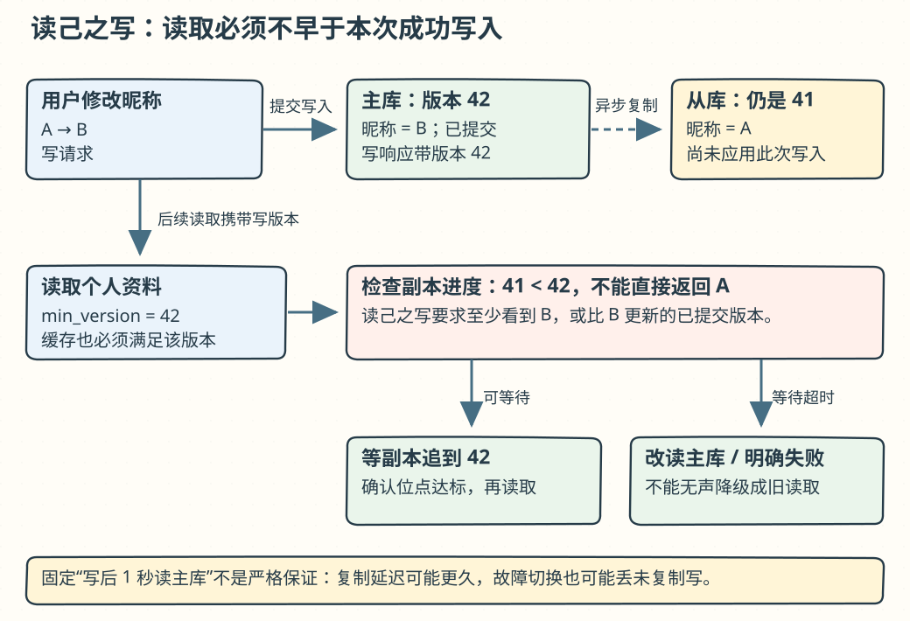

**例子**：主库已经将昵称从 A 改成 B，版本从 41 升到 42；从库仍停在 41。普通负载均衡把请求送到从库，会重新显示 A。若请求要求 `min_version=42`，服务器发现副本只有 41，就等待或改读主库，直到能返回 B 或更晚版本。读路径还要考虑缓存：即使改读主库的路由正确，若前面先命中版本 41 的缓存，仍会读旧数据。

**边界**：固定“写后 1 秒读主库”只是经验策略，复制延迟可能超过 1 秒，不能作为严格保证；主库也可能因故障切换、未提交事务或旧缓存影响可见性。若返回成功的写在故障转移中丢失，读己之写无法凭路由补回来，还需要适当的复制确认和切换策略。展示层直接更新只能改善当前页面，不能替代后续读取保证。

**记忆提示：别赌复制够快；写下版本，读时验版本，不够就等或换路径。**

### Q01-04｜你选择 `user_id` 作为分片键，名人用户把一个分片打爆了怎么办？

**结论：先判断热点是读多、写多，还是一个请求触发巨量扇出；只增加普通分片通常无法拆开同一个 `user_id`。** 相同分片键仍会落到同一位置，因此应针对热点的工作类型分治。

如果是名人资料、帖子等重复读取，可以用 CDN、共享缓存及应用本地缓存分散读请求，并通过请求合并减少同一 key 失效时的回源；缓存重建要有并发上限和失败降级。如果是某名人发布消息后向百万粉丝写入 Feed，就应考虑普通用户写时推送、名人读时拉取的混合策略，或分批扇出并设置积压监控。如果是同一用户下的大量独立数据写入，可考虑增加分桶后缀，如 `(user_id, bucket_id)`，把记录分散到多个子分片；同时设计查询合并、索引与迁移。

**例子**：1,000 个普通用户各占 100 QPS，加上一个名人独占 100,000 QPS。把分片从 10 个加到 100 个能摊薄普通用户，却不会自然将名人的 100,000 QPS 分开。若这些请求读取同一份允许缓存的资料，10 个缓存副本可分担读流量；若它们同时修改同一个余额，则不能靠复制旧值或随机分桶保留原有原子语义，仍需串行协调或重新定义业务操作。

**边界**：把名人搬到专用分片可以隔离对其他用户的影响，但并不消除该分片自身的容量上限。热点可随时间迁移，需监控每分片负载和 top key，准备在线迁移、回填校验与路由版本切换；拆桶会增加读放大和跨桶事务代价。

**记忆提示：先隔离热点，再按读、写、扇出拆工作；换更多篮子，不会自动拆开同一个大西瓜。**

### Q01-05｜哪些任务适合放入消息队列？如何防止消费者重复执行？

**结论：允许稍后完成、需要削峰或与主请求解耦的任务适合入队；队列重投很常见，消费者必须按业务事件做幂等。** 生成缩略图、导出报表、邮件通知和部分审计处理是常见例子。付款、扣库存也能使用消息驱动，但必须明确“请求受理”与“业务完成”的状态和补偿，不能入队成功就向用户宣称扣款成功。

消费者重复执行最典型的窗口是：业务修改已经提交，但进程在发送 ack 前崩溃；队列未收到确认，就再次投递相同消息。解决办法是给事件一个稳定的业务 ID，并将“登记已处理事件”和“修改业务数据”放在同一个数据库事务中，事件 ID 建唯一约束。第一次处理插入成功后执行更新并提交；重投时唯一约束发现已处理，结束或回滚当前重复尝试，再读取已提交结果并确认消息，不再次改账。只有事务成功后才 ack，事务失败则按策略重试。

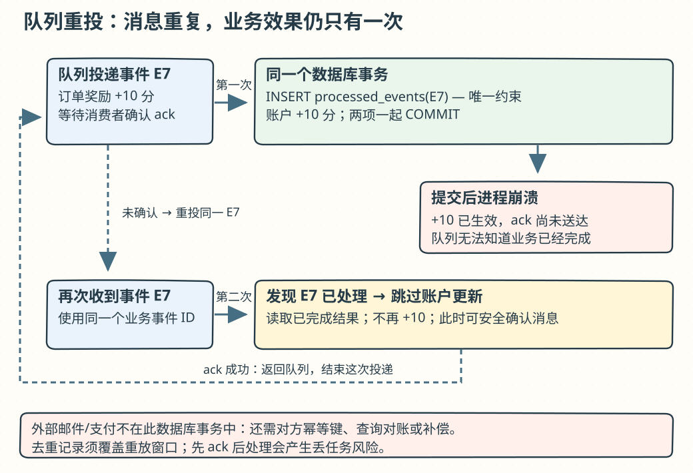

**例子**：积分事件 E7 表示某订单奖励 10 分。事务同时插入 `processed_events(E7)` 并给账户加 10 分。提交后 ack 丢失，E7 再来时插入发生唯一键冲突，因此不再加分。反过来，若先单独记录“已处理”再加分，崩溃会导致永久漏加；先加分再单独记 ID 则可能重复加。

**边界**：上述本地事务不能涵盖外部短信、邮件或支付接口。外部副作用需传递稳定幂等键、使用对方查询/对账能力，或设计 outbox 与补偿；若对方不支持幂等，必须承认重复风险。去重记录的保留期要覆盖可能重放期，还需指数退避、重试上限、死信处理和积压监控。

**记忆提示：消息可来多次，业务只生效一次；提交业务后确认，去重记录与业务一起提交。**

确认与重投语义可对照 [RabbitMQ Consumer Acknowledgements 官方文档](https://www.rabbitmq.com/docs/confirms) 和 [可靠性指南](https://www.rabbitmq.com/docs/reliability)。

## 第2章：数量级估算

题目来源：[第 2 章中文版](../02.%20Back%20Of%20the%20Envelope%20Estimation/Readme.md)。所有数字先声明口径；公式结果是条件成立时的估算，不能直接当成容量承诺。

### Q02-01｜`2^30` 为什么可以快速当作十亿级？

**结论：因为 `2^10=1024≈10^3`，而 `2^30=(2^10)^3≈(10^3)^3=10^9`。** 系统设计初步估算先判断数量级，所以可以把它快速当成十亿级，但涉及精确容量或上限时要恢复精确数值。

推导时把 30 拆成三个 10：`1024×1024×1024 = 1,073,741,824`。这比十进制十亿大约多 7.37%，仍处在同一数量级。类似地，`2^20≈10^6` 是百万级，`2^40≈10^12` 是万亿级。这个规律来自每增加 10 个二进制位，取值空间约扩大 1,000 倍；不是每增加一位扩大十倍，每增加一位只扩大两倍。

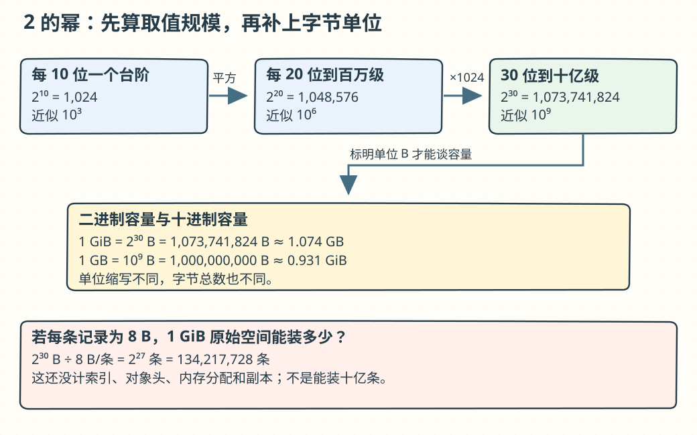

**例子**：一段 `2^30` 字节的裸数据就是 `1 GiB`，用十进制表示约为 `1.074 GB`；而厂商标注的 `1 GB` 若按十进制计算，则是 `10^9 B`，约为 `0.931 GiB`。如果每条记录固定为 8 字节，`1 GiB` 原始空间理论上装 `2^30/8=2^27=134,217,728` 条，而不能装十亿条。实际记录还可能有索引、对象头、分配器和复制开销，容量会更低。

**边界**：`2^30` 本身只是数字，没有自动附带“字节”。只有乘上或标明单位，才可谈内存或存储；30 个二进制位有 `2^30` 种取值，但最大无符号值是 `2^30-1`。估算多个层级累积时，近似误差可能放大，所以生产采购、协议字段范围和边界测试应使用精确整数。

**记忆提示：十位约一千，二十位约百万，三十位约十亿；数字和字节分开，GB 和 GiB 分开。**

### Q02-02｜一个链路依赖三个 99.9% 的组件，端到端可用性大约是多少？

**结论：若三个组件都必须可用、故障相互独立、统计时间与成功口径一致，链路可用性约为 `0.999³=0.997002999`，即 `99.7003%`。** 它低于任意单个组件的 99.9%，不能直接继承“最差组件三个九”的标签。

乘法来自“成功必须同时满足三个条件”。例如一次付款必须成功调用 API、数据库、支付网关，任一必要依赖故障都让操作失败。三个独立成功事件同时发生的概率等于成功概率的乘积。另一种快速近似是对很小的故障率相加：每个约 0.1% 不可用，三个合计约 0.3%，所以可用率约 99.7%；精确乘法会扣除故障重叠部分。

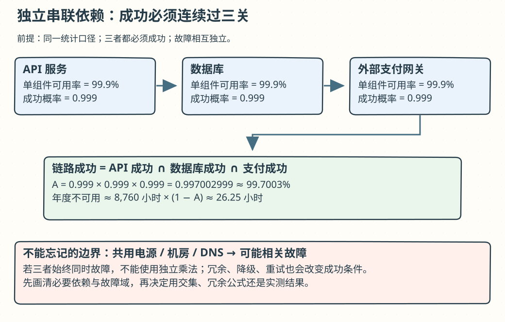

**算成年度时间**：一年按 365 天，停机比例为 `1−0.997002999=0.002997001`，对应 `8760 小时×0.002997001≈26.25 小时/年`。单组件 99.9% 对应约 8.76 小时/年，所以该链路的估算故障预算近似是单组件的三倍。这个数字只用于说明依赖叠加，不预测故障会在哪一天发生。

**边界**：三个组件若共用机房、电源、DNS 或网络，故障并不独立，必须按真实联合事件分析，不能直接相乘。若三者总在完全相同的时刻故障，串联可用率甚至仍是 99.9%；若有降级、缓存、重试或冗余，成功条件也不再是简单的“三者必须同时在线”。此外，超时、慢响应和数据错误是否算失败，要与 SLO 定义保持一致。

**记忆提示：必要串联算交集，独立才相乘；冗余和共同故障先重画成功条件，再写公式。**

### Q02-03｜若 DAU 不变、每天操作从 2 次变成 10 次，QPS 和存储如何变化？

**结论：在活跃时段分布、每次操作产生的数据量、保存时间和副本策略都不变时，平均 QPS 与新增数据存储量都变为原来的 `10/2=5` 倍。** 不是增加 8 倍；增加的是每人 8 次，最终次数是原来 5 倍，增幅为 400%。

平均请求率公式是 `DAU×每人每天操作数÷86,400 秒`。沿用本章 `150M DAU`：原来每天 `150M×2=300M` 次，平均约 `3,472` 次/秒；现在每天 `150M×10=1,500M` 次，平均约 `17,361` 次/秒。若峰值始终取平均的 2 倍，峰值也从约 6,944 增至 34,722 次/秒，通常可约为 7,000 与 35,000。

**存储例子**：若这些操作都是发推文，其中 10% 含 1 MB 媒体，原来的媒体增量是 `300M×10%×1 MB=30 TB/天`，现在是 `150 TB/天`；按十进制、每天相同、保存 5 年，裸媒体从 `54.75 PB` 增至 `273.75 PB`。相同复制系数会同时乘到两边，倍数关系仍为 5，但总容量要另算索引、缩略图、备份等。

**边界**：存储的五倍结论依赖“每次操作都新增相同数据”。若增加的是读取，QPS 会增加而持久数据未必增加；若反复覆盖同一个计数器，主表大小可能不变，但写日志和备份增量会变。若用户把更多操作集中在一分钟内，峰值可能超过 5 倍；若对象大小、媒体占比或 TTL 改变，也需重新代入。

**记忆提示：先看次数比 `10÷2`，再问一操作写多少、存多久；QPS 随请求走，存储随新增字节走。**

### Q02-04｜为什么只算平均 QPS 会让容量不足？

**结论：平均值把忙闲时段摊平了，服务器实际承受的是某个时间窗口内的到达速率与并发工作量。** 全天平均够用，不代表晚高峰、促销开场或缓存失效的十几秒也够用；当到达速度超过处理速度，排队和超时会迅速增加。

例如系统全天平均 1,000 QPS，晚上达到 5,000 QPS。单实例在目标 P99 延迟下稳定处理 500 QPS，按平均只需要 2 台，但高峰至少需要 10 台才能达到理论上的总处理量，还没计入故障与余量。若目标只使用经压测能力的 70%，则实例需求约为 `ceil(5,000/(500×0.7))=15` 台；如果再要求任意 1 台故障后仍满足这一利用率目标，需至少 16 台。不同“留余量”算法含义不同，应明确是假设额外加 30% 机器，还是目标利用率 70%。

**还要看峰值的形状**：5 秒内的突发和持续 2 小时的高峰需要不同策略。允许延迟的工作可入队削峰，但积压不会凭空消失；到达 5,000/秒、处理 3,000/秒且持续 60 秒，会增加 120,000 个待处理任务，还要安排消峰时间。在线请求不能无限排队，应设置超时、并发上限和降级。自动扩容也有发现、启动、预热的延迟，需要提前容量或预热。

**边界**：QPS 相同不等于成本相同，读缓存、复杂 SQL、大文件上传的 CPU、I/O 和带宽需求不同。还需按接口、地区和分片检查峰值，关注热点及重试放大，并用符合目标延迟和错误率的压测结果校准单机能力。

**记忆提示：平均算账，峰值保命；先看峰值有多高、多长、集中在哪里，再算余量和恢复能力。**

### Q02-05｜估算结果和监控实测差很多时，先检查假设、单位还是代码？

**结论：先对齐指标定义、时间窗口和单位，再逐项核查假设，最后用请求追踪与压测定位实现开销；不是一上来就断言代码写坏了。** 单位核对通常最便宜，假设又是估算的输入，两者不一致时，代码可能完全正确。

先问“我们比较的是同一个东西吗”：估算的是业务写 QPS，监控可能统计数据库所有 SQL；估算用全天平均，监控显示峰值一分钟；估算指单个实例，监控可能是整个集群。随后统一单位：毫秒与秒相差 1,000 倍，bit 与 byte 相差 8 倍，MB 与 MiB 也不同；分子、分母和聚合方式都要写出来。再核对 DAU、每人操作次数、读写比、平均响应大小、媒体占比、缓存命中率、重试和副本数量等假设，并做敏感性分析。

**具体例子**：预估应用 1,000 QPS，却看到数据库 6,000 queries/s。追踪发现每个 API 平均执行 5 条 SQL，故障重试带来 20% 额外尝试，那么 `1,000×5×1.2=6,000`，差异来自统计对象与放大系数，不是数据库“多执行了六倍业务”。同样，预估上传 100 MB/s，而网络监控为 800 Mbit/s，实际上两者在十进制口径下相等。

**边界**：口径和假设对齐后仍有大差异，才继续检查 N+1 查询、重复消费、序列化膨胀、索引缺失、锁争用与监控采样偏差；也要保留可能是监控配置错误的假设。线上已过载时应同步限流或扩容止血，不能等完整分析结束才保护服务。把修正后的公式与证据记录下来，避免下次重复猜测。

**记忆提示：先比同一种量，再算同一种单位；输入可信了，才追实现为什么放大。**

## 第3章：系统设计面试框架

题目来源：[第 3 章中文版](../03.%20System%20Design%20Framework/Readme.md)。这组题的答案是一套展示决策依据的方法，不是某种必须照搬的技术栈。

### Q03-01｜设计新闻 Feed 时，你会先确认哪三个需求？它们如何改变架构？

**结论：可以优先确认排序规则、关注关系的规模分布、内容类型这三项；每问一项，都说清答案如何改变设计。** 这是一组高价值起点，不代表问完三个问题就无需再确认权限、时效性或目标延迟。

第一问是“Feed 仅包含关注/好友的帖子并按时间倒序，还是包含推荐与个性化排序？”前者可用时间与稳定 ID 组成游标，读取已物化的帖子 ID 列表；后者通常还需候选召回、特征与排序计算，分页和缓存语义也更复杂。不能在需求仅是按时间展示时，提前加入整套推荐系统。

第二问是“DAU、峰值读取/发布量、平均和最大粉丝数分别是多少？”尤其要区分平均关注数与头部用户。普通用户发布后把帖子 ID 推入少量粉丝的收件箱，能换取快速读取；拥有百万粉丝的名人一次发布则可能引发百万次写，适合读时拉取或混合扇出。用数字判断瓶颈：每秒 100 次发布、每条平均 200 名接收者，是约 20,000 次收件箱写/秒；头部用户的瞬时负载不能被这个平均值掩盖。

第三问是“只有文字，还是包含图片与视频？”纯文本可主要存储在业务数据库；大媒体应进入对象存储，由 CDN 分发，帖子记录保存媒体引用。视频还可能需要转码、不同清晰度与异步处理状态；若上传后立刻可见是要求，必须定义是先显示占位，还是等待处理完成。

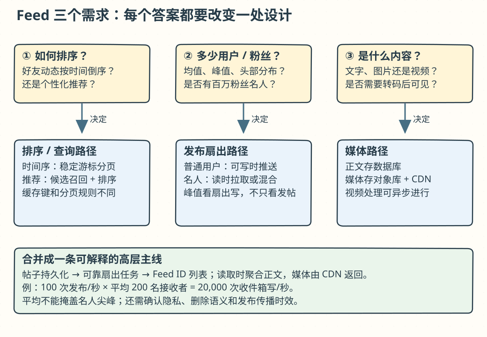

**边界**：还应明确好友或公开关注的关系、删除/屏蔽的可见性、是否允许短暂旧 Feed、移动端与 Web 的分页需求。需求之间可能冲突，例如既要求名人发布立即全量可见，又限制写入成本，就需要拿出延迟与成本的取舍，不能用一个缓存组件掩盖。

**记忆提示：先问“怎么排、多少人、什么内容”，再画“排序、扇出、媒体”三条受影响的路径。**

### Q03-02｜为什么高层设计阶段要取得共识，而不是直接深挖数据库？

**结论：高层共识确认的是问题范围、成功标准与主要数据流；数据库细节只有服务于这些目标时才有意义。** 如果基础假设错了，索引、表字段和分片设计越深入，返工越多，也越难让面试官判断你的取舍是否合理。

可以把共识分为三件可检查的事。先复述需求和明确暂不处理的范围，例如“只做好友动态、按时间倒序、允许秒级传播，不做推荐模型”。然后走通两条主路径：“发帖写入权威存储并产生扇出任务”“读 Feed 取帖子 ID，再聚合正文与媒体引用”。最后列数量级与关键约束，例如读多写少、普通用户与名人比例、P99 延迟目标、删除与隐私要求。把框图和假设摆出来后，邀请面试官指出要优先深入的瓶颈，双方才是在评估同一个设计。

**例子**：你先花十分钟设计按时间排序的 SQL 索引，后来才发现题目要求个性化推荐，原来的单条倒序查询便无法覆盖候选筛选、特征获取与排序。反之，若需求只是几十万人的内部动态系统，一上来就分库分表会引入不必要的迁移、跨分片查询和运维负担。先共识可以在图还便宜、组件还少的时候纠正方向。

**边界**：取得共识不等于每画一个框都停下来求批准，也不意味着方案从此不能改变。若深入后发现吞吐或一致性不满足，要把证据反馈到高层并调整。遇到面试官暂时不给数字，可以提出带标签的工作假设，继续推演并说明哪项结论对它最敏感；不能把沉默理解成所有假设都已经得到事实验证。

**记忆提示：先确认地图和目的地，再优化某一段路；共识让深挖有方向，也让后续修改有依据。**

### Q03-03｜一个热点组件要讨论哪些容量和故障问题？

**结论：要说清进入它的工作量、先耗尽的资源、过载后的传播、单点/数据故障，以及恢复与扩展代价。** 仅说“加机器”或“用缓存”缺少可验证的容量边界，也无法解释故障时用户会看到什么。

先量化输入与输出：平均/峰值 QPS、请求大小、每次请求引发的下游操作数、热点 key 或租户占比、读写比例和积压增长速度。再找受限资源：CPU、内存、磁盘 IOPS、带宽、数据库连接、线程、锁或外部限额。用目标延迟下的压测能力计算需要的实例数，而不是使用某次只看吞吐的最高成绩；也要检查单个 key、分片或串行临界区能否被横向扩展。

**例子**：Feed worker 每秒能处理 20,000 个收件箱更新，某段时间每秒到达 30,000 个，持续一分钟就增加 `10,000×60=600,000` 条积压。要问队列容量够不够、消息延迟是否超出承诺、恢复后的处理能力是否大于新流量，以及能否把名人改为读时合并。若只增加无状态 API，却没有提升 worker 或热点分片能力，积压仍会继续增长。

故障分析应覆盖超时、部分成功、重复执行、节点重启、数据丢失和依赖失联。要说明重试是否幂等、重试会不会放大负载、何时限流或降级、备用节点有没有足够容量，以及恢复靠重放、备份还是重新计算。监控至少包括端到端 P95/P99、错误率、饱和度、积压量和最老消息年龄，并给出触发扩容或告警的阈值来源。

**边界**：副本提升可用性但可能带来复制延迟；分片可增容量但增加迁移与跨分片查询；缓存能挡热读但失效时会暴露回源上限。所有措施都要明确故障域与验证方式，不能把“服务在线”当作“服务仍达到目标”。

**记忆提示：流量进来多少、资源还剩多少、坏了会怎样、恢复要多久。**

### Q03-04｜当面试只剩 5 分钟，你如何收口而不是继续加组件？

**结论：停止扩张范围，用最后五分钟证明当前方案能跑通、取舍明确、故障有边界，并指出有条件的下一步。** 收尾不是报技术名词，也不是说“剩下的以后优化”。

可采用一个明确的五分钟节奏。第 1 分钟重述目标与核心假设，说明哪些功能已经覆盖，哪些主动留在范围外。第 2 分钟沿图走一遍关键写路径和读路径，特别指出数据何时持久化、什么时候可以返回成功，以及缓存未命中或异步处理时发生什么。第 3 分钟总结两个最重要的设计取舍，例如“预计算 Feed 换取低读延迟，但增加扇出写和短暂传播延迟”。第 4 分钟说明当前最大瓶颈、一个关键故障及对应防护，如名人扇出导致队列积压、采用混合扇出与限速重放。最后 1 分钟给出扩展触发条件、验证计划，并留出面试官追问的机会。

**示范收口**：“我们已覆盖发帖、按时间拉取和媒体访问，发帖成功以主存提交为准。普通用户异步推送帖子 ID，读侧聚合正文，代价是允许短暂传播延迟。当前风险是头部用户扇出与队列积压；监控最老消息年龄，并用名人读时合并保护写侧。下一阶段只有在数据库或分片达到实测容量阈值时再拆分，同时演练重放、故障切换和缓存全失效。”

**边界**：若最后才发现会丢钱、超卖或泄露权限的正确性缺口，应立即承认并修正成功条件，不能为了时间漂亮而假装完成。可把不影响主路径的性能增强列为后续，重要错误则必须纳入当前结论。也不要把原本没有证据的新数字说成压测结果。

**记忆提示：最后五分钟讲“已覆盖什么、为什么这样选、哪里会坏、何时再升级”，不再发明第十个服务。**

### Q03-05｜你能否用 90 秒讲完“需求—路径—瓶颈—取舍—演进”？

**结论：可以，前提是只保留一条清楚的主线，并让每个技术选择都回应前一个约束。** 下面以新闻 Feed 为例；数字和目标是演示假设，不是原系统的实际运行数据。可按“需求 15 秒、路径 25 秒、瓶颈 15 秒、取舍 20 秒、演进 15 秒”练习。

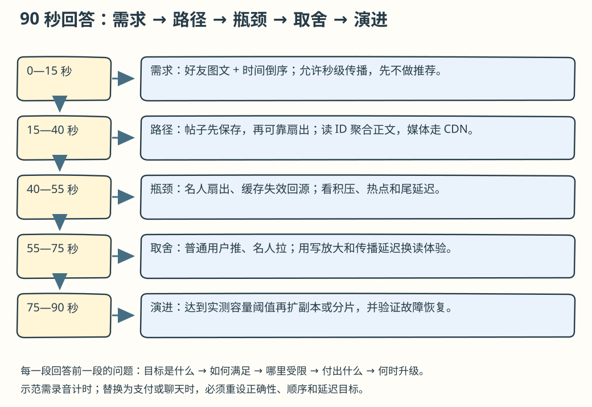

**可直接口述的示范**：

> “我们先做好友动态，按时间倒序，支持图文，允许秒级传播，重点保证读取体验。暂不做个性化推荐。
>
> 发帖先把正文和媒体引用写入数据库，提交成功后可靠地产生扇出任务；普通用户的帖子 ID 进入粉丝收件箱。读取时先取 ID 列表，再聚合正文，图片走对象存储和 CDN。
>
> 主要瓶颈是名人的大量粉丝，以及缓存失效后的回源压力。我会分别监控扇出积压、热点分片和读取延迟。
>
> 为了降低读延迟，普通用户采用写时推送；名人采用读时合并，接受额外读计算。异步任务要能重试、去重；发布成功表示帖子已保存，不保证所有粉丝已经收到。
>
> 起步用单数据库和无状态服务；只有实测达到容量上限才增加读副本、分片或调整扇出策略，同时验证复制延迟和故障恢复。”

**为什么这段完整**：它给出了范围与时效性、写入成功点、读写数据流、两个具体瓶颈、选择的代价以及升级触发条件。它没有展开所有表字段，但面试官可以从“可靠产生任务”“名人合并”“复制延迟”任一点继续深挖，你也能回到同一张图作答。

**边界**：90 秒是训练约束，不是保证任何语速都刚好完成；应录音计时，保留关键因果，删去重复形容词。若题目是支付或聊天，不能照搬 Feed 的秒级传播与扇出方案，而要替换成相应的正确性、顺序或低延迟要求。若还没有澄清需求，应先说明假设，不能以流畅口述掩盖不确定性。

**记忆提示：谁要什么 → 请求怎么走 → 哪里先卡 → 为何接受代价 → 什么证据触发升级。**

## 第4章：限流器

原题来源：[第4章中文学习版](../04.%20Rate%20Limiter/Readme.md)。

### Q04-01｜为什么前端限制不可靠？

**结论：前端限制只能改善正常用户体验，不能成为服务端配额的安全边界。** 用户控制浏览器、手机和脚本，可以删掉倒计时、修改 JavaScript，也可以完全不经过页面，直接请求 API。前端按钮置灰只影响那个按钮，不影响网络接口。

假设网页规定每分钟最多请求 10 次。正常用户确实只能点击 10 次，但同一个人可以开 5 个标签页，或用脚本直接发 100 个请求。如果后端没有校验，它们仍会进入数据库。把计数放在 `localStorage` 也不能解决，用户可以清空它。

实际保护应放在所有业务请求都经过的网关或服务端，并根据**已验证账号、API key、IP 或资源**选择计数维度。账号 ID 不能直接信任客户端参数；按 IP 限制又可能误伤共用公司出口的用户。网关限制总流量，昂贵操作也可在业务服务内部再次限制。前端保留倒计时和退避提示，服务端超限返回 429，两者分工不同。

**边界与记忆**：客户端节流可以省电、省流量和避免误操作，但不能阻止恶意调用。记住“按钮是提示，服务端才是闸门”。

### Q04-02｜令牌桶两个参数分别管什么？

**结论：桶容量 `B` 控制可积攒的突发量，补充速率 `r` 控制长期平均放行速率。** 每个请求花费一个令牌，没令牌就拒绝或按明确策略等待；桶满后不能继续积攒。

设 `B=20`、`r=5 个/秒`，并假设初始桶满：同一瞬间可以放行 20 次，第 21 次必须等待补充。若之后不再请求，空桶约 4 秒补满；即使空闲一分钟，也只能存 20 个，而不是 300 个。若实现支持连续补充，每过 0.2 秒可补一个。对长度为 `Δt` 的时间段，最多约可使用“起始已有令牌 + `r×Δt`”，上界为 `B+r×Δt`；它并不保证任意一秒都只放行 5 次。

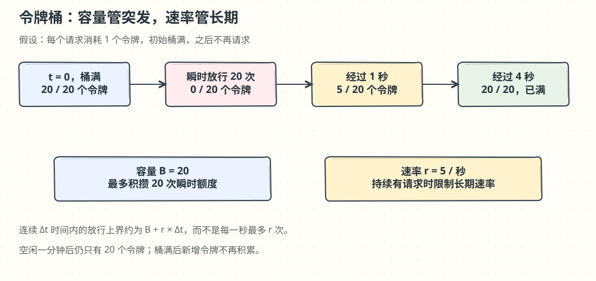

实现通常按请求到达时计算 `tokens=min(B, tokens+r×elapsed)`，无需每隔 0.2 秒真的启动定时器。生产环境还要定义初始满桶还是空桶、时间单位与小数精度，并将补充、判断、扣减原子执行。若一次昂贵任务需要 3 个令牌，计费单位也要写进规则。

**边界与记忆**：容量不能大到一次突发就压垮下游；速率不能高于下游可持续吞吐。记住“桶有多大决定能冲多猛，水流多快决定能跑多久”。

### Q04-03｜为什么固定窗口边界会突发？

**结论：固定窗口限制的是日历对齐的窗口，而不是任意连续的一段时间。** 窗口切换时计数清零，前一个窗口剩余的配额与下一个窗口的新配额可以挤在边界两侧。

例如按整分钟限 100 次：12:00:59.9 发 100 次，12:01:00.1 再发 100 次。两个固定分钟都没有超额，却在约 0.2 秒内通过了 200 次。任取一个覆盖这两批请求的连续 60 秒区间，也会包含 200 次。因此“每个固定分钟 100 次”与“任意连续 60 秒最多 100 次”是不同契约。这里不是计数器算错，而是算法本来就没有承诺后者。

若业务严格要求滚动 60 秒上限，可使用滑动日志：在一次原子操作中清理 60 秒以前的时间戳，统计剩余条目，再决定是否加入新请求。代价是按请求数占内存。滑动窗口计数更省空间，但有近似误差；令牌桶允许受控突发，也不等同于精确滚动窗口。

**边界与记忆**：按天重置的普通配额、容忍边界突发的接口仍可使用固定窗口。若下游关心毫秒级冲击，还需并发或突发限制。记住“清零那一刻，两份额度可以挤到一起”。

### Q04-04｜多台网关怎样避免同时超发最后一个名额？

**结论：把“读状态—补令牌/清旧记录—判断—扣减—保存”做成同一权威状态上的原子操作。** 两台网关各自先查剩余名额，再各自写回，无法保证唯一放行。

假设只剩 1 个令牌：A 读到 1，B 也读到 1；两者都放行并写回 0，实际花掉了两次额度。把这些步骤放进同一 Redis 实例上的短 Lua 脚本后，A 完整执行并扣到 0，B 才开始检查，于是 B 拒绝。只用 `INCR`、只把数据放 sorted set，或给“扣减”单独加锁，都不等于整个检查流程原子。

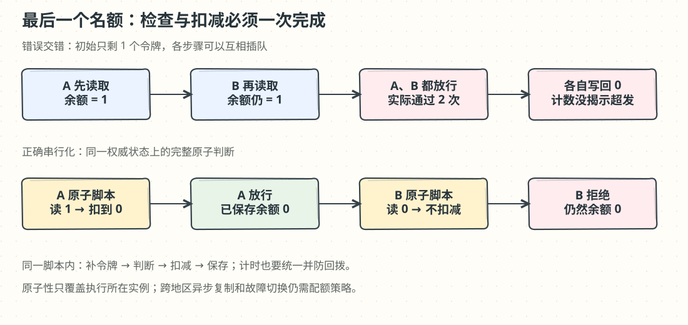

分布式令牌桶还必须统一计时口径，避免网关 A 的快钟提前补额度、B 的慢钟重复计算。可由负责该 key 的服务取时间，并防御回拨，例如 `elapsed=max(0, now-last)` 且不把 `last` 调回过去。Redis Cluster 中关联 key 还要满足脚本的同槽访问约束。

**适用边界**：Lua 原子性不覆盖多个独立 Redis 地区，也不等于故障切换绝不丢计数。严格全局额度需单一协调权威或不重叠地区配额，并明确故障时拒绝、降级或允许多少超发；异步复制后的旧计数可能再次放行。**记忆：同一个名额，只能由同一个裁判一次判完**。

参考：[Redis Lua 原子执行](https://redis.io/docs/latest/develop/programmability/eval-intro/)、[Redis Cluster 多 key 同槽约束](https://redis.io/docs/latest/operate/oss_and_stack/management/scaling/)。

## 第5章：一致性哈希

原题来源：[第5章中文学习版](../05.%20Consistent%20Hashing/Readme.md)。

### Q05-01｜画 3 个服务器和 4 个 key

**结论：先固定环方向和归属规则，再画节点，否则“顺时针后继”很容易记反。** 本题用教学哈希空间 `0…99`，沿数字增大的方向顺时针走，99 后回到 0。规则是：从 key 的哈希位置出发，找到**第一个位置大于等于它的服务器**；超过最大节点则绕回最小节点。

放三台服务器：`S1=20`、`S2=50`、`S3=80`。放四个 key：`kA=10`、`kB=35`、`kC=60`、`kD=90`。它们依次归属 S1、S2、S3、S1。kD 并不去数值上最近的 S3：它只能沿约定方向走，绕过 99/0 后先遇到 S1。

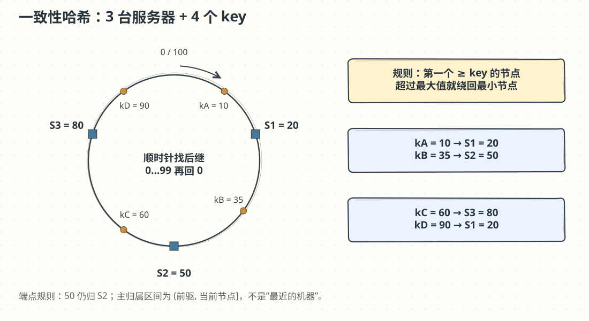

|服务器|负责的区间|本例 key|
|---|---|---|
|S1=20|环形区间 `(80,20]`，即 `81…99` 与 `0…20`|kA=10、kD=90|
|S2=50|`(20,50]`|kB=35|
|S3=80|`(50,80]`|kC=60|

手算时先把服务器位置排序，再逐个执行相同规则。四个 key 不必平均分配；本例 S1 拿到两个 key，并不违反一致性哈希的定义。

**适用边界**：这是单主归属示意，没有画副本和虚拟节点；实际哈希空间远大于 100，图中的数值是哈希结果而非原始 key。边界 `key=50` 归 S2，而不是 S3。**记忆：找负责人顺时针，负责区间看前驱**。

### Q05-02｜加入一个节点后标出唯一受影响区间

**结论：沿用上题的后继规则，加入新节点 `S4=65`，唯一改变主归属的区间是 `(50,65]`。** 这里前驱 `S_prev=S2=50`，新节点 `S_new=S4=65`；旧后继 S3=80 原来负责整个 `(50,80]`。

加入后，S4 截走 `(50,65]`，S3 仍负责 `(65,80]`。四个 key 中只有 `kC=60` 从 S3 迁到 S4；kA=10、kB=35、kD=90 的目标完全不变。端点也可手验：50 仍属于 S2；65 归 S4；66 仍归 S3。不能误画成 `(65,80]` 迁走，那是把“新节点抢到哪段路”方向画反了。

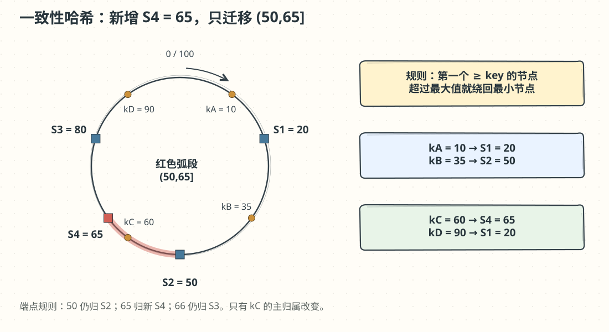

若新节点加在 5，前驱就是 80，受影响区间应写成跨零点的 `(80,5]`，对应 `81…99` 与 `0…5`，不能因为数字小就误认没有区间。

**适用边界：**“唯一受影响区间”说的是固定旧环、一次加入一个普通节点时的主归属。物理机器若一次加入多个虚拟节点，会改变多个小区间；副本布局和故障域策略也可能引发额外复制。迁移还要版本化路由、同步增量写入、确认新节点可读后再删旧数据。**记忆：新节点接管“前驱之后，到自己为止”的 key。**

### Q05-03｜解释为什么虚拟节点不能自动消除热门 key

**结论：虚拟节点改善许多 key 在物理机器之间的统计均衡，却不会把一个热门 key 的访问自动拆给多台机器。** 一台机器在环上占多个分散位置，可以把大地盘分成小块，降低节点位置随机造成的偏差；容量大的机器还可分配更多虚拟节点。

例如 1000 万个 key 平均放在 10 台机器，每台约 100 万个。若其中一个 `product:hot` 占 50 万 QPS，其余所有 key 合计只有 50 万 QPS，即使数量非常平均，拥有这个 key 的机器仍承担至少一半请求。给它再加 100 个虚拟节点，只会改变其他 key 的分配；同一次查找仍会把 `product:hot` 定位到一个主归属。

解决办法取决于操作：只读热数据可复制到多台缓存并分散读取；缓存未命中时可用请求合并避免同时回源；热计数可拆成多个子计数再求和。若是不能超卖的库存扣减，简单复制写入会破坏约束，仍需协调、预分配额度或按业务重设计。

**适用边界**：虚拟节点能缓解“很多普通 key 恰好挤到一台机器”的热点，不能自动解决“一个 key 本身极热”。还要计入路由表和迁移成本，不能无限增加虚拟节点。**记忆：多开分店能分地盘，但同一张必须在总部处理的单据不会自己分成十份**。

## 第6章：键值存储

原题来源：[第6章中文学习版](../06.%20Key-Value%20Store/Readme.md)。

### Q06-01｜分区和复制分别解决什么？

**结论：分区把不同数据分开放，主要扩容量和吞吐；复制把同一数据多放几份，主要抗故障，也可分担读取。** 两者通常同时存在，不能用“有三台数据库”直接判断用了哪一种。

假设有 3 TB 逻辑数据，单机只能安全存 1 TB。划成三个分区、每区 1 TB，可以分布到至少三台机器；但若每区只有一份，负责分区 B 的机器损坏，B 的数据仍会不可用或丢失。再给每个分区放三份副本，物理数据占用约 9 TB（未计索引与余量），一个节点故障后才可能由健康副本继续服务。反过来，只把完整 3 TB 数据复制三份，单份还是 3 TB，并没有解决单机容量上限。

分区键要符合查询局部性，也要防热点；复制还要考虑副本落在不同物理节点和故障域。把三份放在同一机架，机架断电仍可能一起失联。写入到多个副本时，需要额外定义确认数、版本冲突和恢复规则，不能只说“复制了就一致”。

**边界与记忆**：读副本可扩读吞吐，但通常不能让任意并发写自动线性扩展。记住“分区分担内容，复制备份同一内容；数据放得下与机器坏了还能读，是两道题”。

### Q06-02｜N=3、R=W=2 为什么读写集合相交但仍不等于完整强一致协议？

**结论：`R+W>N` 只保证集合有交集，不自动保证读到可线性化的最新结果。** 对固定三副本 A、B、C，任取两个写确认节点与两个读节点，交集至少为 `2+2−3=1`。这意味着读者至少接触到一个保存该次**已完成写**的节点，但仍需正确识别版本。

一个更强的反例说明为什么不够：初始 A/B/C 都是 `x=0`。写 `x=1` 只到 A，尚未拿到 W=2，写请求仍未完成。随后读 1 查询 A、B，选较新版本返回 1，却不写回其他副本；读 1 完成后，读 2 查询 B、C，只能返回 0。两个读都满足 R=2，但观察到“1 后又退回 0”。即使允许那次未完成写在某处生效，也无法在没有后续写的情况下解释这个倒退，因而不满足线性一致性。

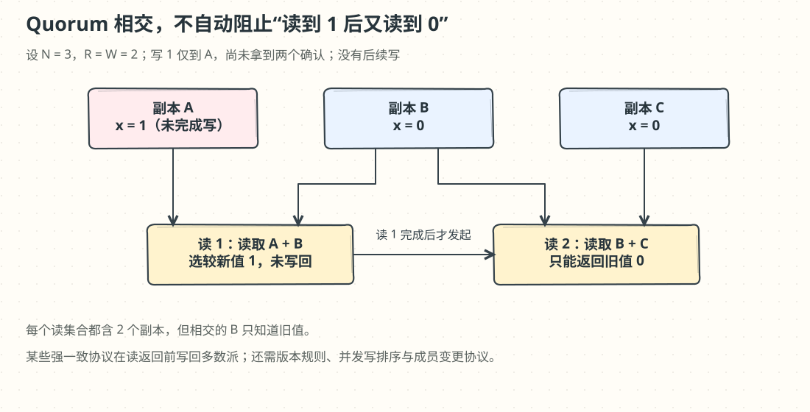

完整协议还要处理并发写的全序/版本、未完成写、必要的读写回与修复、主节点隔离，以及成员变化。例如某些原子寄存器协议会让读操作把选中的版本写回多数派后才返回。Sloppy quorum 若临时借用另一组节点，原来的集合相交证明甚至不再直接适用。

**边界与记忆**：不能据此说所有 Quorum 系统都不强一致；应说“不等式只是协议的一部分”。**记住：碰到一个知情者，不等于已经确定统一事实**。

### Q06-03｜向量时钟能自动选出正确姓名吗？

**结论：向量时钟判断版本之间的因果关系，不能理解哪个业务姓名才正确。** 它能区分“这个版本包含了那个版本的更新”和“两边各自独立修改”，但不会替业务决定合并规则。

设原姓名为“张敏”，向量为 `(A:1,B:1)`。断网后，A 把姓名改为“张明”，形成 `(2,1)`；B 同时改为“李敏”，形成 `(1,2)`。比较两个向量时，A 分量前者较大，B 分量后者较大，因此互不支配，属于并发 siblings。不能取向量总和、比较字符串大小，或从两个版本各取一个字拼出“李明”，就声称得到了正确姓名。

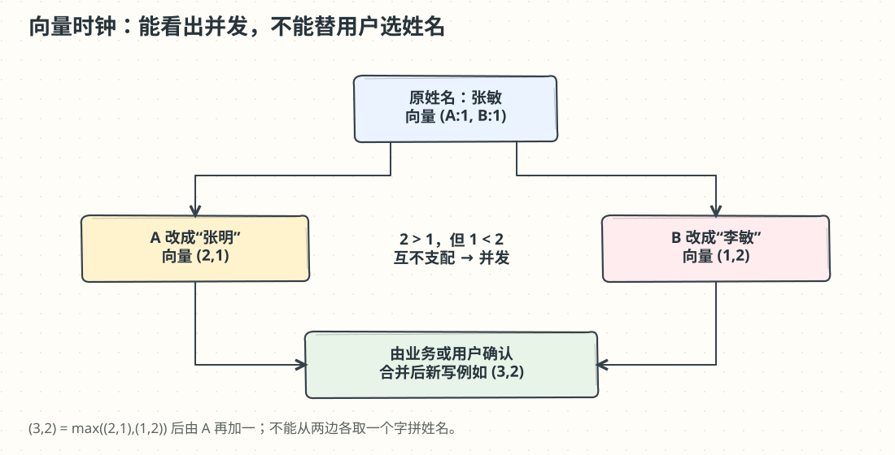

系统可以保留冲突版本，让用户确认；或由业务明确“审核通过的资料优先”等规则。若用户确认了“张明”，合并时先取分量最大值 `(2,2)`，再由执行新写的 A 增一，得到 `(3,2)`，表示这个解决冲突的新版本已考虑过两个分支。对于集合添加、计数等可合并数据，也可设计专门的 CRDT，但姓名字段通常不具备相同的自动合并语义。

**适用边界**：删减向量条目、成员身份复用和并发写入都需要明确策略；不能无代价地无限增长向量。**记忆：向量时钟像两份修改记录的族谱，它说明谁源自谁，不负责判谁写得对**。

### Q06-04｜Bloom Filter 返回“存在”后为何还要读磁盘？

**结论：Bloom Filter 的肯定结果只能说“可能存在”，仍须查精确索引和数据；它不是保存 key/value 的数据库。** 多个 key 会把同一批位设为 1，因此一个从未插入的 key 也可能命中所有检查位。

用 8 位数组、两个哈希函数演示：插入 `alpha`，设位 1、4；插入 `beta`，设位 4、6。数组中 1、4、6 为 1。没插入过的 `gamma` 恰好也映射到位 1、6，两位都为 1，于是过滤器回答“可能存在”；真正查询 SSTable 才能发现没有 gamma。另一个 key 若映射到位 2、7，看到 0，就能排除这个文件，不必继续读磁盘。

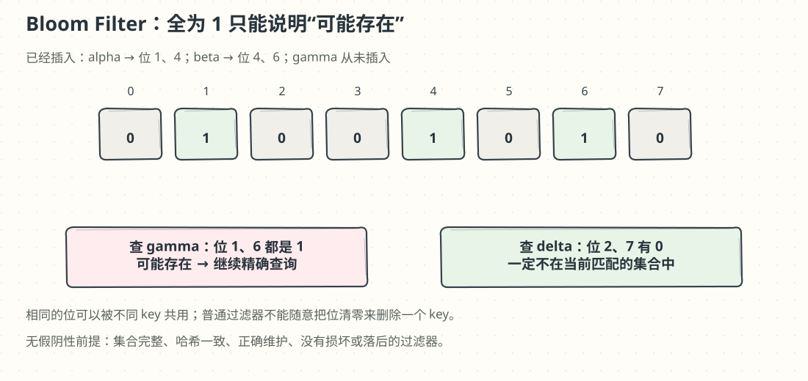

“没有假阴性”有前提：过滤器正确包含所查询集合的全部已插入元素，读写使用相同哈希配置，没有损坏、同步落后或不安全删除。普通 Bloom Filter 不能随便把某个 key 对应位清零，因为这些位可能被其他 key 共用。对不可变 SSTable，可以在建表时构建匹配的过滤器。

**适用边界**：内存/页缓存可能让精确查询不发生真实磁盘 I/O；题目重点是“还需精确验证”。同一 key 可能在多个 SSTable 有不同版本或墓碑，命中后还需按版本规则合并。**记忆：看见 0 可排除，全是 1 只代表有嫌疑**。

## 第7章：分布式唯一 ID

原题来源：[第7章中文学习版](../07.%20Unique-Id%20Generator/Readme.md)。

### Q07-01｜唯一、连续、有序有什么区别？

**结论：唯一、连续和有序是三个独立属性，面试时要分别确认。** 唯一意味着范围内没有重复；连续意味着指定序列无空洞；有序意味着数字或字节比较能反映某种先后，而“先后”还需定义为发号顺序、物理时间还是提交顺序。

例如 `10,12,15` 唯一且递增，但不连续；`30,10,20` 唯一，但按发出顺序不递增；`10,10,11` 发生重复，不能作为唯一主键。数据库自增也可能因为事务回滚、号段预分配而跳号，所以看到订单号有空洞不代表订单丢失。即使发号时得到 100 再得到 101，持有 101 的事务也可能先提交，ID 大小不自动等于数据库提交顺序。

本题要求 64 位、唯一、按时间大致排序，不要求每次 `+1`。Snowflake 高位放时间，能提供时间局部性；跨机器有时钟偏差，因此先完成的发号可能比后完成的数值大。若要求跨节点严格遵守实时先后的全局递增，就要增加协调和更明确的协议，不能单靠各机器本地时钟。

**边界与记忆**：无空洞的财务凭证号可能需要独立于数据库主键的业务编号机制。**记住：唯一防撞号，连续防空洞，有序说明先后；先后到底指什么，还要再问一句**。

### Q07-02｜UUIDv7 为什么仍不满足本题？

**结论：UUIDv7 改善了按时间排序，但仍然是 128 位，因此不满足本题必须放入 64 位的限制。** 不能继续套用“所有 UUID 都完全随机无序”的说法，也不能因为 v7 时间有序，就忽略位宽。

RFC 9562 定义的 UUIDv7 使用高 48 位 Unix 毫秒时间；再加 4 位版本、2 位 variant，以及 `rand_a=12`、`rand_b=62` 共 74 位，可用于随机性及规范允许的计数/亚毫秒构造。合计 `48+4+2+12+62=128` 位。去掉文本连字符、改存 16 字节二进制，都不会把它变成 8 字节的 64 位 ID。下图的宽条只作字段示意，以标注位数为准。

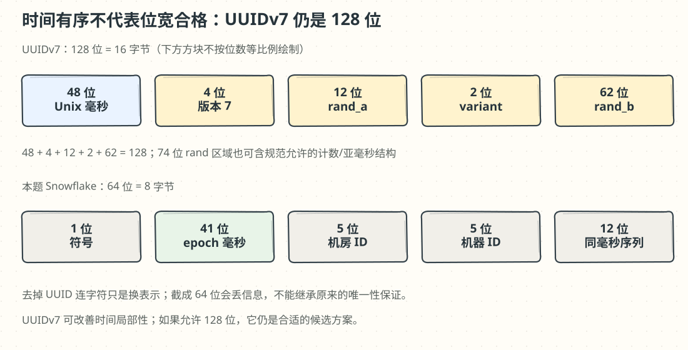

直接截取前或后 64 位也不是保留原保证的“压缩”：取前半会丢弃大部分区分同毫秒 ID 的信息，取后半会丢失时间排序；一般地，128 位空间无法无碰撞地一一映射到 64 位空间。UUIDv7 也不自动提供跨机器严格实时单调顺序，随机生成仍有极小碰撞概率。

**适用边界**：如果数据库和 API 允许 128 位，UUIDv7 可以是很好的分布式 ID 选项；本题排除它是约束不匹配，不是设计落后。**记忆：v7 修好了时间布局，没有改掉 UUID 的 128 位身份证**。

规范：[RFC 9562 §5.7](https://www.rfc-editor.org/rfc/rfc9562.html#section-5.7)。

### Q07-03｜为什么机器号重复会产生碰撞？

**结论：Snowflake 的唯一性依赖字段组合不同；两个活跃生成器共用同一机房号和机器号，就失去了区分它们的那部分信息。** 按本题布局，低位由 5 位机房、5 位机器、12 位序列组成，高位是 41 位毫秒时间。

具体反例：两台克隆出来的实例都配置 `dc=3, machine=7`。某毫秒它们都第一次发号，时间字段均为 `t=1,000,000`，序列均为 0，那么公式 `ID=(t<<22)|(dc<<17)|(machine<<12)|seq` 的每个输入完全相同，输出必然相同。这不是小概率哈希碰撞，而是确定性重复。仅在不同机房中重用 machine=7 不会因此冲突，因为 dc 字段不同。

机器身份可以由唯一配置、注册服务或租约分配，但必须控制复用边界。旧实例网络失联并不等于已经停止发号；给新实例相同身份之前，要让旧实例失去继续发号的能力，或使用不会重叠的身份/时间范围。重启后清空本地序列又回到旧毫秒，也可能重复历史 ID。

**适用边界**：本机同一毫秒的序列递增还必须在多线程之间同步；机器号互斥只解决跨实例的一部分问题。**记忆：时间是日期，机器号是窗口，序列是小票号；两个窗口冒用同一编号，就可能发出同一张票**。

### Q07-04｜同一毫秒序列用完或时钟回拨时，该做什么？

**结论：序列耗尽时不能绕回 0，时钟回拨时不能把较早时间当成新毫秒重新开始。** 本题 12 位序列只有 `0…4095`，所以单机单毫秒最多 4096 个不同值。第 4097 个请求必须等待下一毫秒、排队或明确拒绝；不能继续重复使用 `(时间,机器,序列)`。

设 `lastTimestamp=1000ms`，刚发完 seq=4095，时钟仍是 1000ms。正确实现等待到 `now>1000` 再把 seq 重置为 0。若 NTP、虚拟机恢复等原因使 `now=998`，也必须检测出来。小幅回拨可在有界时间内等待追平；较大回拨可拒绝发号并报警。也可采用经设计的逻辑时间，如继续使用 lastTimestamp 并递增未用完的序列，但它会偏离真实时间，且仍须处理序列耗尽、重启持久状态和时钟再次追上的情况。

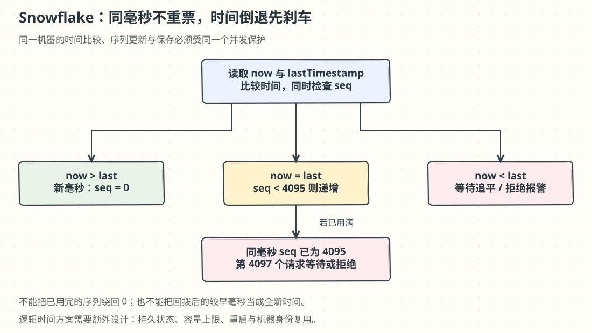

比较时间、更新序列和保存最后状态必须作为一个受同步保护的生成步骤，否则两线程可能都拿到同一个序列。NTP 降低漂移，却不是回拨保护。理论单机上限 `4096×1000≈409.6万/秒` 不是实际吞吐承诺；41 位毫秒也只有约 69.7 年的 epoch 跨度。

**边界与记忆**：等待要有超时和背压，故障转移不能随便复用旧机器身份。**记住：同毫秒不重票，时间倒退先刹车**。

## 第22章：酒店预订系统

原题与背景：[第22章中文正文](../22.%20Hotel%20Reservation%20System/README.md)。本组统一把入住区间看作左闭右开 `[check_in, check_out)`：退房日不再占一个房晚。

### Q22-01｜住三晚时中间一天无房怎么办？

**结论：整笔预订失败，三晚库存一起回滚。** 不能只订到第一晚和第三晚，再把结果称为一次成功的连续入住。若产品允许换房型、换酒店或拆单，应先向用户明确展示另一份方案，不能静默替代原请求。

例如 9 月 10 日入住、13 日退房，需要占用 10、11、12 日三行库存。该房型三晚的剩余可售量分别是 `2、0、4`，用户要一间，那么可订数量由最紧张的一晚决定：`min(2,0,4)=0`。处理时在同一个数据库事务中，按固定的“酒店、房型、日期”顺序锁行或执行带版本/库存条件的更新；每晚都必须成功扣一。任意一行缺失、库存不足或版本冲突，就回滚此前更新；全部成功后，才把预订/库存占用记录一起提交。**原子性负责“不留半笔”，并发控制负责“不卖重复”。** 只用事务包住普通的“先查后改”仍可能争抢失败，不能省略条件校验或行锁。

如果第一晚已临时从 2 扣到 1，第二晚失败，回滚后应恢复为 `2、0、4`，订单不能显示已确认。支付应通过“有期限的库存占用 → 付款 → 确认/释放”状态机衔接；不要持有三行数据库锁等待外部支付。支付已成功而确认失败时，需查证状态、重试确认或退款，不能假设数据库回滚会撤销银行扣款。

**边界：** 若多晚库存跨数据库分片，就不能假定一个本地事务覆盖全部；可优先按酒店分片把一次普通预订留在同片，跨酒店套餐另设计协调流程。

**记忆提示：连续三晚是一张不可拆开的票；最少的那晚决定能不能卖。**

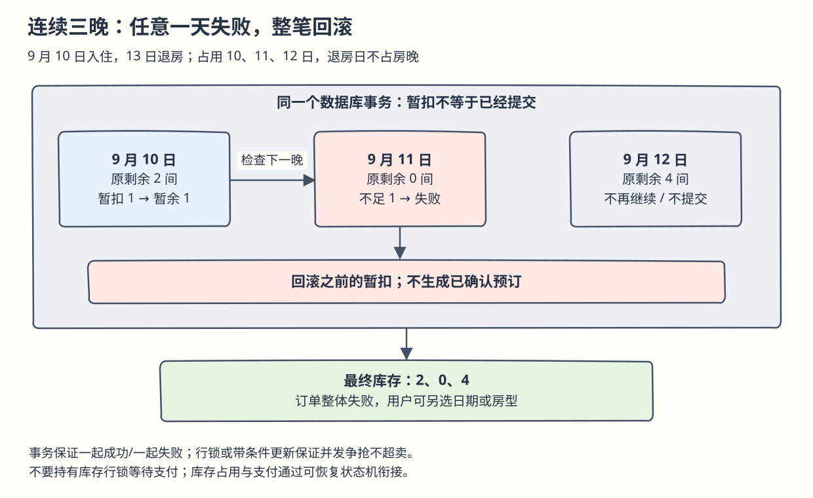

### Q22-02｜同一订单重试与两张订单抢房有什么不同？

**结论：前者要识别“这件事是否已经做过”，后者要判断“资源够不够两件事做”。** 同一请求重试用幂等键（idempotency key）；不同请求争抢用库存事务、条件更新/锁和约束。它们是两个保护层，不能互相替代。

例如客户端提交 `reservation_id=R7`，服务器已经成功扣房并生成订单，只是响应丢失。客户端带同一 `R7` 重试时，应返回原订单或其处理中状态，不能再扣一次。实现上，幂等键要有数据库唯一约束，并与业务状态关联；同时保存请求摘要，防止用户用相同键改成另一家酒店、另一组日期。两个并发的 `R7` 不能都靠“先查不存在”通过，必须由唯一性/原子创建选出一个执行者。发生超时时，应按 R7 查证结果，不能换一个新 ID 再试。

而 `R7` 与 `R8` 是两张不同订单，幂等键各不相同、都合法。若库存只剩一间，仍需要原子地检查 `reserved + 1 <= sellable_limit` 并更新，且把多晚操作放在同一事务。一个成功、另一个收到售罄/冲突，才是正确结果。只有唯一订单 ID 并不能防止两张合法订单共同把库存扣成负数；只有库存锁又可能让同一请求重试重复扣两次。

**边界：** 幂等记录不能在客户端仍可能重试时过早过期；“订单已创建”也不一定表示“支付已完成”。取消和退款同样需要各自稳定的操作 ID 与状态规则，不能简单复用一个布尔 `done`。

**记忆提示：幂等管“同一件事做几次”，库存控制管“不同的人能买几份”。**

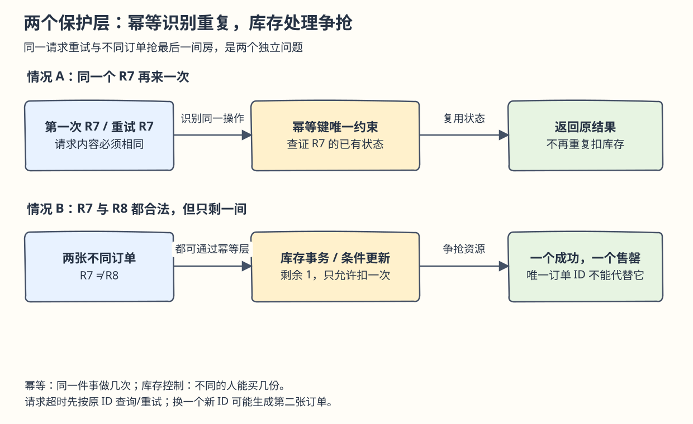

### Q22-03｜为什么缓存显示有房仍可下单失败？

**结论：展示库存是一份会变旧的观察，不是对用户的库存承诺。** 最终能否成交，要在权威数据库的预订事务里重新检查。缓存快，是因为允许复用以前的结果；这与每一次展示都永久有效是两回事。

一个具体时序：10:00:00 缓存写着“剩 1 间”；10:00:01 用户 B 在数据库成功订走，剩余变成 0；CDC 更新 Redis 需要 200 毫秒。10:00:01.100 用户 A 仍看到 1，但提交时数据库已经是 0，所以拒绝。这是缓存传播延迟。即使完全没有缓存，A 查数据库看到 1 后思考了 10 秒，B 仍可在期间抢先买走，因此“取消缓存”也不能消除查询和下单之间的竞争窗口。

正确处理是：展示页可读短 TTL 缓存；提交时原子检查所有入住晚的可售量；失败后刷新库存并给出明确售罄、改日期或改房型选择。只有系统给用户创建了**有期限、已经扣入权威占用量的 hold**，才能在其规则内承诺一段时间的库存。网页倒计时若只是前端动画，没有真实占用记录，就不构成保留。

**边界与排查：** “偶尔最后一间被抢”可接受，不代表长时间错误展示可以不管。持续失败时应检查 CDC 消费落后、缓存 TTL、删除/更新失败及旧事件回写覆盖新值；用版本号避免乱序。库存已过期、订单已取消与付款超时也要准确释放占用，不能让缓存自行 `+1` 充当最终账本。

**记忆提示：看见有房是报价单；数据库确认占用才是保留单。**

### Q22-04｜若允许 10% 超售，数据库约束应该限制什么？

**结论：限制的是“已分配库存不得超过整数可售上限”，而不是永远不得超过物理房间数。** 对每个酒店、房型、入住日，设物理库存为非负整数 `N`。若“10%”严格表示最多超过 N 的 10%，则 `sellable_limit = floor(1.10 × N)`，可用整数运算 `N + floor(N/10)`，避免浮点误差。

例子：100 间可卖 110 间；15 间可卖 `floor(16.5)=16` 间；9 间可卖 9 间。不能把 9.9 向上取整为 10，因为多卖一间是 `1/9≈11.11%`，已经超过 10%。如果业务确实希望小房型至少超售一间，那是另一条明确策略，不应伪装成“最多 10%”。

数据库应约束类似 `0 <= allocated <= sellable_limit`，并校验 `N >= 0`、申请数量 `q > 0`。这里 `allocated` 包括已确认预订和仍有效的库存占用，转换 hold 为 confirmed 时不能再重复加一次。下单用条件更新 `allocated + q <= sellable_limit`，并检查受影响行数；连续多晚还要一起成功。上限只是数据库中的护栏，不能代替事务和重试规则。

**边界：** 物理房间临时停用可能使上限从 110 降到 105，而已有 108 份有效承诺。这是需要运营处理的库存缺口，不应悄悄删除三张订单或让配置更新绕过审计。应停止新增销售，安排履约/迁移，并按政策更新上限。10% 是题目给定的经营决策，不是系统能自动保证没人同时入住的概率结论。

**记忆提示：先把经营策略变成整数上限，再让每一晚的数据库都守住它。**

## 第23章：分布式邮件服务

原题与背景：[第23章中文正文](../23.%20Distributed%20Email%20Service/README.md)。邮件正文是权威数据；搜索、文件夹列表和通知是不同的读取/传播路径。

### Q23-01｜SMTP 接受邮件代表用户已读吗？

**结论：不代表，甚至不能笼统地说任意一个 SMTP `250` 都代表完整邮件已接收。** 必须看回复发生在哪个阶段。`MAIL FROM` 后的 250 接受发件人阶段，`RCPT TO` 后的 250 接受某个收件人；`DATA` 后的 354 只是允许继续发送正文。完整 DATA 结束标记之后的成功回复，才表示该 SMTP 服务器接下投递或转交责任。

例如 10:00 发信 API 返回“已排队”，说明本系统收到发送任务；10:01 中继 SMTP 在完整 DATA 后返回 250，说明中继承担后续投递；10:02 目标邮件系统把邮件放入邮箱；11:30 客户端打开并提交已读状态。前面三个时间都不能替代最后一个。目标系统接受后也可能分类到垃圾邮件、隔离，或在后续投递失败时产生退信。根据 RFC 5321，接受责任后不能因可预见的资源不足就随意丢信，应履行重试或失败通知语义。

临时 `4xx` 通常进入带退避的重试；永久 `5xx` 需要记录拒收原因并结束对应失败投递，而非无限重发。多个收件人还可能部分接受、部分拒绝，要分别记状态。读回执和追踪像素也不等于可靠证明“人已经阅读”：用户可关闭回执，客户端预加载图片可能造成误判。

**边界：** 邮箱的 `is_read` 通常表示客户端/用户操作后的系统状态，不证明用户理解了内容。产品状态应区分“已接受、投递中、目标已接受、失败、已读”，不能把一个成功图标混用。

**记忆提示：SMTP 是快递员签收运输任务，不是收件人阅读证明。** 参考：[RFC 5321 §4.2.5](https://www.rfc-editor.org/rfc/rfc5321.html#section-4.2.5)。

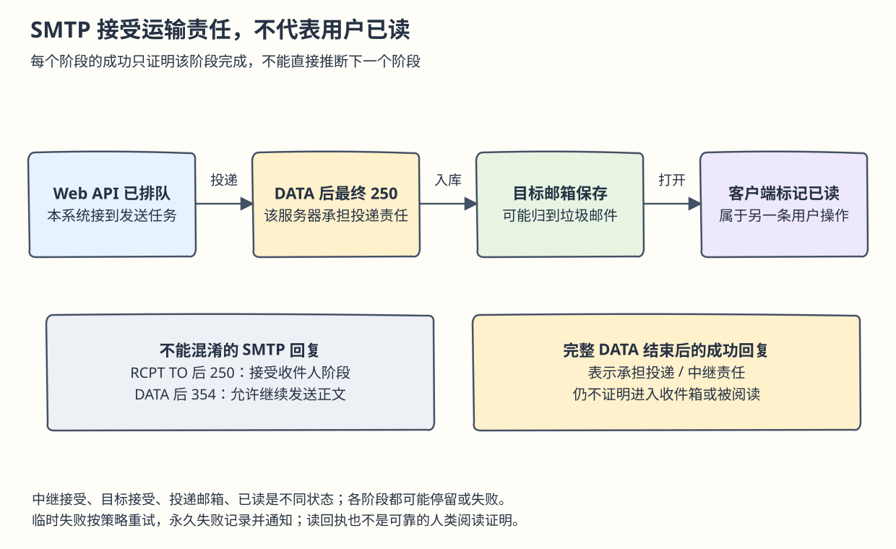

### Q23-02｜为什么附件常放对象存储？

**结论：附件通常“大、少改、整块读”，而邮件列表需要“小字段、高频查”；分开存储能让容量、查询和生命周期分别优化。** 数据库保留附件 ID、对象 key、大小、类型、校验值与权限关系，对象存储保留字节。查收件箱时无需把几 MB 附件一起搬进数据库缓存。

用本章假设计算 1000 封邮件：每封正文/元数据 50 KB，共 50 MB；20% 带平均 500 KB 附件，即 `200 × 500 KB = 100 MB`。附件虽只出现在五分之一的邮件中，却占这份简化模型总字节的三分之二。放大到每天 400 亿封收信，附件约 4 PB/天、1460 PB/年，尚未计副本、索引、MIME 和备份。对象存储可独立扩容、分段上传、按访问频率转冷层，避免大 blob 挤压数据库索引和热邮件页。

Base64 还有传输成本：每 3 字节编码为 4 字符，500 KB 二进制约变成 667 KB，再加 MIME 头与换行。解码后单独保存原始附件可以避免把这部分编码膨胀也复制进所有附件存储副本，但若业务要保留完整原始 MIME，仍要计入那份副本，不能重复省算。

**边界：** 对象存储不是“任意附件都免费”。还要算请求、下载流量、冷层取回与最小保存期限；并保证先持久化字节再发布引用，失败后清理孤儿。下载必须校验邮箱权限或签发短时 URL，不能把可猜的对象 key 当权限。小附件是否合并存储，应按实际读写和成本测量决定。

**记忆提示：数据库保存附件清单，仓库保存附件箱子；省的是不同访问模式互相拖累的成本。**

### Q23-03｜搜索不到刚收到的信，先查哪个队列水位？

**结论：先确认原信已在权威邮箱存储，然后查“邮件变更 → 索引任务 → Elasticsearch”的索引更新队列水位。** 不要先扩发信 SMTP worker：邮件已经收到时，发信队列往往不在这次搜索故障路径上。

以该邮件的 `email_id` 找到对应变更事件，并定位 Kafka 的 topic、partition、offset。假设事件在分区 P 的 offset 4312，日志末尾已到 4315，而索引消费者只处理到 4280，说明事件仍在排队。此时查积压增长、消费者错误、重试/死信和分区热点。若生产端根本没有 4312，则检查数据库提交后的 outbox/CDC 事件是否成功发出。水位必须按分区比较，不能把不同分区的 offset 当作全局时间线。

如果消费者已处理 4312，还要分清“取到/提交消费进度”“ES 成功写入”“搜索 refresh 后可见”。Bulk 请求可能部分文档失败；若消费 offset 提前提交，表面零积压也可能漏建索引。ES 写入确认后通常还需 refresh 才能搜索到，所以要继续看索引应用版本、失败记录与可搜索水位，而不是认定 Kafka 正常就完成了。最后核对 `user_id` 路由、索引别名、权限过滤和查询条件。

**边界：** Elasticsearch 是近实时搜索，具体 refresh 设置会影响延迟。可给用户“邮件已收到，搜索索引处理中”的状态，或按邮件 ID 从主存打开；不要为了每封信立即可搜就无条件全局强制 refresh。删除和权限事件尤其需要及时处理，搜索结果还应做权限校验。

**记忆提示：先找原信，再追索引事件；队列消费完，不等于搜索已经可见。** 参考：[Elasticsearch 近实时搜索](https://www.elastic.co/docs/manage-data/data-store/near-real-time-search)。

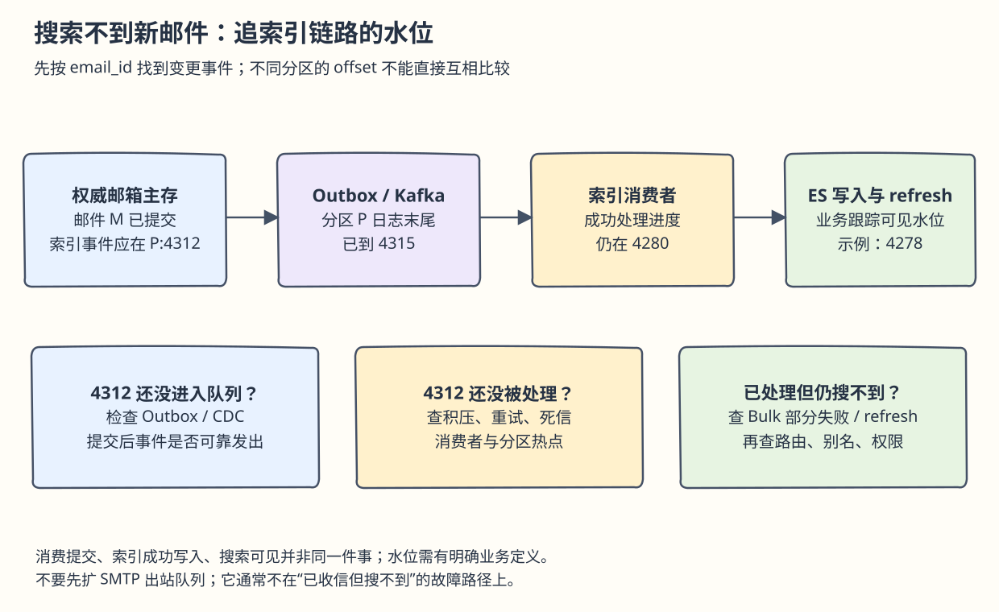

### Q23-04｜已读查询表反规范化之后多了什么写入责任？

**结论：读时少做过滤，换成写时维护多份一致的查询结果。** 一封信从未读改成已读，不再只是修改主记录的 `is_read=true`；还要从未读视图移除、写入已读视图，并更新未读计数、搜索过滤字段和其他依赖视图。

例如邮件 M 在版本 7 为未读，更新到版本 8 为已读。权威存储应先接受这个状态转换；可在支持的同一事务里同步维护相关表，或者原子保存权威状态与待发布事件，再由可重试的投影消费者更新视图。采用后者时，要明确短暂最终一致窗口：搜索或列表可能稍晚变化，但主状态已经是版本 8。不能因为“用了 Cassandra/NoSQL”就假设跨表、跨分区所有更新自动原子成功。

重复事件必须幂等。例如版本 8 的已读事件被投递两次，第二次不能再次把未读数减一；可以记录已应用版本/事件 ID，或从当前权威状态重建准确计数。乱序也要处理：版本 9 已把邮件放入垃圾箱，迟到的版本 8 不能把它重新插回已读收件箱。删除、移动文件夹、批量标记和重新标为未读，都必须遵守同一套投影规则。

**边界：** 手工双写最容易留下半更新：主记录已读、未读表仍有它、计数也没变。要有失败重试、死信排查和周期对账/重建，并指定哪份数据是真相。前端不能靠“从两个列表都删掉再加回来”的临时动作替代服务端维护。

**记忆提示：反规范化把一次复杂查询，换成每次状态变化时的一组可靠写入。**

## 第24章：类 S3 对象存储

原题与背景：[第24章中文正文](../24.%20S3-like%20Object%20Storage/README.md)。本组区分空间成本、数据耐久性、读写一致性和完整性校验，四者不能混为一谈。

### Q24-01｜8+4 的总存储放大为什么是 1.5？

**结论：原始数据分成 8 份等大数据分片，再产生 4 份同等大小的校验分片，共存 12 份；总量是 `12/8=1.5` 倍。** “额外开销”则是 `4/8=50%`，不要把总占用 150% 误说成额外增加 150%。

例如原始对象 800 MB，切成 8 片，每片 100 MB；再生成 4 片校验，各 100 MB。总占用 `8×100 + 4×100 = 1200 MB`，比原始多 400 MB。若改用完整三副本，会占 `800×3=2400 MB`，因此这份理想模型的 8+4 总占用是三副本的一半。实际还要加上元数据、校验和、对齐填充、小对象包装和修复时临时空间，不能用 1.5 直接当作机房最终采购倍数。

采用具备相应性质的编码（例如合适的 Reed–Solomon 12/8 MDS 编码）时，任何 8 个有效分片可恢复原数据，因此最多容忍 4 个**已识别位置的缺失分片**。这不是“随便坏四台机器都没事”：若五片放在同一故障域，该区域故障一次就只剩七片，无法恢复。损坏分片需要先由校验发现并当作不可用处理，不能把未知错误与已知缺失完全等同。

**边界：** 空间省下来，通常要付编码/解码、跨节点读取与修复带宽成本。能恢复一次丢四片，也不等于一定达到某个“几个九”的耐久性；修复时间、相关故障和操作失误仍影响风险。

**记忆提示：分母看原始的 8，分子看最终的 12；50% 是额外，1.5 倍是总量。**

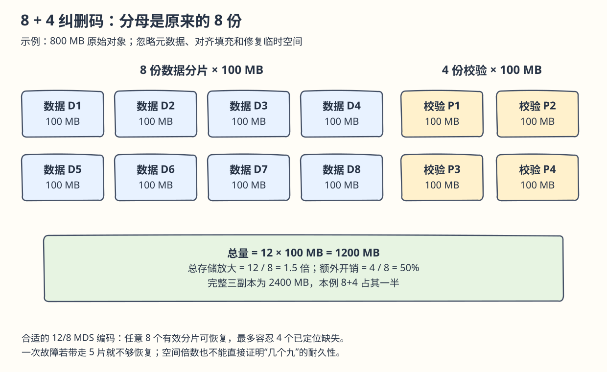

### Q24-02｜元数据提交失败会留下什么？

**结论：如果数据字节已经持久化，而 `bucket/key → object_id` 的元数据未成功发布，就会留下不可通过正常名称读取的孤儿对象或分片。** 但“客户端收到超时”不等于“元数据一定没提交”，必须先查证状态，不能立即删数据。

例如上传 U9 已写出对象 O9 的三份副本；随后提交 key `photo.jpg` 指向 O9 时数据库连接断开。存在两种结果：事务确实回滚，O9 尚无可见引用；或者事务已提交，只是响应丢失，O9 已是合法对象。恢复流程应携带稳定的 upload/request ID，查询提交记录并幂等重试。若已经完成就返回原结果，不能产生另一个版本后再随便删除 O9。

对真正的孤儿，GC 可先标记候选，再等待安全宽限期，确认没有已提交版本、活动 multipart 会话、重试事务或保留策略引用，并结合可验证的提交/GC 水位重新检查后回收。新上传可能先写字节、稍后才发布元数据，因此“这一秒查不到引用”不足以证明它是垃圾。若元数据系统暂不可达、GC 无法证明无引用，通常应延后删除，以空间暂时增长换数据安全。

**边界：** 反过来先发布元数据、字节还没达到耐久性要求，会产生用户看得见却读不到的坏引用，比短期孤儿更危险。覆盖已有 key 时，旧版本也可能仍被在途读取或版本保留引用；切换完成不等于可以立即物理删除旧字节。GC 必须遵守读者安全与版本生命周期。

**记忆提示：宁可暂时多一箱找不到货单的货，也不要先发货单却没有货；删箱前再确认一次。**

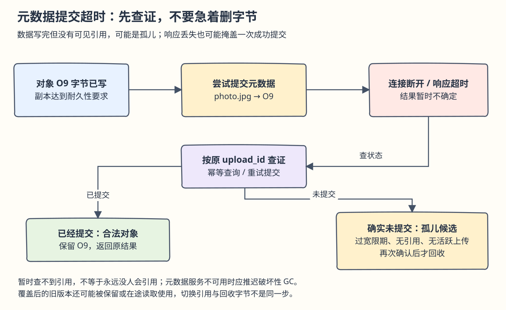

### Q24-03｜同步三副本为什么不能直接证明线性一致？

**结论：同步三副本主要说明成功写入前有多份数据，线性一致则要求每次操作看起来在调用与返回之间某个瞬间生效，并且尊重现实先后顺序。** 副本数量没有说明写入怎么排序、读哪个版本、选主怎么做、旧主能否继续接单。

一个反例足够说明问题：key K 原来指向对象 O1；客户端 PUT 新对象 O2，O2 的字节已同步到三台数据节点，元数据也提交为 K→O2，随后系统返回成功。另一个客户端在这之后 GET K，却命中仍缓存 K→O1 的元数据，读出了旧值。虽然 O2 有三份完整副本，这次读仍违反了“已完成写之后的读取应看见该写或更新值”的要求。若读取与写入重叠，返回旧或新值可能都合法；本反例特意让 GET 在 PUT 返回之后才开始。

要证明更强语义，至少需明确：同 key 的并发写有统一顺序与提交点；成功响应只在该版本真正提交后返回；读路径取得已提交且足够新的版本；故障选主保留已提交历史，使用任期/栅栏隔离旧主；缓存不能绕过这些规则返回旧映射。可以通过共识日志、受验证的 Leader 读取等构造协议，但只写“`R+W>N`”也不是完整证明，还需处理并发、版本和故障。

**边界：** 这不是说同步复制不能成为线性一致系统的一部分，而是它单独不足。三副本字节都在仍可能读错版本；反过来，读写顺序正确也不自动提供足够的长期备份与灾难恢复。

**记忆提示：副本回答“数据还在几份”，线性一致回答“这次读应该看见哪一份历史”。**

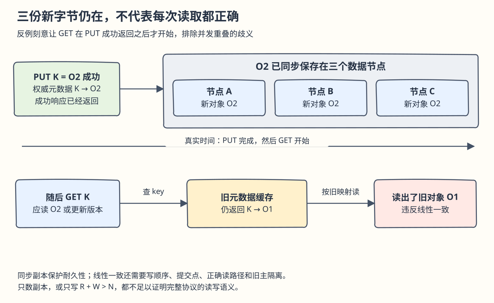

### Q24-04｜ETag 为什么不能始终当 MD5？

**结论：ETag 是服务定义的实体标识，不能无条件理解为“完整对象字节的 MD5”。** AWS S3 官方文档明确区分创建方式与加密方式：某些单段上传、明文或 SSE-S3 对象的 ETag 可为 MD5；但 Multipart Upload、Part Copy，以及 SSE-KMS/SSE-C 加密等情况不满足这个等式。目录桶还不支持 MD5。

例如同一个 20 MB 文件，用单次上传与分成两段上传，得到的 ETag 可能不同；常见 multipart ETag 带有类似 `…-2` 的段数后缀，但不能仅凭格式自行推导所有服务的校验规则。若客户端直接比较 `md5(local_file) == ETag`，可能把完整正确的分段上传误判为损坏。反过来，字符串恰好长得像 32 位十六进制，也不能作为算法证明。

正确做法是把 ETag 按 API 契约用于条件读取/写入或缓存验证；完整性则使用明确声明的 checksum 算法与字段，例如服务支持的 SHA-256、CRC 等，并确认比较的是**全对象 checksum 还是分片组合 checksum**。本地与远端必须覆盖相同字节范围，不能拿压缩前文件的哈希去比压缩后对象。收到不匹配结果要停止把对象标为完整，检查传输/编码或重试，而不是忽略差异。

**边界：** ETag 也不是通用版本 ID 或安全签名。某些场景可可靠使用其 MD5 性质，但要以该产品、上传路径和加密配置的文档为前提，而不是从一次实验推广到所有对象存储。

**记忆提示：ETag 先当不透明标签；完整性要问清“什么算法、哪些字节、哪种组合”。** 参考：[S3 Object API 的 ETag 说明](https://docs.aws.amazon.com/AmazonS3/latest/API/API_Object.html)。

## 第25章：实时游戏排行榜

原题与背景：[第25章中文正文](../25.%20Real-time%20Gaming%20Leaderboard/README.md)。本组以“分数高优先”为默认方向，并明确区分分数、展示顺序与并列名次。

### Q25-01｜为什么 HTTPS 不能防玩家自行报高分？

**结论：HTTPS 保护传输过程，不能让发送端自己编造的内容自动变真。** 合法登录的玩家可以控制自己的客户端、修改代码或直接调用 API；他完全可以通过一条加密良好的连接发送 `{"score":999999}`。服务端若照单全收，加密保护的恰好是这个假数据。

正确的信任边界是让权威游戏服务器根据已验证的比赛状态/动作计算结果，客户端只提交允许的输入或比赛引用。计分事件应包含比赛 ID、玩家、结果、规则版本和唯一事件 ID，由可信服务认证发送；消费端校验比赛确实完成、玩家属于该比赛、计分符合规则，并利用唯一约束防止重放。比如同一场赢得 10 分的事件因为超时重发三次，总分只能增加 10，不能增加 30。可先持久保存比赛事实和处理状态，再把榜单作为可重建视图更新到 Redis。

仅让客户端给分数签名通常没有解决问题：若签名密钥也发到玩家设备，攻击者可提取或调用签名逻辑。同样，用户登录证明“谁提交了分数”，不证明“分数怎么来的”。服务间签名有价值的前提，是私钥与权威计算都留在可信服务器一侧。

**边界：** 单机离线游戏无法仅靠一个服务器接口百分之百证明玩家真实完成了挑战，可能需要可验证动作回放、反作弊检测、设备证明和异常审核，并明确剩余风险。不要把它说成加 HTTPS 就能获得的保证。

**记忆提示：HTTPS 保证信封运输没被偷改；权威计分保证信封里写的事有依据。**

### Q25-02｜两人同分时 Redis 返回的位置就是题目要求的并列名次吗？

**结论：不一定。Redis 返回的是按规则排好后的零基位置，不会自动把同分的人赋予同一个名次。** Sorted set 同分时还会按成员字符串的字典序打破平局；反向读取时顺序也反向。这是一种稳定排序规则，不一定是产品的并列排名规则。

例如 B=100、A=100、C=90。反向顺序可能是 B、A、C，`ZREVRANK` 分别返回 `0、1、2`，加一得到 `1、2、3`。但“竞赛排名”希望 `1、1、3`，“密集排名”希望 `1、1、2`，都不能直接拿位置代替。必须先问产品采用哪种排名。

竞赛排名可用公式 `rank(s)=1+分数严格大于 s 的人数`。100 分上方有 0 人，所以 A、B 都第 1；90 分上方有 2 人，所以 C 第 3。单 ZSET 可用 `ZCOUNT board "(100" +inf` 统计严格大于 100 的人数。密集排名统计的是“严格更高的不同分数档位数”，不是人数，因此需要另一个分数分布结构或聚合，不能把同一条 ZCOUNT 直接复用。

**边界：** 先读 `ZSCORE` 再计数之间若发生加分，结果可能混用两个时刻；单 key 可用原子脚本或其他一致读取方式，跨片则需定义快照或接受短暂近似。展示时仍可给并列者配置次序，如先达分者优先，但应把“次序”与“并列名次”分开。

**记忆提示：位置给每人一个座号；名次可能让同分的人共享领奖台。** 参考：[Redis ZREVRANK](https://redis.io/docs/latest/commands/zrevrank/)、[Sorted sets](https://redis.io/docs/latest/develop/data-types/sorted-sets/)。

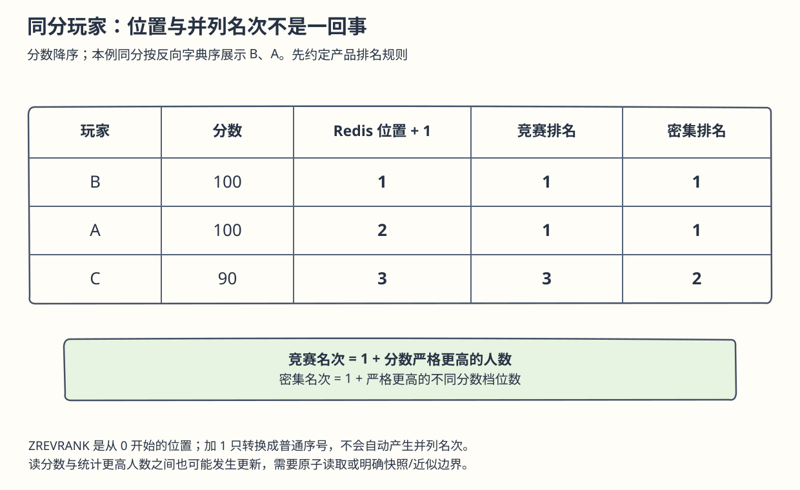

### Q25-03｜Redis Cluster 为什么不能自动拆一个大 ZSET？

**结论：Redis Cluster 按 key 分配哈希槽，不按一个 ZSET 内的成员分片。** 集群共有 16,384 个槽，普通 key 通过 `CRC16(key) mod 16384` 定位其中一个槽；一个 key 的数据作为整体由该槽对应的主节点负责。榜单有一亿成员，若都在 `leaderboard:month` 这个 key 中，仍集中在同一主节点。

增加节点可以搬迁槽和整个 key，却不会把这个 ZSET 的前一半成员自动放 A、后一半放 B。副本能提供容错，某些读取策略也能分担读负载，但不会自动拆散这个 key 的写吞吐或内存需求。类比是搬迁整本词典，不是自动按字母切成多卷。

要分散一个逻辑榜单，应用先设计多个 key，例如按玩家 ID 哈希到 `board:2026-09:s00` 到 `s15`，再确认这些 key 落到不同槽/节点。注意不要都写成 `board:{2026-09}:s00`、`...:s01`：共享 hash tag `{2026-09}` 会故意把它们送进同一槽，失去此次分片目的。若需在每片内原子更新分数和去重状态，可以把**同一片**相关 key 使用相同标签，而不是全榜共用标签。

**边界：** 分片不是免费的。全局 Top K 要跨片合并，个人精确名次需要跨片统计更高分人数；跨槽多 key 原子操作也受限制。范围分片可改善部分查询，却增加玩家跨分数段迁移的复杂度。应依据真实容量和读写模式决定，不能只“打开 Cluster”就宣布单大 key 已解决。

**记忆提示：Cluster 分的是 key 这本书；拆书成多卷是应用的工作。** 参考：[Redis Cluster 分片](https://redis.io/docs/latest/operate/oss_and_stack/management/scaling/)。

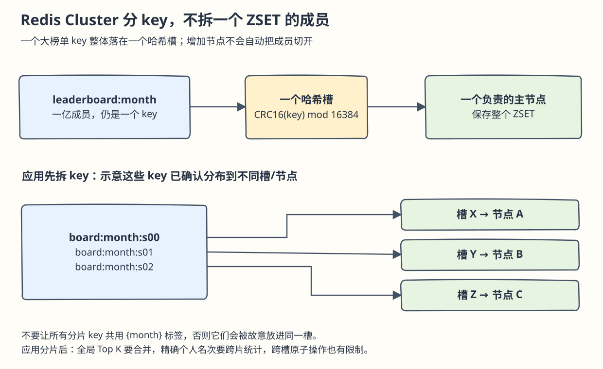

### Q25-04｜本地 Top 10 为什么足够求全局 Top 10？

**结论：在每名玩家只属于一片、所有分片使用同一完整排序规则、并以同一逻辑快照比较时，取各片前 10 再合并，足够得到全局前 10 个玩家。** 规则可为“分数降序，同分按用户 ID”，但每片与最终合并必须完全一致。

反证：假设玩家 P 在全局前 10，却没有进入自己分片的前 10。那么本片已经有至少 10 名玩家排在 P 前面。这 10 人也都存在于全局，并且按相同规则仍在 P 前，因此 P 的全局位置至少是第 11，矛盾。于是全局前 10 必然包含在各片前 10 的候选并集中。m 个分片最多返回 `10m` 人，取并集排序或用堆合并即可；某片不足 10 人就取全片。

举一个缩小版 K=3：A 片 `[100,90,80]`，B 片 `[95,85,75]`，C 片 `[93,92,70]`，候选合并后的全局前三为 `[100,95,93]`。任何本地第四名都已经被本地三人压住，不可能突然成为全局前三。

**边界最重要：** “前 10 个人”与“第 10 名边界的所有并列者”不同。若 12 人都为 100 分、同属一片，本地只取 10 人就遗漏两位并列第一。要包含边界同分者，可先求全局第 10 个位置的分数阈值，再向各片取所有不低于阈值的人；若产品要求前 10 个**不同分数档位**，又是另一种阈值算法。各片数据若在查询中持续变化，得到的是不同时间截面，严格的快照证明也不再直接成立。

**记忆提示：本地出不了前 K，全局也出不了；但“人头 K 个”不等于“名次含并列”。**

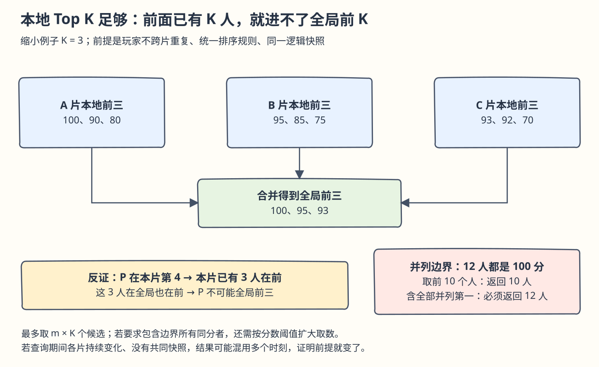

## 通用复盘题

这组题沿用同一个电商例子：每天 100 万次下单，峰值 1,000 TPS；商品详情峰值 30,000 QPS；一单一个商品，人民币金额用“分”表示。初始订单、库存预留和 outbox 在同一个关系数据库中，支付由外部 PSP 处理，通知、搜索和统计异步更新。这些是用于推理的假设，不是产品实测结论。

### R-01｜一次请求从哪里进、哪里返回成功？

[出处：一分钟复盘法](../术语速查.md)

**先定义成功的含义。** 用户点击下单，客户端携带稳定的 `checkout_id` 经网关进入订单服务；服务校验身份、商品价格版本和数量，在本地事务中条件扣减可售库存、写入“待支付”订单、写入 outbox 事件。三项一起提交后才能返回“订单已创建”，此时 HTTP 201 并不表示已经付款或可以发货。扣库存必须检查受影响行数，库存不足则整笔回滚。

数据库提交后，发送器读取 outbox，支付服务用该订单对应的固定幂等键向 PSP 发起支付。PSP 验签回调或主动查询确认成功后，支付服务保存结果，账务服务幂等记账，订单再进入“已支付”，随后发出履约事件。用户页面可以先显示“支付处理中”，靠查询或推送获得终态。浏览器回跳不作为付款凭证。

如果返回响应途中断网，客户端不能把超时解释为订单不存在，而应复用原键重试或查询；数据库中的订单是创建结果的依据。平均下单约每秒 12 笔，峰值却是 1,000，因此接口容量按峰值和压测规划。把 PSP、短信移出数据库事务，牺牲了“一次响应就完成一切”的简单体验，换来更短锁占用和更好的故障隔离；成功边界清楚，重试才不会变成重复扣钱。

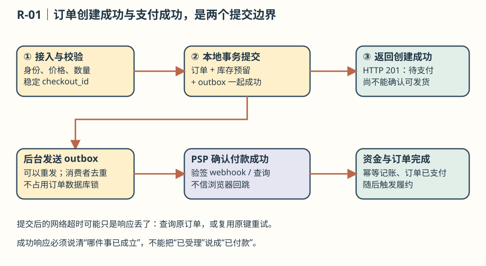

### R-02｜哪一份记录是可用于恢复的权威事实？

[出处：一分钟复盘法](../术语速查.md)

**不能给整个系统只指定一份“万能真相”。** 在这个电商例子里，订单数据库中已提交的订单与库存预留，决定订单是否存在、预留了多少货；支付机构确认的交易及内部不可变支付记录，决定外部扣款是否完成；已入账凭证解释内部资金变化。Redis 商品缓存、搜索索引、短信发送状态都不能反过来证明订单已支付。各领域事实要用订单号、支付号、币种、金额和业务版本关联起来。

例如进程在提交订单后、发布消息前重启：订单与 outbox 已在同一事务内落库，恢复后的发送器扫描未发送 outbox，继续发布；消费者按事件 ID 去重。如果 Redis 全丢，可从商品库重建；搜索全丢，可从订单事实重建投影。若 PSP 已扣款但本地没有收到结果，则保存“未知/处理中”，按原支付键查询并用结算文件对账，不能凭本地缺少记录就宣告扣款失败。

这里的“权威”还包含故障承诺：返回成功的事务须满足规定的刷盘与副本确认条件，快照应标注覆盖到的日志位置，恢复只重放其后的记录。备份与恢复演练验证的是能否找回事实，而非机器是否在线。保留可追溯记录会增加存储和恢复管理成本，却让派生数据丢失可修复、跨系统争议可调查；仅保留最新余额或状态虽然省空间，无法解释历史变更。

### R-03｜请求重复、机器重启、网络断开时会发生什么？

[出处：一分钟复盘法](../术语速查.md)

把三类故障分别沿同一条下单链路推演。**请求重复**时，同一 `checkout_id` 受到唯一约束保护；相同参数返回原订单，不再扣第二次库存，同键不同商品或金额则拒绝。支付使用稳定业务幂等键，消息消费使用事件去重记录，并把“去重记录＋本地业务更新”放在一个事务中。发送按钮变灰只是体验优化，不能替代服务端约束。

**机器重启**时，事务提交前的写入回滚，已提交订单和 outbox 保留。发送器从已确认进度继续，可能再次发送上一次已发但尚未标记完成的事件，所以消费者仍会收到重复。它应先查自己的处理记录，再决定是否更新库存、账本或发出下一事件；不能只把“已读消息”保存在进程内存。

**网络断开**时，最危险的是“对方做完了，我没拿到响应”。调用 PSP 超时后保持处理中，查询原支付结果或等待验签回调，重试复用原键。采用退避和抖动、总重试预算、死信告警与对账，不让千次每秒峰值变成重试风暴。数据库主副本失联时，若无法取得所需的一致性确认，宁可暂时拒绝新增资金操作，也不让两个写者各自确认成功。代价是部分请求等待更久，但不会用可用性掩盖重复订单或不明扣款。

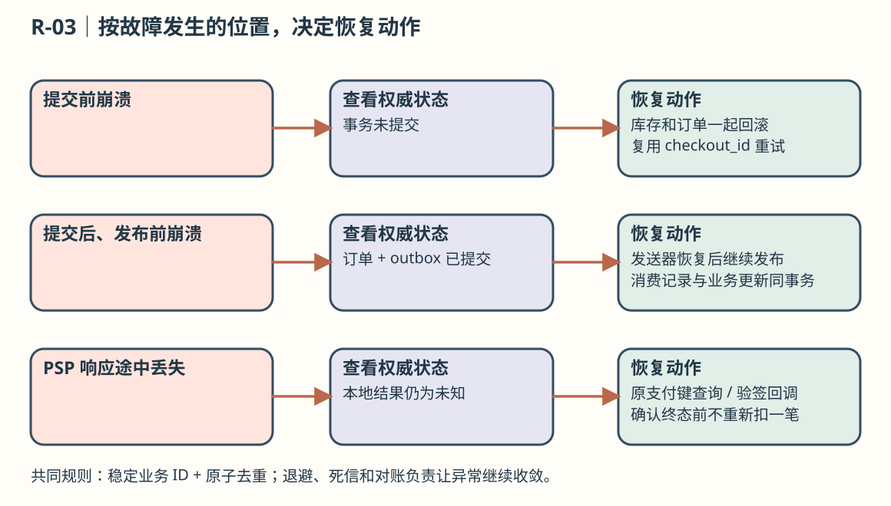

### R-04｜哪个数字或查询模式决定了要不要缓存、分片或异步？

[出处：一分钟复盘法](../术语速查.md)

先把“总流量大”拆成不同访问路径。商品详情峰值 30,000 QPS，内容读取频繁、修改较少，可按商品 ID 缓存；若命中率达到假设的 95%，回源仍有约 1,500 QPS，必须压测数据库是否承受得住，并为热点失效准备请求合并和限流。商品展示允许短暂旧价格，结账则重新校验权威价格版本与库存，不能用缓存库存直接确认售出。

下单平均约 `100 万/86,400≈12 TPS`，峰值 1,000 TPS；决定容量的是峰值事务耗时、锁竞争和 I/O，而非日均。如果单库在所需事务隔离和持久化配置下有足够余量，就先不分片；只有数据体积、写吞吐或租户隔离确实逼近上限，再按查询模式选键。按用户分片方便查用户订单，却可能让同一商品库存跨片竞争，不能忽略这一代价。

短信和搜索更新不决定订单是否成立，适合异步。队列容量按积压算：若消费者每秒处理 500 个事件，而入口连续 10 分钟每秒 1,000 个，积压约 30 万条；要估每条大小和恢复追赶速度，而不是无限加队列。缓存省读延迟却引入陈旧数据，分片增加迁移与跨片事务复杂性，异步提高隔离却增加结果等待。用这些数字选型，才能解释组件存在的原因。

### R-05｜我为了延迟/成本/可靠性牺牲了什么？

[出处：一分钟复盘法](../术语速查.md)

在这套下单方案中，先列不可妥协的条件：同一订单不能重复预留库存，已确认支付不能重复入账，未确认的资金结果不能伪装成成功。为降低延迟，我们缓存商品详情并异步发送通知；代价是展示价格可能短暂陈旧、短信可能晚到。因此结账强制核验价格版本，订单查询展示真实处理阶段，通知失败不撤销已经成立的订单。

为降低成本，初期保留单个逻辑数据库集群，不急着按用户分片；代价是它有明确的写吞吐和容量上限，需要监控峰值锁等待、磁盘增长及故障后剩余容量。为了可靠性，订单与 outbox 同事务提交，支付和账务保留幂等历史并部署跨故障域副本；代价是额外写入、复制等待、存储和运维成本。若只有异步异地复制，就要如实说明地域灾难下可能存在恢复点缺口，不能把它说成零丢失。

遇到网络分区，我们优先保持订单和资金的单一权威写入，必要时暂停下单；商品浏览和带时间标记的历史查询可以继续。这个取舍降低了故障期间的交易可用性，却避免事后无法判断哪笔扣款或库存承诺有效。最终通过明确目标验收：峰值 1,000 TPS 下的尾延迟、允许的库存预留时长、支付终态等待上限、恢复时间和恢复点，都要量化，再用压测、故障演练与对账检验。

## 第27章正文追问

### P27-01｜是否知道任意时刻的账户余额？

[出处：数字钱包·事件溯源](../27.%20%20Digital%20Wallet/README.md)

**可以重建，但先定义“任意时刻”。** 是“系统在那个时刻已经知道并提交的余额”，还是“把后来补录的交易也归属到业务发生日后的余额”？两者不同。事件至少应保存账户、币种、金额、交易 ID、提交序号、提交时间、业务生效时间、事件 schema 版本和规则版本。需要审计历史可见状态时，通常以已提交的日志边界为准，而不能只按可能乱序的客户端时间筛选。

假设账户 A 在序号 100 的可信快照里可用余额 10,000 分、冻结 0 分；101 预留 1,500 分，102 确认扣款，103 入账退款 500 分。查询截至序号 101 的状态，应重放到 101，得到可用 8,500 分、冻结 1,500 分；查询截至序号 103 则得到可用 9,000 分、冻结 0。快照必须带最后应用序号、数据版本和校验信息，恢复从下一事件开始，避免既把快照算一次又重复扣款。没有快照也能从已知期初余额完整重放，只是更慢。

重放只接受已提交且去重后的事实，用对应版本的确定性归约器更新本地状态，禁止访问 PSP、发送通知、读取实时汇率或生成新的随机业务 ID。跨账户、跨分片查询“同一时点总余额”还需要定义一致切面与在途资金账户；各分片随意取最新值会出现暂时不平衡。可重建的结论依赖完整日志和版本可用，数据超出保留期或版本缺失时应明确报告无法准确还原。

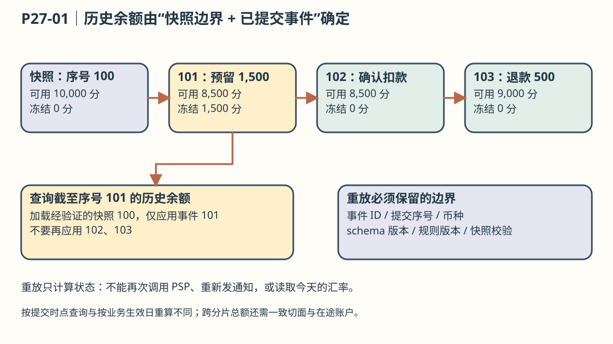

### P27-02｜如何证明历史余额和当前余额正确？

[出处：数字钱包·事件溯源](../27.%20%20Digital%20Wallet/README.md)

**重放相同结果只是第一层证据。** 如果原始事件把 100 分错记成 1,000 分，旧程序和重放程序都可能得到同样错误。因此审计至少分三层：事件是否完整且未被悄悄改写，账务不变量是否成立，以及记录是否对应真实业务凭证。日志应检查序号缺口、重复事件、交易 ID 唯一性、版本和校验值；访问控制与不可变保留策略用于降低历史篡改风险。

然后用独立重算过程，从期初余额或经过验证的快照应用全部已提交事件，与线上余额投影按账户、币种、最后应用序号比较。检查每笔转账借贷合计平衡、冻结释放不超过预留、余额不得违反业务约束，跨分片在途资金有明确归属。不能把人民币和美元相加后声称守恒，也不能只比所有账户总额，因为一增一减记错账户仍可能总额正确。

最后把流水与订单、充值/提现凭证以及 PSP 或银行结算记录对账。外部交易成功而内部缺失、金额不符或终态长时间未收敛，要进入有责任人的差异处理。修复使用可追溯的补正事件，关联原流水和审批原因，不覆盖旧事件来“消除差异”。审计流水保留 schema、规则和补正版本；验证器在隔离环境只读执行，禁止触发外部付款或再次发送业务事件。这样形成“来源凭证—事件分录—余额投影”的证据链，而不是只证明程序能重复跑一遍。

### P27-03｜代码修改后，如何验证系统逻辑仍然正确？

[出处：数字钱包·事件溯源](../27.%20%20Digital%20Wallet/README.md)

先固定验证输入：同一份不可变事件集、同一个已验证快照、相同的起止序号、账户配置、币种精度和历史规则版本。旧版本与候选版本分别在隔离存储中重放，关闭网络写出、PSP 调用、通知和消息发布；外部服务返回、汇率、时间与随机选择若影响结果，必须已经记录为可重放事实，不能让新程序重新取得“今天的答案”。

逐步对比每个事件之后的账户状态、冻结金额、分录、已保存的拒绝原因和最后应用序号，除了末尾校验和，还要定位**第一个分歧事件**。末尾总余额相同不够：中途重复扣款又被后续补偿抵消，仍可能让用户一度错误透支。样本覆盖重复、乱序、崩溃恢复、补偿重试、历史 schema、金额边界和跨分片在途转账；完整流水做离线回归，线上可让新投影只读影子运行，并监控偏差。

如果这次仅优化实现，原则上同版本业务语义的派生结果应一致；任何差异都需解释。如果是合法规则变更，就不能强求所有历史结果与旧版本完全相同。应保留旧流水与原规则版本，对明确的新生效区间应用新规则，用升级器或新事件版本处理格式变化，并为预期差异建立审批与断言。已有真实转账绝不能通过重跑命令再执行一次；事件重放只重建状态，确需调整资金时另发受控补正交易。若修改的是命令验证或事件生成逻辑，还需用记录下来的命令与外部输入做无副作用重演，比对预期事件；只重放旧事件不能证明新的验证逻辑正确。

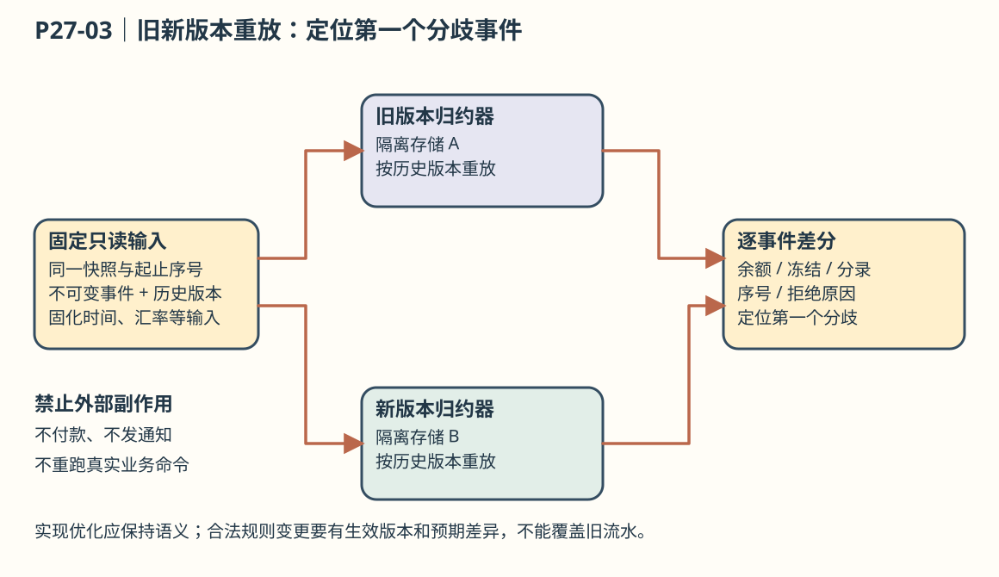

## 第28章正文追问

### P28-01｜主实例下线，什么时候、怎样切换到备份？

[出处：证券交易所·容错](../28.%20Stock%20Exchange/README.md)

**心跳超时只能触发怀疑，不能单独证明旧主已死。** 先结合心跳、进程健康、网络和复制进度判定故障，并停止向不确定的旧主发送新的可确认交易。切换必须满足：可获得合法选主仲裁，候选副本包含所需已提交日志，旧主的写入与成交发布权能被隔离，且候选已恢复到可提供正确服务的状态。缺一项就暂停交易，而不是为了快速变绿让两台同时撮合。

一个具体顺序是：网关进入短暂交易暂停并保留请求 ID；控制平面按任期完成选主；撤销旧主资格或由下游拒绝旧任期写入；新主恢复快照并重放已提交事件，验证序号连续、订单簿校验与资金冻结一致；然后先接管出站流的最后已发布位置，再恢复入站命令。对于故障前已提交但客户未收到结果的订单，查询和重试必须映射到原订单，不能新建；已生成成交不能因重放变成新的成交事实；补发回报可能重复传输，须复用原成交 ID 与序号，由接收方去重。

切换时不要凭最高本地序号认定最新，因为尾部可能尚未提交。使用共识协议确定合法已提交前缀，并处理少数旧主上未确认命令。若缺少已确认交易、出现日志缺口或无法证明唯一主节点，宁可停盘并调查。演练应验证单进程、单机、网络分区和副本同时故障的路径，统计从停止服务到重新正确成交的时间，而非仅记录进程启动速度。

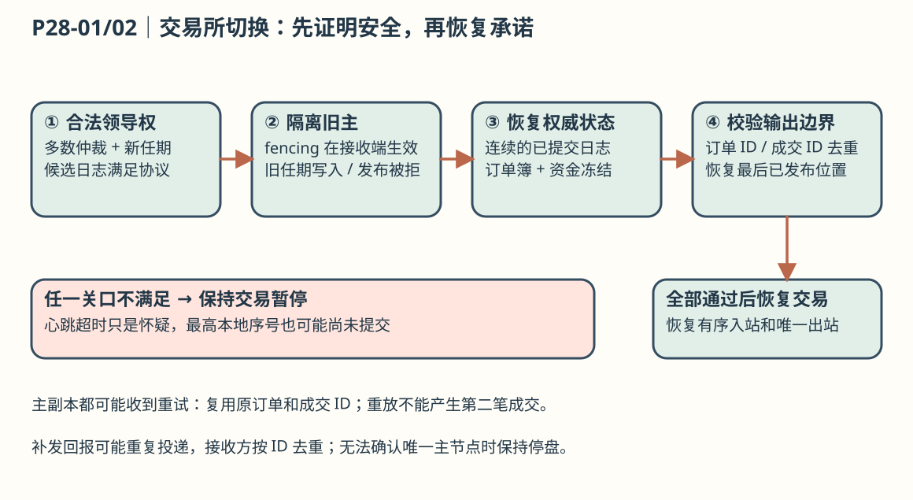

### P28-02｜从备份中如何选主？

[出处：证券交易所·容错](../28.%20Stock%20Exchange/README.md)

选主不应采用“谁先发现主机失联谁接管”。在一个假设的 3 节点 Raft 组中，候选者必须获得多数票，并满足日志新旧检查；任期单调递增，每个节点每任期只投一票。网络分区中的单节点不能仅凭自己仍能接收用户请求继续确认新交易。实际候选资格还需考虑数据完整性、软件版本和恢复进度，不能让缺失已提交前缀的副本绕过协议上位。

**选出新主还不够，必须防旧主继续产生效果。** 给每次领导权配置单调递增的 fencing token 或任期，把它附在向权威存储、序列化入口和成交发布通道发送的操作上。接收端必须记住已接受的最高任期并拒绝更旧任期；如果只有客户端自己检查 token，旧主仍可能越过检查发布成交。网络隔离、撤销连接/租约和硬件断电可作为补充措施，但必须明确故障时谁执行、怎样验证生效。

新主接管后只基于合法已提交日志恢复状态，恢复消费位置与出站提交位置，对订单 ID、命令序号和成交 ID 去重。租约类方案还要说明时钟误差与过期边界，不能将墙钟当作绝对可靠仲裁。备份都追不上、无法取得多数或无法隔离旧主时，系统应保持交易暂停，继续明确标记的历史只读服务。这样牺牲少数分区的交易可用性，换取不会出现两个订单簿各自承诺成交的资金安全。

### P28-03｜恢复时间目标 RTO 是多少？

[出处：证券交易所·容错](../28.%20Stock%20Exchange/README.md)

RTO 不是从技术栈名字推出来的，应由业务能容忍的停盘时间设定，再用演练证明。例如先假设同机房单机故障目标为 **5 秒内恢复可验证的交易服务**，而城市级灾难另定更长目标。把这 5 秒拆成不重叠的预算：故障发现 0.5 秒、选主和隔离旧主 1 秒、追日志与重建状态 2 秒、验证并重新开放网关 1.5 秒。实际阶段可部分并行，但不能重复扣算，也不能省掉最后的正确性检查。

最影响恢复时间的通常是日志落后量、快照新旧、重放吞吐和订单簿大小。若副本落后 100 万事件、只能每秒应用 20 万条，仅追赶就需要约 5 秒，已经花完整个预算；应提高热备应用速度、缩短快照间隔或改善恢复路径，而不是降低验证标准。演练统计端到端 P95/P99，包含客户端重连、重复请求处理与出站回报恢复，不能只测 leader 选举耗时。

**RPO 则回答能丢多少数据。** 对已向客户确认的订单和成交，目标可设为零丢失，但必须由确认前的复制持久化和提交协议支撑；异步灾备可能达不到同样 RPO，要单独披露。5 秒 RTO 不等于允许丢 5 秒交易，也不等于达到 99.99% 可用性：后者还取决于全年故障次数和总停机时间。如果恢复到一半发现日志缺口，应超出目标并停盘调查，不能为了满足秒表而开放错误交易。

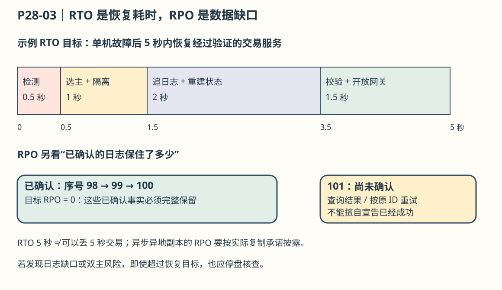

### P28-04｜必须恢复哪些功能，能否降级运行？

[出处：证券交易所·容错](../28.%20Stock%20Exchange/README.md)

恢复顺序应围绕“能否再次安全承诺交易”。最先恢复的是合法主节点身份、连续的已提交输入序列、订单簿状态、订单生命周期和资金/证券冻结事实。随后恢复幂等命令处理与成交回报的权威发布者及持久化出站位置；最后才重新开放经过风控的下单和撤单。撤单也必须进入同一有序命令流，并与已发生的撮合按序竞争；不能在主撮合不可用时从旁路直接删除订单并向用户确认已撤。

可以降级的功能包括高级图表、历史分析、非关键报表、部分深度档位或推送频率。只读余额、订单历史和行情若来自落后副本，要标出时间、序号或“可能延迟”，不能把陈旧报价当成可执行价格。通知和报告可暂时积压，但应保留完整事件并监控背压，恢复后按序补齐。若暂时只能收到请求而不能确认权威执行结果，只能明确返回“未接受/处理中”，不能把接收成功包装成成交成功。

以下情况应停盘或拒绝新增交易：存在两个可能写主、已提交日志缺口、无法校验订单簿一致性、冻结资金无法核对、出站成交去重状态丢失，或队列与延迟已超过安全上限。重新开盘前用最后提交位置和已发布位置核对，确认故障前成交不会变成新的成交、补发仍保留原成交 ID、未成交挂单不会凭空消失。安全降级的原则是缩减可提供的产品能力，保留交易语义；不能通过跳过风控、跳过序号或放松重复成交保护来追求表面可用。
