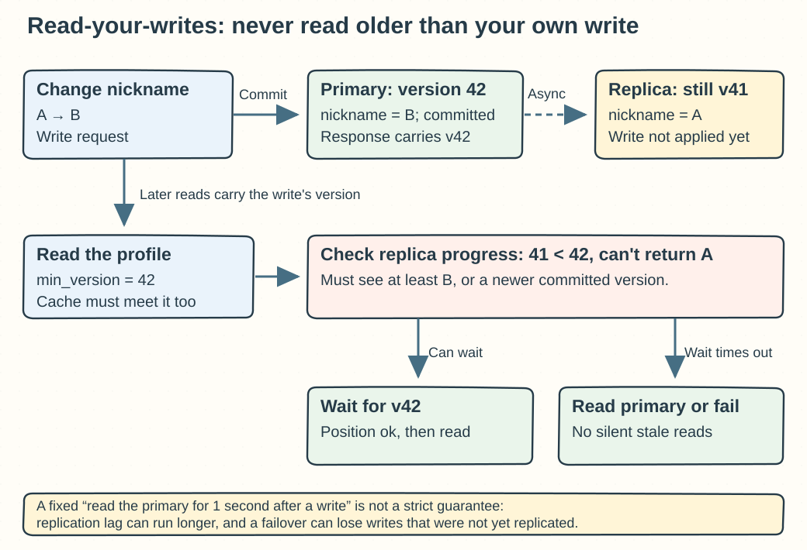
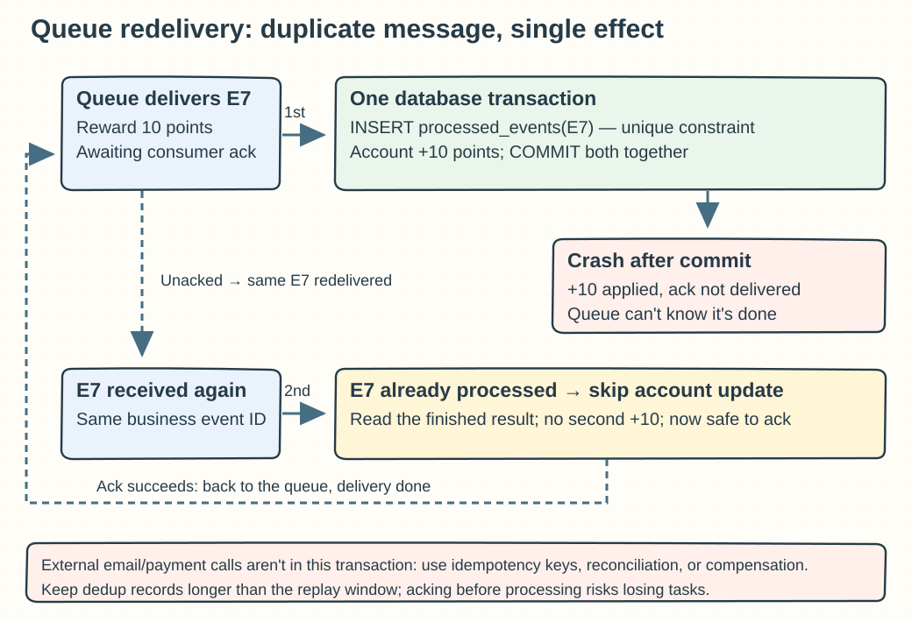

## Chapter 1: Scaling from Zero to Millions of Users

These questions follow Chapter 1. The focus is to locate the bottleneck first and only then talk about scaling, and to treat consistency and duplicate execution as part of the design.

### Q01-01 | Why doesn't adding web servers fix database lock waits?

**Conclusion: The lock wait happens inside the shared database, and adding web instances does not add any parallelism for modifying the same protected data.** New instances can even bring more concurrent transactions and make the lock queue longer.

Break a request into “web computation → get a database connection → run the SQL → wait for a lock → commit the transaction.” Adding web machines directly adds capacity only when web computation is the bottleneck. Suppose every order updates the same inventory row: while transaction A holds the lock, B and C must wait, and whether there are 2 web servers in front or 20, the database still has only this one inventory row. If each transaction holds the lock on that row for 50 ms and they must run one after another, the ideal ceiling is only about `1 / 0.05 = 20` per second, and in practice other overhead eats into that.

**The troubleshooting order** is to look first at how database time breaks down in request traces, then at lock wait time, blockers versus blocked sessions, transaction duration, connection pool queueing, and slow SQL. Once you know who holds the lock, check whether the transaction includes remote calls, human waiting, or needlessly broad updates. Shortening transactions, adding the right indexes, and accessing resources in a consistent order often work better than adding web servers. If a single business object is truly highly contended, consider atomic conditional updates, splitting inventory at a granularity the business allows, or serializing requests for that object.

**Boundaries**: You cannot simply remove the lock to gain throughput, or you may oversell, and an index doesn't remove the constraint that “the same row must be modified serially.” Adding database read replicas mainly shares reads and doesn't directly help with write-lock hotspots on the primary. If the lock wait is just amplification from too much concurrency, limiting concurrency may recover faster than adding more instances.

**Memory hook: Adding cashiers doesn't let two people edit the same line of the same ledger at once. First find where the waiting happens, then add the matching resource.**

### Q01-02 | When the cache hit rate drops, which metrics should you check first?

**Conclusion: First confirm how the hit rate is measured, then look at traffic, expiration and eviction, capacity, and backend load together; a single percentage can't explain the cause.** Compare the increase in hits and misses over the same time window, and avoid mixing counters accumulated since the process started, or ratios from different endpoints.

You can work through four groups of metrics. The first is request volume, read/write ratio, hit rate per endpoint or key prefix, and the rate of fetches that fall through to the backend, to tell whether the traffic mix changed or previously hot data suddenly became invalid. The second is expiration count, eviction count, TTL distribution, cache memory use against its limit, and key count, to separate normal expiry, clustered expiry, and insufficient capacity. The third is cache request latency, error rate, connection count, and connection pool waits, to separate “not found” from “the cache lookup timed out and was counted as a miss.” The fourth is database QPS, connection count, slow queries, CPU and disk, and P95/P99 latency, to judge whether the cache problem is already hitting the database.

**Example**: With 10,000 cacheable reads per second, if the hit rate drops from 98% to 80%, misses go from `10,000×2%=200` per second to `10,000×20%=2,000` per second, so the load that falls through to the database becomes 10 times, not just 18% more. If there are also many evictions and memory is at its limit, evaluate capacity, object size, and eviction policy first. If evictions are normal but expirations suddenly cluster, look for a uniform TTL, a deployment flush, or a cold start. If only one key is abnormal, check invalidation and rebuild behavior and hot access.

**Boundaries**: Redis keyspace hit statistics don't necessarily match business-level request hit rates, since one request may read several keys, and an application may also record a cache fallback as a miss. Don't extend the TTL endlessly just to raise the hit rate; wrongly stale data can be worse than slow data.

**Memory hook: First see “who missed,” then “why they missed,” and finally “whom the fall-through traffic is crushing.”**

To see how these metrics are defined, check the [official Redis INFO documentation source](https://github.com/redis/docs/blob/main/content/commands/info.md).

### Q01-03 | When a replica lags, how do you make sure a user can see the data they just wrote?

**Conclusion: Give this read an explicit consistency guarantee instead of just assuming the replica will catch up soon.** “Read-your-writes” means that after a user's successful write, later reads won't fall back to a version from before that write; it does not mean all users see the latest global state.

The simplest approach is to send the relevant reads to the primary after a critical write succeeds. For example, once a nickname change is committed, the profile page reads from the primary, or simply updates the page with the new value from the write response. A finer approach is to have the write response carry a version number or replication position. The client's later requests say “read at least version 42,” and the read router picks only replicas that have applied up to that position. If none has caught up, it can wait briefly, then fall back to the primary or return an explicit retryable error. The version token must be issued by a trusted service; never trust a position claimed by the client.

**Example**: The primary has changed the nickname from A to B, moving the version from 41 to 42, while a replica is still at 41. An ordinary load balancer that sends the request to that replica would show A again. If the request requires `min_version=42`, the server sees the replica only has 41, so it waits or reads the primary until it can return B or something newer. The read path must also account for caches: even if routing to the primary is correct, hitting a version-41 cache first still returns stale data.

**Boundaries**: A fixed rule like “read the primary for 1 second after a write” is only a rule of thumb. Replication lag may exceed 1 second, so it can't serve as a strict guarantee, and the primary itself can affect visibility through failover, uncommitted transactions, or stale caches. If a write that was acknowledged is lost in a failover, routing can't bring it back; you also need proper replication acknowledgement and failover policies. Updating the display directly only improves the current page and doesn't replace a guarantee for later reads.

**Memory hook: Don't bet on replication being fast enough. Write down the version, check it on read, and if the replica isn't there yet, wait or take another path.**

### Q01-04 | You chose `user_id` as the shard key, and a celebrity user overwhelms one shard. What do you do?

**Conclusion: First work out whether the hotspot is read-heavy, write-heavy, or a single request that triggers huge fan-out; simply adding ordinary shards usually can't split up one `user_id`.** The same shard key still lands in the same place, so handle the hotspot according to its type of work.

If it's repeated reads of a celebrity's profile or posts, use a CDN, a shared cache, and an application-local cache to spread the reads, and use request coalescing to cut the fetches that fall through when one key is invalidated. Cache rebuilds need a concurrency cap and a degradation path on failure. If a celebrity's post must be written into millions of followers' feeds, consider a hybrid: push on write for ordinary users and pull on read for celebrities, or fan out in batches with backlog monitoring. If it's a large volume of independent writes under one user, consider adding a bucket suffix, such as `(user_id, bucket_id)`, to spread the records across several sub-shards, while designing query merging, indexes, and migration.

**Example**: 1,000 ordinary users at 100 QPS each, plus one celebrity alone at 100,000 QPS. Going from 10 shards to 100 thins out the ordinary users but doesn't naturally split the celebrity's 100,000 QPS. If those requests read one cacheable profile, 10 cache replicas can share the read traffic. If they all modify the same balance, you can't keep the original atomic semantics by copying old values or bucketing randomly; you still need serialized coordination or a redefined business operation.

**Boundaries**: Moving the celebrity to a dedicated shard isolates the impact on other users but doesn't remove that shard's own capacity limit. Hotspots can move over time, so monitor load per shard and top keys, and prepare online migration, backfill validation, and routing-version cutover. Bucketing adds read amplification and the cost of cross-bucket transactions.

**Memory hook: Isolate the hotspot first, then split the work by reads, writes, and fan-out. More baskets won't automatically split the same big watermelon.**

### Q01-05 | Which tasks suit a message queue, and how do you stop consumers from running a task twice?

**Conclusion: Tasks that can finish later, need traffic smoothing, or should be decoupled from the main request suit a queue; redelivery is common, so consumers must be idempotent per business event.** Generating thumbnails, exporting reports, sending email notifications, and some audit processing are common examples. Payments and stock deduction can also be message-driven, but you must be explicit about the states and compensation between “request accepted” and “business complete,” and never tell the user the charge succeeded just because the message was enqueued.

The classic window for duplicate execution is this: the business change is already committed, but the process crashes before sending the ack, so the queue gets no confirmation and delivers the same message again. The fix is to give each event a stable business ID and put “record the event as processed” and “change the business data” in the same database transaction, with a unique constraint on the event ID. On the first run the insert succeeds, the update runs, and the transaction commits. On redelivery the unique constraint shows the event was already processed, so you end or roll back the duplicate attempt, read the committed result, and acknowledge the message without changing the account again. Ack only after the transaction succeeds; if it fails, retry according to policy.

**Example**: Points event E7 means “award 10 points for an order.” One transaction inserts `processed_events(E7)` and adds 10 points to the account. After the commit the ack is lost and E7 arrives again; the insert hits a unique-key conflict, so no points are added. Conversely, if you record “processed” separately first and then add the points, a crash loses the points forever, and if you add the points first and record the ID separately, they may be added twice.

**Boundaries**: This local transaction can't cover external SMS, email, or payment APIs. External side effects need a stable idempotency key passed along, the other side's query or reconciliation capability, or an outbox plus compensation; if the other side doesn't support idempotency, you must accept the duplicate risk. Dedup records must be kept long enough to cover the replay window, and you also need exponential backoff, a retry cap, dead-letter handling, and backlog monitoring.

**Memory hook: A message may arrive many times, but the business effect happens once. Ack after committing the business change, and commit the dedup record together with it.**

For acknowledgement and redelivery semantics, see the official RabbitMQ docs on [Consumer Acknowledgements](https://www.rabbitmq.com/docs/confirms) and the [Reliability Guide](https://www.rabbitmq.com/docs/reliability).
