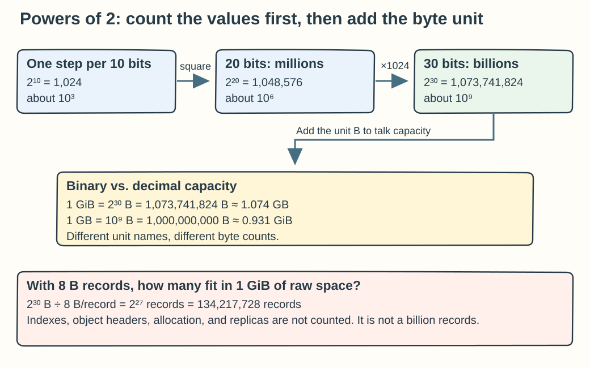
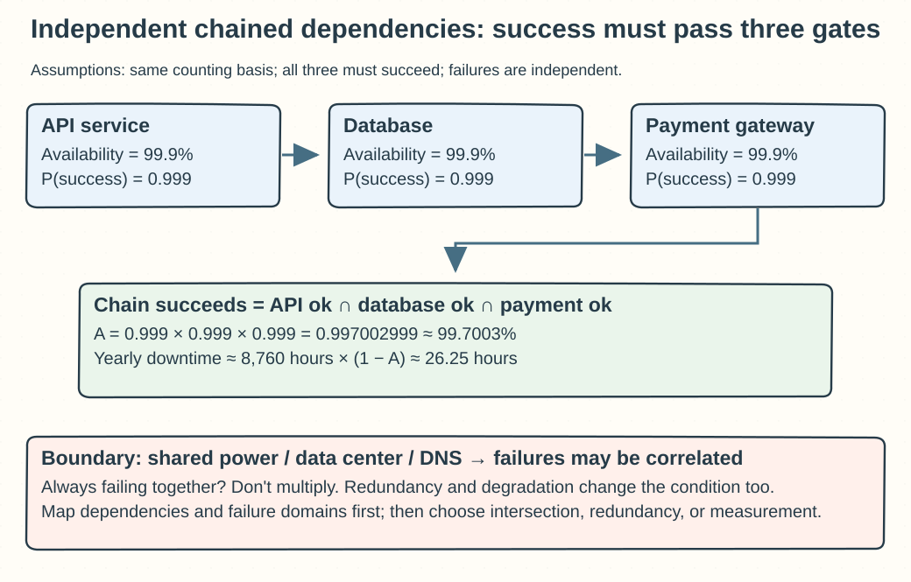

## Chapter 2: Back-of-the-Envelope Estimation

State the basis for every number first. A formula's result is an estimate that holds only while its conditions hold; do not treat it as a capacity commitment.

### Q02-01 | Why can `2^30` be treated as “about a billion” at a glance?

**Conclusion: Because `2^10=1024≈10^3`, so `2^30=(2^10)^3≈(10^3)^3=10^9`.** An early system design estimate only needs the order of magnitude, so you can treat it as about a billion. For exact capacities or limits, though, go back to the exact value.

To derive it, split 30 into three 10s: `1024×1024×1024 = 1,073,741,824`. That is about 7.37% above the decimal billion, still the same order of magnitude. By the same logic, `2^20≈10^6` is millions and `2^40≈10^12` is trillions. The rule comes from the fact that every 10 extra binary bits expands the space of values by about 1,000 times. It is not ten times per extra bit; each extra bit only doubles it.

**Example**: A block of raw data of `2^30` bytes is `1 GiB`, about `1.074 GB` in decimal. A vendor’s `1 GB`, if decimal, is `10^9 B`, about `0.931 GiB`. If each record is a fixed 8 bytes, `1 GiB` of raw space holds `2^30/8=2^27=134,217,728` records in theory, not a billion. Real records also carry indexes, object headers, allocator overhead, and replication, so the actual capacity is lower.

**Boundaries**: `2^30` is just a number and does not come with “bytes” attached. You can only talk about memory or storage once you multiply by a unit or name it. 30 binary bits have `2^30` possible values, but the largest unsigned value is `2^30-1`. When approximations accumulate across several layers, the error can grow, so use exact integers for production purchasing, protocol field ranges, and boundary tests.

**Memory hook: Ten bits is about a thousand, twenty about a million, thirty about a billion; keep numbers and bytes apart, and GB and GiB apart.**

### Q02-02 | A path depends on three 99.9% components. What is its end-to-end availability?

**Conclusion: If all three components must be available, their failures are independent, and the time window and definition of success are consistent, the path’s availability is about `0.999³=0.997002999`, i.e. `99.7003%`.** That is lower than any single component’s 99.9%, so it does not inherit the “three nines” label of the weakest one.

The multiplication comes from “success requires all three conditions at once.” For example, a payment must succeed through the API, the database, and the payment gateway, and a failure in any required dependency fails the operation. The probability that three independent success events all happen equals the product of their success probabilities. A quick approximation is to add the small failure rates: each is about 0.1% unavailable, three together about 0.3%, so availability is about 99.7%. The exact multiplication subtracts the overlap where failures coincide.

**Converting to yearly time**: Take a year as 365 days. The downtime fraction is `1−0.997002999=0.002997001`, which gives `8760 hours×0.002997001≈26.25 hours/year`. A single 99.9% component means about 8.76 hours/year, so the estimated failure budget of this path is roughly three times that of one component. The number only illustrates how dependencies stack up; it does not predict which day a failure will happen.

**Boundaries**: If the three components share a data center, power supply, DNS, or network, their failures are not independent, and you must analyze the real joint events instead of multiplying directly. If all three always fail at exactly the same moments, the series availability is still 99.9%. With degradation, caching, retries, or redundancy, the success condition is no longer a simple “all three online.” Also, whether timeouts, slow responses, and wrong data count as failures must match your SLO definition.

**Memory hook: Required chains take the intersection, and only independent events multiply; with redundancy or shared failures, redraw the success condition before writing the formula.**

### Q02-03 | If DAU stays the same and daily actions go from 2 to 10, what happens to QPS and storage?

**Conclusion: When the distribution of active hours, the data produced per action, the retention period, and the replica policy all stay the same, both average QPS and the storage added per day become `10/2=5` times the original.** It is not 8 times more: each person adds 8 actions, but the total ends up 5 times the original, an increase of 400%.

The average request rate is `DAU×actions per person per day÷86,400 seconds`. Using this chapter’s `150M DAU`: before, `150M×2=300M` actions a day, about `3,472` per second on average; now `150M×10=1,500M` actions a day, about `17,361` per second. If the peak is always 2 times the average, the peak goes from about 6,944 to 34,722 per second, which you would usually round to 7,000 and 35,000.

**Storage example**: If these actions are all tweets and 10% carry 1 MB of media, the media added per day was `300M×10%×1 MB=30 TB/day` and is now `150 TB/day`. In decimal, with the same amount every day and 5 years of retention, raw media grows from `54.75 PB` to `273.75 PB`. The same replication factor multiplies both sides, so the ratio is still 5, but total capacity must also account for indexes, thumbnails, backups, and so on.

**Boundaries**: The fivefold storage conclusion depends on every action adding the same amount of data. If the extra actions are reads, QPS rises while persistent data does not necessarily grow. If you keep overwriting the same counter, the main table may stay the same size, though write logs and backup increments change. If users concentrate their extra actions within one minute, the peak can exceed 5 times; and if object size, media share, or TTL change, plug in the new values.

**Memory hook: First take the ratio of actions, `10÷2`, then ask how much each action writes and for how long it is kept; QPS follows requests, and storage follows new bytes.**

### Q02-04 | Why does counting only the average QPS leave you short of capacity?

**Conclusion: An average flattens busy and quiet periods, but servers face the arrival rate and concurrent work within a particular time window.** Being enough on the all-day average does not mean being enough at the evening peak, at the start of a promotion, or in the dozen seconds after a cache invalidation. When arrivals outpace processing, queueing and timeouts grow fast.

For example, a system averages 1,000 QPS all day but reaches 5,000 QPS in the evening. One instance steadily handles 500 QPS at the target P99 latency. The average suggests 2 servers, but the peak needs at least 10 just to reach the theoretical total throughput, before counting failures and headroom. If the goal is to use only 70% of load-tested capacity, the instance need is about `ceil(5,000/(500×0.7))=15`; if you also require that the goal still holds after any 1 server fails, you need at least 16. Different ways of leaving headroom mean different things, so be explicit about whether you assume 30% extra machines or a 70% target utilization.

**Also look at the shape of the peak**: A 5-second burst and a 2-hour sustained peak call for different strategies. Work that tolerates delay can be queued to absorb spikes, but a backlog does not vanish by itself. With 5,000/s arriving and 3,000/s processed for 60 seconds, 120,000 pending tasks accumulate, and you must plan time to drain them. Online requests cannot queue forever, so set timeouts, concurrency limits, and degradation. Autoscaling also has delays for detection, startup, and warm-up, so provision ahead or warm up in advance.

**Boundaries**: The same QPS does not mean the same cost; a cached read, a complex SQL query, and a large file upload need different CPU, I/O, and bandwidth. Also check peaks per endpoint, region, and shard, watch for hotspots and retry amplification, and calibrate per-server capacity with load-test results that meet the target latency and error rate.

**Memory hook: Do the accounting with the average, protect the service with the peak; first ask how high, how long, and where the peak concentrates, then work out headroom and recovery capacity.**

### Q02-05 | When an estimate and monitoring disagree widely, check assumptions, units, or code first?

**Conclusion: First align metric definitions, time windows, and units; then check the assumptions one by one; and only last use request tracing and load tests to find implementation overhead. Do not start by declaring the code broken.** Checking units is usually the cheapest step, and assumptions are the inputs to an estimate; when the two disagree, the code may be entirely correct.

Start by asking, “Are we comparing the same thing?” The estimate may be business write QPS while monitoring counts every SQL statement in the database; the estimate may use an all-day average while monitoring shows the peak minute; the estimate may be for one instance while monitoring covers the whole cluster. Then unify the units: milliseconds and seconds differ by 1,000 times, bits and bytes by 8 times, and MB and MiB are different too; write out the numerator, the denominator, and the aggregation. Next recheck assumptions such as DAU, actions per person, read/write ratio, average response size, media share, cache hit rate, retries, and replica count, and run a sensitivity analysis.

**A concrete example**: The estimate says the application sees 1,000 QPS, yet the database shows 6,000 queries/s. Tracing finds that each API call runs 5 SQL statements on average and failure retries add 20% more attempts, so `1,000×5×1.2=6,000`. The gap comes from what is counted and from amplification factors; the database is not “doing six times the business work.” Likewise, if the estimate is 100 MB/s of uploads and network monitoring shows 800 Mbit/s, the two are in fact equal in decimal terms.

**Boundaries**: Only if a large gap remains after definitions and assumptions are aligned should you go on to check N+1 queries, duplicate consumption, serialization bloat, missing indexes, lock contention, and monitoring sampling bias; also keep open the possibility that the monitoring configuration is wrong. If production is already overloaded, rate limit or scale out at the same time as a quick fix; do not wait for the full analysis to finish before protecting the service. Record the corrected formula and the evidence so nobody has to guess again next time.

**Memory hook: Compare the same quantity first, in the same unit; once the inputs are trustworthy, chase why the implementation amplifies.**
