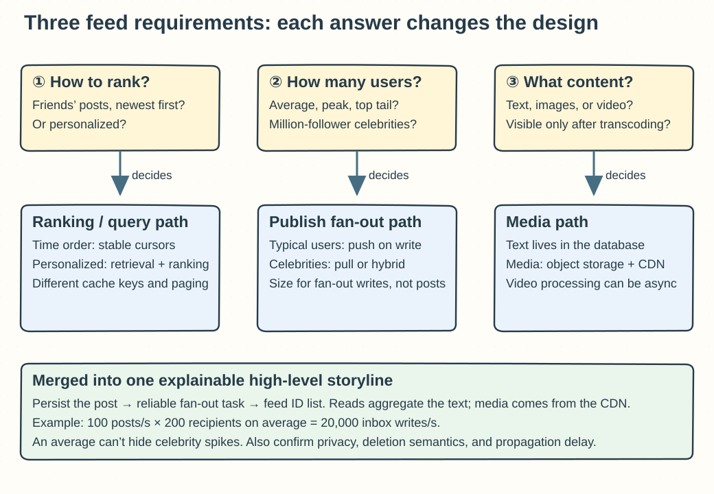
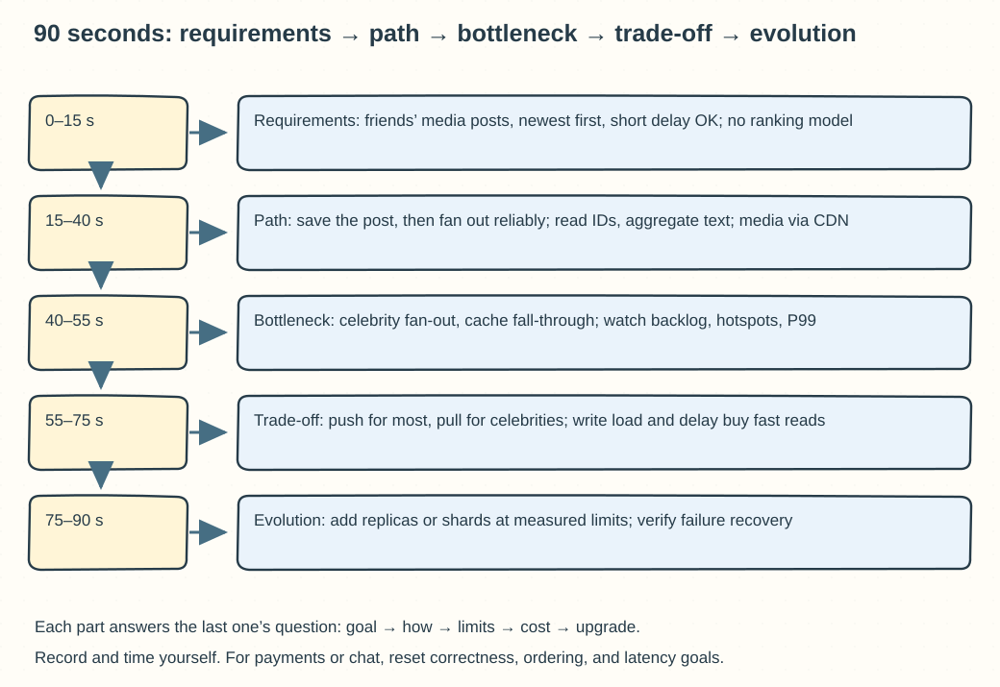

## Chapter 3: A Framework for System Design Interviews

These questions follow Chapter 3. The answers are a method for showing the reasoning behind your decisions, not a technology stack to copy.

### Q03-01 | When designing a news feed, which three requirements do you confirm first, and how do they change the architecture?

**Conclusion: Start by confirming the ranking rule, the distribution of the follow graph, and the content type; for each question, say how the answer changes the design.** This is a high-value starting set, but it doesn't mean that after three questions you no longer need to confirm permissions, freshness, or the target latency.

The first question is: “Does the feed contain only posts from people you follow or friends, newest first, or does it include recommendations and personalized ranking?” For the former, you can build a cursor from the time and a stable ID and read a materialized list of post IDs. The latter usually also needs candidate retrieval, features, and ranking computation, and its paging and caching semantics are more complex. You shouldn't add a whole recommendation system when the requirement is simply to show posts by time.

The second question is: “What are the DAU, the peak read and publish rates, and the average and maximum number of followers?” In particular, separate the average number of follows from the top users. When an ordinary user publishes, pushing the post ID into the inboxes of a few followers buys fast reads. A celebrity with a million followers can cause a million writes with a single post, which suits pull on read or hybrid fan-out. Use numbers to find the bottleneck: 100 posts per second with 200 recipients per post on average is about 20,000 inbox writes per second, and the instantaneous load from the top users must not be hidden by that average.

The third question is: “Text only, or images and videos too?” Plain text can live mostly in the business database. Large media should go into object storage and be served by a CDN, with the post record keeping a media reference. Video may also need transcoding, multiple resolutions, and an async processing status. If “visible immediately after upload” is a requirement, you must define whether to show a placeholder first or wait until processing finishes.

**Boundaries**: Also clarify the relationship type (friends or public follows), the visibility of deletions and blocks, whether a briefly stale feed is acceptable, and the paging needs of mobile and web. Requirements can conflict. For example, if a celebrity's post must be fully visible immediately but write cost is also limited, you need to present a latency-versus-cost trade-off and can't paper over it with one cache component.

**Memory hook: Ask “how to rank, how many people, what content” first, then draw the three affected paths: ranking, fan-out, and media.**

### Q03-02 | Why get buy-in at the high-level design stage instead of diving straight into the database?

**Conclusion: High-level buy-in confirms the problem scope, the success criteria, and the main data flows; database details matter only when they serve those goals.** If a basic assumption is wrong, the deeper you go into indexes, table columns, and sharding, the more rework you create, and the harder it is for the interviewer to judge whether your trade-offs are reasonable.

You can break buy-in into three checkable things. First, restate the requirements and the scope you are explicitly not handling, for example: “Friends' posts only, newest first, seconds of propagation delay allowed, no recommendation model.” Then walk through two main paths: “a post is written to the authoritative store and produces a fan-out task,” and “a feed read fetches post IDs, then aggregates the text and media references.” Finally, list the orders of magnitude and key constraints, such as read-heavy and write-light, the ratio of ordinary users to celebrities, the P99 latency target, and deletion and privacy requirements. Once the diagram and assumptions are on the table, invite the interviewer to point out the bottleneck to dig into first, so that both of you are evaluating the same design.

**Example**: You spend ten minutes designing SQL indexes for time-ordered reads, and only later learn the question requires personalized recommendations. A single newest-first query then can't cover candidate filtering, feature retrieval, and ranking. Conversely, if the requirement is just an internal activity feed for a few hundred thousand people, sharding the database right away adds needless migration, cross-shard queries, and operational burden. Buy-in corrects direction while the diagram is still cheap and has few components.

**Boundaries**: Buy-in doesn't mean stopping to ask approval at every box you draw, and it doesn't mean the design can never change. If a deep dive shows that throughput or consistency isn't met, feed the evidence back to the high level and adjust. When the interviewer isn't ready to give numbers, you can state labeled working assumptions, keep reasoning, and say which conclusion is most sensitive to them. You can't take silence to mean that every assumption has been confirmed by facts.

**Memory hook: Confirm the map and the destination first, then optimize one stretch of the road. Buy-in gives the deep dive a direction and gives later changes a basis.**

### Q03-03 | What capacity and failure questions should you discuss for a hotspot component?

**Conclusion: Say how much work reaches it, which resource runs out first, how overload spreads, what its single-point and data failures are, and what recovery and scaling cost.** Saying only “add machines” or “use a cache” gives no verifiable capacity boundary and can't explain what users see when something fails.

First quantify input and output: average and peak QPS, request size, the number of downstream operations each request triggers, the share of hot keys or tenants, the read/write ratio, and how fast the backlog grows. Then find the limiting resource: CPU, memory, disk IOPS, bandwidth, database connections, threads, locks, or an external quota. Compute the number of instances from the load-test capacity at the target latency, not from a best result measured on throughput alone. Also check whether a single key, shard, or serial critical section can scale horizontally.

**Example**: A feed worker can process 20,000 inbox updates per second, and for one minute 30,000 per second arrive, which adds `10,000×60=600,000` messages to the backlog. Ask whether the queue has enough capacity, whether message latency exceeds the promise, whether the processing capacity after recovery exceeds the new traffic, and whether celebrities can switch to merging on read. If you only add stateless API servers without raising worker or hot-shard capacity, the backlog keeps growing.

Failure analysis should cover timeouts, partial success, duplicate execution, node restarts, data loss, and lost dependencies. Explain whether retries are idempotent, whether retries amplify load, when to rate limit or degrade, whether a standby node has enough capacity, and whether recovery relies on replay, backup, or recomputation. Monitoring should include at least end-to-end P95/P99, error rate, saturation, backlog size, and the age of the oldest message, along with where the thresholds for scaling or alerting come from.

**Boundaries**: Replicas improve availability but may bring replication lag. Sharding adds capacity but adds migration and cross-shard queries. A cache shields hot reads but exposes the fall-through limit when it is invalidated. For every measure, state the failure domain and how you would verify it, and don't treat “the service is up” as “the service still meets its target.”

**Memory hook: How much comes in, how much resource is left, what happens when it breaks, and how long recovery takes.**

### Q03-04 | With 5 minutes left in the interview, how do you wrap up instead of adding more components?

**Conclusion: Stop expanding the scope and use the last five minutes to show that the current design works, the trade-offs are explicit, failures have boundaries, and the next step has a condition.** A wrap-up is not a list of technology names, and it is not “we'll optimize the rest later.”

Use a clear five-minute rhythm. In minute 1, restate the goal and core assumptions, and say which features are covered and which are deliberately out of scope. In minute 2, walk the key write path and read path on the diagram, pointing out when data becomes durable, when it is OK to return success, and what happens on a cache miss or during async processing. In minute 3, summarize the two most important design trade-offs, for example: “Precomputing the feed buys low read latency, but adds fan-out writes and a brief propagation delay.” In minute 4, name the current biggest bottleneck and one key failure with its protection, such as celebrity fan-out causing queue backlog, handled with hybrid fan-out and rate-limited replay. For the final 1 minute, give the triggers for scaling and a validation plan, and leave room for the interviewer's follow-up questions.

**A sample wrap-up**: “We've covered posting, time-ordered fetching, and media access, and a post counts as published when the main store commits it. Posts from ordinary users are pushed asynchronously as post IDs, and the read side aggregates the text, at the cost of a brief propagation delay. The current risk is top-user fan-out and queue backlog. We'll monitor the age of the oldest message and protect the write side by merging celebrity posts on read. In the next phase, we split the database or shards only when they reach a measured capacity threshold, and we rehearse replay, failover, and a full cache invalidation.”

**Boundaries**: If at the very end you find a correctness gap that could lose money, oversell, or leak permissions, admit it immediately and correct the success criteria. Don't pretend to be done just to look tidy on time. You can defer performance enhancements that don't affect the main path, but important errors must go into the current conclusion. Also don't present a new number that has no evidence as a load-test result.

**Memory hook: In the last five minutes, say “what we covered, why we chose it, where it breaks, and when to upgrade,” and don't invent a tenth service.**

### Q03-05 | Can you cover “requirements, path, bottleneck, trade-off, evolution” in 90 seconds?

**Conclusion: Yes, provided you keep only one clear storyline and make every technical choice answer the constraint before it.** The example below uses a news feed. The numbers and goals are demonstration assumptions, not real operating data of any system. You can practice with this split: 15 seconds for requirements, 25 for the path, 15 for the bottleneck, 20 for the trade-off, and 15 for evolution.

**A sample you can say aloud**:

> “We start with a friends' feed, newest first, with text and images, allowing seconds of propagation delay and focusing on the read experience. We leave out personalized recommendations for now.
>
> A post first writes its text and media references to the database, then reliably produces a fan-out task after the commit succeeds. Posts from ordinary users have their post IDs pushed into followers' inboxes. A read first fetches the ID list and then aggregates the text, and images go through object storage and a CDN.
>
> The main bottlenecks are celebrities with huge follower counts and the fall-through load after cache invalidation. I'd monitor the fan-out backlog, hot shards, and read latency separately.
>
> To cut read latency, ordinary users use fan-out on write and celebrities use merge on read, accepting some extra read-time computation. Async tasks must be retryable and deduplicated. Publishing succeeds when the post is saved; it doesn't guarantee that every follower has received it.
>
> We start with a single database and stateless services, and only add read replicas, sharding, or a different fan-out strategy once measurements reach the capacity limit, while verifying replication lag and failure recovery.”

**Why this answer is complete**: It gives the scope and freshness, the point at which a write succeeds, the read and write data flows, two concrete bottlenecks, the cost of each choice, and the upgrade trigger. It doesn't expand every table column, but the interviewer can pick any of “reliably produce a task,” “merge celebrities,” or “replication lag” and dig deeper, and you can return to the same diagram to answer.

**Boundaries**: 90 seconds is a training constraint, not a guarantee that any speaking pace will finish exactly on time. Record and time yourself, keep the key causal links, and cut repeated adjectives. If the question is a payment or chat system, you can't copy the feed's seconds-level propagation and fan-out design, and must replace them with the matching correctness, ordering, or low-latency requirements. If you haven't clarified the requirements yet, state your assumptions first, and don't let fluent delivery cover up uncertainty.

**Memory hook: Who wants what → how the request flows → where it jams first → why accept the cost → what evidence triggers an upgrade.**
