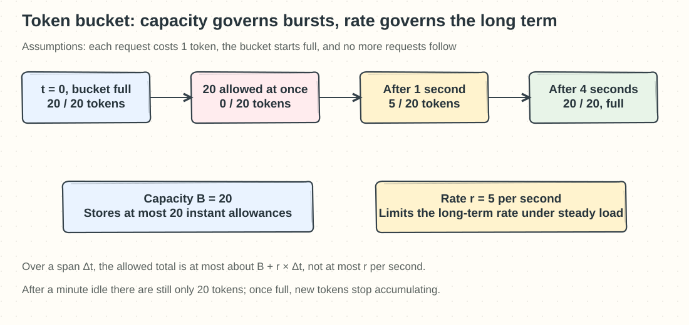
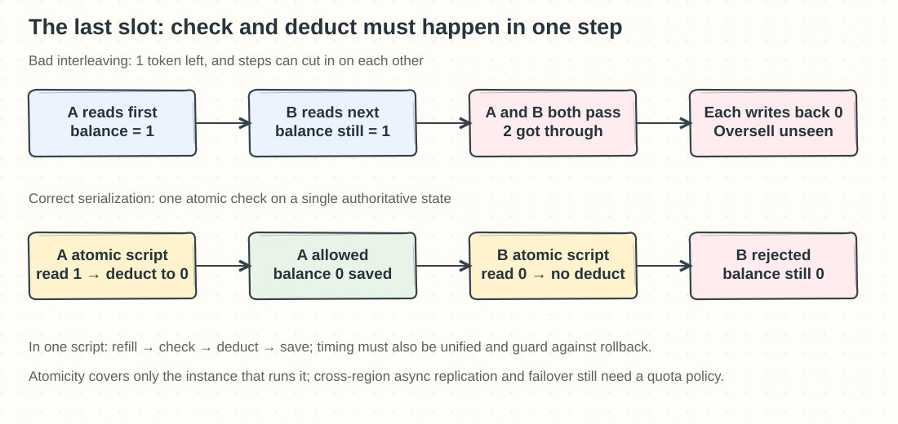

## Chapter 4: Design a Rate Limiter

Source: [Chapter 4 study edition](../04.%20Rate%20Limiter/Readme.md).

### Q04-01 | Why can’t you trust a frontend limit?

**Conclusion: A frontend limit only improves the experience for well-behaved users; it cannot be the security boundary for a server-side quota.** Users control their browsers, phones, and scripts. They can delete the countdown, edit the JavaScript, or skip the page entirely and call the API directly. Graying out a button affects only that button, not the network endpoint.

Suppose a web page allows at most 10 requests per minute. A normal user really can click only 10 times, but the same person can open 5 tabs or send 100 requests from a script. If the backend does not check, they all still reach the database. Storing the count in `localStorage` does not help either, because users can clear it.

The real protection belongs at the gateway or server that every business request passes through, and the counting dimension should be chosen from a **verified account, API key, IP, or resource**. A user ID cannot be trusted straight from a client parameter, and limiting by IP can wrongly block users who share a company egress. The gateway limits total traffic, and expensive operations can be limited again inside the business service. The frontend keeps the countdown and backoff hints, while the server returns 429 when the limit is exceeded; the two have different jobs.

**Boundaries and memory hook**: Client-side throttling can save battery and data and prevent accidental repeats, but it cannot stop malicious calls. Remember: “The button is a hint; the server is the gate.”

### Q04-02 | What do the two token bucket parameters each control?

**Conclusion: The bucket capacity `B` controls how large a burst can be saved up, and the refill rate `r` controls the long-term average allow rate.** Each request spends one token; with no token, the request is rejected or waits under an explicit policy. Once the bucket is full, it cannot save any more.

Take `B=20` and `r=5 per second`, and assume the bucket starts full: 20 requests can pass in the same instant, and the 21st must wait for a refill. If no more requests come, an empty bucket refills in about 4 seconds; even after a minute idle, it holds only 20, not 300. If the implementation supports continuous refill, one token is added every 0.2 seconds. Over a period of length `Δt`, you can use at most about “the tokens you start with + `r×Δt`,” with an upper bound of `B+r×Δt`; it does not guarantee that every single second lets through only 5.

Implementations usually compute `tokens=min(B, tokens+r×elapsed)` when a request arrives, with no need to start a timer every 0.2 seconds. In production you also have to define whether the bucket starts full or empty, the time unit and fractional precision, and make refill, check, and deduct atomic. If an expensive task costs 3 tokens, write that pricing unit into the rule too.

**Boundaries and memory hook**: The capacity must not be so large that a single burst crushes the downstream, and the rate must not exceed what the downstream can sustain. Remember: “The size of the bucket decides how hard you can sprint; the flow rate decides how long you can keep running.”

### Q04-03 | Why does a fixed window allow a burst at the boundary?

**Conclusion: A fixed window limits calendar-aligned windows, not any continuous stretch of time.** When the window switches, the count resets to zero, so the quota left in one window and the fresh quota of the next can pile up on either side of the boundary.

For example, with 100 requests allowed per calendar minute, a user sends 100 at 12:00:59.9 and another 100 at 12:01:00.1. Neither fixed minute is over quota, yet 200 requests pass in about 0.2 seconds. Any continuous 60-second interval covering those two batches also contains 200. So “100 per fixed minute” and “at most 100 in any continuous 60 seconds” are different contracts. The counter is not miscounting here; the algorithm simply never promised the latter.

If the business strictly needs a rolling 60-second cap, use a sliding log: in one atomic operation, purge timestamps older than 60 seconds, count the remaining entries, and then decide whether to add the new request. The cost is memory proportional to the number of requests. A sliding window counter uses less space but has an approximation error, and a token bucket allows a controlled burst, so it is not an exact rolling window either.

**Boundaries and memory hook**: Ordinary quotas that reset daily, or endpoints that tolerate a boundary burst, can still use a fixed window. If the downstream cares about millisecond-level impact, you also need a concurrency or burst limit. Remember: “At the moment of reset, two quotas can pile up together.”

### Q04-04 | How can multiple gateways avoid overselling the last slot?

**Conclusion: Make “read the state, refill tokens or purge old records, check, deduct, save” one atomic operation on the same authoritative state.** If two gateways each look up the remaining quota and then each write it back, there is no guarantee that only one request passes.

Suppose only 1 token is left: A reads 1 and B also reads 1; both allow the request and write back 0, so the quota is actually spent twice. Put these steps into a short Lua script on the same Redis instance, and A runs to completion and deducts to 0 before B starts checking, so B is rejected. Using only `INCR`, putting the data in a sorted set alone, or adding a lock around just the “deduct” step does not make the whole check atomic.

A distributed token bucket must also use a single clock, so that gateway A’s fast clock does not refill early and B’s slow clock does not double-count. The service that owns the key can supply the time and guard against rollback, for example `elapsed=max(0, now-last)` without ever moving `last` back in time. In Redis Cluster, related keys must also satisfy the script’s same-slot access constraint.

**Applicable boundaries**: Lua atomicity does not span independent Redis instances in several regions, and it does not mean failover can never lose counts. A strict global quota needs a single coordinating authority or non-overlapping regional quotas, and a clear rule for whether to reject, degrade, or allow some overshoot during failures; a stale count after asynchronous replication can allow requests again. **Memory hook: one slot, one referee, one decision**.

References: [Redis Lua atomic execution](https://redis.io/docs/latest/develop/programmability/eval-intro/), [Redis Cluster multi-key same-slot constraint](https://redis.io/docs/latest/operate/oss_and_stack/management/scaling/).
