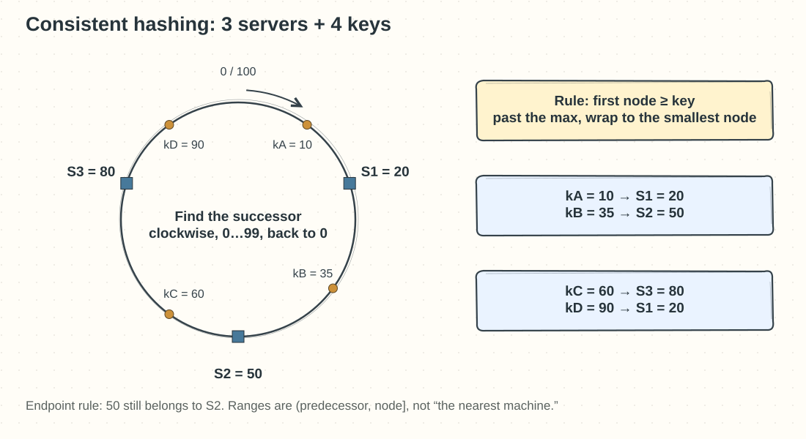
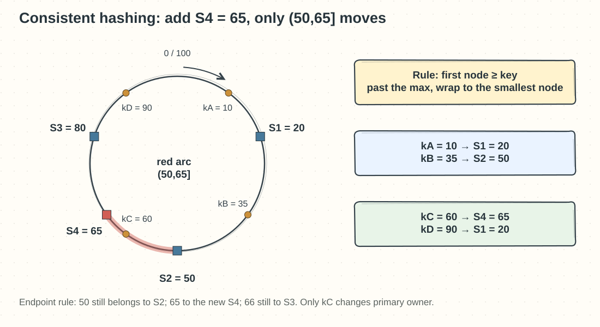

## Chapter 5: Design Consistent Hashing

### Q05-01 | Draw 3 servers and 4 keys

**Conclusion: fix the ring direction and the ownership rule first, then draw the nodes; otherwise “clockwise successor” is easy to get backwards.** This question uses a teaching hash space `0…99`, walking clockwise in the direction of increasing numbers, with 99 wrapping back to 0. The rule: starting from the key’s hash position, find the **first server at a position greater than or equal to it**; past the largest node, wrap around to the smallest.

Place three servers: `S1=20`, `S2=50`, `S3=80`. Place four keys: `kA=10`, `kB=35`, `kC=60`, `kD=90`. They belong to S1, S2, S3, S1 in that order. kD does not go to S3, the numerically nearest: it can only walk in the agreed direction, and after wrapping past 99/0 it meets S1 first.

|Server|Range it owns|Keys in this example|
|---|---|---|
|S1=20|Ring range `(80,20]`, that is `81…99` and `0…20`|kA=10, kD=90|
|S2=50|`(20,50]`|kB=35|
|S3=80|`(50,80]`|kC=60|

When working by hand, sort the server positions first, then apply the same rule to each key. The four keys need not be spread evenly; here S1 gets two keys, which does not violate the definition of consistent hashing.

**Boundaries**: this is an illustrative single-owner view, with no replicas or virtual nodes drawn; a real hash space is far larger than 100, and the numbers in the figure are hash results, not the original keys. The edge case `key=50` belongs to S2, not S3. **Memory hook: find the owner clockwise; find the owned range by looking at the predecessor.**

### Q05-02 | Add a node and mark the only affected range

**Conclusion: keep the successor rule from the previous card; when the new node `S4=65` is added, the only range that changes primary owner is `(50,65]`.** Here the predecessor is `S_prev=S2=50`, the new node is `S_new=S4=65`, and the old successor S3=80 used to own the whole range `(50,80]`.

After the addition, S4 cuts off `(50,65]` and S3 still owns `(65,80]`. Of the four keys, only `kC=60` moves from S3 to S4; the targets of kA=10, kB=35, and kD=90 do not change at all. The endpoints can be checked by hand too: 50 still belongs to S2; 65 goes to S4; 66 still goes to S3. Do not draw `(65,80]` as the part that moves, which gets the direction of “which stretch the new node grabs” backwards.

If the new node is added at 5 instead, its predecessor is 80, and the affected range must be written across zero as `(80,5]`, covering `81…99` and `0…5`. Do not conclude there is no range just because the number is small.

**Boundaries:** “the only affected range” refers to the primary owner when one ordinary node is added to a fixed old ring. If a physical machine joins with several virtual nodes at once, multiple small ranges change; replica layout and failure-domain policy can also trigger extra copying. A migration must also version the routing, sync incremental writes, and confirm the new node is readable before deleting the old data. **Memory hook: a new node takes over the keys “after the predecessor, up to itself.”**

### Q05-03 | Explain why virtual nodes do not automatically remove a hot key

**Conclusion: virtual nodes improve the statistical balance of many keys across physical machines, but they do not automatically split one hot key’s traffic across several machines.** A machine that holds many scattered positions on the ring cuts its big territory into small pieces, which reduces the skew caused by random node positions; a machine with more capacity can also be given more virtual nodes.

For example, 10 million keys are spread evenly over 10 machines, about 1 million each. If one of them, `product:hot`, takes 500,000 QPS and all the other keys together take only 500,000 QPS, then even with a perfectly even key count, the machine that owns this key still carries at least half of the requests. Giving it another 100 virtual nodes only changes how other keys are assigned; the same lookup still locates `product:hot` at a single primary owner.

The fix depends on the operation: read-only hot data can be replicated to several caches so reads are spread out; on a cache miss, request coalescing prevents everyone from hitting the origin at once; a hot counter can be split into sub-counters and summed on read. For inventory deduction that must never oversell, naively replicating writes breaks the constraint, and you still need coordination, pre-allocated quotas, or a redesign around the business logic.

**Boundaries**: virtual nodes can ease the hotspot where “many ordinary keys happen to pile onto one machine,” but they cannot automatically fix “one key is itself extremely hot.” You must also count the routing-table and migration cost, so virtual nodes cannot be added without limit. **Memory hook: opening more branches splits up the territory, but a single document that must be handled at headquarters will not split itself into ten copies.**
