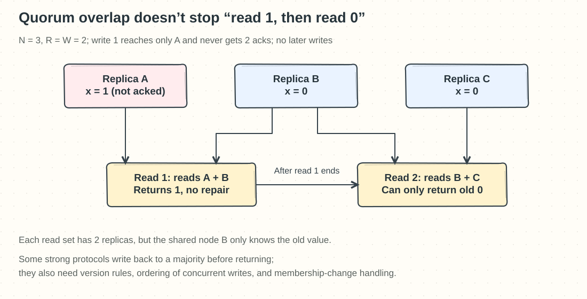
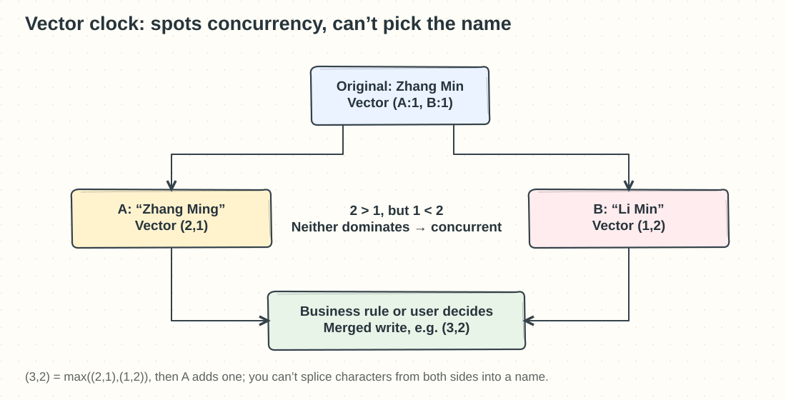
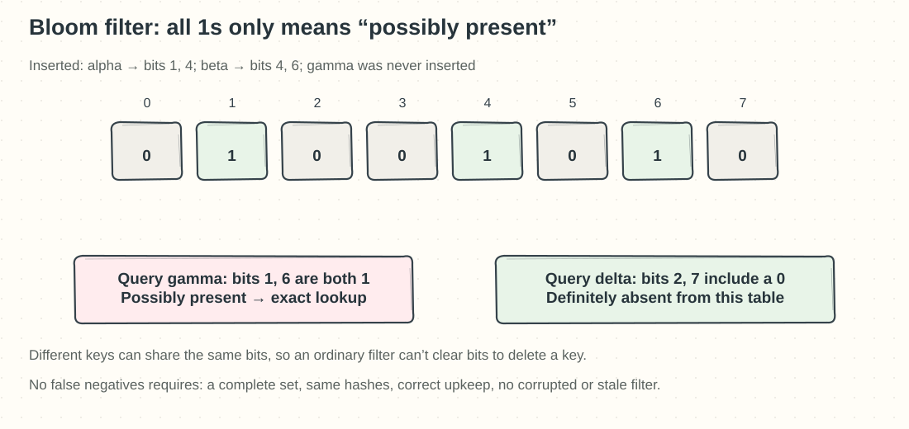

## Chapter 6: Design a Key-Value Store

These questions follow Chapter 6. The aim is to answer four questions in order: where a key lives, how many copies to keep, how many copies to wait for, and how to catch up after a failure.

### Q06-01 | What do partitioning and replication each solve?

**Conclusion: Partitioning places different data in different places, mainly to add capacity and throughput; replication keeps several copies of the same data, mainly to survive failures, and can also share reads.** Systems usually have both, so you can’t tell which one is in use just from “we have three databases.”

Suppose there are 3 TB of logical data and one machine can safely store only 1 TB. Split it into three partitions of 1 TB each, and it can spread across at least three machines; but if each partition has only one copy and the machine holding partition B breaks, B’s data becomes unavailable or lost. Give each partition three replicas, and the physical footprint is about 9 TB (not counting indexes and headroom); only then can a healthy replica keep serving after one node fails. Conversely, copying the full 3 TB three times leaves each copy at 3 TB, so the single-machine capacity limit is not solved at all.

The partition key must fit your query locality and avoid hotspots; replication must also place copies on different physical nodes and failure domains. Three copies in the same rack can still go dark together when the rack loses power. When a write goes to several replicas, you also need to define the number of acknowledgements, version conflicts, and recovery rules; you can’t just say “it’s replicated, so it’s consistent.”

**Boundaries and memory hook**: Read replicas can scale read throughput, but they usually don’t make arbitrary concurrent writes scale linearly. Remember: **partitioning divides the content, replication backs up the same content; fitting the data and surviving a broken machine are two separate problems.**

### Q06-02 | Why do read and write sets overlap with N=3 and R=W=2, yet it is still not a complete strong-consistency protocol?

**Conclusion: `R+W>N` only guarantees that the sets share a member; it does not automatically guarantee a linearizable, latest result.** With a fixed set of three replicas A, B, C, take any two write-acknowledging nodes and any two reading nodes: the overlap is at least `2+2−3=1`. This means the reader touches at least one node that holds the **completed write**, but it still has to identify the right version.

A stronger counterexample shows why this is not enough. Initially A/B/C all hold `x=0`. The write `x=1` reaches only A and never gets W=2, so the write is still incomplete. Then read 1 queries A and B, picks the newer version and returns 1, but does not write it back to the other replicas. After read 1 completes, read 2 queries B and C and can only return 0. Both reads satisfy R=2, yet they observe “1, then back to 0.” Even if you allow that incomplete write to take effect somewhere, no later write explains the regression, so this violates linearizability.

A complete protocol must also handle a total order or versions for concurrent writes, incomplete writes, the necessary write-back on reads and repair, fencing off a deposed primary, and membership changes. For example, some atomic register protocols make a read write the chosen version back to a majority before it returns. If a sloppy quorum temporarily borrows another set of nodes, the original overlap proof no longer applies directly.

**Boundaries and memory hook**: Don’t conclude that no quorum system is strongly consistent; say that “the inequality is only one part of the protocol.” **Remember: meeting one node that knows is not the same as having settled the facts.**

### Q06-03 | Can a vector clock automatically pick the correct name?

**Conclusion: A vector clock judges the causal relationship between versions; it can’t understand which business name is correct.** It can tell “this version contains that version’s updates” from “both sides changed independently,” but it won’t decide the merge rule for the business.

Say the original name is “Zhang Min” with vector `(A:1,B:1)`. After the network breaks, A changes the name to “Zhang Ming,” giving `(2,1)`; B concurrently changes it to “Li Min,” giving `(1,2)`. Comparing the two vectors, the first is larger on A and the second is larger on B, so neither dominates the other and they are concurrent siblings. You can’t take the vector sum, compare string order, or take one character from each version to splice together “Li Ming” and claim you have the correct name.

The system can keep the conflicting versions and let the user confirm, or the business can set an explicit rule such as “the reviewed profile wins.” If the user confirms “Zhang Ming,” the merge first takes the entry-wise maximum `(2,2)`, then A, which performs the new write, increments its own count to give `(3,2)`, showing that the new version has accounted for both branches. For mergeable data such as set additions or counters, you can also design a dedicated CRDT, but a name field usually lacks such automatic merge semantics.

**Boundaries**: Pruning vector entries, reusing member identities, and concurrent writes all need an explicit policy; a vector can’t grow without bound for free. **Memory hook: a vector clock is like a family tree of two edit histories: it shows who descends from whom, and doesn’t judge who wrote it right.**

### Q06-04 | Why read the disk after a Bloom filter says “present”?

**Conclusion: A positive Bloom filter result only means “possibly present,” and you still must check the exact index and data; it is not a database that stores keys and values.** Several keys set the same bits to 1, so a key that was never inserted can also hit every checked bit.

Take an 8-bit array and two hash functions: inserting `alpha` sets bits 1 and 4; inserting `beta` sets bits 4 and 6. Bits 1, 4, and 6 are now 1. A never-inserted `gamma` happens to map to bits 1 and 6, both 1, so the filter answers “possibly present”; only querying the SSTable reveals that gamma isn’t there. Another key that maps to bits 2 and 7 sees a 0, which rules this file out, so there’s no need to read the disk.

“No false negatives” has preconditions: the filter correctly contains every inserted element of the set being queried, reads and writes use the same hash configuration, and there is no corruption, stale sync, or unsafe deletion. An ordinary Bloom filter can’t casually clear a key’s bits, because those bits may be shared with other keys. For an immutable SSTable, you can build a matching filter when the table is created.

**Boundaries**: Memory or the page cache may mean the exact lookup does no real disk I/O; the point of this question is that “exact verification is still needed.” The same key may have different versions or tombstones in several SSTables, so after a hit you still merge them by version rules. **Memory hook: seeing a 0 rules it out; all 1s only means a suspect.**
