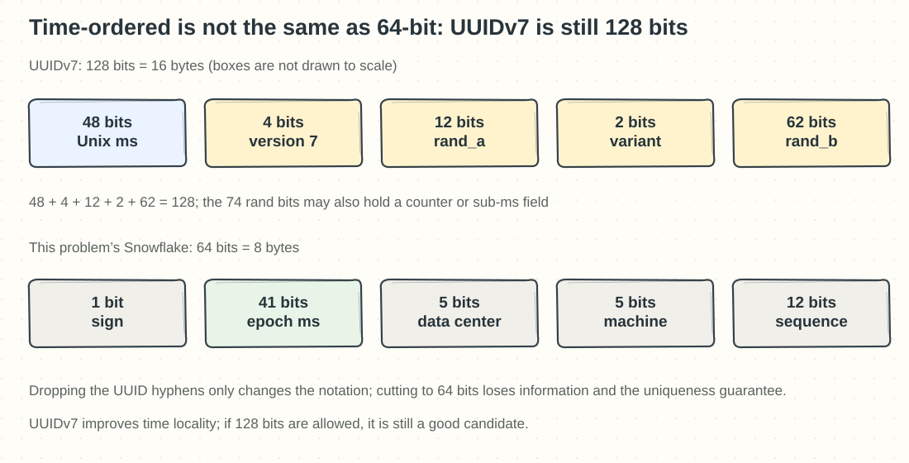
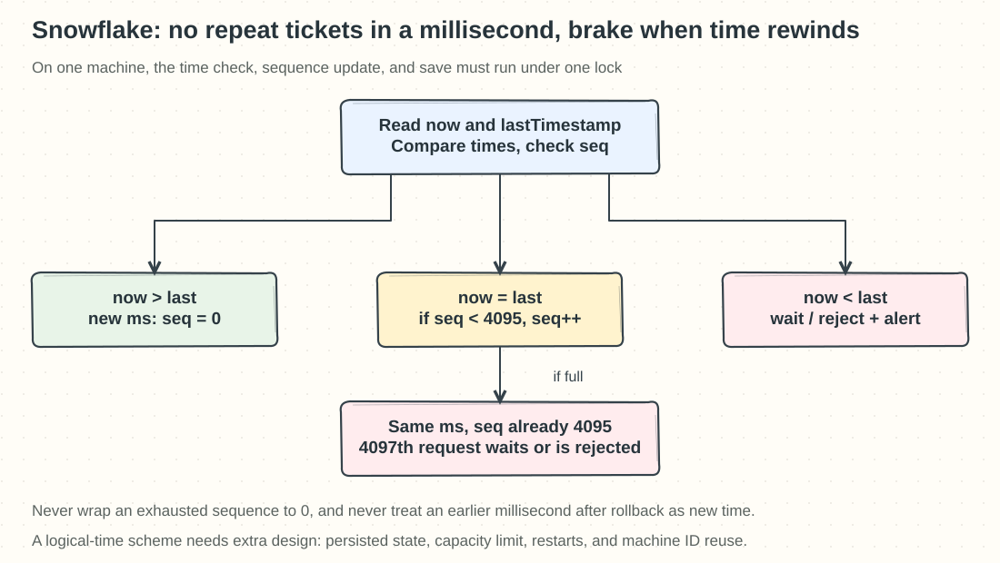

## Chapter 7: Distributed Unique ID Generator

Source: [Chapter 7 study guide](../07.%20Unique-Id%20Generator/Readme.md).

### Q07-01 | What is the difference between unique, consecutive, and ordered?

**Conclusion: Unique, consecutive, and ordered are three independent properties, and in an interview you confirm each one separately.** Unique means no duplicates within the scope; consecutive means no gaps in a given sequence; ordered means that comparing numbers or bytes reflects some notion of “before,” and “before” still has to be defined as issue order, physical time, or commit order.

For example, `10,12,15` is unique and increasing but not consecutive; `30,10,20` is unique but not increasing in issue order; `10,10,11` contains a duplicate and can’t serve as a unique primary key. Database auto-increment can also skip numbers because of transaction rollbacks and preallocated ranges, so a gap in order numbers doesn’t mean an order was lost. Even if one transaction gets 100 and then another gets 101, the transaction holding 101 may commit first: ID size does not automatically equal database commit order.

This problem requires 64 bits, unique, and roughly ordered by time, not `+1` every time. Snowflake puts time in the high bits, which gives time locality; across machines, clocks differ, so a generator that finished earlier may produce a larger value than one that finished later. If you need a global increasing order that strictly follows real time across nodes, you need extra coordination and a more explicit protocol, and you can’t rely on each machine’s local clock alone.

**Boundaries and memory hook**: Gap-free voucher numbers for accounting may need a business numbering scheme separate from the database primary key. **Remember: unique prevents collisions, consecutive prevents gaps, ordered tells you what came first; and always ask once more what “first” means**.

### Q07-02 | Why does UUIDv7 still not meet this problem’s requirements?

**Conclusion: UUIDv7 improves time ordering, but it is still 128 bits, so it breaks this problem’s limit of fitting in 64 bits.** Don’t keep repeating “all UUIDs are completely random and unordered,” and don’t ignore the bit width just because v7 is time-ordered.

UUIDv7, as defined in RFC 9562, uses the high 48 bits for Unix milliseconds; add 4 version bits, 2 variant bits, and `rand_a=12` plus `rand_b=62`, a total of 74 bits that can be used for randomness and for counter or sub-millisecond constructions the specification allows. The total is `48+4+2+12+62=128` bits. Dropping the text hyphens and storing 16 bytes of binary doesn’t turn it into an 8-byte, 64-bit ID. The wide boxes in the figure below only illustrate the fields; go by the bit counts in the labels.

Taking the first or last 64 bits isn’t “compression” that keeps the original guarantees either: the first half throws away most of the information that tells same-millisecond IDs apart, the second half loses time ordering, and in general a 128-bit space can’t be mapped one-to-one into a 64-bit space without collisions. UUIDv7 also doesn’t automatically give strictly monotonic order across machines in real time, and random generation still carries a tiny collision probability.

**Where it applies**: If your database and API allow 128 bits, UUIDv7 can be a very good distributed ID option; this problem rules it out because the constraint doesn’t match, not because the design is outdated. **Memory hook: v7 fixed the time layout, but it didn’t change UUID’s 128-bit identity card**.

Specification: [RFC 9562 §5.7](https://www.rfc-editor.org/rfc/rfc9562.html#section-5.7).

### Q07-03 | Why does a duplicate machine ID cause collisions?

**Conclusion: Snowflake’s uniqueness depends on the field combination being different; if two active generators share the same data center ID and machine ID, you lose the part of the information that tells them apart.** In this problem’s layout, the low bits are 5 bits of data center, 5 bits of machine, and 12 bits of sequence, and the high bits are the 41-bit millisecond time.

A concrete counterexample: two cloned instances are both configured with `dc=3, machine=7`. In some millisecond both issue their first ID, with the time field `t=1,000,000` and sequence 0 for both, so every input to the formula `ID=(t<<22)|(dc<<17)|(machine<<12)|seq` is identical and the output must be identical. This isn’t a rare hash collision but a deterministic duplicate. Reusing machine=7 in different data centers does not cause a conflict, because the dc field differs.

Machine identity can be assigned through a unique configuration, a registry service, or a lease, but the boundary for reuse has to be controlled. An old instance losing its network connection doesn’t mean it has stopped issuing; before giving a new instance the same identity, make the old instance lose its ability to keep issuing, or use identities or time ranges that don’t overlap. If a restart wipes the local sequence and the clock lands back in an old millisecond, historical IDs can also repeat.

**Boundaries**: Incrementing the sequence within the same millisecond on one machine must also be synchronized across threads; making machine IDs exclusive solves only part of the cross-instance problem. **Memory hook: time is the date, the machine ID is the window, and the sequence is the ticket number; if two windows use the same number, they may hand out the same ticket**.

### Q07-04 | What should you do when the sequence runs out in a millisecond or the clock rolls back?

**Conclusion: When the sequence is exhausted you must not wrap back to 0, and when the clock rolls back you must not treat the earlier time as a fresh millisecond and start over.** This problem’s 12-bit sequence has only `0…4095`, so one machine can produce at most 4096 distinct values per millisecond. The 4097th request must wait for the next millisecond, queue, or be rejected explicitly; you can’t keep reusing `(time, machine, sequence)`.

Say `lastTimestamp=1000ms` and seq=4095 has just been issued while the clock still reads 1000ms. A correct implementation waits until `now>1000` and then resets seq to 0. If NTP, VM resume, or something similar makes `now=998`, that must be detected too. A small rollback can be waited out for a bounded time; a larger one can be rejected with an alert. You can also use a deliberately designed logical time, such as continuing to use lastTimestamp and incrementing the unused sequence, but it drifts away from real time and still has to handle sequence exhaustion, persistent state across restarts, and the clock catching up again.

Comparing the time, updating the sequence, and saving the last state must be one synchronized generation step, or two threads may both get the same sequence. NTP reduces drift but is not rollback protection. The theoretical single-machine ceiling `4096×1000` ≈ 4.096 million per second is not a promised throughput, and 41 bits of milliseconds give an epoch span of only about 69.7 years.

**Boundaries and memory hook**: Waiting needs a timeout and backpressure, and failover must not casually reuse an old machine identity. **Remember: never reissue a ticket within a millisecond, and brake first when time runs backward**.
