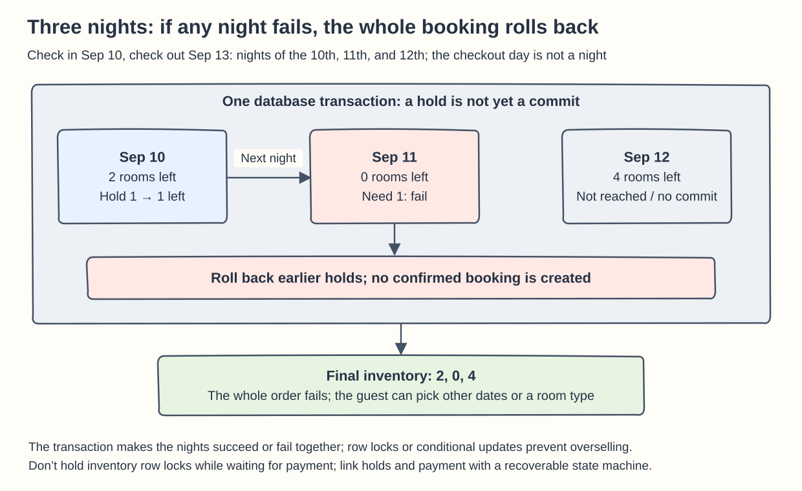
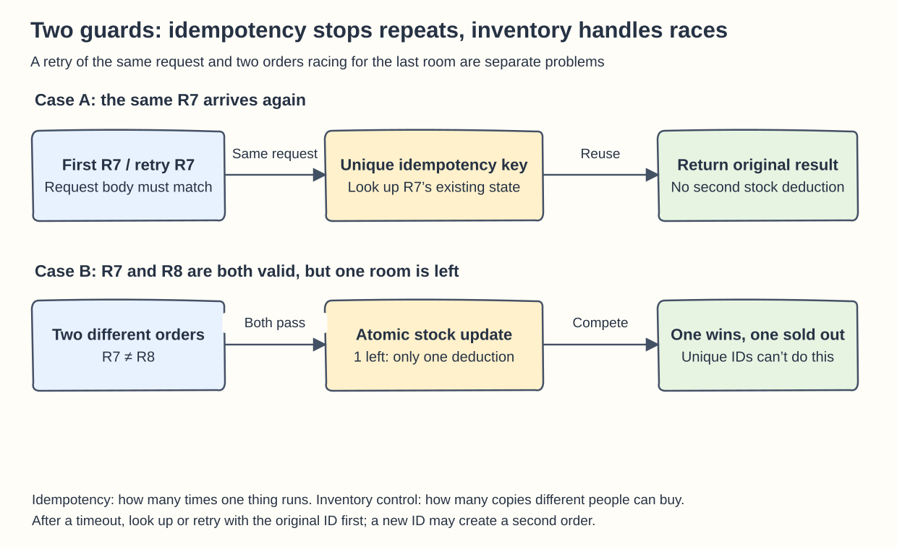

## Chapter 22: Hotel Reservation System

These cards follow Chapter 22. Throughout, a stay is treated as a half-open interval `[check_in, check_out)`: the checkout day no longer uses up a room night.

### Q22-01 | What if the middle night of a three-night stay has no room?

**Conclusion: The whole booking fails, and all three nights roll back together.** You cannot book only the first and third nights and call the result a successful continuous stay. If the product allows a different room type, a different hotel, or a split booking, show that alternative to the user explicitly first; never substitute it silently for the original request.

Say the stay is check-in on 9/10 and check-out on 9/13, so it needs the inventory rows for 9/10, 9/11, and 9/12. The remaining sellable counts for that room type on those nights are `2, 0, 4`, and the user wants one room, so the number you can book is set by the tightest night: `min(2,0,4)=0`. Handle it in a single database transaction: in a fixed “hotel, room type, date” order, lock the rows or run updates that carry a version or stock condition, and every night must successfully deduct one. If any row is missing, short on stock, or hits a version conflict, roll back the earlier updates; only when all of them succeed do you commit the booking and inventory-hold records together. **Atomicity ensures “no half-finished booking”; concurrency control ensures “no double selling.”** Merely wrapping a plain “read, then write” in a transaction can still lose the race, so you cannot skip the conditional check or the row lock.

If the first night was temporarily deducted from 2 to 1 and the second night fails, the rollback should restore `2, 0, 4`, and the order must not show as confirmed. Connect payment through a state machine of “time-limited inventory hold → payment → confirm or release”; do not hold three database row locks while waiting for an external payment. If payment succeeded but confirmation failed, verify the state and then retry the confirmation or refund; never assume that a database rollback undoes a bank charge.

**Boundaries:** If the inventory for several nights spans database shards, you cannot assume one local transaction covers all of it. Prefer sharding by hotel so that an ordinary booking stays on one shard, and design a separate coordination flow for packages that span hotels.

**Memory hook: Three consecutive nights are one ticket that cannot be split, and the scarcest night decides whether it can be sold.**

### Q22-02 | How does retrying the same order differ from two orders competing for a room?

**Conclusion: The first asks “has this already been done?”, the second asks “are there enough resources for both?”** Retries of the same request are handled with an idempotency key; competition between different requests is handled with inventory transactions, conditional updates or locks, and constraints. These are two separate layers of protection, and neither can replace the other.

For example, the client submits `reservation_id=R7`, and the server has already deducted the room and created the order, but the response was lost. When the client retries with the same `R7`, the server should return the original order or its in-progress status, never deduct again. In practice the idempotency key needs a database unique constraint and must be tied to the business state; you also store a digest of the request, so a user cannot reuse the same key for a different hotel or different dates. Two concurrent `R7` requests cannot both pass by checking “does it exist yet?” first; a uniqueness check or atomic create must pick exactly one executor. On a timeout, look up the result by R7 rather than retrying with a new ID.

`R7` and `R8`, on the other hand, are two different orders: their idempotency keys differ and both are valid. If only one room is left, you still need to atomically check `reserved + 1 <= sellable_limit` and update, and keep the multi-night work in one transaction. One succeeds and the other gets sold out or a conflict; that is the correct outcome. A unique order ID alone cannot stop two valid orders from driving inventory negative together, and an inventory lock alone can still let a retry of the same request deduct twice.

**Boundaries:** An idempotency record must not expire while the client may still retry, and “order created” does not necessarily mean “payment completed.” Cancellation and refunds likewise need their own stable operation IDs and state rules, rather than reusing a single boolean `done`.

**Memory hook: Idempotency governs how many times one thing is done; inventory control governs how many copies different people can buy.**

### Q22-03 | Why can an order fail even though the cache shows a room available?

**Conclusion: Displayed inventory is an observation that can go stale, not a promise of inventory to the user.** Whether the sale goes through must be checked again inside the booking transaction on the authoritative database. A cache is fast because it is allowed to reuse earlier results, which is not the same as every displayed value staying valid forever.

Here is a concrete timeline. At 10:00:00 the cache says “1 left.” At 10:00:01 user B successfully books it in the database, so the remainder becomes 0; CDC takes 200 ms to update Redis. At 10:00:01.100 user A still sees 1, but when A submits, the database is already at 0, so the request is rejected. That is cache propagation delay. Even with no cache at all, if A reads 1 from the database and thinks for 10 seconds, B can still buy it first in the meantime, so “removing the cache” cannot close the race window between viewing and ordering.

The right approach is that the display page may read a short-TTL cache; on submit you atomically check the sellable count for every night of the stay; after a failure you refresh the inventory and give a clear choice of sold out, change dates, or change room type. Only when the system has created a **time-limited hold that has already been deducted from the authoritative allocated count** can it promise inventory for a period under its own rules. If a web countdown is just a front-end animation with no real hold record behind it, it is not a reservation.

**Boundaries and troubleshooting:** Accepting that the last room is “occasionally taken” does not mean a long-lived wrong display can be ignored. If failures persist, check for CDC consumer lag, the cache TTL, failed deletes or updates, and stale events overwriting newer values; use version numbers to guard against out-of-order writes. Inventory that expires, orders that are canceled, and payment timeouts must also release their holds accurately; the cache must never add `+1` on its own and serve as the final ledger.

**Memory hook: Seeing a room is a price quote; a database-confirmed hold is a reservation.**

### Q22-04 | If 10% overselling is allowed, what should the database constraint limit?

**Conclusion: It limits “allocated inventory must not exceed an integer sellable limit,” not “never exceed the physical room count.”** For each hotel, room type, and stay date, let the physical inventory be a non-negative integer `N`. If “10%” strictly means at most 10% above N, then `sellable_limit = floor(1.10 × N)`, which you can compute with integer arithmetic as `N + floor(N/10)` to avoid floating-point error.

Examples: 100 rooms can sell 110; 15 rooms can sell `floor(16.5)=16`; 9 rooms can sell 9. You must not round 9.9 up to 10, because selling one extra room is `1/9≈11.11%`, which already exceeds 10%. If the business really wants small room types to be oversold by at least one room, that is a separate, explicit policy and should not be disguised as “at most 10%.”

The database should enforce something like `0 <= allocated <= sellable_limit`, and validate `N >= 0` and a requested quantity `q > 0`. Here `allocated` includes confirmed bookings and still-valid holds, so converting a hold to confirmed must not add one a second time. Place an order with the conditional update `allocated + q <= sellable_limit` and check the affected row count; for multiple consecutive nights, all of them must succeed together. The limit is only a guardrail in the database; it does not replace transactions and retry rules.

**Boundaries:** If a physical room is temporarily taken out of service, the limit may drop from 110 to 105 while 108 valid commitments already exist. That is an inventory gap that operations has to resolve; do not quietly delete three orders or let a config update bypass the audit trail. Stop new sales, arrange fulfillment or relocation, and update the limit according to policy. The 10% is a business decision given by the problem, not a probabilistic guarantee that the system can ensure nobody arrives at once.

**Memory hook: First turn the business policy into an integer limit, then have the database hold that limit for every night.**
