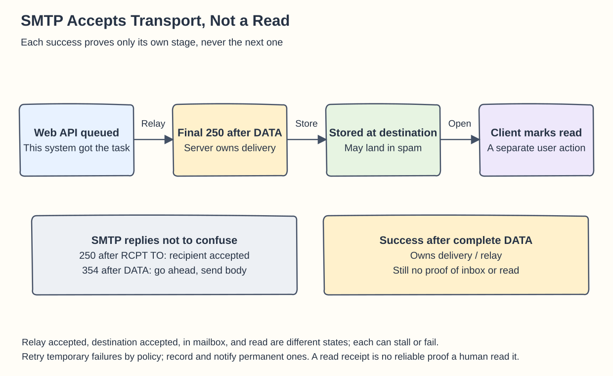
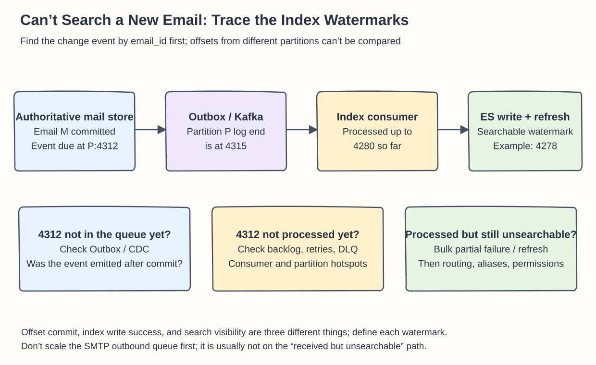

## Chapter 23: Distributed Email Service

Background: [Chapter 23 text](../23.%20Distributed%20Email%20Service/README.md). The email body is the authoritative data; search, folder lists, and notifications are different read and propagation paths.

### Q23-01 | Does an SMTP acceptance mean the user has read the email?

**Conclusion: No, and you can’t even say that any SMTP `250` means the complete email was received.** You have to look at which stage the reply belongs to. A 250 after `MAIL FROM` accepts the sender, and a 250 after `RCPT TO` accepts one recipient; a 354 after `DATA` only permits the body to be sent. Only the success reply after the complete end-of-DATA marker means that SMTP server has taken over responsibility for delivering or relaying the message.

For example, at 10:00 the send API returns “queued,” which means this system has received the send task. At 10:01 the relay SMTP server returns 250 after the complete DATA, which means the relay now owns further delivery. At 10:02 the destination mail system puts the email in the mailbox. At 11:30 the client opens it and submits the read state. None of the first three times can substitute for the last one. Even after the destination system accepts the email, it may file it as spam or quarantine it, or generate a bounce if later delivery fails. Under RFC 5321, once a server has accepted responsibility it must not drop the mail just because of foreseeable resource shortages; it should retry or send a failure notice.

A temporary `4xx` normally leads to a retry with backoff; a permanent `5xx` means you record the rejection reason and end that failed delivery instead of resending forever. With several recipients, some may be accepted and others rejected, so track each one’s status separately. Read receipts and tracking pixels are not reliable proof that “a person read it” either: users can turn receipts off, and clients that preload images can cause false positives.

**Boundaries**: A mailbox’s `is_read` usually means the system state after a client or user action; it doesn’t prove the user understood the content. A product should distinguish “accepted, in transit, accepted by the destination, failed, read” rather than reuse one success icon for all of them.

**Memory hook: SMTP is the courier signing for the transport job, not proof that the recipient read the letter.** Reference: [RFC 5321 §4.2.5](https://www.rfc-editor.org/rfc/rfc5321.html#section-4.2.5).

### Q23-02 | Why are attachments usually kept in object storage?

**Conclusion: Attachments are usually “large, rarely modified, and read whole,” while the email list needs “small fields, queried often.” Storing them separately lets capacity, queries, and lifecycle be optimized independently.** The database keeps the attachment ID, object key, size, type, checksum, and permission relationship; object storage keeps the bytes. Listing an inbox then never has to pull multi-MB attachments into the database cache.

Take 1,000 emails under this chapter’s assumptions: each has 50 KB of body/metadata, 50 MB in total, and 20% carry an average 500 KB attachment, which is `200 × 500 KB = 100 MB`. Although attachments appear in only a fifth of the emails, they take up two thirds of the total bytes in this simplified model. Scaled up to 40 billion incoming emails a day, attachments come to about 4 PB a day and 1,460 PB a year, before replicas, indexes, MIME overhead, and backups. Object storage can scale independently, upload in parts, and move data to a colder tier by access frequency, so large blobs don’t crowd out database indexes and hot email pages.

Base64 also has a transfer cost: every 3 bytes become 4 characters, so 500 KB of binary becomes about 667 KB, plus MIME headers and line breaks. Decoding and storing the raw attachment separately avoids copying that encoding bloat into every attachment replica, but if the business must keep the complete raw MIME, you still have to count that copy and not save the space twice.

**Boundaries**: Object storage doesn’t make attachments free. You still pay for requests, download traffic, cold-tier retrieval, and minimum retention periods, and you must persist the bytes before publishing the reference, then clean up orphans after failures. Downloads must check mailbox permissions or issue a short-lived URL; a guessable object key is not access control. Whether to merge small attachments into shared objects should be decided by measuring real reads, writes, and cost.

**Memory hook: The database keeps the attachment manifest and the warehouse keeps the boxes; what you save is the cost of different access patterns dragging each other down.**

### Q23-03 | An email just received can’t be found by search. Which queue watermark do you check first?

**Conclusion: First confirm the original is in the authoritative mailbox store, then check the watermark of the index update queue on the path “email change → indexing task → Elasticsearch.”** Don’t start by scaling the outbound SMTP workers: when the email has already arrived, the outbound queue is usually not on this search failure’s path.

Use the email’s `email_id` to find the matching change event, then locate its Kafka topic, partition, and offset. Suppose the event is at offset 4312 in partition P, the log end is already at 4315, and the index consumer has only processed up to 4280: the event is still queued. Now check backlog growth, consumer errors, retries and dead letters, and partition hotspots. If the producer never emitted 4312 at all, check whether the outbox or CDC event after the database commit was sent successfully. Compare watermarks per partition; offsets from different partitions are not one global timeline.

If the consumer has already processed 4312, you still need to separate “fetched and committed consumer progress,” “successfully written to ES,” and “visible to search after refresh.” A bulk request can fail for some documents, and if the consumer offset is committed too early, an apparently zero backlog can still hide missing index entries. After ES acknowledges a write, a refresh is usually needed before it is searchable, so keep looking at the applied index version, failure records, and the searchable watermark instead of assuming that a healthy Kafka means you’re done. Finally, verify the `user_id` routing, the index alias, permission filters, and the query conditions.

**Boundaries**: Elasticsearch is near-real-time search, and the refresh settings affect latency. You can show users a status such as “email received, search indexing in progress,” or open the email by ID from the primary store; don’t force a global refresh unconditionally just to make every email searchable at once. Delete and permission events especially need timely handling, and search results should also be permission-checked.

**Memory hook: Find the original first, then trace the index event; a consumed queue doesn’t mean search can see it yet.** Reference: [Elasticsearch near real-time search](https://www.elastic.co/docs/manage-data/data-store/near-real-time-search).

### Q23-04 | What write responsibilities appear after denormalizing into read/unread query tables?

**Conclusion: You do less filtering at read time and in exchange maintain several consistent query results at write time.** Changing an email from unread to read is no longer just setting `is_read=true` on the main record; you must also remove it from the unread view, write it to the read view, and update the unread counter, search filter fields, and any other dependent views.

For example, email M is unread at version 7 and updated to read at version 8. The authoritative store should accept this state transition first. You can maintain the related tables synchronously in one transaction where supported, or atomically save the authoritative state together with a pending event and let a retryable projection consumer update the views. With the latter, state the brief eventual-consistency window explicitly: search or the list may change a little later, but the primary state is already version 8. Don’t assume that all cross-table, cross-partition updates succeed atomically just because you “use Cassandra/NoSQL.”

Duplicate events must be idempotent. If the version 8 read event is delivered twice, the second one must not decrement the unread count again; record the applied version or event ID, or rebuild the exact count from the current authoritative state. Out-of-order events need handling too: if version 9 has already moved the email to the trash, a late version 8 must not reinsert it into the read inbox. Deleting, moving folders, bulk marking, and marking as unread again must all follow the same projection rules.

**Boundaries**: Manual dual writes most easily leave a partial update: the main record says read, but the unread table still holds the email and the counter hasn’t changed. You need failure retries, dead-letter diagnosis, and periodic reconciliation or rebuilds, and you must name which copy is the source of truth. The frontend can’t replace server-side maintenance with a temporary “remove it from both lists and add it back.”

**Memory hook: Denormalization turns one complex query into a set of reliable writes on every state change.**
