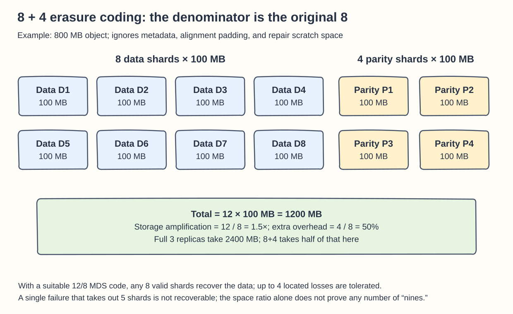
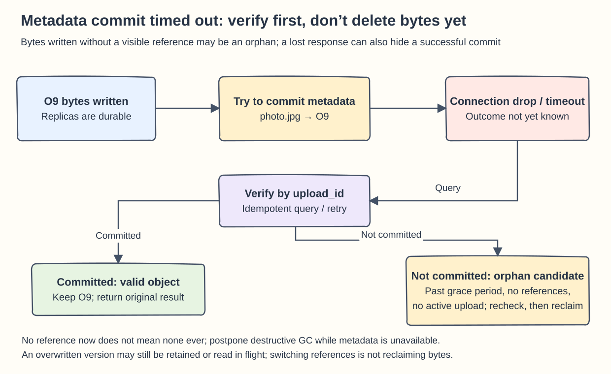
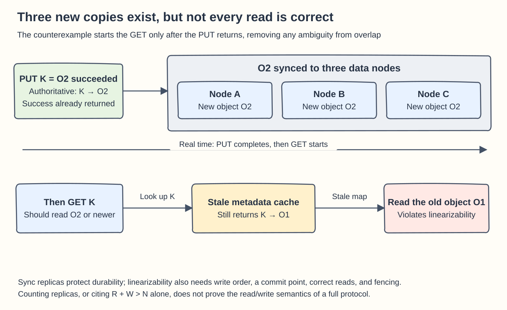

## Chapter 24: S3-like Object Storage

These questions follow Chapter 24. They separate four things that must not be confused: space cost, data durability, read/write consistency, and integrity verification.

### Q24-01 | Why is the total storage amplification of 8+4 equal to 1.5?

**Conclusion: The original data is split into 8 equal-size data shards, and 4 parity shards of the same size are computed from them, so 12 shards are stored in all; the total is `12/8=1.5` times the original.** The “extra overhead” is `4/8=50%`. Don’t mistake a total of 150% for an extra 150%.

For example, take an original object of 800 MB, cut into 8 shards of 100 MB each, then generate 4 parity shards of 100 MB each. The total is `8×100 + 4×100 = 1200 MB`, which is 400 MB more than the original. Full three-replica storage would take `800×3=2400 MB`, so in this idealized model, 8+4 uses half the space of three replicas. In practice you must add metadata, checksums, alignment padding, small-object packing, and temporary space during repair, so 1.5 can’t be used directly as the final purchasing multiple for a data center.

With a code that has the right property (for example, a suitable Reed–Solomon 12/8 MDS code), any 8 valid shards can recover the original data, so it tolerates at most 4 **missing shards at known locations**. This does not mean “any four machines can fail and everything is fine”: if five shards sit in one failure domain, a single failure of that domain leaves only seven shards, which cannot recover the data. A corrupted shard must first be detected by a checksum and treated as unavailable; an unknown error cannot be treated entirely the same as a known loss.

**Boundaries:** The space you save usually costs encoding and decoding work, cross-node reads, and repair bandwidth. Being able to recover from losing four shards at once also doesn’t guarantee any particular number of “nines” of durability; repair time, correlated failures, and operator mistakes all still affect the risk.

**Memory hook: For the denominator, look at the original 8; for the numerator, look at the final 12. 50% is the extra, and 1.5 times is the total.**

### Q24-02 | What does a failed metadata commit leave behind?

**Conclusion: If the data bytes are already durable but the metadata `bucket/key → object_id` was not published successfully, you are left with an orphan object or shards that can’t be read by their normal name.** But “the client got a timeout” does not mean “the metadata definitely wasn’t committed.” You must check the state first, and never delete the data right away.

For example, upload U9 has written three replicas of object O9. Then, while committing key `photo.jpg` to point to O9, the database connection drops. There are two possible outcomes: the transaction really rolled back, and O9 has no visible reference yet; or the transaction committed and only the response was lost, so O9 is already a legitimate object. The recovery flow should carry a stable upload/request ID, look up the commit record, and retry idempotently. If the commit already completed, return the original result. It must not create another version and then delete O9 carelessly.

For a true orphan, GC can first mark it as a candidate, then wait out a safe grace period. It reclaims the object only after confirming that no committed version, active multipart session, retrying transaction, or retention policy references it, and after rechecking against verifiable commit/GC watermarks. A new upload may write its bytes first and publish the metadata a moment later, so “no reference found this second” is not enough to prove the object is garbage. If the metadata system is temporarily unreachable and GC cannot prove there are no references, it should usually postpone deletion, trading a temporary rise in space for data safety.

**Boundaries:** The reverse order, publishing metadata before the bytes meet the durability requirement, produces a broken reference that users can see but cannot read, which is more dangerous than a short-lived orphan. When overwriting an existing key, the old version may also still be referenced by in-flight reads or version retention; finishing the switch does not mean the old bytes can be physically deleted at once. GC must respect reader safety and the version lifecycle.

**Memory hook: Better to have an extra box for a while with no waybill than a waybill with no box; confirm once more before you throw a box away.**

### Q24-03 | Why can’t synchronous three-replica writes prove linearizability by themselves?

**Conclusion: Synchronous three-replica writes mainly show that several copies of the data exist before a write succeeds, whereas linearizability requires every operation to appear to take effect at some instant between its invocation and its return, respecting real-time order.** The number of replicas says nothing about how writes are ordered, which version a read returns, how a primary is elected, or whether an old primary can keep accepting requests.

One counterexample is enough. Key K used to point to object O1. A client PUTs a new object O2; O2’s bytes are synchronized to all three data nodes, the metadata is committed as K→O2, and the system returns success. After that, another client does GET K but hits metadata that still caches K→O1, and reads the old value. Even though O2 has three complete replicas, this read still violates the requirement that a read after a completed write must see that write or a newer value. If a read overlaps a write, returning either the old or the new value can be legitimate; this counterexample deliberately starts the GET after the PUT has returned.

To prove stronger semantics you must at least specify the following: concurrent writes to the same key have a single order and a commit point; a success response is returned only after that version is truly committed; the read path obtains a committed, sufficiently recent version; failover elections preserve the committed history and use terms or fencing to isolate the old primary; and caches cannot bypass these rules to return an old mapping. You can build such guarantees with a consensus log or a verified leader-read protocol, but merely writing “`R+W>N`” is not a complete proof either, because concurrency, versions, and failures still have to be handled.

**Boundaries:** This does not say synchronous replication can’t be part of a linearizable system, only that it is not enough on its own. Having all three byte copies in place can still mean reading the wrong version; conversely, correct read/write ordering does not automatically provide enough long-term backup and disaster recovery.

**Memory hook: Replicas answer “how many copies of the data still exist”; linearizability answers “which version of history should this read see.”**

### Q24-04 | Why can’t you always treat an ETag as an MD5?

**Conclusion: An ETag is an entity identifier defined by the service, and it cannot be read unconditionally as “the MD5 of the complete object bytes.”** The official AWS S3 documentation distinguishes by how an object is created and encrypted: for some single-part uploads, plaintext objects, or SSE-S3 objects the ETag can be an MD5, but Multipart Upload, Part Copy, and SSE-KMS/SSE-C encryption do not satisfy that equality. Directory buckets do not support MD5 at all.

For example, the same 20 MB file may get different ETags from a single upload and from a two-part upload; a common multipart ETag carries a suffix such as `…-2` for the number of parts, but you can’t derive every service’s verification rules from the format alone. If a client directly compares `md5(local_file) == ETag`, it may wrongly judge a complete, correct multipart upload to be corrupted. Conversely, a string that merely looks like 32 hexadecimal digits is not proof of any algorithm.

The right approach is to use the ETag, per the API contract, for conditional reads/writes or cache validation, and to use an explicitly declared checksum algorithm and field for integrity, such as SHA-256 or CRC where the service supports it, while confirming whether you are comparing a **whole-object checksum or a combined checksum of parts**. The local and remote values must cover the same byte range; don’t compare the hash of the uncompressed file with the compressed object. On a mismatch, stop marking the object as complete, then check transfer and encoding or retry, rather than ignoring the difference.

**Boundaries:** An ETag is also not a general version ID or a security signature. In some scenarios you can reliably use its MD5 property, but only on the basis of the documentation for that product, upload path, and encryption configuration, not by generalizing from one experiment to every object store.

**Memory hook: Treat an ETag as an opaque tag first; for integrity, ask “which algorithm, which bytes, and which combination.”** Reference: [ETag description in the S3 Object API](https://docs.aws.amazon.com/AmazonS3/latest/API/API_Object.html).
