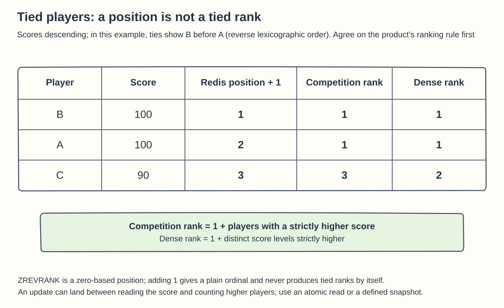
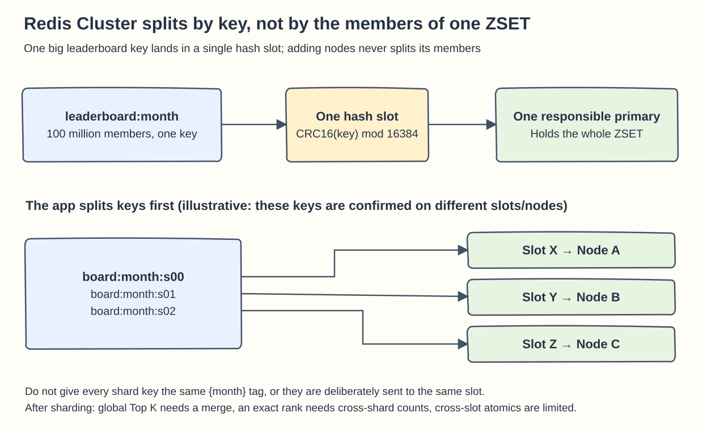
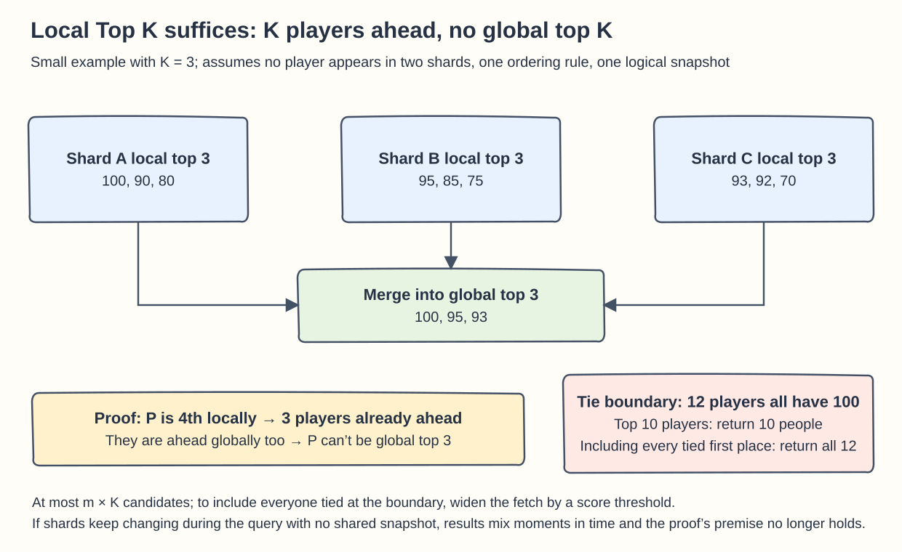

## Chapter 25: Real-Time Gaming Leaderboard

These questions follow Chapter 25. By default, a higher score ranks first, and the cards keep three things clearly apart: the score, the display order, and the tied rank.

### Q25-01 | Why can't HTTPS stop a player from reporting their own high score?

**Conclusion: HTTPS protects the data in transit; it doesn't make anything the sender invents true.** A legitimately logged-in player controls their own client, can modify the code, or can call the API directly, so they can send `{"score":999999}` over a perfectly encrypted connection. If the server accepts it as is, the encryption ends up protecting exactly the fake data.

The correct trust boundary is to let an authoritative game server compute the result from verified match state and actions, while the client submits only permitted inputs or a match reference. A scoring event should carry the match ID, the player, the result, the rule version, and a unique event ID, and it should be sent by an authenticated trusted service. The consumer verifies that the match really finished, that the player belongs to that match, and that the scoring follows the rules, and it uses a unique constraint to block replays. For example, if the same win worth 10 points is resent three times after a timeout, the total may rise by 10, not by 30. You can first durably store the match facts and the processing state, then update the leaderboard in Redis as a view that can be rebuilt.

Having the client sign the score usually doesn't solve the problem: if the signing key is also shipped to the player's device, an attacker can extract it or call the signing logic. Likewise, a user login proves “who submitted the score,” not “how the score was earned.” Service-to-service signing is valuable only when the private key and the authoritative computation both stay on the trusted server side.

**Boundaries**: An offline single-player game can't be proven 100% by one server endpoint to have completed the challenge for real; you may need verifiable action replays, anti-cheat detection, device attestation, and anomaly review, and you should state the residual risk. Never present it as a guarantee you get just by adding HTTPS.

**Memory hook: HTTPS guarantees the envelope wasn't opened or altered in transit; authoritative scoring guarantees that what's written inside has a basis.**

### Q25-02 | When two players tie, is the position Redis returns the tied rank the problem asks for?

**Conclusion: Not necessarily. Redis returns a zero-based position after sorting by its rule; it doesn't automatically give tied players the same rank.** For equal scores, a sorted set also breaks the tie by the lexicographic order of the member string, and reading in reverse reverses that order too. That is a stable sorting rule, but not necessarily the product's tied-ranking rule.

For example, with B=100, A=100, C=90, the reverse order may be B, A, C, and `ZREVRANK` returns `0, 1, 2`, which become `1, 2, 3` after adding one. But “competition ranking” wants `1, 1, 3` and “dense ranking” wants `1, 1, 2`, so neither can simply reuse the position. You must first ask the product which ranking to use.

Competition ranking can use the formula `rank(s) = 1 + the number of players with a score strictly greater than s`. There are 0 players above 100, so A and B are both 1st; there are 2 above 90, so C is 3rd. On a single ZSET, `ZCOUNT board "(100" +inf` counts the players strictly above 100. Dense ranking counts “the number of distinct score levels strictly higher,” not the number of players, so it needs another score-distribution structure or an aggregation; you can't reuse the same ZCOUNT.

**Boundaries**: If a score update lands between the `ZSCORE` read and the count, the result may mix two moments in time; on a single key you can use an atomic script or another consistent read, and across shards you need to define a snapshot or accept a brief approximation. You can still configure an order for display among tied players, such as whoever reached the score first, but keep that “order” separate from the “tied rank.”

**Memory hook: A position gives each person a seat number; a rank may let tied players share a podium step.** References: [Redis ZREVRANK](https://redis.io/docs/latest/commands/zrevrank/), [Sorted sets](https://redis.io/docs/latest/develop/data-types/sorted-sets/).

### Q25-03 | Why can't Redis Cluster automatically split one big ZSET?

**Conclusion: Redis Cluster assigns hash slots by key; it doesn't shard the members inside one ZSET.** The cluster has 16,384 slots, an ordinary key is mapped to one of them with `CRC16(key) mod 16384`, and the data of one key is handled as a whole by the primary that owns that slot. If a board has 100 million members, all in the single key `leaderboard:month`, they still sit on one primary.

Adding nodes can move slots and whole keys, but it never puts the first half of this ZSET's members on A and the second half on B. Replicas give fault tolerance, and some read strategies can share the read load, but they don't split up this key's write throughput or memory needs. The analogy is moving a whole dictionary, not automatically cutting it into volumes by letter.

To spread one logical board, the application first designs several keys, for example hashing the player ID into `board:2026-09:s00` through `s15`, and then confirms that those keys land on different slots and nodes. Be careful not to write them all as `board:{2026-09}:s00`, `...:s01`: sharing the hash tag `{2026-09}` deliberately sends them all to the same slot and defeats the purpose of sharding. If you need to atomically update scores and dedup state inside each shard, give the related keys of **the same shard** the same tag, not the whole board.

**Boundaries**: Sharding isn't free. A global Top K needs a cross-shard merge, an exact personal rank needs cross-shard counts of higher scores, and atomic operations over multiple keys in different slots are restricted. Range sharding can improve some queries but adds the complexity of players migrating across score ranges. Decide from real capacity and read/write patterns; don't just “turn on Cluster” and declare the big-key problem solved.

**Memory hook: Cluster divides the books, which are keys; splitting one book into volumes is the application's job.** Reference: [Redis Cluster sharding](https://redis.io/docs/latest/operate/oss_and_stack/management/scaling/).

### Q25-04 | Why is a local Top 10 enough to find the global Top 10?

**Conclusion: When each player belongs to exactly one shard, all shards use the same complete ordering rule, and the comparison uses one logical snapshot, taking each shard's top 10 and merging them is enough to get the global top 10 players.** The rule can be “score descending, ties broken by user ID,” but every shard and the final merge must use exactly the same one.

Proof by contradiction: suppose player P is in the global top 10 but isn't in the top 10 of their own shard. Then at least 10 players in that shard rank ahead of P. Those 10 also exist globally and, by the same rule, are still ahead of P, so P's global position is at least 11th, a contradiction. So the global top 10 must lie inside the union of the shards' top-10 candidates. With m shards you get at most `10m` players back, and sorting the union or merging with a heap is enough; if a shard has fewer than 10 players, take all of them.

Take a scaled-down example with K=3: shard A is `[100,90,80]`, shard B is `[95,85,75]`, and shard C is `[93,92,70]`. After merging the candidates, the global top three is `[100,95,93]`. Any shard's 4th player is already held down by that shard's three, so it can't suddenly become global top three.

**The most important boundary**: “the top 10 people” is not the same as “every player tied at the 10th-place boundary.” If 12 players all have 100 points and sit in the same shard, taking only 10 locally misses two players tied for first. To include everyone tied at the boundary, first find the score threshold at the global 10th position, then fetch from every shard all players at or above the threshold; if the product wants the top 10 **distinct score levels**, that is yet another threshold algorithm. If the shards keep changing during the query, you get different cross-sections in time, and the strict snapshot proof no longer applies directly.

**Memory hook: Whoever can't make the local top K can't make the global one; but “K heads” is not the same as “a rank that includes ties.”**

