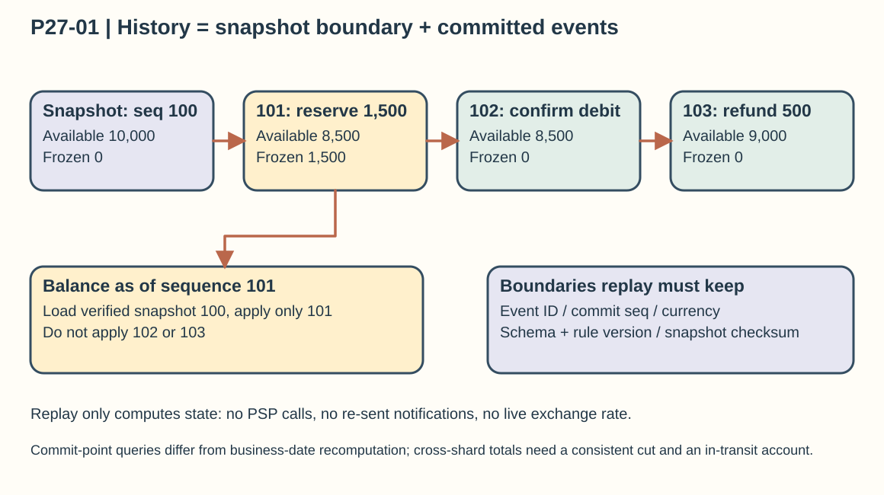
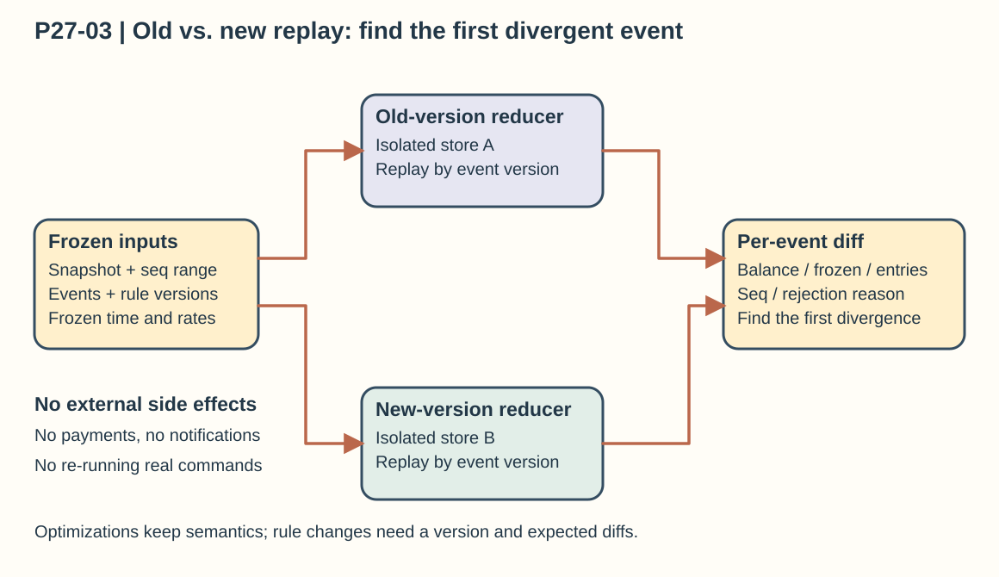

## Chapter 27: Digital Wallet

### P27-01 | Can you tell the account balance at any point in time?

**Conclusion: Yes, you can rebuild it, but first define what “any point in time” means.** It could be “the balance the system had already learned of and committed at that moment,” or “the balance after attributing later back-filled transactions to the day the business activity occurred.” The two differ. Each event should store at least the account, currency, amount, transaction ID, commit sequence number, commit time, business effective time, event schema version, and rule version. When you need to audit what history was visible, use the committed log boundary as the reference, not a filter on client timestamps, which may be out of order.

Say account A’s trusted snapshot at sequence 100 shows 10,000 cents available and 0 cents frozen; event 101 reserves 1,500 cents, 102 confirms the debit, and 103 credits a 500-cent refund. To query the state as of sequence 101, replay up to 101 and you get 8,500 cents available and 1,500 cents frozen; as of sequence 103, you get 9,000 available and 0 frozen. A snapshot must carry its last applied sequence number, data version, and checksum, and recovery starts from the next event, so the snapshot is never counted once and then deducted again. Without a snapshot you can still replay in full from a known opening balance; it is just slower.

Replay accepts only committed, deduplicated facts and updates local state with the deterministic reducer for the matching version. It must not call a PSP, send notifications, read a live exchange rate, or generate new random business IDs. Asking for “the total balance at the same instant” across accounts or shards also requires a defined consistent cut and an in-transit funds account; if each shard simply returns its latest value, the totals can be temporarily unbalanced. The claim that you can rebuild depends on the full log and the right versions being available; if the data is past its retention period or a version is missing, report clearly that an exact restoration is impossible.

### P27-02 | How do you prove that historical and current balances are correct?

**Conclusion: Getting the same result on replay is only the first layer of evidence.** If the original event recorded 100 cents as 1,000 cents, both the old program and the replay program may produce the same wrong answer. So an audit needs at least three layers: whether the events are complete and have not been quietly rewritten, whether the accounting invariants hold, and whether the records match real business documents. Check the log for sequence gaps, duplicate events, transaction ID uniqueness, versions, and checksums; access control and an immutable retention policy reduce the risk of tampering with history.

Next, run an independent recomputation: starting from the opening balance or a verified snapshot, apply all committed events and compare the result with the live balance projection by account, currency, and last applied sequence number. Check that each transfer’s debits and credits balance, that released holds never exceed what was reserved, that balances never violate business constraints, and that cross-shard funds in transit have a clear owner. You cannot add CNY and USD together and claim conservation, and comparing only the total across all accounts is not enough, because crediting or debiting the wrong account can still leave the total correct.

Finally, reconcile the ledger with orders, top-up and withdrawal documents, and PSP or bank settlement records. A transaction that succeeded externally but is missing internally, an amount mismatch, or a final state that stays unresolved for too long must go into a discrepancy process with an owner. Fix problems with traceable correction events that point to the original entries and the approval reason; never overwrite old events to “make the difference disappear.” Keep the schema, rule, and correction versions with the audit trail; the verifier runs read-only in an isolated environment and must not trigger external payments or re-send business events. This builds an evidence chain of “source document, event entry, balance projection,” instead of proving only that the program can run twice and agree with itself.

### P27-03 | After a code change, how do you verify the system logic is still correct?

**Conclusion: Replay the same frozen inputs through the old and new versions in isolation, and compare them event by event.** First fix the verification inputs: the same immutable event set, the same verified snapshot, the same start and end sequence numbers, account configuration, currency precision, and historical rule versions. Replay the old version and the candidate version in separate isolated stores, with outbound network writes, PSP calls, notifications, and message publishing turned off. If an external response, exchange rate, time, or random choice affects the result, it must already be recorded as a replayable fact; the new program must not be allowed to fetch “today’s answer” again.

Compare, after every event, the account state, frozen amounts, ledger entries, stored rejection reasons, and last applied sequence number, and beyond the final checksum, locate the **first divergent event**. Matching final totals are not enough: a duplicate debit that a later compensation cancels out can still leave a user wrongly overdrawn for a while. The samples should cover duplicates, out-of-order events, crash recovery, compensation retries, historical schemas, amount boundaries, and in-transit cross-shard transfers. Run the full ledger as an offline regression, and in production let the new projection run read-only in shadow mode while you monitor for deviations.

If the change only optimizes the implementation, then results derived under the same version’s business semantics should in principle be identical, and any difference needs an explanation. If it is a legitimate rule change, you cannot insist that every historical result match the old version. Keep the old ledger with its original rule version, apply the new rule to a clearly defined new effective period, handle format changes with an upgrader or a new event version, and set up approvals and assertions for the expected differences. A real transfer that already happened must never be executed again by re-running its command; replaying events only rebuilds state, and if funds really must be adjusted, issue a separate, controlled correction transaction. If the change touches command validation or event generation, you also need a side-effect-free re-run of the recorded commands and external inputs, comparing the events against expectations; replaying old events alone cannot prove the new validation logic is correct.

