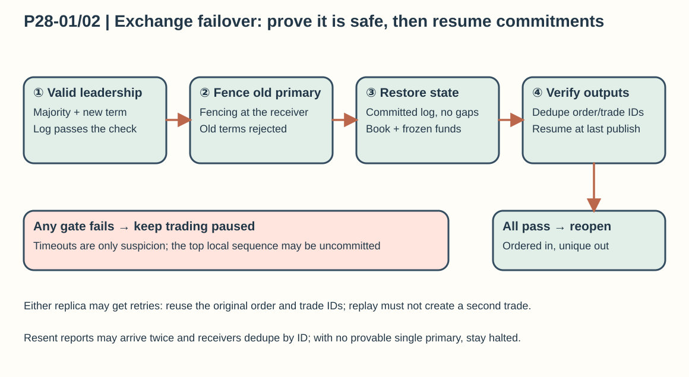
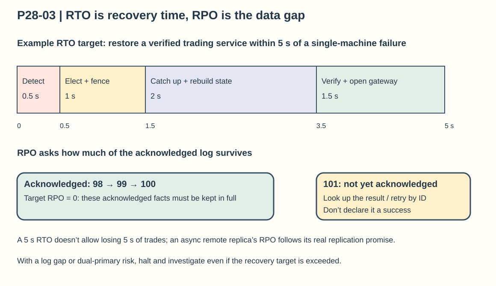

## Chapter 28: Stock Exchange

### P28-01 | The primary instance goes down: when and how do you switch to the backup?

**A heartbeat timeout can only raise suspicion; on its own it can’t prove the old primary is dead.** First judge the failure using heartbeats, process health, the network, and replication progress, and stop sending new confirmable trades to the uncertain old primary. A switch requires all of the following: a legitimate election quorum is available, the candidate replica holds the committed log it needs, the old primary’s write and trade-publishing authority is fenced off, and the candidate has recovered to a state where it can serve correctly. If any one is missing, pause trading rather than let two nodes match at once just to turn the dashboard green quickly.

One concrete order: the gateway enters a short trading pause and keeps request IDs; the control plane completes an election by term; the old primary’s eligibility is revoked, or downstream rejects old-term writes; the new primary restores a snapshot and replays committed events, and verifies that sequence numbers are contiguous and that the order book checksum and funds freezes agree; then it takes over the outbound stream’s last published position first, and only afterward reopens inbound commands. For orders committed before the failure whose results the client never received, queries and retries must map to the original order and never create a new one. A trade that was already generated can’t turn into a new trade fact because of replay; resent reports may be transmitted twice, so they must reuse the original trade ID and sequence number, and the receiver deduplicates.

Don’t decide who is most current by the highest local sequence number, because the tail may not be committed yet. Use a consensus protocol to determine the legitimate committed prefix, and deal with unacknowledged commands left on a minority old primary. If acknowledged trades are missing, the log has a gap, or you can’t prove there is a single primary, halt the market and investigate. Drills should cover single-process, single-machine, network-partition, and simultaneous replica failure paths, and measure the time from stopping service to trading correctly again, not just how fast a process starts.

### P28-02 | How do you elect a new primary from the backups?

Don’t elect by “whoever notices the primary is unreachable takes over first.” In a hypothetical 3-node Raft group, a candidate must win a majority of votes and pass the log up-to-date check; terms increase monotonically, and each node votes at most once per term. A single node in a network partition can’t keep confirming new trades just because it can still receive user requests. Real candidacy also has to consider data integrity, software version, and recovery progress; a replica missing the committed prefix must not bypass the protocol and take over.

**Electing a new primary isn’t enough; you must also stop the old primary from producing effects.** Give each leadership a monotonically increasing fencing token or term, and attach it to operations sent to the authoritative store, the sequencing entry point, and the trade-publishing channel. The receiving end must remember the highest term it has accepted and reject older terms; if only the client checks the token, the old primary can still slip past the check and publish trades. Network isolation, revoking connections or leases, and cutting hardware power can be added as extra measures, but you must say clearly who performs them during a failure and how you verify they took effect.

After taking over, the new primary restores state only from the legitimate committed log, recovers the consumption position and the outbound commit position, and deduplicates by order ID, command sequence number, and trade ID. Lease-based schemes must also address clock skew and expiry boundaries, and can’t treat wall-clock time as an absolutely reliable arbiter. If no backup can catch up, no majority is available, or the old primary can’t be fenced off, the system should keep trading paused and continue clearly labeled read-only access to history. This sacrifices trading availability for a minority partition in exchange for fund safety, so two order books never each promise fills.

### P28-03 | What is the recovery time objective (RTO)?

RTO isn’t derived from the name of a technology stack. The business sets it from the halt time it can tolerate, and drills then prove it. For example, first assume a single-machine failure in the same data center targets **restoring a verifiable trading service within 5 seconds**, with a separate, longer target for a city-level disaster. Break the 5 seconds into non-overlapping budgets: 0.5 seconds for failure detection, 1 second to elect a primary and fence off the old one, 2 seconds to catch up on the log and rebuild state, and 1.5 seconds to verify and reopen the gateway. Real phases can partly run in parallel, but you can’t double-count them, and you can’t drop the final correctness check.

What most affects recovery time is usually how far the log lags, how fresh the snapshot is, replay throughput, and order book size. If a replica is 1 million events behind and can apply only 200,000 per second, catching up alone takes about 5 seconds and uses the whole budget; speed up the hot standby’s apply rate, shorten the snapshot interval, or improve the recovery path, rather than lower the verification standard. Drills should record end-to-end P95/P99, including client reconnects, duplicate request handling, and outbound report recovery, not just leader election time.

**RPO answers how much data you can lose.** For orders and trades already confirmed to clients, the target can be zero loss, but it must be backed by replication, persistence, and a commit protocol that complete before confirmation; asynchronous disaster recovery may not reach the same RPO and must be disclosed separately. A 5-second RTO doesn’t mean you may lose 5 seconds of trades, and it doesn’t mean 99.99% availability: that also depends on the number of failures in a year and total downtime. If you find a log gap halfway through recovery, exceed the target and halt to investigate; don’t open incorrect trading just to satisfy the stopwatch.

### P28-04 | Which functions must be restored, and can the system run in a degraded mode?

Recovery order should revolve around whether the system can safely commit to trades again. First to return are a legitimate primary identity, a contiguous committed input sequence, the order book state, the order lifecycle, and the facts about frozen funds and securities. Next come idempotent command handling, the authoritative publisher of execution reports, and the persisted outbound position; only last do you reopen risk-checked order entry and cancels. A cancel must also enter the same ordered command stream and compete in sequence with matches that have already happened; while primary matching is unavailable, you can’t delete an order from a side path and confirm to the user that it was canceled.

Functions that can be degraded include advanced charts, historical analytics, non-critical reports, some depth levels, and push frequency. Read-only balances, order history, and market data that come from a lagging replica must be labeled with a time, a sequence number, or “possibly delayed,” and a stale quote must never be treated as an executable price. Notifications and reports can back up for a while, but they should keep every event and monitor backpressure, then catch up in order after recovery. If the system can only receive requests and can’t confirm authoritative execution results, it may only answer “not accepted” or “processing”; it must not dress up successful receipt as a successful trade.

Halt trading or reject new trades in these cases: two possible primaries, a gap in the committed log, an order book that can’t be checked for consistency, frozen funds that can’t be reconciled, lost deduplication state for outbound trades, or queues and latency beyond safe limits. Before reopening, reconcile using the last committed position and the published position, and confirm that trades from before the failure won’t become new trades, that resent reports keep the original trade ID, and that unfilled resting orders won’t vanish. The principle of safe degradation is to cut back the product capabilities you offer while keeping trading semantics; don’t chase apparent availability by skipping risk checks, skipping sequence numbers, or loosening duplicate-trade protection.
