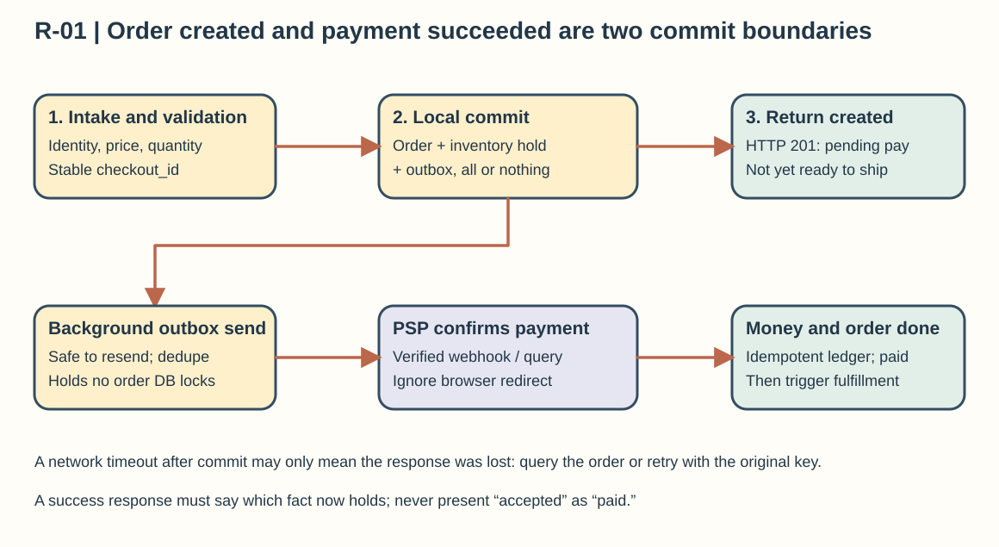
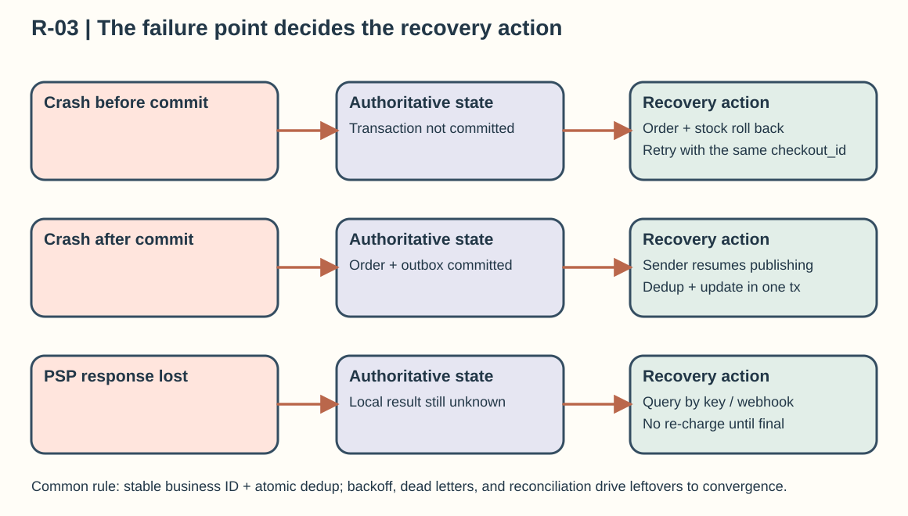

## General Review Questions

These questions all use one e-commerce example: 1 million orders per day with a peak of 1,000 TPS; product detail pages peak at 30,000 QPS; one product per order; amounts in RMB are stored in fen (cents). Orders, inventory reservations, and the outbox start out in the same relational database. Payment is handled by an external PSP, and notifications, search, and statistics update asynchronously. These are assumptions for reasoning, not measured product results.

### R-01 | Where does a request enter, and where does it return success?

**Conclusion: Define what “success” means first.** A user clicks “Place order.” The client sends a stable `checkout_id` through the gateway to the order service. The service validates identity, the product price version, and the quantity, then in one local transaction it conditionally decrements sellable inventory, writes a “pending payment” order, and writes an outbox event. Only after all three commit together can it return “order created.” That HTTP 201 does not mean the order is paid or ready to ship. The inventory decrement must check the affected row count, and if stock is insufficient the whole transaction rolls back.

After the database commits, a sender reads the outbox, and the payment service starts the payment with the PSP using a fixed idempotency key for that order. Once a signature-verified webhook or an active query confirms success, the payment service stores the result, the ledger service records it idempotently, the order moves to “paid,” and a fulfillment event goes out. The page can show “payment processing” in the meantime and reach the final state through polling or push. A browser redirect back to your site is never proof of payment.

If the connection drops while the response is on its way back, the client must not read the timeout as “the order doesn't exist.” It should retry with the original key or query the order; the order in the database is the source of truth for whether it was created. The average is about 12 orders per second but the peak is 1,000, so size the API for the peak and verify it with load tests. Moving the PSP and SMS calls out of the database transaction gives up the simplicity of “everything finishes in one response” and buys shorter lock holds and better failure isolation. With a clear success boundary, a retry can't turn into a double charge.

### R-02 | Which record is the authoritative fact you can recover from?

**Conclusion: You can't name one “universal truth” for the whole system.** In this e-commerce example, the committed order and inventory reservation in the order database decide whether an order exists and how much stock is reserved. The transaction confirmed by the PSP, together with the internal immutable payment record, decides whether the external charge completed. Posted ledger entries explain internal movements of money. The Redis product cache, the search index, and SMS delivery status can never prove that an order is paid. Link the facts of each domain through the order ID, payment ID, currency, amount, and business version.

For example, say a process restarts after committing an order but before publishing the message. The order and the outbox row were written in the same transaction, so after recovery the sender scans for unsent outbox rows and keeps publishing, and consumers deduplicate by event ID. If Redis loses everything, rebuild it from the product database. If search loses everything, rebuild the projection from the order facts. If the PSP has charged the customer but the local system never received the result, store “unknown/processing,” query by the original payment key, and reconcile against the settlement file. A missing local record is never grounds for declaring that the charge failed.

“Authoritative” also carries a durability promise: a transaction that returned success must have met the required flush and replica-acknowledgement conditions. A snapshot should record the log position it covers, and recovery replays only the records after it. Backup and restore drills prove that you can get the facts back, not that the machines are up. Keeping a traceable record raises storage and recovery-management costs, but it makes lost derived data repairable and cross-system disputes investigable. Keeping only the latest balance or status saves space, yet it can't explain how things changed.

### R-03 | What happens when requests repeat, machines restart, or the network drops?

**Conclusion: Walk each of the three failures along the same order flow, and for each one name the authoritative state and the recovery action.** On a **repeated request**, the same `checkout_id` is protected by a unique constraint. The same parameters return the original order and never decrement stock a second time, while the same key with a different product or amount is rejected. Payment uses a stable business idempotency key, and message consumption uses event deduplication records, with the “dedup record + local business update” in one transaction. Graying out the submit button is only a UX nicety and can't replace server-side constraints.

On a **machine restart**, writes made before the commit roll back, while committed orders and the outbox survive. The sender resumes from its last confirmed progress and may resend an event that was already sent but not yet marked done, so consumers still receive duplicates. A consumer should check its own processing record first, and only then decide whether to update inventory or the ledger or to emit the next event. It must not keep “messages already read” only in process memory.

On a **network drop**, the most dangerous case is “the other side finished, but I never got the response.” After a PSP call times out, keep the payment in processing, query the original payment result or wait for the signature-verified webhook, and reuse the original key on retries. Use backoff with jitter, a total retry budget, dead-letter alerts, and reconciliation, so a peak of 1,000 per second doesn't turn into a retry storm. If the database primary is unreachable and you can't get the consistency acknowledgement you need, it is better to temporarily reject new money-moving operations than to let two writers each confirm success. The cost is that some requests wait longer, but availability never hides duplicate orders or unexplained charges.

### R-04 | Which number or query pattern decides whether to cache, shard, or go async?

**Conclusion: Break “the traffic is huge” into separate access paths, then let each path's numbers decide.** Product detail pages peak at 30,000 QPS, are read often and changed rarely, so you can cache them by product ID. If the hit rate reaches the assumed 95%, about 1,500 QPS still falls through to the database, so load test whether it can handle that, and prepare request coalescing and rate limiting for hot-key expiry. Showing a slightly stale price is acceptable on the product page, but checkout must revalidate the authoritative price version and inventory. A cached stock count must never confirm a sale directly.

Orders average `1,000,000/86,400≈12 TPS` and peak at 1,000 TPS. Capacity is set by peak transaction time, lock contention, and I/O, not by the daily average. If a single database has enough headroom under the isolation level and durability settings you need, don't shard yet. Only when data volume, write throughput, or tenant isolation truly approaches its limit should you pick a shard key based on query patterns. Sharding by user makes “my orders” easy to query, but the same product's inventory may then compete across shards. Don't ignore that cost.

SMS and search updates don't decide whether an order stands, so they suit asynchronous processing. Size queues by backlog: if consumers handle 500 events per second while the input runs at 1,000 per second for 10 minutes, the backlog is about 300,000 events. Estimate the size of each event and how fast you can catch up, rather than adding queues without limit. Caching saves read latency but introduces stale data, sharding adds migration work and cross-shard transaction complexity, and async improves isolation but adds waiting for results. Choosing with these numbers is how you explain why each component exists.

### R-05 | What did I give up for latency, cost, or reliability?

**Conclusion: Start from what is non-negotiable, then say exactly what each optimization costs.** In this order design, the non-negotiables are: the same order must not reserve inventory twice, a confirmed payment must not be recorded twice, and an unconfirmed money result must not pose as a success. To cut latency, you cache product details and send notifications asynchronously. The price is that a displayed price may be briefly stale and an SMS may arrive late. So checkout forces a price-version check, order queries show the real processing stage, and a failed notification does not undo an order that already stands.

To cut cost, you keep a single logical database cluster at first instead of rushing to shard by user. The price is a clear ceiling on write throughput and capacity, so you need to monitor peak lock waits, disk growth, and the capacity left after a failure. For reliability, the order and the outbox commit in one transaction, and payment and ledger keep idempotency history and run replicas across failure domains. The price is extra writes, replication waits, storage, and operations cost. If you only have asynchronous cross-region replication, say plainly that a regional disaster can leave a recovery point gap. Never call it zero data loss.

During a network partition, you prefer to keep a single authoritative writer for orders and money, and pause order placement if necessary, while product browsing and timestamped historical queries can continue. This lowers transaction availability during the failure but avoids being unable to tell afterwards which charge or inventory commitment is valid. Finally, you sign off against explicit targets: tail latency at the 1,000 TPS peak, the allowed inventory reservation time, the upper bound on waiting for a final payment state, and the recovery time and recovery point all need numbers, then you verify them with load tests, failure drills, and reconciliation.
